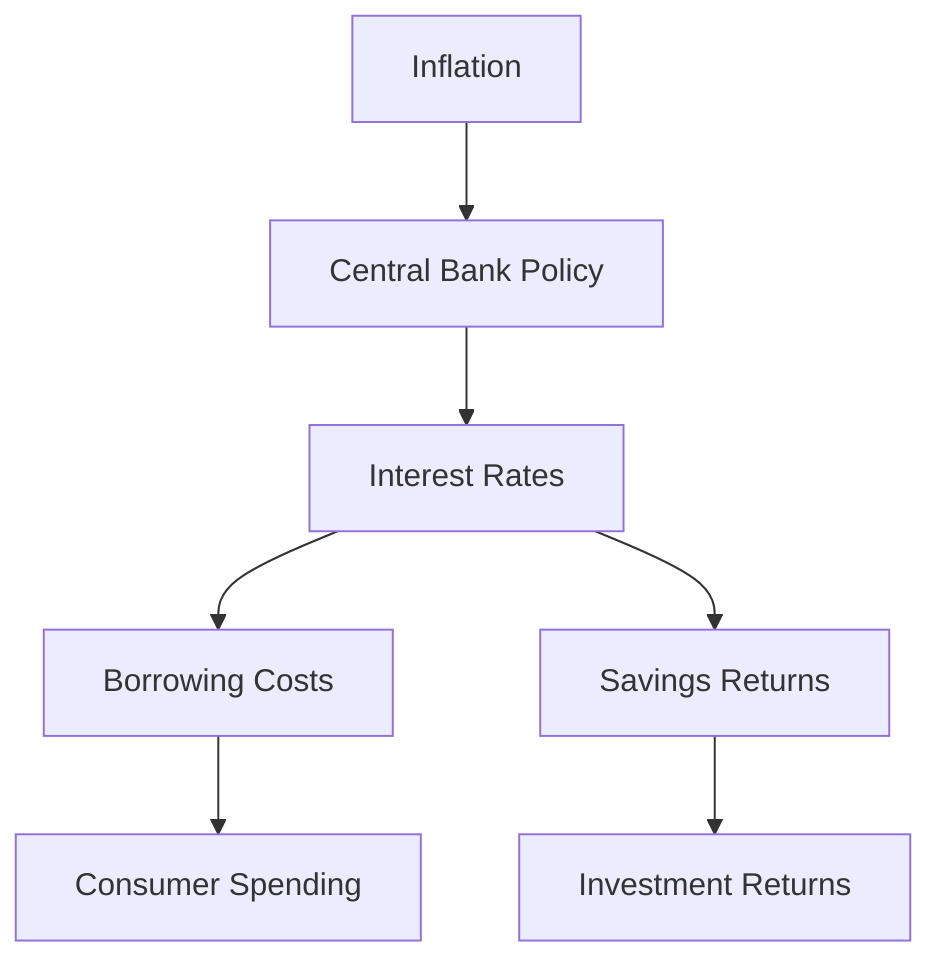

## 5.13 The Impact of Inflation

Inflation is a critical economic concept that affects every aspect of the financial landscape, from consumer purchasing power to business profitability and investment returns. Understanding inflation's impact is essential for making informed financial decisions, particularly in the Canadian context where economic policies and market conditions can vary significantly. This section delves into the effects of inflation on consumers, businesses, and investors, and explores the intricate relationship between inflation and interest rates.

### Effects of Inflation on Consumers, Businesses, and Investors

#### Consumers

Inflation directly impacts consumers by eroding purchasing power, which is the value of money expressed in terms of the amount of goods or services that one unit of money can buy. As prices rise, the same amount of money buys fewer goods and services, effectively reducing the standard of living if wages do not increase at the same rate. For example, if inflation is at 3% annually, a basket of goods that costs $100 today will cost $103 next year, assuming no change in consumption patterns.

#### Businesses

For businesses, inflation can have mixed effects. On one hand, companies may benefit from increased prices for their goods and services, potentially boosting revenues. However, if input costs such as raw materials and wages rise faster than the prices they can charge, profit margins may shrink. Additionally, inflation can create uncertainty, making it challenging for businesses to plan long-term investments and manage costs effectively.

#### Investors

Investors face the challenge of ensuring that their returns outpace inflation to maintain the real value of their investments. Inflation erodes the real value of fixed-income investments, such as bonds, where the interest payments may not keep up with rising prices. Equities, on the other hand, may offer some protection against inflation, as companies can often pass on higher costs to consumers. However, this is not guaranteed, and market volatility can increase during periods of high inflation.

### Inflation and Purchasing Power

Purchasing power is a crucial concept in understanding inflation's impact. As inflation rises, the purchasing power of money declines, meaning that each dollar buys less than it did before. This decline affects not only consumers but also savers and retirees who rely on fixed incomes. For instance, if a retiree's pension does not adjust for inflation, their ability to afford goods and services diminishes over time.

### Inflation and Interest Rates

The relationship between inflation and interest rates is pivotal in economic policy and financial planning. Central banks, such as the Bank of Canada, often adjust interest rates to control inflation. When inflation is high, central banks may raise interest rates to cool down the economy by making borrowing more expensive and saving more attractive. Conversely, when inflation is low, they may lower interest rates to stimulate economic activity.

#### Implications for Borrowers and Lenders

For borrowers, higher interest rates mean higher costs for loans, mortgages, and credit, which can dampen consumer spending and business investment. For lenders, higher rates can lead to better returns on savings and fixed-income investments. However, if inflation outpaces nominal interest rates, the real interest rate (the nominal rate adjusted for inflation) can be negative, eroding the value of savings.

### Long-term Consequences of Sustained Inflation

Sustained inflation can have profound long-term consequences on economic growth and stability. High inflation can lead to uncertainty, reducing consumer and business confidence. It can also distort price signals, leading to inefficient allocation of resources. In extreme cases, hyperinflation can destabilize economies, erode savings, and lead to social unrest.

Conversely, moderate inflation is often seen as a sign of a growing economy, encouraging spending and investment. The key is maintaining inflation at a level that supports economic growth without causing instability.

### Best Practices and Strategies

To mitigate the impact of inflation, consumers, businesses, and investors can adopt several strategies:

- **Consumers**: Budgeting and prioritizing essential expenses can help manage the impact of rising prices. Investing in inflation-protected securities, such as Real Return Bonds, can also preserve purchasing power.

- **Businesses**: Implementing cost-control measures and diversifying revenue streams can help maintain profitability. Businesses can also consider hedging strategies to protect against volatile input costs.

- **Investors**: Diversifying portfolios with assets that historically perform well during inflationary periods, such as equities, real estate, and commodities, can help protect against inflation. Understanding the real interest rate is crucial for evaluating investment returns.

### Conclusion

Inflation is an inevitable part of the economic cycle, with significant implications for consumers, businesses, and investors. By understanding its effects and adopting appropriate strategies, stakeholders can mitigate its impact and make informed financial decisions. Staying informed about economic trends and central bank policies is essential for navigating the challenges posed by inflation.

For further reading on the effects of inflation and understanding real versus nominal interest rates, consider exploring the following resources:

- [Effects of Inflation](https://www.bankofcanada.ca/education/banknotes-money/inflation/)
- [Understanding Real vs Nominal Interest Rates](https://www.investopedia.com/terms/r/realinterestrate.asp)

### **Ready to Test Your Knowledge?**

**Practice 10 Essential CSC Exam Questions to Master Your Certification**



### How does inflation affect consumers?

- [x] It erodes purchasing power.
- [ ] It increases purchasing power.
- [ ] It has no effect on purchasing power.
- [ ] It stabilizes purchasing power.

> **Explanation:** Inflation erodes purchasing power by reducing the amount of goods and services that can be purchased with a given amount of money.

### What is the relationship between inflation and interest rates?

- [x] Central banks adjust interest rates to control inflation.
- [ ] Inflation has no impact on interest rates.
- [ ] Interest rates are always higher than inflation.
- [ ] Inflation decreases when interest rates rise.

> **Explanation:** Central banks often adjust interest rates to control inflation, raising rates to cool the economy and lowering them to stimulate growth.

### What is the real interest rate?

- [x] The nominal interest rate adjusted for inflation.
- [ ] The interest rate before taxes.
- [ ] The interest rate after taxes.
- [ ] The nominal interest rate without adjustments.

> **Explanation:** The real interest rate is the nominal interest rate adjusted for inflation, reflecting the true cost of borrowing and the real yield on savings.

### How can businesses mitigate the impact of inflation?

- [x] Implement cost-control measures and diversify revenue streams.
- [ ] Increase prices without considering input costs.
- [ ] Ignore inflationary pressures.
- [ ] Focus solely on short-term profits.

> **Explanation:** Businesses can mitigate inflation by controlling costs, diversifying revenue, and considering hedging strategies to manage input costs.

### What is purchasing power?

- [x] The value of money in terms of goods or services it can buy.
- [ ] The amount of money in circulation.
- [ ] The interest rate on savings.
- [ ] The nominal value of currency.

> **Explanation:** Purchasing power refers to the value of money expressed in terms of the amount of goods or services that one unit of money can buy.

### What happens to fixed-income investments during inflation?

- [x] Their real value is eroded.
- [ ] Their real value increases.
- [ ] They are unaffected by inflation.
- [ ] They become more valuable.

> **Explanation:** Inflation erodes the real value of fixed-income investments, as the interest payments may not keep up with rising prices.

### How can investors protect their portfolios from inflation?

- [x] Diversify with equities, real estate, and commodities.
- [ ] Invest only in fixed-income securities.
- [x] Consider inflation-protected securities.
- [ ] Avoid investing during inflationary periods.

> **Explanation:** Diversifying with assets that perform well during inflation and considering inflation-protected securities can help protect against inflation.

### What is a potential consequence of sustained high inflation?

- [x] Economic instability and uncertainty.
- [ ] Increased consumer confidence.
- [ ] Stable economic growth.
- [ ] Decreased borrowing costs.

> **Explanation:** Sustained high inflation can lead to economic instability, uncertainty, and reduced consumer and business confidence.

### How does inflation affect long-term economic growth?

- [x] It can distort price signals and resource allocation.
- [ ] It always promotes economic growth.
- [ ] It has no impact on economic growth.
- [ ] It stabilizes economic growth.

> **Explanation:** Inflation can distort price signals and lead to inefficient resource allocation, potentially hindering long-term economic growth.

### True or False: Moderate inflation is beneficial for economic growth.

- [x] True
- [ ] False

> **Explanation:** Moderate inflation is often seen as beneficial for economic growth, as it encourages spending and investment without causing instability.


