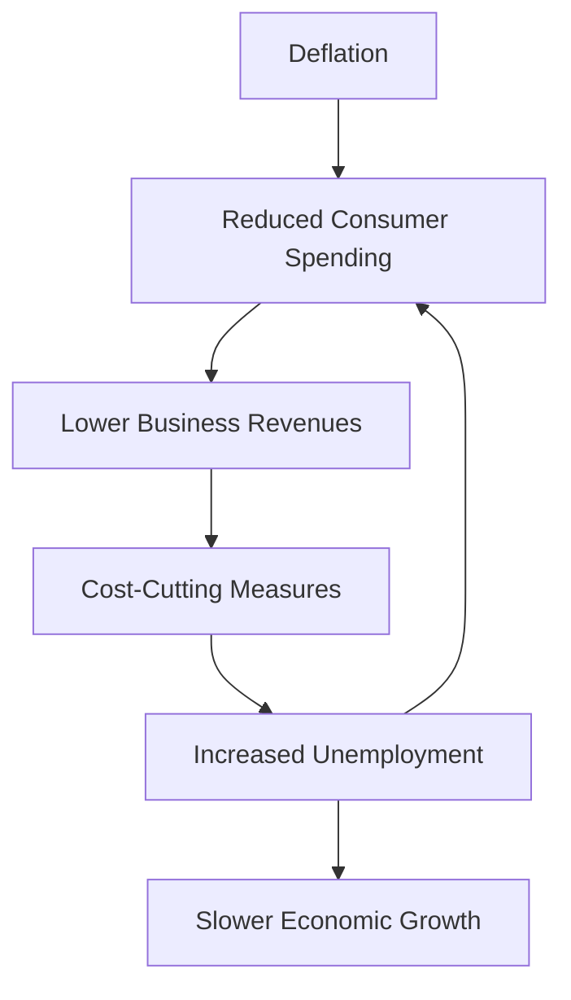

## 5.15 Deflation and Disinflation

In the realm of economics, understanding the nuances between deflation and disinflation is crucial for financial professionals and investors alike. These concepts, while related to price changes, have distinct implications for the economy, consumer behavior, and investment strategies. This section delves into the definitions, economic impacts, and strategic considerations associated with deflation and disinflation, with a particular focus on the Canadian context.

### Defining Disinflation and Deflation

**Disinflation** refers to a decrease in the rate of inflation. This means that while prices continue to rise, they do so at a slower pace than before. Disinflation is often seen as a normal part of the economic cycle and can be indicative of a stabilizing economy.

**Deflation**, on the other hand, is characterized by a sustained decrease in the general price level of goods and services. Unlike disinflation, deflation implies that prices are falling, which can have more severe economic consequences.

### Economic Implications of Sustained Deflation

Sustained deflation can have profound effects on an economy. When prices consistently decline, consumers may delay purchases in anticipation of even lower prices, leading to decreased consumer spending. This behavior can result in reduced business revenues and profitability, as companies struggle to sell their goods and services at profitable prices.

Moreover, deflation increases the real value of debt, making it more expensive for borrowers to repay loans. This can lead to higher default rates and financial distress for both individuals and businesses. In a deflationary environment, companies may also cut costs by reducing wages or laying off employees, further exacerbating economic challenges.

### Relationship Between Deflation, Unemployment, and Economic Growth

Deflation is often associated with higher unemployment rates and slower economic growth. As businesses face declining revenues, they may reduce their workforce to cut costs, leading to increased unemployment. This, in turn, reduces overall consumer spending, creating a vicious cycle that hampers economic growth.

The relationship between deflation and economic growth can be illustrated through the following diagram:

### Impact of Deflation on Investment Decisions and Market Stability

Deflation can significantly influence investment decisions and market stability. In a deflationary environment, the real return on fixed-income investments, such as bonds, increases, making them more attractive to investors. However, equities may suffer as companies face declining profits and reduced growth prospects.

Investors may also become more risk-averse, preferring safer assets over equities or other riskier investments. This shift can lead to decreased market liquidity and increased volatility, as investors react to changing economic conditions.

### Practical Financial Examples and Case Studies

Consider the case of Japan in the 1990s, often referred to as the "Lost Decade." Japan experienced prolonged deflation, leading to stagnant economic growth and increased unemployment. The Japanese government's attempts to stimulate the economy through monetary and fiscal policies were met with limited success, highlighting the challenges of combating deflation.

In Canada, while deflation has not been a significant issue in recent decades, understanding its potential impacts is crucial for financial professionals. Canadian pension funds, for example, may adjust their asset allocations in anticipation of deflationary pressures, increasing their holdings in fixed-income securities to capitalize on higher real returns.

### Best Practices and Strategies

To navigate a deflationary environment, investors and financial professionals should consider the following strategies:

1. **Diversification:** Maintain a diversified portfolio to mitigate risks associated with deflation. Include a mix of asset classes, such as bonds, equities, and alternative investments.

2. **Focus on Quality:** Invest in high-quality companies with strong balance sheets and stable cash flows, as they are more likely to withstand economic downturns.

3. **Monitor Economic Indicators:** Keep a close eye on economic indicators, such as inflation rates, unemployment figures, and GDP growth, to anticipate potential deflationary trends.

4. **Stay Informed:** Regularly review financial news and analysis to stay informed about global economic developments and their potential impact on the Canadian market.

### Conclusion

Understanding deflation and disinflation is essential for making informed investment decisions and navigating economic challenges. By recognizing the differences between these concepts and their implications, financial professionals can develop strategies to protect and grow their investments, even in uncertain economic times.

For further exploration, consider the following resources:

- [Understanding Deflation](https://www.investopedia.com/terms/d/deflation.asp)
- [The Effects of Deflation](https://www.bankofcanada.ca/2020/05/inflation-deflation-survival-2020/)

### **Ready to Test Your Knowledge?**

**Practice 10 Essential CSC Exam Questions to Master Your Certification**



### What is disinflation?

- [x] A decrease in the rate of inflation
- [ ] A sustained decrease in the general price level
- [ ] An increase in the rate of inflation
- [ ] A sustained increase in the general price level

> **Explanation:** Disinflation refers to a decrease in the rate of inflation, meaning prices are still rising but at a slower pace.

### What characterizes deflation?

- [x] A sustained decrease in the general price level
- [ ] A decrease in the rate of inflation
- [ ] An increase in consumer spending
- [ ] A sustained increase in the general price level

> **Explanation:** Deflation is characterized by a sustained decrease in the general price level of goods and services.

### How does deflation affect consumer behavior?

- [x] Consumers may delay purchases
- [ ] Consumers increase spending
- [ ] Consumers buy more luxury goods
- [ ] Consumers invest more in equities

> **Explanation:** During deflation, consumers may delay purchases in anticipation of even lower prices.

### What is a common consequence of deflation for businesses?

- [x] Reduced profitability
- [ ] Increased revenues
- [ ] Higher consumer demand
- [ ] Expansion of operations

> **Explanation:** Deflation often leads to reduced profitability as businesses struggle to sell goods at profitable prices.

### How does deflation impact unemployment?

- [x] It can increase unemployment
- [ ] It decreases unemployment
- [x] It leads to cost-cutting measures
- [ ] It has no impact on employment

> **Explanation:** Deflation can increase unemployment as businesses cut costs, often through layoffs.

### What investment strategy is advisable during deflation?

- [x] Diversification
- [ ] Concentration in equities
- [ ] Avoiding fixed-income securities
- [ ] Investing only in real estate

> **Explanation:** Diversification helps mitigate risks associated with deflation by spreading investments across various asset classes.

### How does deflation affect fixed-income investments?

- [x] Increases real returns
- [ ] Decreases real returns
- [x] Makes them more attractive
- [ ] Has no impact on returns

> **Explanation:** Deflation increases the real return on fixed-income investments, making them more attractive.

### What happened during Japan's "Lost Decade"?

- [x] Prolonged deflation and stagnant growth
- [ ] Rapid economic growth
- [ ] High inflation rates
- [ ] Decreased unemployment

> **Explanation:** Japan experienced prolonged deflation and stagnant economic growth during the "Lost Decade."

### Why might investors become risk-averse during deflation?

- [x] Due to increased market volatility
- [ ] Because of higher equity returns
- [ ] Due to stable economic conditions
- [ ] Because of decreased bond yields

> **Explanation:** Investors may become risk-averse during deflation due to increased market volatility and economic uncertainty.

### Deflation increases the real value of debt.

- [x] True
- [ ] False

> **Explanation:** Deflation increases the real value of debt, making it more expensive for borrowers to repay loans.


