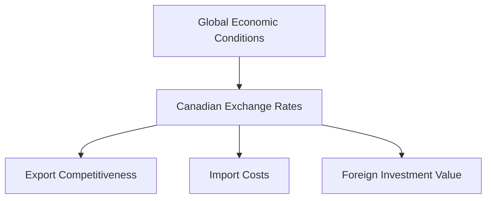

## 5.16 International Finance and Trade

International finance and trade are pivotal components of the global economy, influencing the economic landscape of countries worldwide, including Canada. This section delves into the significance of international finance, the role of trade, investments, and capital flows, and the impact of global economic conditions on Canadian markets. We will also explore how international trade agreements and policies shape Canada's economic performance.

### Understanding International Finance

**International Finance** is the study of financial interactions that occur between two or more countries. It encompasses the management of financial risks and opportunities that arise from cross-border transactions. For Canada, international finance is crucial as it facilitates trade, investment, and economic growth. The interconnectedness of global markets means that Canadian businesses and investors must navigate complex financial landscapes to optimize their economic outcomes.

### The Role of Trade, Investments, and Capital Flows

Trade, investments, and capital flows are the lifeblood of international finance. They enable countries to access resources, technologies, and markets beyond their borders, fostering economic development and prosperity.

#### Trade

Trade involves the exchange of goods and services between countries. For Canada, trade is a significant driver of economic growth, with exports accounting for a substantial portion of the GDP. Canada's trade relationships, particularly with the United States, China, and the European Union, are vital for its economic stability and growth.

#### Investments

International investments, including foreign direct investment (FDI) and portfolio investment, allow Canadian businesses to expand their operations and access new markets. FDI involves acquiring a lasting interest in a foreign enterprise, while portfolio investment refers to the purchase of financial assets like stocks and bonds in foreign markets.

#### Capital Flows

Capital flows refer to the movement of money for investment, trade, or business production across borders. These flows can be in the form of equity, debt, or other financial instruments. For Canada, capital inflows can provide the necessary funding for infrastructure projects and business expansions, while capital outflows represent Canadian investments in foreign markets.

### Impact of Global Economic Conditions on Canadian Markets

Global economic conditions significantly influence Canadian markets. Factors such as economic growth rates, inflation, interest rates, and geopolitical events in major economies like the United States, China, and the European Union can have profound effects on Canada's economic performance.

#### Exchange Rates

The **exchange rate**, or the price of one currency in terms of another, is a critical factor in international finance. Fluctuations in exchange rates can impact the competitiveness of Canadian exports, the cost of imports, and the value of foreign investments. For instance, a stronger Canadian dollar may make exports more expensive and less competitive, while a weaker dollar can boost export competitiveness but increase the cost of imports.

### Influence of International Trade Agreements and Policies

International trade agreements and policies play a crucial role in shaping Canada's economic landscape. These agreements facilitate trade by reducing tariffs, eliminating trade barriers, and establishing rules for international commerce.

#### Key Trade Agreements

- **North American Free Trade Agreement (NAFTA)/United States-Mexico-Canada Agreement (USMCA):** This agreement has been instrumental in enhancing trade relations between Canada, the United States, and Mexico, promoting economic integration and growth.

- **Comprehensive Economic and Trade Agreement (CETA):** This agreement between Canada and the European Union aims to boost trade and investment by removing barriers and providing Canadian businesses with greater access to European markets.

- **Comprehensive and Progressive Agreement for Trans-Pacific Partnership (CPTPP):** This agreement enhances trade relations between Canada and several Asia-Pacific countries, opening new markets for Canadian goods and services.

### Practical Examples and Case Studies

#### Canadian Pension Funds and International Investments

Canadian pension funds, such as the Canada Pension Plan Investment Board (CPPIB), actively invest in international markets to diversify their portfolios and achieve higher returns. By investing in foreign equities, real estate, and infrastructure, these funds can mitigate domestic risks and capitalize on global opportunities.

#### Major Canadian Banks and Global Operations

Canadian banks like RBC and TD have expanded their operations internationally to tap into new markets and diversify their revenue streams. These banks leverage their expertise in financial services to compete in global markets, contributing to Canada's economic growth.

### Best Practices and Common Challenges

#### Best Practices

- **Diversification:** Canadian investors should diversify their portfolios across different asset classes and geographic regions to manage risks and enhance returns.
- **Hedging:** Using financial instruments like futures and options can help mitigate exchange rate risks associated with international investments.

#### Common Challenges

- **Currency Risk:** Fluctuations in exchange rates can impact the value of international investments and trade transactions.
- **Regulatory Compliance:** Navigating different regulatory environments can be challenging for Canadian businesses operating internationally.

### Conclusion

International finance and trade are integral to Canada's economic prosperity. By understanding the dynamics of global markets and leveraging trade agreements, Canadian businesses and investors can optimize their economic outcomes. As global economic conditions continue to evolve, staying informed and adaptable is crucial for success in the international arena.

For further exploration, consider the following resources:

- [Bank of Canada on International Finance](https://www.bankofcanada.ca/core-functions/monetary-policy/international-finance/)
- [Understanding Exchange Rates](https://www.investopedia.com/terms/e/exchangerate.asp)

### **Ready to Test Your Knowledge?**

**Practice 10 Essential CSC Exam Questions to Master Your Certification**



### What is international finance?

- [x] The study of financial interactions that occur between two or more countries.
- [ ] The study of domestic financial markets.
- [ ] The management of a country's internal economy.
- [ ] The analysis of local investment strategies.

> **Explanation:** International finance focuses on cross-border financial interactions, which are crucial for global trade and investment.

### How do exchange rates impact Canadian exports?

- [x] A stronger Canadian dollar makes exports more expensive and less competitive.
- [ ] A stronger Canadian dollar makes exports cheaper and more competitive.
- [ ] Exchange rates have no impact on exports.
- [ ] A weaker Canadian dollar makes exports more expensive and less competitive.

> **Explanation:** A stronger Canadian dollar increases the price of Canadian goods in foreign markets, reducing competitiveness.

### What is the role of foreign direct investment (FDI)?

- [x] Acquiring a lasting interest in a foreign enterprise.
- [ ] Purchasing foreign stocks and bonds.
- [ ] Trading domestic goods internationally.
- [ ] Managing domestic financial portfolios.

> **Explanation:** FDI involves investing in foreign enterprises to establish a lasting business interest.

### Which agreement enhances trade between Canada and the European Union?

- [x] Comprehensive Economic and Trade Agreement (CETA)
- [ ] North American Free Trade Agreement (NAFTA)
- [ ] Comprehensive and Progressive Agreement for Trans-Pacific Partnership (CPTPP)
- [ ] United States-Mexico-Canada Agreement (USMCA)

> **Explanation:** CETA is the trade agreement between Canada and the European Union.

### What is a common challenge in international finance?

- [x] Currency risk
- [ ] Domestic inflation
- [x] Regulatory compliance
- [ ] Local market saturation

> **Explanation:** Currency risk and regulatory compliance are significant challenges in international finance.

### How can Canadian investors manage exchange rate risks?

- [x] By using financial instruments like futures and options.
- [ ] By investing only in domestic markets.
- [ ] By ignoring exchange rate fluctuations.
- [ ] By focusing solely on short-term investments.

> **Explanation:** Futures and options can hedge against exchange rate fluctuations, protecting investments.

### What is the significance of capital flows in international finance?

- [x] They provide funding for infrastructure projects and business expansions.
- [ ] They are irrelevant to international finance.
- [x] They represent Canadian investments in foreign markets.
- [ ] They only affect domestic markets.

> **Explanation:** Capital flows facilitate investment and economic growth by providing necessary funding.

### Which Canadian institution actively invests in international markets?

- [x] Canada Pension Plan Investment Board (CPPIB)
- [ ] Bank of Canada
- [ ] Statistics Canada
- [ ] Canadian Revenue Agency

> **Explanation:** CPPIB invests globally to diversify and achieve higher returns.

### What is the impact of a weaker Canadian dollar on imports?

- [x] It increases the cost of imports.
- [ ] It decreases the cost of imports.
- [ ] It has no impact on import costs.
- [ ] It makes imports more competitive.

> **Explanation:** A weaker Canadian dollar raises the cost of foreign goods, increasing import expenses.

### True or False: International trade agreements have no impact on Canada's economic performance.

- [ ] True
- [x] False

> **Explanation:** Trade agreements significantly influence Canada's economic performance by facilitating trade and investment.


