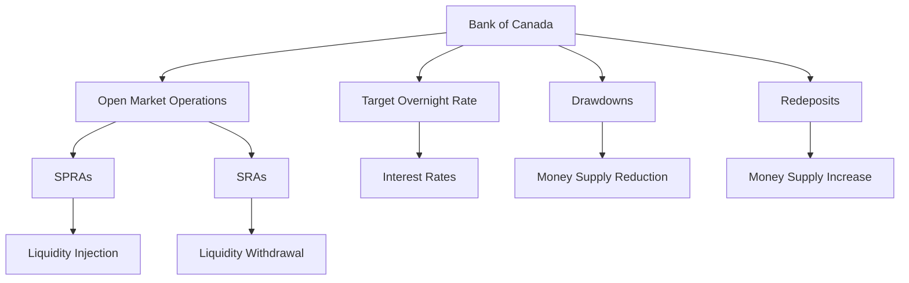

## 5.2 Monetary Policy

Monetary policy is a critical component of economic management, influencing everything from inflation rates to employment levels. In Canada, the Bank of Canada plays a pivotal role in shaping and implementing monetary policy to promote the economic and financial welfare of the nation. This section delves into the functions of the Bank of Canada, the tools it uses to implement monetary policy, and the broader impact of these policies on the Canadian economy.

### Understanding the Role and Functions of the Bank of Canada

#### Mission and Responsibilities

The Bank of Canada, established in 1934, serves as the nation's central bank with a clear mission: to promote the economic and financial welfare of Canada. This mission is achieved through several key responsibilities:

1. **Conducting Monetary Policy:** The Bank of Canada aims to maintain low and stable inflation, typically targeting a 2% inflation rate. This stability fosters a predictable economic environment conducive to growth and investment.

2. **Regulating the Money Supply:** By controlling the amount of money circulating in the economy, the Bank influences interest rates and overall economic activity.

3. **Maintaining Financial Stability:** The Bank works to ensure a stable and efficient financial system, which is crucial for economic confidence and growth.

4. **Issuing Currency:** The Bank is responsible for the design, production, and distribution of Canadian banknotes.

#### Independence and Collaboration

The Bank of Canada operates independently from the government to ensure unbiased policy implementation. This independence is crucial for making decisions that are in the best long-term interest of the economy, free from political pressures. However, the Bank collaborates closely with other financial institutions and government bodies to align monetary policy with broader economic goals.

### Analyzing the Implementation of Monetary Policy

The Bank of Canada employs several tools to implement monetary policy effectively:

#### Target Overnight Rate

The **target overnight rate** is the primary tool used by the Bank to influence short-term interest rates. It is the interest rate at which major financial institutions borrow and lend one-day (or "overnight") funds among themselves. Adjustments to this rate have a ripple effect across the economy, influencing borrowing costs for consumers and businesses.

- **Lowering the Target Rate:** Encourages borrowing and spending, stimulating economic activity.
- **Raising the Target Rate:** Discourages borrowing, helping to control inflation.

#### Open Market Operations

These operations involve the buying and selling of government securities to regulate the money supply:

- **Special Purchase and Resale Agreements (SPRAs):** Used to inject liquidity into the financial system, lowering interest rates.
- **Sale and Repurchase Agreements (SRAs):** Used to withdraw liquidity, raising interest rates.

#### Drawdowns and Redeposits

- **Drawdowns:** The Bank removes funds from the banking system, which can increase interest rates by reducing the money supply.
- **Redeposits:** The Bank adds funds to the banking system, which can decrease interest rates by increasing the money supply.

### Assessing the Impact of Monetary Policy on the Economy

Monetary policy has profound effects on various aspects of the economy:

#### Stimulating Economic Activity

Lowering interest rates can stimulate borrowing, investment, and consumer spending. For example, when the Bank of Canada reduces the target overnight rate, it becomes cheaper for businesses to finance expansion and for consumers to take out loans for major purchases like homes and cars.

#### Controlling Inflation

Conversely, raising interest rates can help control inflation and cool down an overheated economy. By making borrowing more expensive, the Bank can reduce spending and investment, thereby slowing down inflationary pressures.

#### Addressing Economic Challenges

Monetary policy is a powerful tool for addressing economic challenges such as recession and inflation. During a recession, the Bank may lower interest rates to encourage economic activity. In contrast, during periods of high inflation, the Bank may raise rates to stabilize prices.

#### Exchange Rates and International Trade

Monetary policy also affects exchange rates, which in turn impact international trade. A lower interest rate can lead to a depreciation of the Canadian dollar, making exports cheaper and imports more expensive, potentially boosting domestic production.

### Glossary

- **Interest Rate:** The cost of borrowing money, expressed as a percentage of the principal.
- **Target Overnight Rate:** The interest rate set by the Bank of Canada to influence short-term interest rates.
- **SPRA (Special Purchase and Resale Agreement):** An operation used by the Bank to inject liquidity into the financial system.
- **SRA (Sale and Repurchase Agreement):** An operation used by the Bank to withdraw liquidity from the financial system.
- **Drawdown:** The Bank's method of removing funds from the banking system to increase interest rates.
- **Redeposit:** The Bank's method of adding funds to the banking system to decrease interest rates.

### Visualizing Monetary Policy Tools

Below is a diagram illustrating the flow of monetary policy tools used by the Bank of Canada:

### Best Practices and Challenges

**Best Practices:**
- Stay informed about changes in monetary policy and their potential impact on investments.
- Diversify portfolios to mitigate risks associated with interest rate fluctuations.

**Common Challenges:**
- Predicting the timing and magnitude of monetary policy changes can be difficult.
- Balancing short-term economic growth with long-term financial stability.

**Strategies to Overcome Challenges:**
- Use financial models to simulate different interest rate scenarios.
- Consult with financial advisors to align investment strategies with current monetary policy.

### Encouraging Continuous Learning

Monetary policy is a dynamic field that requires continuous learning and adaptation. Readers are encouraged to explore additional resources such as the Bank of Canada's official publications, financial news outlets, and academic courses on monetary economics.

## Quiz Time!



### What is the primary mission of the Bank of Canada?

- [x] To promote the economic and financial welfare of Canada
- [ ] To maximize government revenue
- [ ] To regulate international trade
- [ ] To manage public debt

> **Explanation:** The Bank of Canada's primary mission is to promote the economic and financial welfare of Canada through various responsibilities, including conducting monetary policy.

### Which tool is primarily used by the Bank of Canada to influence short-term interest rates?

- [x] Target Overnight Rate
- [ ] SPRAs
- [ ] SRAs
- [ ] Drawdowns

> **Explanation:** The target overnight rate is the primary tool used by the Bank of Canada to influence short-term interest rates.

### What happens when the Bank of Canada lowers the target overnight rate?

- [x] Borrowing and spending are encouraged
- [ ] Inflation increases immediately
- [ ] The Canadian dollar appreciates
- [ ] Government revenue decreases

> **Explanation:** Lowering the target overnight rate makes borrowing cheaper, encouraging spending and investment.

### What is the purpose of a Special Purchase and Resale Agreement (SPRA)?

- [x] To inject liquidity into the financial system
- [ ] To withdraw liquidity from the financial system
- [ ] To increase interest rates
- [ ] To decrease the money supply

> **Explanation:** SPRAs are used by the Bank of Canada to inject liquidity into the financial system, helping to lower interest rates.

### How does raising interest rates help control inflation?

- [x] By discouraging borrowing and spending
- [ ] By increasing government spending
- [x] By slowing down economic activity
- [ ] By reducing exports

> **Explanation:** Raising interest rates makes borrowing more expensive, which discourages spending and investment, thereby helping to control inflation.

### What is a drawdown in the context of monetary policy?

- [x] A method of removing funds from the banking system
- [ ] A method of adding funds to the banking system
- [ ] A tool to increase liquidity
- [ ] A tool to decrease interest rates

> **Explanation:** A drawdown is the Bank's method of removing funds from the banking system to increase interest rates.

### How can monetary policy affect exchange rates?

- [x] By influencing interest rates
- [ ] By directly setting currency values
- [x] By impacting international trade
- [ ] By regulating foreign investments

> **Explanation:** Changes in interest rates can affect exchange rates, which in turn impact international trade dynamics.

### What is the relationship between monetary policy and financial stability?

- [x] Monetary policy helps maintain financial stability
- [ ] Monetary policy disrupts financial stability
- [ ] Monetary policy has no impact on financial stability
- [ ] Monetary policy only affects inflation

> **Explanation:** One of the key responsibilities of the Bank of Canada is to maintain financial stability through effective monetary policy.

### What is the effect of a redeposit on the money supply?

- [x] It increases the money supply
- [ ] It decreases the money supply
- [ ] It has no effect on the money supply
- [ ] It stabilizes the money supply

> **Explanation:** A redeposit adds funds to the banking system, thereby increasing the money supply.

### True or False: The Bank of Canada operates independently from the government to ensure unbiased policy implementation.

- [x] True
- [ ] False

> **Explanation:** The Bank of Canada operates independently to ensure that its policy decisions are made in the best interest of the economy, free from political influence.


