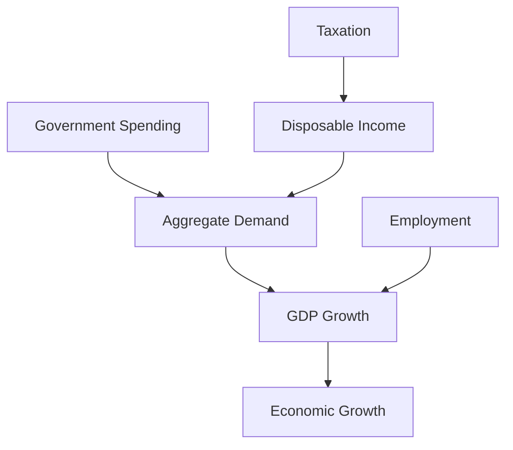

## 5.1 Fiscal Policy

Fiscal policy is a critical tool used by governments to influence a nation's economic performance. It involves the strategic use of government spending and taxation to achieve macroeconomic objectives such as controlling inflation, stimulating economic growth, and reducing unemployment. In Canada, fiscal policy plays a pivotal role in shaping the economic landscape, impacting everything from GDP to employment rates.

### Understanding Fiscal Policy

Fiscal policy refers to the government's use of its spending and taxation powers to influence the economy. It is one of the primary means by which governments can steer economic activity, alongside monetary policy, which is managed by central banks. The significance of fiscal policy lies in its ability to directly affect aggregate demand—the total demand for goods and services within an economy.

#### Components of Fiscal Policy

1. **Government Spending**: This includes all expenditures by the government on goods, services, and public projects. Government spending can be directed towards infrastructure projects, healthcare, education, and defense, among other areas. By increasing spending, the government can stimulate economic activity, creating jobs and boosting demand.

2. **Taxation**: This is the process by which governments collect revenue from individuals and businesses. Taxes can be levied on income, consumption, property, and more. By adjusting tax rates, the government can influence disposable income levels and consumer spending. Lowering taxes can increase disposable income, encouraging spending and investment.

### The Impact of Fiscal Policy on Economic Performance

Fiscal policy influences several key economic indicators:

- **Gross Domestic Product (GDP)**: By altering government spending and taxation, fiscal policy can directly impact GDP. Increased government spending typically boosts GDP by raising aggregate demand. Conversely, higher taxes can reduce disposable income, potentially slowing economic growth.

- **Employment**: Fiscal policy can affect employment levels. For instance, increased government spending on infrastructure projects can create jobs, reducing unemployment. Tax incentives for businesses can also encourage hiring and investment.

- **Economic Growth**: Over the long term, fiscal policy can influence the economy's growth trajectory. Strategic investments in education, technology, and infrastructure can enhance productivity and competitiveness, fostering sustainable economic growth.

### Balancing Taxes and Spending

A crucial aspect of fiscal policy is the balancing act between taxes and spending to achieve budgetary goals. Governments must carefully consider the trade-offs involved in fiscal decisions. For example, while increased spending can stimulate growth, it may also lead to higher deficits and debt levels if not matched by sufficient revenue.

#### Budgetary Goals and Fiscal Responsibility

In Canada, fiscal policy is guided by principles of fiscal responsibility and sustainability. The government aims to balance the budget over the economic cycle, ensuring that spending does not consistently exceed revenue. This involves making difficult choices about where to allocate resources and how to structure the tax system.

### Practical Examples and Case Studies

#### Canadian Pension Funds and Fiscal Policy

Canadian pension funds, such as the Canada Pension Plan Investment Board (CPPIB), are influenced by fiscal policy decisions. For instance, changes in corporate tax rates can affect the profitability of investments, impacting the returns for pensioners.

#### Major Canadian Banks and Fiscal Policy

Major Canadian banks like RBC and TD are also affected by fiscal policy. Changes in taxation and government spending can influence interest rates, credit availability, and overall economic conditions, affecting the banks' operations and profitability.

### Diagrams and Visual Aids

To better understand the flow of fiscal policy, consider the following diagram illustrating the relationship between government spending, taxation, and economic performance:

### Best Practices and Challenges

**Best Practices:**

- **Strategic Allocation**: Prioritize spending on projects that yield long-term economic benefits, such as infrastructure and education.
- **Tax Efficiency**: Design a tax system that maximizes revenue without discouraging investment and consumption.

**Common Challenges:**

- **Deficit Management**: Balancing the need for economic stimulus with the imperative to maintain fiscal sustainability.
- **Political Considerations**: Fiscal policy decisions are often influenced by political factors, which can complicate economic objectives.

### References and Further Exploration

For those interested in exploring fiscal policy further, consider the following resources:

- [Canada Revenue Agency (CRA)](https://www.canada.ca/en/revenue-agency.html)
- [Federal Budget Reports](https://www.budget.gc.ca/)
- [Economic Growth and Fiscal Policy](https://www.bankofcanada.ca/2020/10/fiscal-policy-economic-growth/)

These resources provide valuable insights into the intricacies of fiscal policy within the Canadian context.

### Conclusion

Fiscal policy is a powerful tool for managing economic performance. By understanding its components and impacts, financial professionals can better anticipate economic trends and make informed decisions. As you continue to explore fiscal policy, consider how these principles apply to your own financial planning and investment strategies.

### **Ready to Test Your Knowledge?**

**Practice 10 Essential CSC Exam Questions to Master Your Certification**



### What is fiscal policy?

- [x] The use of government spending and taxation to influence the economy
- [ ] The regulation of interest rates by central banks
- [ ] The management of a country's currency exchange rates
- [ ] The control of inflation through monetary policy

> **Explanation:** Fiscal policy involves the use of government spending and taxation to influence economic activity.

### Which of the following is a component of fiscal policy?

- [x] Government Spending
- [x] Taxation
- [ ] Interest Rate Adjustments
- [ ] Currency Devaluation

> **Explanation:** Fiscal policy consists of government spending and taxation, while interest rate adjustments and currency devaluation are related to monetary policy.

### How does fiscal policy affect GDP?

- [x] By altering aggregate demand through changes in spending and taxation
- [ ] By directly controlling the money supply
- [ ] By setting exchange rates
- [ ] By regulating stock market activities

> **Explanation:** Fiscal policy affects GDP by influencing aggregate demand through changes in government spending and taxation.

### What is the primary goal of fiscal policy?

- [x] To manage economic performance and achieve macroeconomic objectives
- [ ] To regulate the banking sector
- [ ] To control the money supply
- [ ] To manage international trade

> **Explanation:** The primary goal of fiscal policy is to manage economic performance and achieve macroeconomic objectives like growth and employment.

### What is the effect of increased government spending on employment?

- [x] It can create jobs and reduce unemployment
- [ ] It decreases disposable income
- [x] It boosts aggregate demand
- [ ] It leads to higher interest rates

> **Explanation:** Increased government spending can create jobs and boost aggregate demand, reducing unemployment.

### What is a challenge of fiscal policy?

- [x] Balancing economic stimulus with fiscal sustainability
- [ ] Controlling the money supply
- [ ] Setting interest rates
- [ ] Managing currency exchange rates

> **Explanation:** A challenge of fiscal policy is balancing the need for economic stimulus with maintaining fiscal sustainability.

### How can taxation influence consumer spending?

- [x] By affecting disposable income levels
- [ ] By directly controlling prices
- [x] By providing tax incentives
- [ ] By regulating interest rates

> **Explanation:** Taxation influences consumer spending by affecting disposable income levels and providing tax incentives.

### What role do Canadian banks play in fiscal policy?

- [x] They are affected by changes in taxation and government spending
- [ ] They set fiscal policy
- [ ] They regulate government budgets
- [ ] They manage public debt

> **Explanation:** Canadian banks are affected by fiscal policy changes, which influence economic conditions and their operations.

### What is the relationship between fiscal policy and economic growth?

- [x] Fiscal policy can influence long-term growth through strategic investments
- [ ] Fiscal policy has no impact on economic growth
- [ ] Fiscal policy only affects short-term economic conditions
- [ ] Fiscal policy is unrelated to economic growth

> **Explanation:** Fiscal policy can influence long-term economic growth through strategic investments in areas like infrastructure and education.

### True or False: Fiscal policy is solely concerned with taxation.

- [ ] True
- [x] False

> **Explanation:** Fiscal policy involves both taxation and government spending, not just taxation.


