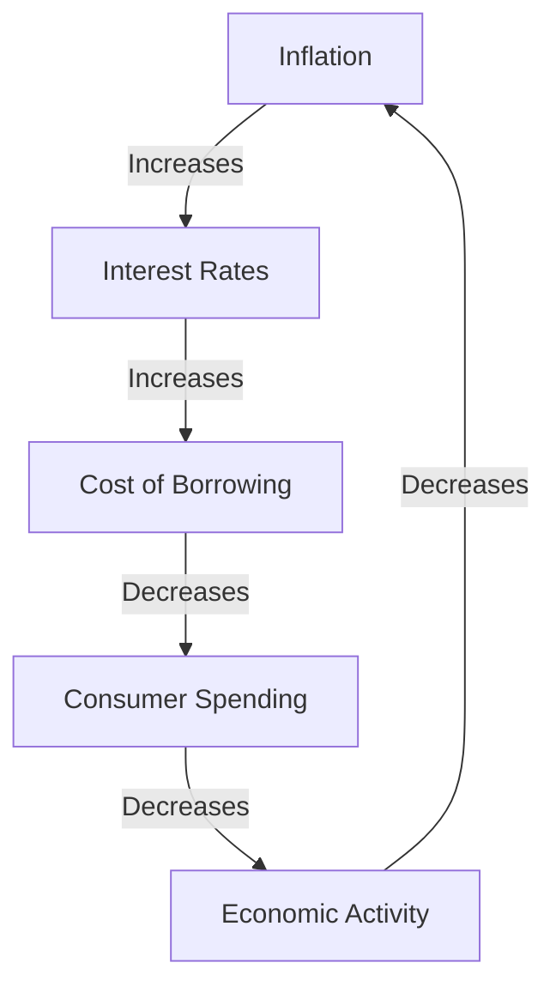

## 5.21 The Impact of Inflation

Inflation is a critical economic concept that affects various aspects of the financial landscape. It represents the rate at which the general level of prices for goods and services rises, eroding purchasing power. Understanding inflation's impact is essential for consumers, businesses, and investors, as it influences financial decisions and economic stability.

### Effects of Inflation on Consumers, Businesses, and Investors

#### Consumers

Inflation directly impacts consumers by reducing their purchasing power. As prices increase, the same amount of money buys fewer goods and services. This effect is particularly pronounced for individuals on fixed incomes, such as retirees, who may find their standard of living declining as their income does not keep pace with rising costs.

For example, if inflation is at 3% annually, a basket of goods that costs $100 today will cost $103 next year. Over time, this can significantly impact household budgets, necessitating adjustments in spending habits and savings strategies.

#### Businesses

For businesses, inflation can lead to increased costs for raw materials and labor. Companies may pass these costs onto consumers in the form of higher prices, but this can also reduce demand if consumers are unwilling or unable to pay more. Additionally, inflation can complicate long-term planning and budgeting, as future costs become more difficult to predict.

Businesses that can effectively manage inflationary pressures often have a competitive advantage. For instance, companies with strong pricing power or those that can improve operational efficiencies may better withstand inflationary environments.

#### Investors

Inflation erodes the real value of investments. For example, if an investment yields a 5% return but inflation is at 3%, the real return is only 2%. This underscores the importance of considering inflation when evaluating investment performance.

Investors often seek assets that provide a hedge against inflation, such as real estate, commodities, or inflation-linked bonds. In Canada, Real Return Bonds (RRBs) are an example of an investment designed to protect against inflation, as they adjust for changes in the Consumer Price Index (CPI).

### Inflation and Purchasing Power

**Purchasing Power** is a crucial concept in understanding inflation's impact. It refers to the value of money in terms of the quantity of goods or services it can purchase. As inflation rises, purchasing power declines, meaning consumers and businesses need more money to buy the same amount of goods and services.

To illustrate, consider a scenario where inflation is consistently at 2% per year. Over a decade, this would result in a cumulative price increase of approximately 22%, significantly affecting long-term savings and investment strategies.

### Inflation and Interest Rates

The relationship between inflation and interest rates is pivotal in economic policy. Central banks, such as the Bank of Canada, often adjust interest rates to control inflation. When inflation is high, central banks may increase interest rates to cool economic activity, making borrowing more expensive and saving more attractive.

**Real Interest Rate** is the nominal interest rate adjusted for inflation. It reflects the true cost of borrowing and the real yield on savings. For example, if the nominal interest rate is 4% and inflation is 2%, the real interest rate is 2%.

For borrowers, higher interest rates mean increased costs for loans and mortgages, potentially reducing disposable income. Conversely, lenders benefit from higher rates as they receive better returns on their investments.

### Long-term Consequences of Sustained Inflation

Sustained inflation can have profound long-term consequences on economic growth and stability. Moderate inflation is often seen as a sign of a growing economy, but high inflation can lead to uncertainty and reduced investment. It can also erode savings, distort spending and investment decisions, and lead to wage-price spirals.

In extreme cases, hyperinflation can destabilize economies, as seen in historical examples like Zimbabwe and the Weimar Republic. Therefore, maintaining inflation within a target range is a key objective for central banks to ensure economic stability.

### Practical Examples and Case Studies

#### Canadian Pension Funds

Canadian pension funds, such as the Canada Pension Plan Investment Board (CPPIB), often incorporate inflation protection into their investment strategies. By investing in assets like infrastructure and real estate, which tend to appreciate with inflation, these funds aim to preserve the purchasing power of their beneficiaries' future payouts.

#### Major Canadian Banks

Major Canadian banks, such as RBC and TD, adjust their interest rates in response to changes in the Bank of Canada's policy rate. This affects the rates offered on savings accounts, mortgages, and loans, influencing consumer behavior and economic activity.

### Diagrams and Visuals

Below is a simplified diagram illustrating the relationship between inflation, interest rates, and economic activity:

### Best Practices and Strategies

- **Diversification:** Investors should diversify their portfolios to include assets that perform well in inflationary environments, such as equities, real estate, and commodities.
- **Inflation-Linked Investments:** Consider investments like Real Return Bonds that provide protection against inflation.
- **Regular Review:** Regularly review and adjust financial plans to account for changes in inflation and interest rates.

### Common Pitfalls and Challenges

- **Underestimating Inflation:** Failing to account for inflation in financial planning can lead to inadequate savings and investment returns.
- **Overreliance on Fixed Income:** Relying too heavily on fixed-income investments can expose investors to inflation risk, as these assets may not keep pace with rising prices.

### References and Further Reading

- [Bank of Canada on Inflation](https://www.bankofcanada.ca/core-functions/monetary-policy/inflation/)
- [Understanding the Impact of Inflation](https://www.investopedia.com/terms/i/inflation.asp)

### Summary

Inflation is a complex phenomenon with wide-ranging effects on consumers, businesses, and investors. By understanding its impact on purchasing power, interest rates, and economic stability, individuals and organizations can make informed financial decisions. Employing strategies to mitigate inflation risk, such as diversification and inflation-linked investments, is crucial for preserving wealth and achieving long-term financial goals.

### **Ready to Test Your Knowledge?**

**Practice 10 Essential CSC Exam Questions to Master Your Certification**



### What is the primary effect of inflation on consumers?

- [x] It reduces purchasing power.
- [ ] It increases purchasing power.
- [ ] It has no effect on purchasing power.
- [ ] It stabilizes purchasing power.

> **Explanation:** Inflation reduces purchasing power because it increases the prices of goods and services, meaning consumers can buy less with the same amount of money.

### How does inflation affect the real value of investments?

- [x] It erodes the real value.
- [ ] It increases the real value.
- [ ] It has no effect on the real value.
- [ ] It stabilizes the real value.

> **Explanation:** Inflation erodes the real value of investments by reducing the purchasing power of the returns generated by those investments.

### What is the relationship between inflation and interest rates?

- [x] Central banks may raise interest rates to control inflation.
- [ ] Central banks lower interest rates to control inflation.
- [ ] Inflation and interest rates are unrelated.
- [ ] Inflation directly decreases interest rates.

> **Explanation:** Central banks often raise interest rates to control inflation by making borrowing more expensive and saving more attractive.

### What is the real interest rate?

- [x] The nominal interest rate adjusted for inflation.
- [ ] The nominal interest rate without adjustment.
- [ ] The interest rate after taxes.
- [ ] The interest rate before taxes.

> **Explanation:** The real interest rate is the nominal interest rate adjusted for inflation, reflecting the true cost of borrowing.

### What is a common strategy for investors to hedge against inflation?

- [x] Investing in real estate and commodities.
- [ ] Investing solely in fixed-income securities.
- [ ] Keeping all assets in cash.
- [ ] Avoiding investments altogether.

> **Explanation:** Investing in real estate and commodities can provide a hedge against inflation, as these assets often appreciate in value with rising prices.

### How does sustained high inflation affect economic growth?

- [x] It can lead to uncertainty and reduced investment.
- [ ] It promotes economic stability.
- [ ] It has no effect on economic growth.
- [ ] It guarantees economic growth.

> **Explanation:** Sustained high inflation can lead to uncertainty and reduced investment, negatively impacting economic growth.

### What is purchasing power?

- [x] The value of money in terms of the amount of goods or services it can buy.
- [ ] The nominal value of money.
- [ ] The interest rate on savings.
- [ ] The amount of money in circulation.

> **Explanation:** Purchasing power refers to the value of money expressed in terms of the amount of goods or services that one unit of money can buy.

### Which Canadian investment is designed to protect against inflation?

- [x] Real Return Bonds (RRBs).
- [ ] Regular savings accounts.
- [ ] Fixed-rate bonds.
- [ ] Common stocks.

> **Explanation:** Real Return Bonds (RRBs) are designed to protect against inflation by adjusting for changes in the Consumer Price Index (CPI).

### What is a potential pitfall of relying too heavily on fixed-income investments?

- [x] Exposure to inflation risk.
- [ ] Guaranteed high returns.
- [ ] Complete protection against inflation.
- [ ] No risk of loss.

> **Explanation:** Relying too heavily on fixed-income investments can expose investors to inflation risk, as these assets may not keep pace with rising prices.

### True or False: Inflation only affects consumers and not businesses or investors.

- [ ] True
- [x] False

> **Explanation:** False. Inflation affects consumers, businesses, and investors by impacting purchasing power, costs, and investment returns.


