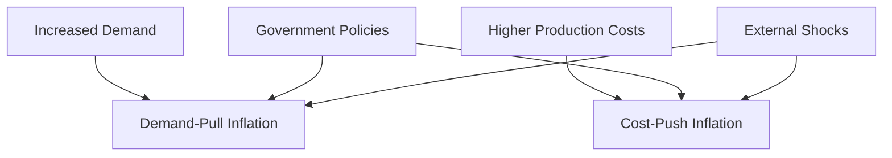

## 5.22 The Causes of Inflation

Inflation is a critical economic concept that affects purchasing power, investment decisions, and overall economic stability. Understanding the causes of inflation is essential for financial professionals, policymakers, and investors. In this section, we will delve into the primary causes of inflation, focusing on demand-pull and cost-push dynamics, and explore how these factors manifest in the Canadian economy.

### Understanding Inflation

Inflation refers to the rate at which the general level of prices for goods and services rises, eroding purchasing power. It is typically measured by the Consumer Price Index (CPI) in Canada. Inflation can have various causes, but it is broadly categorized into two main types: demand-pull inflation and cost-push inflation.

### Demand-Pull Inflation

**Demand-pull inflation** occurs when aggregate demand in an economy outpaces aggregate supply. This imbalance leads to higher prices as consumers compete for limited goods and services. The primary drivers of demand-pull inflation include:

- **Increased Consumer Spending:** When consumers have more disposable income, perhaps due to tax cuts or wage increases, they tend to spend more, boosting demand.
- **Government Spending:** Increased government expenditure on infrastructure, social programs, or other initiatives can raise overall demand.
- **Monetary Policy:** Central banks, such as the Bank of Canada, may lower interest rates to stimulate borrowing and spending, leading to increased demand.
- **Export Demand:** A surge in demand for a country's exports can also contribute to demand-pull inflation.

#### Real-World Example: Demand-Pull Inflation in Canada

In the early 2000s, Canada experienced demand-pull inflation driven by a booming housing market and increased consumer spending. Low-interest rates encouraged borrowing, leading to higher demand for housing and consumer goods. This period saw significant price increases, particularly in real estate.

### Cost-Push Inflation

**Cost-push inflation** arises when the costs of production increase, leading to higher prices for finished goods and services. Key factors contributing to cost-push inflation include:

- **Rising Wages:** If wages increase without a corresponding rise in productivity, businesses may pass on the higher labor costs to consumers.
- **Increased Raw Material Costs:** A rise in the cost of essential raw materials, such as oil or metals, can lead to higher production costs.
- **Supply Chain Disruptions:** Events such as natural disasters or geopolitical tensions can disrupt supply chains, increasing costs.
- **Regulatory Changes:** New regulations that increase compliance costs can also contribute to cost-push inflation.

#### Real-World Example: Cost-Push Inflation in Canada

In 2021, Canada faced cost-push inflation due to rising oil prices and supply chain disruptions caused by the COVID-19 pandemic. These factors led to increased transportation and production costs, which were passed on to consumers in the form of higher prices for goods and services.

### Supply and Demand Dynamics

The interplay between supply and demand is fundamental to understanding inflationary pressures. When demand exceeds supply, prices tend to rise, leading to demand-pull inflation. Conversely, when production costs increase, supply may decrease, resulting in cost-push inflation. These dynamics are influenced by various factors, including consumer behavior, government policies, and external shocks.

### The Role of Government Policies

Government policies play a crucial role in influencing inflation. Fiscal policies, such as changes in taxation and government spending, can impact aggregate demand. Monetary policies, including interest rate adjustments and money supply management by the Bank of Canada, also affect inflationary trends. For instance, expansionary monetary policy can lead to demand-pull inflation, while contractionary policy may help curb inflation.

### External Shocks and Inflation

External shocks, such as global economic crises, natural disasters, or geopolitical events, can trigger inflation by disrupting supply chains or altering demand patterns. For example, a sudden increase in oil prices due to geopolitical tensions can lead to cost-push inflation, affecting transportation and production costs across various sectors.

### Practical Financial Examples

To illustrate these concepts, consider the investment strategies of Canadian pension funds. During periods of high inflation, these funds may adjust their asset allocation to include more inflation-protected securities, such as real return bonds, to preserve purchasing power. Similarly, major Canadian banks like RBC or TD may revise their lending rates in response to inflationary trends, influencing consumer borrowing and spending.

### Diagrams and Visual Aids

Below is a diagram illustrating the relationship between demand-pull and cost-push inflation:

### Best Practices and Challenges

Understanding the causes of inflation is crucial for making informed financial decisions. Here are some best practices and challenges to consider:

- **Best Practices:**
  - Monitor economic indicators, such as CPI and interest rates, to anticipate inflationary trends.
  - Diversify investment portfolios to include assets that perform well during inflationary periods, such as commodities or real estate.
  - Stay informed about government policies and global events that may impact inflation.

- **Common Challenges:**
  - Predicting inflation accurately can be difficult due to the complex interplay of various factors.
  - Inflation can erode fixed-income investments, requiring proactive portfolio management.

### Conclusion

Inflation is a multifaceted economic phenomenon influenced by demand-pull and cost-push factors. By understanding these dynamics, financial professionals can better navigate the challenges posed by inflation and make informed decisions. As you continue your studies, consider how these principles apply to your financial planning and investment strategies.

For further reading, explore the following resources:

- [Types of Inflation: Demand-Pull and Cost-Push](https://www.bankofcanada.ca/education/inflation/)
- [Government Policies and Inflation](https://www.investopedia.com/terms/i/inflation.asp)

### **Ready to Test Your Knowledge?**

**Practice 10 Essential CSC Exam Questions to Master Your Certification**



### What is demand-pull inflation?

- [x] Inflation caused by an increase in aggregate demand exceeding aggregate supply.
- [ ] Inflation caused by an increase in production costs.
- [ ] Inflation caused by a decrease in consumer demand.
- [ ] Inflation caused by government intervention.

> **Explanation:** Demand-pull inflation occurs when aggregate demand exceeds aggregate supply, leading to higher prices.

### Which of the following is a cause of cost-push inflation?

- [x] Rising wages
- [ ] Increased consumer spending
- [ ] Decreased government spending
- [ ] Lower interest rates

> **Explanation:** Cost-push inflation is caused by rising production costs, such as wages or raw materials.

### How can government policies influence inflation?

- [x] By adjusting taxation and government spending
- [ ] By increasing consumer savings
- [ ] By decreasing export demand
- [ ] By reducing global oil prices

> **Explanation:** Government policies, such as fiscal and monetary measures, can impact aggregate demand and supply, influencing inflation.

### What role do external shocks play in inflation?

- [x] They can trigger inflation by disrupting supply chains or altering demand patterns.
- [ ] They have no impact on inflation.
- [ ] They only affect inflation in developing countries.
- [ ] They always lead to deflation.

> **Explanation:** External shocks, such as natural disasters or geopolitical events, can disrupt supply and demand, leading to inflation.

### Which of the following is an example of demand-pull inflation in Canada?

- [x] A booming housing market due to low-interest rates
- [ ] Rising oil prices due to geopolitical tensions
- [ ] Increased transportation costs from supply chain disruptions
- [ ] New regulatory compliance costs

> **Explanation:** A booming housing market driven by low-interest rates is an example of demand-pull inflation, as increased demand exceeds supply.

### What is the primary measure of inflation in Canada?

- [x] Consumer Price Index (CPI)
- [ ] Producer Price Index (PPI)
- [ ] Gross Domestic Product (GDP)
- [ ] Unemployment Rate

> **Explanation:** The Consumer Price Index (CPI) is the primary measure of inflation in Canada.

### Which of the following strategies can help protect against inflation in investment portfolios?

- [x] Diversifying with inflation-protected securities
- [ ] Investing solely in fixed-income assets
- [ ] Holding large amounts of cash
- [ ] Focusing only on domestic equities

> **Explanation:** Diversifying with inflation-protected securities, such as real return bonds, can help preserve purchasing power during inflationary periods.

### What is a common challenge in predicting inflation?

- [x] The complex interplay of various factors
- [ ] The simplicity of economic indicators
- [ ] The stability of global markets
- [ ] The predictability of government policies

> **Explanation:** Predicting inflation is challenging due to the complex interplay of factors such as supply and demand dynamics, government policies, and external shocks.

### How did the COVID-19 pandemic contribute to cost-push inflation in Canada?

- [x] By causing supply chain disruptions and increasing production costs
- [ ] By decreasing consumer demand
- [ ] By stabilizing global oil prices
- [ ] By reducing government spending

> **Explanation:** The COVID-19 pandemic led to supply chain disruptions, increasing production costs and contributing to cost-push inflation.

### True or False: Inflation only affects the prices of goods, not services.

- [ ] True
- [x] False

> **Explanation:** Inflation affects the prices of both goods and services, as it reflects the overall increase in the price level of an economy.


