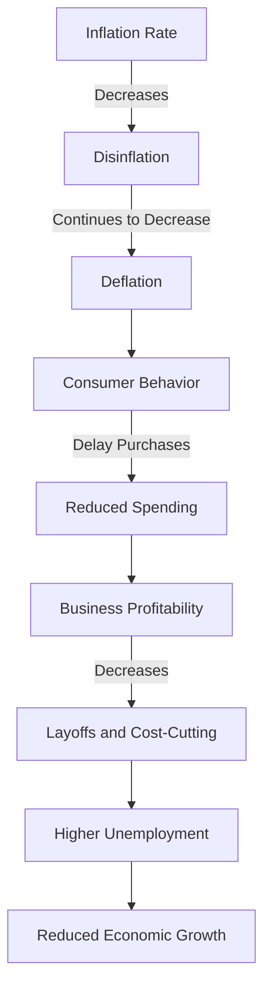

## 5.23 Deflation and Disinflation

In the realm of economic policy, understanding the nuances of deflation and disinflation is crucial for financial professionals. These phenomena, while related, have distinct characteristics and implications for the economy, consumer behavior, and investment strategies. This section delves into the definitions, economic impacts, and strategic considerations associated with deflation and disinflation, with a particular focus on the Canadian financial landscape.

### Defining Disinflation and Deflation

**Disinflation** refers to a decrease in the rate of inflation. This means that while prices continue to rise, they do so at a slower pace than before. Disinflation is often seen as a positive sign, indicating that inflation is being brought under control without leading to a decrease in the overall price level.

**Deflation**, on the other hand, is characterized by a sustained decrease in the general price level of goods and services. Unlike disinflation, deflation implies that prices are falling, which can have more severe economic consequences.

### Economic Implications of Sustained Deflation

Deflation can have profound effects on an economy, influencing consumer behavior, business profitability, and overall economic stability.

#### Impact on Consumer Behavior

During periods of deflation, consumers may delay purchases in anticipation of lower prices in the future. This behavior can lead to a decrease in consumer spending, which is a critical component of economic growth. As spending declines, businesses may experience reduced revenues, leading to cost-cutting measures such as layoffs or reduced investment in new projects.

#### Business Profitability

For businesses, deflation can erode profit margins. As prices fall, companies may struggle to maintain profitability, especially if they are unable to reduce costs at the same rate. This can lead to a vicious cycle where businesses cut back on production, leading to further declines in prices and economic activity.

### Relationship Between Deflation, Unemployment, and Economic Growth

Deflation is often associated with higher unemployment and slower economic growth. As businesses face declining revenues, they may reduce their workforce to cut costs, leading to higher unemployment rates. This, in turn, reduces consumer spending power, further exacerbating the deflationary spiral.

The relationship between deflation and economic growth is complex. While lower prices can increase the purchasing power of consumers, the negative impacts on business profitability and employment can outweigh these benefits, leading to a contraction in economic activity.

### Deflation's Impact on Investment Decisions and Market Stability

Deflation can significantly influence investment decisions and market stability. Investors may become more risk-averse during deflationary periods, preferring to hold cash or invest in safer assets such as government bonds. This shift in investment behavior can lead to decreased demand for equities and other riskier assets, potentially resulting in lower stock prices and increased market volatility.

#### Investment Strategies in a Deflationary Environment

In a deflationary environment, investors may consider several strategies to protect their portfolios:

1. **Focus on Fixed-Income Securities**: Government bonds and high-quality corporate bonds can provide a stable income stream and preserve capital during deflationary periods.

2. **Invest in Defensive Stocks**: Companies in sectors such as utilities, healthcare, and consumer staples tend to perform better during economic downturns due to their stable demand.

3. **Consider International Diversification**: Investing in markets that are not experiencing deflation can provide opportunities for growth and reduce overall portfolio risk.

4. **Hold Cash or Cash Equivalents**: Maintaining liquidity allows investors to take advantage of opportunities as they arise and provides a buffer against market volatility.

### Practical Example: Canadian Pension Funds

Canadian pension funds, such as the Canada Pension Plan Investment Board (CPPIB), often employ diversified investment strategies to mitigate the risks associated with deflation. By investing in a mix of domestic and international assets, including equities, fixed income, and alternative investments, these funds aim to achieve stable returns regardless of economic conditions.

### Diagrams and Visual Aids

To better understand the dynamics of deflation and disinflation, consider the following diagram illustrating the relationship between inflation rates, consumer behavior, and economic growth:

### Best Practices and Common Pitfalls

**Best Practices:**

- **Stay Informed**: Regularly monitor economic indicators and central bank policies to anticipate changes in inflation and deflation trends.
- **Diversify Investments**: A well-diversified portfolio can help mitigate the risks associated with deflation and provide opportunities for growth.
- **Focus on Quality**: Invest in high-quality assets that are more likely to withstand economic downturns.

**Common Pitfalls:**

- **Overreacting to Short-Term Trends**: Avoid making drastic changes to your investment strategy based on short-term deflationary trends.
- **Ignoring Global Opportunities**: Focusing solely on domestic markets can limit potential returns and increase risk during deflationary periods.

### References and Further Reading

For more information on deflation and its effects, consider the following resources:

- [Understanding Deflation](https://www.investopedia.com/terms/d/deflation.asp)
- [The Effects of Deflation](https://www.bankofcanada.ca/2020/05/inflation-deflation-survival-2020/)

### Encouragement for Application

Understanding deflation and disinflation is essential for making informed investment decisions and navigating economic challenges. By applying the principles and strategies discussed in this section, financial professionals can better manage their portfolios and contribute to economic stability.

### **Ready to Test Your Knowledge?**

**Practice 10 Essential CSC Exam Questions to Master Your Certification**



### What is the primary difference between disinflation and deflation?

- [x] Disinflation refers to a decrease in the rate of inflation, while deflation is a sustained decrease in the general price level.
- [ ] Disinflation and deflation both refer to a decrease in prices, but disinflation is more severe.
- [ ] Disinflation is a temporary decrease in prices, while deflation is permanent.
- [ ] Disinflation occurs only in specific sectors, while deflation affects the entire economy.

> **Explanation:** Disinflation is a slowdown in the rate of inflation, meaning prices rise at a slower pace, whereas deflation is an actual decrease in the overall price level.

### How does deflation typically affect consumer behavior?

- [x] Consumers may delay purchases in anticipation of lower prices.
- [ ] Consumers tend to increase spending due to higher purchasing power.
- [ ] Consumers are unaffected by deflation in their purchasing decisions.
- [ ] Consumers focus more on luxury goods during deflation.

> **Explanation:** During deflation, consumers often delay purchases, expecting prices to fall further, which can reduce overall spending.

### What is a common consequence of deflation on businesses?

- [x] Reduced profitability due to falling prices.
- [ ] Increased investment in new projects.
- [ ] Higher profit margins due to lower costs.
- [ ] Expansion of workforce to meet demand.

> **Explanation:** Deflation can erode business profitability as prices fall, making it difficult to maintain margins.

### Which investment strategy is often recommended during deflationary periods?

- [x] Focus on fixed-income securities.
- [ ] Invest heavily in equities.
- [ ] Increase exposure to high-risk assets.
- [ ] Concentrate on speculative investments.

> **Explanation:** Fixed-income securities, such as government bonds, are considered safer during deflationary periods due to their stable returns.

### What is the relationship between deflation and unemployment?

- [x] Deflation is often associated with higher unemployment.
- [ ] Deflation leads to lower unemployment.
- [ ] Deflation has no impact on unemployment.
- [ ] Deflation decreases unemployment in the short term.

> **Explanation:** Deflation can lead to higher unemployment as businesses cut costs in response to declining revenues.

### How can international diversification help during deflation?

- [x] It provides opportunities for growth in non-deflationary markets.
- [ ] It increases exposure to domestic market risks.
- [ ] It limits access to foreign investment opportunities.
- [ ] It focuses solely on Canadian assets.

> **Explanation:** International diversification allows investors to benefit from growth in markets not experiencing deflation, reducing overall portfolio risk.

### Why might investors hold cash during deflationary periods?

- [x] To maintain liquidity and take advantage of opportunities.
- [ ] To avoid all investment risks.
- [ ] To maximize returns through interest.
- [ ] To increase exposure to currency fluctuations.

> **Explanation:** Holding cash provides liquidity and flexibility to capitalize on investment opportunities as they arise.

### What sector is typically considered defensive during economic downturns?

- [x] Utilities
- [ ] Technology
- [ ] Luxury goods
- [ ] Real estate

> **Explanation:** Utilities are considered defensive because they provide essential services with stable demand, even during downturns.

### What is a potential pitfall when reacting to deflation?

- [x] Overreacting to short-term trends.
- [ ] Maintaining a diversified portfolio.
- [ ] Investing in high-quality assets.
- [ ] Staying informed about economic indicators.

> **Explanation:** Overreacting to short-term deflationary trends can lead to poor investment decisions and increased risk.

### True or False: Deflation always leads to economic growth.

- [ ] True
- [x] False

> **Explanation:** Deflation can hinder economic growth by reducing consumer spending and business profitability, leading to a contraction in economic activity.


