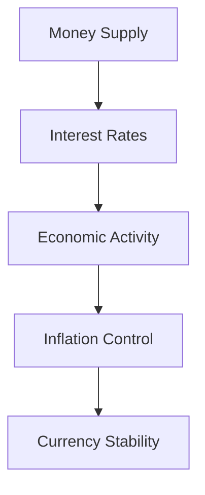

## 5.3 Monetary Policy

Monetary policy is a critical tool used by central banks to influence a nation's economy. In Canada, the Bank of Canada is responsible for formulating and implementing monetary policy. This section will delve into the definition, objectives, and mechanisms of monetary policy, with a focus on its application within the Canadian context.

### Definition and Role of Monetary Policy

Monetary policy refers to the actions undertaken by a central bank, such as the Bank of Canada, to manage the money supply and interest rates to achieve macroeconomic objectives. These objectives typically include controlling inflation, stabilizing the currency, and fostering economic growth and employment.

The role of monetary policy is to ensure that the economy operates smoothly by influencing the availability and cost of money and credit. By adjusting the money supply and interest rates, the central bank can either stimulate economic activity or cool down an overheated economy.

### Objectives of Monetary Policy

The primary objectives of monetary policy are:

1. **Controlling Inflation:** Inflation control is crucial for maintaining the purchasing power of money. The Bank of Canada aims to keep inflation within a target range, typically around 2%, to ensure price stability. This helps businesses and consumers make informed financial decisions without the uncertainty of fluctuating prices.

2. **Stabilizing the Currency:** A stable currency is essential for international trade and investment. By managing interest rates and money supply, the Bank of Canada can influence the exchange rate of the Canadian dollar, thereby stabilizing the currency and maintaining investor confidence.

### Relationship Between Money Supply, Interest Rates, and Economic Activity

The interplay between money supply, interest rates, and economic activity is central to understanding monetary policy. Here's how these elements interact:

- **Money Supply:** The total amount of money available in the economy, including cash, coins, and balances held in bank accounts. An increase in money supply typically lowers interest rates, making borrowing cheaper and encouraging spending and investment.

- **Interest Rates:** The cost of borrowing money, usually expressed as an annual percentage. Lower interest rates reduce the cost of loans, encouraging businesses to invest and consumers to spend, thereby boosting economic activity. Conversely, higher interest rates can slow down borrowing and spending, cooling off an overheated economy.

- **Economic Activity:** The level of production, consumption, and investment in the economy. By adjusting the money supply and interest rates, the central bank can influence economic activity to achieve its macroeconomic objectives.

### Practical Examples and Case Studies

#### Example 1: The Bank of Canada's Response to the 2008 Financial Crisis

During the 2008 financial crisis, the Bank of Canada implemented an aggressive monetary policy to stabilize the economy. It lowered the overnight rate, which is the interest rate at which major financial institutions borrow and lend one-day funds among themselves, to encourage borrowing and spending. This action helped to mitigate the recession's impact on the Canadian economy.

#### Example 2: Inflation Targeting in Canada

Canada's inflation-targeting framework has been a cornerstone of its monetary policy since 1991. By setting a clear inflation target, the Bank of Canada provides a stable environment for economic growth. This approach has been successful in keeping inflation within the target range, contributing to economic stability.

### Diagrams and Visuals

To better understand the relationship between money supply, interest rates, and economic activity, consider the following diagram:

This diagram illustrates how changes in the money supply can influence interest rates, which in turn affect economic activity, inflation control, and currency stability.

### Best Practices and Common Pitfalls

**Best Practices:**

- **Stay Informed:** Regularly review updates from the Bank of Canada and other financial institutions to understand current monetary policy trends.
- **Diversify Investments:** Consider the impact of interest rate changes on different asset classes and diversify your portfolio accordingly.
- **Plan for Inflation:** Incorporate inflation expectations into your financial planning to protect purchasing power.

**Common Pitfalls:**

- **Ignoring Interest Rate Changes:** Failing to account for interest rate fluctuations can lead to suboptimal investment decisions.
- **Overreacting to Short-term Changes:** Focus on long-term trends rather than short-term market volatility when making financial decisions.

### References and Additional Resources

- [Bank of Canada - Monetary Policy](https://www.bankofcanada.ca/core-functions/monetary-policy/)
- [Understanding Interest Rates](https://www.bankofcanada.ca/education/interest-rates/)

For further exploration, consider reading "The Bank of Canada: A History" by John Crow or enrolling in online courses on monetary policy offered by institutions like Coursera or edX.

### Summary

Monetary policy is a powerful tool for managing the economy, with the Bank of Canada playing a pivotal role in controlling inflation and stabilizing the currency. By understanding the relationship between money supply, interest rates, and economic activity, financial professionals can make informed decisions that align with economic conditions.

### **Ready to Test Your Knowledge?**

**Practice 10 Essential CSC Exam Questions to Master Your Certification**



### What is the primary role of monetary policy?

- [x] To manage the money supply and interest rates to achieve macroeconomic objectives
- [ ] To regulate the stock market
- [ ] To set tax rates
- [ ] To control government spending

> **Explanation:** The primary role of monetary policy is to manage the money supply and interest rates to achieve macroeconomic objectives such as controlling inflation and stabilizing the currency.

### Which institution is responsible for formulating monetary policy in Canada?

- [x] Bank of Canada
- [ ] Canadian Securities Administrators
- [ ] Department of Finance Canada
- [ ] Canada Revenue Agency

> **Explanation:** The Bank of Canada is responsible for formulating and implementing monetary policy in Canada.

### What is the typical inflation target range set by the Bank of Canada?

- [x] Around 2%
- [ ] 0-1%
- [ ] 3-4%
- [ ] 5-6%

> **Explanation:** The Bank of Canada typically sets an inflation target of around 2% to ensure price stability.

### How does an increase in money supply generally affect interest rates?

- [x] It lowers interest rates
- [ ] It raises interest rates
- [ ] It has no effect on interest rates
- [ ] It stabilizes interest rates

> **Explanation:** An increase in money supply generally lowers interest rates, making borrowing cheaper and encouraging spending and investment.

### What was the Bank of Canada's response to the 2008 financial crisis?

- [x] Lowered the overnight rate
- [ ] Raised the overnight rate
- [ ] Implemented a tax increase
- [ ] Reduced government spending

> **Explanation:** During the 2008 financial crisis, the Bank of Canada lowered the overnight rate to encourage borrowing and spending, helping to stabilize the economy.

### What is the relationship between interest rates and economic activity?

- [x] Lower interest rates encourage economic activity
- [ ] Higher interest rates encourage economic activity
- [ ] Interest rates have no impact on economic activity
- [ ] Economic activity determines interest rates

> **Explanation:** Lower interest rates reduce the cost of borrowing, encouraging businesses to invest and consumers to spend, thereby boosting economic activity.

### What is a common pitfall when considering monetary policy?

- [x] Ignoring interest rate changes
- [ ] Over-diversifying investments
- [ ] Focusing solely on inflation
- [ ] Relying only on government bonds

> **Explanation:** Ignoring interest rate changes can lead to suboptimal investment decisions, as these changes significantly impact borrowing costs and economic activity.

### What does inflation control help maintain?

- [x] Purchasing power of money
- [ ] Stock market stability
- [ ] Government budget balance
- [ ] Trade surplus

> **Explanation:** Inflation control helps maintain the purchasing power of money, ensuring that consumers and businesses can make informed financial decisions without the uncertainty of fluctuating prices.

### How can the Bank of Canada influence the exchange rate of the Canadian dollar?

- [x] By managing interest rates and money supply
- [ ] By setting tax rates
- [ ] By regulating the stock market
- [ ] By controlling government spending

> **Explanation:** The Bank of Canada can influence the exchange rate of the Canadian dollar by managing interest rates and money supply, thereby stabilizing the currency and maintaining investor confidence.

### True or False: The Bank of Canada has been using an inflation-targeting framework since 1991.

- [x] True
- [ ] False

> **Explanation:** True. Canada's inflation-targeting framework has been a cornerstone of its monetary policy since 1991, providing a stable environment for economic growth.


