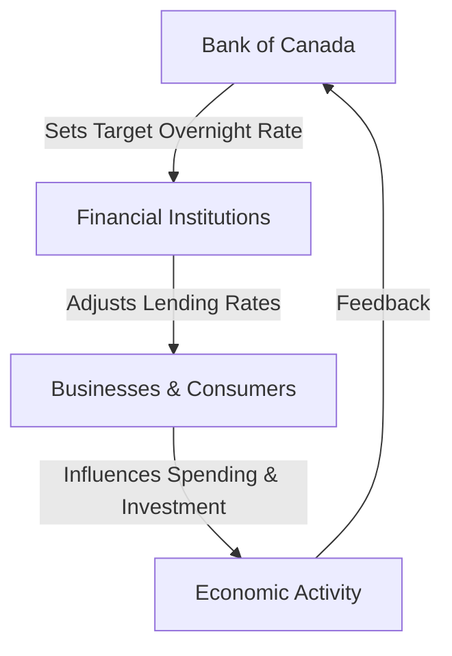

## 5.5 Monetary Policy Tools

Monetary policy is a critical component of economic management, influencing the availability and cost of money and credit to promote national economic goals. In Canada, the Bank of Canada is the central authority responsible for implementing monetary policy. This section delves into the primary tools used by the Bank of Canada, including the target for the overnight rate, open market operations, and drawdowns/redeposits. We will also explore how Special Purchase and Resale Agreements (SPRAs) and Sale and Repurchase Agreements (SRAs) are utilized to control the money supply, and the subsequent impact on interest rates and economic activity.

### The Target for the Overnight Rate

The overnight rate is the interest rate at which major financial institutions borrow and lend one-day (overnight) funds among themselves. It is a pivotal tool in the Bank of Canada's monetary policy framework. By setting a target for the overnight rate, the Bank influences other interest rates, such as those for consumer loans and mortgages, which in turn affect economic activity.

#### How It Works

The Bank of Canada sets a target for the overnight rate eight times a year. This target is a key signal to financial markets about the stance of monetary policy. When the Bank wants to stimulate the economy, it lowers the target rate, making borrowing cheaper and encouraging spending and investment. Conversely, to cool down an overheating economy, the Bank raises the target rate, making borrowing more expensive and slowing down economic activity.

### Open Market Operations

Open market operations are the primary means by which the Bank of Canada implements its monetary policy. These operations involve the buying and selling of government securities in the open market to influence the level of cash reserves in the banking system, thereby affecting the overnight rate.

#### Special Purchase and Resale Agreements (SPRAs)

SPRAs are short-term loans used by the Bank of Canada to inject liquidity into the financial system. In a SPRA, the Bank purchases securities from financial institutions with an agreement to sell them back the next day. This transaction temporarily increases the cash reserves of the financial institutions, lowering the overnight rate.

#### Sale and Repurchase Agreements (SRAs)

SRAs are the opposite of SPRAs. They are used to withdraw liquidity from the financial system. In an SRA, the Bank sells securities to financial institutions with an agreement to repurchase them the next day. This transaction temporarily reduces the cash reserves of the financial institutions, increasing the overnight rate.

### Drawdowns and Redeposits

Drawdowns and redeposits are additional tools used by the Bank of Canada to manage liquidity in the banking system. 

- **Drawdowns** involve the transfer of government deposits from the Bank of Canada to the financial institutions, reducing the amount of cash in the banking system and putting upward pressure on the overnight rate.
- **Redepsits** are the opposite, where funds are moved from financial institutions back to the Bank of Canada, increasing the cash reserves in the banking system and putting downward pressure on the overnight rate.

### Impact on Interest Rates and Economic Activity

The tools discussed above directly influence the overnight rate, which in turn affects other interest rates in the economy. Lower interest rates reduce the cost of borrowing, encouraging businesses to invest and consumers to spend, thereby stimulating economic growth. Conversely, higher interest rates increase the cost of borrowing, discouraging spending and investment, and slowing down economic activity.

#### Diagram: Influence of Monetary Policy Tools on Economic Activity

### Practical Example: The 2008 Financial Crisis

During the 2008 financial crisis, the Bank of Canada aggressively cut the target for the overnight rate to stimulate the economy. It also used SPRAs extensively to ensure liquidity in the financial system. These actions helped stabilize the Canadian economy by making credit more accessible and affordable.

### Best Practices and Common Pitfalls

- **Best Practices:** Financial professionals should monitor the Bank of Canada's announcements regarding the overnight rate and open market operations to anticipate changes in interest rates and adjust investment strategies accordingly.
- **Common Pitfalls:** Ignoring the broader economic context when interpreting changes in monetary policy can lead to misguided investment decisions. It's crucial to consider factors such as inflation, employment, and global economic conditions.

### References and Further Reading

- [Bank of Canada - Monetary Policy Tools](https://www.bankofcanada.ca/core-functions/monetary-policy/monetary-policy-tools/)
- [Understanding SPRAs and SRAs](https://www.bankofcanada.ca/rates/interest-rates/bank-details/monetary-policy-tools/)

### Conclusion

Understanding the tools of monetary policy is essential for financial professionals and investors. By influencing interest rates and liquidity, the Bank of Canada plays a crucial role in steering the economy towards its goals. By staying informed about these tools and their implications, you can make more informed financial decisions and better anticipate market movements.

### **Ready to Test Your Knowledge?**

**Practice 10 Essential CSC Exam Questions to Master Your Certification**



### What is the primary interest rate used by the Bank of Canada to influence monetary policy?

- [x] Overnight Rate
- [ ] Prime Rate
- [ ] Discount Rate
- [ ] Federal Funds Rate

> **Explanation:** The overnight rate is the interest rate at which major financial institutions borrow and lend one-day (overnight) funds among themselves and is the primary tool used by the Bank of Canada to influence monetary policy.

### How do Special Purchase and Resale Agreements (SPRAs) affect the money supply?

- [x] They inject liquidity into the financial system.
- [ ] They withdraw liquidity from the financial system.
- [ ] They have no effect on liquidity.
- [ ] They permanently change the money supply.

> **Explanation:** SPRAs are used by the Bank of Canada to inject liquidity into the financial system by purchasing securities with an agreement to sell them back the next day.

### What is the effect of raising the target for the overnight rate?

- [x] It increases the cost of borrowing.
- [ ] It decreases the cost of borrowing.
- [ ] It has no effect on borrowing costs.
- [ ] It directly changes the inflation rate.

> **Explanation:** Raising the target for the overnight rate increases the cost of borrowing, which can slow down economic activity by discouraging spending and investment.

### What is the purpose of Sale and Repurchase Agreements (SRAs)?

- [x] To withdraw liquidity from the financial system.
- [ ] To inject liquidity into the financial system.
- [ ] To permanently alter the money supply.
- [ ] To set the prime rate.

> **Explanation:** SRAs are used to withdraw liquidity from the financial system by selling securities with an agreement to repurchase them the next day.

### Which of the following tools can put upward pressure on the overnight rate?

- [x] Drawdowns
- [ ] Redepsits
- [x] Sale and Repurchase Agreements (SRAs)
- [ ] Special Purchase and Resale Agreements (SPRAs)

> **Explanation:** Drawdowns and SRAs both reduce the cash reserves in the banking system, putting upward pressure on the overnight rate.

### What happens when the Bank of Canada lowers the target for the overnight rate?

- [x] Borrowing becomes cheaper.
- [ ] Borrowing becomes more expensive.
- [ ] Inflation immediately decreases.
- [ ] The money supply contracts.

> **Explanation:** Lowering the target for the overnight rate makes borrowing cheaper, encouraging spending and investment.

### How do redeposits affect the banking system?

- [x] They increase cash reserves.
- [ ] They decrease cash reserves.
- [x] They put downward pressure on the overnight rate.
- [ ] They have no effect on liquidity.

> **Explanation:** Redepsits increase cash reserves in the banking system, putting downward pressure on the overnight rate.

### What is the main goal of the Bank of Canada's monetary policy?

- [x] To maintain price stability and support economic growth.
- [ ] To maximize government revenue.
- [ ] To control the stock market.
- [ ] To set fiscal policy.

> **Explanation:** The main goal of the Bank of Canada's monetary policy is to maintain price stability and support economic growth.

### What is a common pitfall when interpreting changes in monetary policy?

- [x] Ignoring the broader economic context.
- [ ] Overanalyzing the Bank's announcements.
- [ ] Focusing too much on fiscal policy.
- [ ] Assuming immediate effects on inflation.

> **Explanation:** Ignoring the broader economic context can lead to misguided investment decisions when interpreting changes in monetary policy.

### True or False: The Bank of Canada uses open market operations to directly set the prime rate.

- [ ] True
- [x] False

> **Explanation:** The Bank of Canada uses open market operations to influence the overnight rate, not directly set the prime rate.


