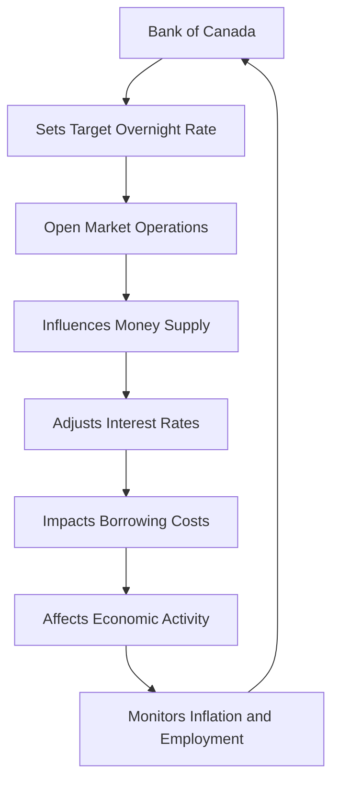

## 5.6 Implementing Monetary Policy

Monetary policy is a critical tool used by central banks to manage economic stability and growth. In Canada, the Bank of Canada plays a pivotal role in implementing monetary policy, primarily through the manipulation of the overnight rate. This section delves into how the Bank of Canada uses the overnight rate to influence economic conditions, the process of adjusting the target overnight rate within the operating band, and the broader implications of these decisions on borrowing costs for consumers and businesses.

### Understanding the Overnight Rate

The overnight rate is the interest rate at which major financial institutions borrow and lend one-day (or "overnight") funds among themselves. It serves as a benchmark for other interest rates in the economy, influencing everything from mortgage rates to savings account yields.

The Bank of Canada sets a target for the overnight rate, which is a key component of its monetary policy framework. By adjusting this target, the Bank can influence economic activity, inflation, and employment levels. The target overnight rate is set within an operating band, which is typically a range of 0.5 percentage points. The upper limit of this band is the rate at which the Bank will lend to financial institutions, while the lower limit is the rate at which it will accept deposits.

### The Operating Band and Its Significance

The operating band is crucial because it provides flexibility for the overnight rate to fluctuate in response to market conditions while maintaining overall control over monetary policy. By setting a target within this band, the Bank of Canada can signal its monetary policy stance to the market.

For instance, if the Bank wants to stimulate economic activity, it might lower the target overnight rate, making borrowing cheaper and encouraging spending and investment. Conversely, if inflation is rising too quickly, the Bank might raise the target rate to cool down economic activity.

### Adjusting the Target Overnight Rate

The process of adjusting the target overnight rate involves careful consideration of various economic indicators, including inflation, employment, and GDP growth. The Bank of Canada conducts eight fixed announcement dates each year, during which it announces any changes to the target overnight rate.

When the Bank decides to change the rate, it uses open market operations to influence the supply of money in the economy. For example, to lower the rate, the Bank might purchase government securities, increasing the money supply and putting downward pressure on interest rates. Conversely, to raise the rate, the Bank might sell securities, reducing the money supply and exerting upward pressure on rates.

### Impact on Borrowing Costs

Changes in the overnight rate have a direct impact on borrowing costs for consumers and businesses. When the Bank of Canada lowers the rate, it typically leads to lower interest rates on loans and mortgages, making it cheaper for consumers to borrow money for big-ticket items like homes and cars. Businesses also benefit from lower borrowing costs, which can encourage investment in new projects and expansion.

Conversely, when the Bank raises the rate, borrowing becomes more expensive. This can lead to reduced consumer spending and business investment, slowing down economic activity. The Bank uses these tools to maintain a balance between stimulating growth and controlling inflation.

### Practical Examples and Case Studies

To illustrate these concepts, consider the actions of the Bank of Canada during the COVID-19 pandemic. In response to the economic downturn, the Bank significantly lowered the target overnight rate to support economic recovery. This move helped reduce borrowing costs, encouraging spending and investment during a challenging economic period.

Another example is the period of rising inflation in the early 2020s, where the Bank of Canada began to increase the target overnight rate to prevent the economy from overheating. These actions demonstrate the Bank's role in navigating complex economic landscapes to achieve its mandate of price stability and sustainable economic growth.

### Diagram: The Flow of Monetary Policy

Below is a diagram illustrating the flow of monetary policy from the Bank of Canada's decision-making process to its impact on the economy.

### Best Practices and Challenges

Implementing monetary policy effectively requires a deep understanding of economic conditions and the ability to anticipate market reactions. One common challenge is the time lag between policy implementation and its effects on the economy. Policymakers must also consider global economic conditions, as external factors can influence domestic economic outcomes.

### Conclusion

The Bank of Canada's use of the overnight rate is a powerful tool for managing the Canadian economy. By understanding how these mechanisms work, financial professionals can better anticipate changes in economic conditions and make informed decisions. As you continue to explore the intricacies of monetary policy, consider how these principles apply to your own financial strategies and the broader economic landscape.

For further reading, refer to the [Bank of Canada - Overnight Rate](https://www.bankofcanada.ca/rates/interest-rates/overnight-rate/) and the [Impact of Interest Rate Changes](https://www.bankofcanada.ca/education/impact-interest-rates/).

### **Ready to Test Your Knowledge?**

**Practice 10 Essential CSC Exam Questions to Master Your Certification**



### What is the primary tool used by the Bank of Canada to implement monetary policy?

- [x] The overnight rate
- [ ] The prime rate
- [ ] The discount rate
- [ ] The federal funds rate

> **Explanation:** The Bank of Canada uses the overnight rate as its primary tool to implement monetary policy, influencing economic conditions through interest rate adjustments.

### What is the operating band?

- [x] The range within which the overnight rate is allowed to fluctuate
- [ ] The difference between the prime rate and the discount rate
- [ ] The spread between long-term and short-term interest rates
- [ ] The range of inflation targets set by the Bank of Canada

> **Explanation:** The operating band is the range within which the overnight rate is allowed to fluctuate, providing flexibility while maintaining control over monetary policy.

### How does the Bank of Canada lower the target overnight rate?

- [x] By purchasing government securities
- [ ] By selling government securities
- [ ] By increasing the prime rate
- [ ] By decreasing the discount rate

> **Explanation:** To lower the target overnight rate, the Bank of Canada purchases government securities, increasing the money supply and putting downward pressure on interest rates.

### What happens to borrowing costs when the Bank of Canada raises the overnight rate?

- [x] Borrowing costs increase
- [ ] Borrowing costs decrease
- [ ] Borrowing costs remain unchanged
- [ ] Borrowing costs fluctuate unpredictably

> **Explanation:** When the Bank of Canada raises the overnight rate, borrowing costs increase, making loans and mortgages more expensive for consumers and businesses.

### Why might the Bank of Canada raise the target overnight rate?

- [x] To control inflation
- [ ] To stimulate economic growth
- [x] To prevent the economy from overheating
- [ ] To increase employment

> **Explanation:** The Bank of Canada might raise the target overnight rate to control inflation and prevent the economy from overheating, balancing growth and price stability.

### What is the impact of a lower overnight rate on consumer spending?

- [x] It encourages consumer spending
- [ ] It discourages consumer spending
- [ ] It has no impact on consumer spending
- [ ] It leads to unpredictable changes in consumer spending

> **Explanation:** A lower overnight rate encourages consumer spending by reducing borrowing costs, making it cheaper for consumers to finance purchases.

### How often does the Bank of Canada announce changes to the target overnight rate?

- [x] Eight times a year
- [ ] Four times a year
- [x] Twelve times a year
- [ ] Once a year

> **Explanation:** The Bank of Canada conducts eight fixed announcement dates each year to announce any changes to the target overnight rate.

### What is the effect of open market operations on the money supply?

- [x] It influences the money supply
- [ ] It has no effect on the money supply
- [ ] It decreases the money supply
- [ ] It increases the money supply unpredictably

> **Explanation:** Open market operations influence the money supply by buying or selling government securities, affecting interest rates and economic activity.

### What is the relationship between the overnight rate and inflation?

- [x] The overnight rate is used to control inflation
- [ ] The overnight rate has no relationship with inflation
- [ ] The overnight rate directly causes inflation
- [ ] The overnight rate is inversely related to inflation

> **Explanation:** The overnight rate is used to control inflation by influencing borrowing costs and economic activity, helping maintain price stability.

### True or False: The Bank of Canada uses the overnight rate to influence employment levels.

- [x] True
- [ ] False

> **Explanation:** True. The Bank of Canada uses the overnight rate to influence economic conditions, including employment levels, by adjusting borrowing costs and stimulating or cooling economic activity.


