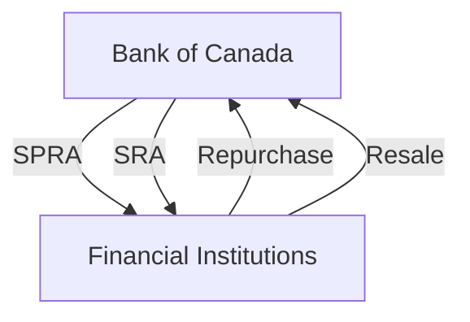

## 5.7 Open Market Operations

Open market operations (OMOs) are a fundamental component of monetary policy, employed by central banks to regulate the money supply and influence interest rates. In Canada, the Bank of Canada utilizes OMOs as a primary tool to maintain the overnight rate within its target band, thereby ensuring economic stability and growth. This section delves into the mechanics of OMOs, with a particular focus on Special Purchase and Resale Agreements (SPRAs) and Sale and Repurchase Agreements (SRAs), and their significance in the Canadian financial landscape.

### Understanding Open Market Operations

Open market operations involve the buying and selling of government securities in the open market to control the supply of money that banks hold, which in turn influences interest rates. By adjusting the level of liquidity in the banking system, the Bank of Canada can steer the overnight rate—the interest rate at which major financial institutions borrow and lend one-day funds among themselves—towards its target.

#### Role in Monetary Policy

The primary objective of OMOs is to implement monetary policy by influencing short-term interest rates and the supply of base money in the economy. This, in turn, affects broader economic variables such as inflation, employment, and economic growth. The Bank of Canada conducts these operations to ensure that the overnight rate remains within the target range set by the Governing Council.

### Special Purchase and Resale Agreements (SPRAs)

SPRAs are a type of open market operation used by the Bank of Canada to inject liquidity into the financial system. In an SPRA, the Bank purchases securities from a financial institution with an agreement to sell them back at a predetermined price on a specified future date. This transaction temporarily increases the amount of money in the banking system, thereby lowering the overnight rate if it is above the target.

#### Example of SPRAs

Consider a scenario where the overnight rate is trending above the target range. The Bank of Canada might initiate an SPRA to increase the liquidity available to financial institutions. By purchasing securities, the Bank effectively provides funds to the market, encouraging banks to lend more freely at lower rates, thus bringing the overnight rate back towards the target.

### Sale and Repurchase Agreements (SRAs)

Conversely, SRAs are employed to withdraw liquidity from the market. In an SRA, the Bank of Canada sells securities to financial institutions with an agreement to repurchase them later. This operation reduces the amount of money in the banking system, helping to increase the overnight rate if it is below the target.

#### Example of SRAs

Suppose the overnight rate is below the desired target range. The Bank of Canada may conduct an SRA to reduce the liquidity in the market. By selling securities, the Bank absorbs funds from the financial system, prompting banks to lend less freely, which can increase the overnight rate towards the target.

### Maintaining the Overnight Rate

The Bank of Canada uses SPRAs and SRAs strategically to maintain the overnight rate within its target band. By carefully managing the supply of money through these operations, the Bank can influence the cost of borrowing and lending, which is crucial for economic stability.

#### Diagram: Open Market Operations Flow

In this diagram, the flow of SPRAs and SRAs is depicted, showing how the Bank of Canada interacts with financial institutions to manage liquidity.

### Practical Implications for Investors

Understanding OMOs is essential for investors and financial professionals, as these operations can significantly impact interest rates, bond prices, and overall market conditions. For instance, when the Bank of Canada conducts SPRAs, it may signal an easing monetary policy stance, which could lead to lower interest rates and higher bond prices. Conversely, SRAs might indicate a tightening policy, potentially resulting in higher interest rates and lower bond prices.

### Best Practices and Challenges

**Best Practices:**
- Stay informed about the Bank of Canada's monetary policy announcements and open market operations.
- Monitor the overnight rate and its implications for interest-sensitive investments, such as bonds and real estate.
- Consider the broader economic context when interpreting the impact of SPRAs and SRAs on financial markets.

**Common Challenges:**
- Predicting the exact timing and magnitude of OMOs can be difficult, as they depend on various economic indicators and policy objectives.
- Rapid changes in market conditions may require quick adjustments to investment strategies.

### Conclusion

Open market operations are a vital tool for the Bank of Canada in implementing monetary policy and maintaining economic stability. By understanding the mechanics of SPRAs and SRAs, financial professionals can better anticipate changes in interest rates and adjust their strategies accordingly. As the Canadian economy evolves, staying informed about these operations will remain crucial for effective financial decision-making.

For further reading, consider exploring the following resources:
- [Bank of Canada - Open Market Operations](https://www.bankofcanada.ca/rates/interest-rates/bank-details/monetary-policy-tools/open-market-operations/)
- [Understanding SPRAs vs. SRAs](https://www.bankofcanada.ca/rates/interest-rates/bank-details/monetary-policy-tools/)

### **Ready to Test Your Knowledge?**

**Practice 10 Essential CSC Exam Questions to Master Your Certification**



### What are open market operations?

- [x] Transactions involving the buying and selling of government securities to control the money supply.
- [ ] Transactions involving the buying and selling of foreign currencies.
- [ ] Transactions involving the buying and selling of corporate bonds.
- [ ] Transactions involving the buying and selling of real estate.

> **Explanation:** Open market operations involve the buying and selling of government securities to influence the money supply and interest rates.

### What is the primary goal of open market operations?

- [x] To maintain the overnight rate within the target band.
- [ ] To increase government revenue.
- [ ] To stabilize the stock market.
- [ ] To control inflation directly.

> **Explanation:** The primary goal of open market operations is to maintain the overnight rate within the target band set by the central bank.

### How do Special Purchase and Resale Agreements (SPRAs) affect the market?

- [x] They inject liquidity into the market, lowering the overnight rate.
- [ ] They withdraw liquidity from the market, raising the overnight rate.
- [ ] They have no effect on market liquidity.
- [ ] They stabilize the foreign exchange rate.

> **Explanation:** SPRAs inject liquidity into the market, which can lower the overnight rate if it is above the target.

### What is the purpose of Sale and Repurchase Agreements (SRAs)?

- [x] To withdraw liquidity from the market, raising the overnight rate.
- [ ] To inject liquidity into the market, lowering the overnight rate.
- [ ] To stabilize the stock market.
- [ ] To increase government revenue.

> **Explanation:** SRAs are used to withdraw liquidity from the market, which can raise the overnight rate if it is below the target.

### Which of the following is a correct statement about SPRAs?

- [x] They involve the Bank of Canada purchasing securities with an agreement to sell them back later.
- [ ] They involve the Bank of Canada selling securities with an agreement to repurchase them later.
- [x] They are used to inject liquidity into the market.
- [ ] They are used to withdraw liquidity from the market.

> **Explanation:** SPRAs involve the Bank of Canada purchasing securities to inject liquidity into the market, with an agreement to sell them back later.

### Which tool is used by the Bank of Canada to influence short-term interest rates?

- [x] Open market operations
- [ ] Fiscal policy
- [ ] Exchange rate interventions
- [ ] Tax policy

> **Explanation:** Open market operations are used by the Bank of Canada to influence short-term interest rates.

### What happens to the overnight rate when the Bank of Canada conducts an SRA?

- [x] It tends to increase.
- [ ] It tends to decrease.
- [x] It remains unchanged.
- [ ] It becomes unpredictable.

> **Explanation:** Conducting an SRA tends to increase the overnight rate by withdrawing liquidity from the market.

### What is the effect of SPRAs on bond prices?

- [x] They may lead to higher bond prices.
- [ ] They may lead to lower bond prices.
- [ ] They have no effect on bond prices.
- [ ] They stabilize bond prices.

> **Explanation:** SPRAs can lead to higher bond prices by lowering interest rates through increased market liquidity.

### What is the relationship between SRAs and monetary policy?

- [x] SRAs are used to tighten monetary policy by reducing liquidity.
- [ ] SRAs are used to ease monetary policy by increasing liquidity.
- [ ] SRAs have no relationship with monetary policy.
- [ ] SRAs are used to stabilize the foreign exchange market.

> **Explanation:** SRAs are used to tighten monetary policy by reducing liquidity in the financial system.

### True or False: Open market operations are the only tool used by the Bank of Canada to implement monetary policy.

- [ ] True
- [x] False

> **Explanation:** False. The Bank of Canada uses various tools, including open market operations, the policy interest rate, and other measures to implement monetary policy.


