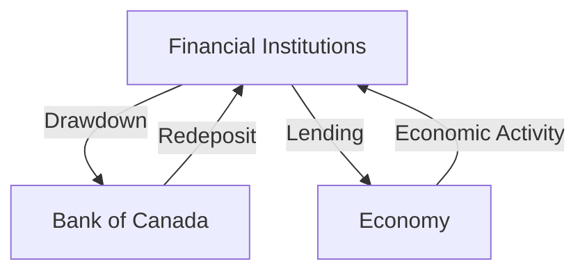

## 5.8 Drawdowns and Redeposits

In the realm of fiscal agency functions, drawdowns and redeposits are pivotal tools used by the Bank of Canada to regulate the money supply and influence interest rates. Understanding these mechanisms is crucial for grasping how monetary policy is implemented in Canada and how it affects financial institutions and the broader economy.

### Understanding Drawdowns and Redeposits

**Drawdown** refers to the process where the Bank of Canada transfers funds from financial institutions to itself. This action effectively reduces the money supply within the economy, leading to an increase in interest rates. Conversely, a **redeposit** occurs when the Bank of Canada transfers funds back to financial institutions, increasing the money supply and typically resulting in lower interest rates.

These tools are part of the Bank's monetary policy arsenal, allowing it to manage liquidity in the financial system and stabilize the economy. By adjusting the levels of drawdowns and redeposits, the Bank of Canada can influence economic activity, inflation, and employment levels.

### The Role of the Bank of Canada

The Bank of Canada utilizes drawdowns and redeposits as part of its broader monetary policy strategy. These tools are employed to maintain the target overnight rate, which is the interest rate at which major financial institutions borrow and lend one-day funds among themselves. By influencing this rate, the Bank can indirectly affect other interest rates, such as those for mortgages, loans, and savings.

#### How Drawdowns Work

When the Bank of Canada initiates a drawdown, it withdraws funds from the accounts of financial institutions. This action decreases the amount of money available for lending and investment, leading to a contraction in the money supply. As a result, interest rates tend to rise, making borrowing more expensive and saving more attractive. This can help cool down an overheating economy or control inflation.

#### How Redeposits Work

In contrast, a redeposit involves the Bank of Canada injecting funds back into the financial system. This increases the money supply, lowers interest rates, and encourages borrowing and investment. Redeposits are typically used to stimulate economic activity during periods of slow growth or recession.

### Impact on Financial Institutions and the Economy

The effects of drawdowns and redeposits extend beyond the immediate changes in money supply and interest rates. They have significant implications for financial institutions and the broader economy.

#### Impact on Financial Institutions

For financial institutions, drawdowns mean a reduction in available reserves, which can constrain their ability to lend. This can lead to tighter credit conditions and higher borrowing costs for businesses and consumers. On the other hand, redeposits increase reserves, enhancing the capacity of banks to extend credit and support economic growth.

#### Broader Economic Impact

On a macroeconomic level, drawdowns and redeposits influence consumer spending, business investment, and overall economic activity. Higher interest rates resulting from drawdowns can dampen consumer spending and business investment, slowing down economic growth. Conversely, lower rates from redeposits can boost spending and investment, stimulating economic expansion.

### Practical Example: The 2008 Financial Crisis

During the 2008 financial crisis, central banks worldwide, including the Bank of Canada, used redeposits and other monetary policy tools to inject liquidity into the financial system. By lowering interest rates and increasing the money supply, these actions helped stabilize financial markets and support economic recovery.

### Diagram: Drawdowns and Redeposits Flow

To better understand the flow of funds during drawdowns and redeposits, consider the following diagram:

### Best Practices and Challenges

**Best Practices:**

- **Monitoring Economic Indicators:** Financial institutions and policymakers should closely monitor economic indicators to anticipate changes in monetary policy.
- **Diversifying Portfolios:** Investors should diversify their portfolios to mitigate risks associated with interest rate fluctuations.
- **Staying Informed:** Keeping abreast of Bank of Canada announcements and policy changes can help individuals and businesses make informed financial decisions.

**Common Challenges:**

- **Predicting Policy Changes:** Anticipating the timing and magnitude of drawdowns and redeposits can be challenging, requiring careful analysis of economic conditions.
- **Managing Interest Rate Risk:** Financial institutions must manage the risk of interest rate changes impacting their lending and investment activities.

### Conclusion

Drawdowns and redeposits are essential tools in the Bank of Canada's monetary policy toolkit. By understanding how these mechanisms work and their impact on the economy, financial professionals can better navigate the complexities of the Canadian financial landscape. As you continue to explore the intricacies of monetary policy, consider how these tools can influence your financial planning and investment strategies.

For further reading, explore the following resources:

- [Bank of Canada - Drawdowns and Redeposits](https://www.bankofcanada.ca/rates/interest-rates/bank-details/monetary-policy-tools/drawdowns-redeposits/)
- [Impact on Money Supply](https://www.bankofcanada.ca/education/monetary-policy/money-supply/)

### **Ready to Test Your Knowledge?**

**Practice 10 Essential CSC Exam Questions to Master Your Certification**



### What is a drawdown in the context of fiscal agency functions?

- [x] A transfer of funds from financial institutions to the Bank of Canada, reducing the money supply.
- [ ] A transfer of funds from the Bank of Canada to financial institutions, increasing the money supply.
- [ ] A method of increasing interest rates by injecting funds into the economy.
- [ ] A strategy to decrease inflation by increasing consumer spending.

> **Explanation:** A drawdown involves transferring funds from financial institutions to the Bank of Canada, which reduces the money supply and typically increases interest rates.

### How does a redeposit affect the money supply?

- [x] It increases the money supply.
- [ ] It decreases the money supply.
- [ ] It has no effect on the money supply.
- [ ] It stabilizes the money supply without changing it.

> **Explanation:** A redeposit involves transferring funds from the Bank of Canada to financial institutions, thereby increasing the money supply.

### What is the primary goal of using drawdowns and redeposits?

- [x] To influence the money supply and interest rates.
- [ ] To directly control inflation.
- [ ] To regulate the stock market.
- [ ] To manage government spending.

> **Explanation:** The primary goal of drawdowns and redeposits is to influence the money supply and interest rates, which in turn affects economic activity.

### During a drawdown, what typically happens to interest rates?

- [x] They increase.
- [ ] They decrease.
- [ ] They remain unchanged.
- [ ] They fluctuate unpredictably.

> **Explanation:** During a drawdown, the money supply decreases, leading to an increase in interest rates.

### What is the effect of redeposits on financial institutions?

- [x] They increase the reserves of financial institutions.
- [ ] They decrease the reserves of financial institutions.
- [x] They enhance the capacity to lend.
- [ ] They restrict lending activities.

> **Explanation:** Redeposits increase the reserves of financial institutions, enhancing their capacity to lend and support economic growth.

### How do drawdowns impact consumer spending?

- [x] They tend to decrease consumer spending.
- [ ] They tend to increase consumer spending.
- [ ] They have no impact on consumer spending.
- [ ] They stabilize consumer spending.

> **Explanation:** Drawdowns increase interest rates, making borrowing more expensive and saving more attractive, which can decrease consumer spending.

### What is a common challenge associated with drawdowns and redeposits?

- [x] Predicting policy changes.
- [ ] Managing inflation directly.
- [x] Managing interest rate risk.
- [ ] Regulating stock market volatility.

> **Explanation:** Predicting policy changes and managing interest rate risk are common challenges associated with drawdowns and redeposits.

### In what economic condition might the Bank of Canada use redeposits?

- [x] During a recession to stimulate economic activity.
- [ ] During high inflation to cool down the economy.
- [ ] During a stock market boom to stabilize prices.
- [ ] During a period of high employment to reduce job growth.

> **Explanation:** The Bank of Canada might use redeposits during a recession to increase the money supply and stimulate economic activity.

### What is the relationship between drawdowns and inflation?

- [x] Drawdowns can help control inflation by reducing the money supply.
- [ ] Drawdowns increase inflation by increasing the money supply.
- [ ] Drawdowns have no effect on inflation.
- [ ] Drawdowns directly decrease inflation by increasing consumer spending.

> **Explanation:** Drawdowns can help control inflation by reducing the money supply, which typically leads to higher interest rates and reduced spending.

### True or False: Redeposits are used to decrease the money supply.

- [ ] True
- [x] False

> **Explanation:** False. Redeposits are used to increase the money supply by transferring funds from the Bank of Canada to financial institutions.


