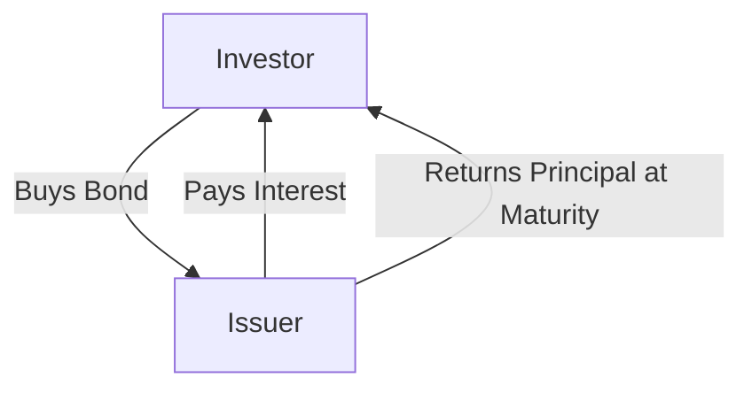

## 6.1 The Fixed-Income Marketplace

In the realm of financial markets, fixed-income securities play a pivotal role in providing stability and predictable income streams for investors. This section delves into the intricacies of the fixed-income marketplace, focusing on the fundamental instruments such as bonds and debentures, and their significance in both individual and institutional investment strategies.

### Understanding Fixed-Income Securities

Fixed-income securities are financial instruments that offer investors a return in the form of fixed periodic payments and the eventual return of principal at maturity. These securities are essentially loans made by investors to borrowers, which can be governments, municipalities, or corporations. The borrower agrees to pay a specified interest rate over a predetermined period, culminating in the repayment of the principal amount.

#### Bonds vs. Debentures

A common distinction within fixed-income securities is between bonds and debentures. While both serve as debt instruments, they differ primarily in terms of security and risk:

- **Bonds:** These are secured debt instruments, meaning they are backed by specific collateral. In the event of a default, bondholders have a claim on the collateral, which reduces the risk associated with the investment. Bonds are typically issued by governments and large corporations, offering a lower risk profile due to the security provided by the collateral.

- **Debentures:** Unlike bonds, debentures are unsecured. They rely solely on the creditworthiness and reputation of the issuer. This lack of collateral means debentures generally carry a higher risk, which is often compensated by offering higher interest rates. Debentures are commonly used by corporations to raise capital without pledging specific assets.

### The Variety of Fixed-Income Securities

The fixed-income marketplace is diverse, encompassing various types of debt instruments beyond traditional bonds and debentures. Some of these include:

- **Government Bonds:** Issued by national governments, these bonds are considered low-risk due to the backing of the government’s credit. In Canada, examples include Canada Savings Bonds and Government of Canada Bonds.

- **Municipal Bonds:** Issued by local governments or municipalities, these bonds finance public projects such as infrastructure development. They often offer tax advantages to investors.

- **Corporate Bonds:** Issued by corporations, these bonds can vary significantly in terms of risk and return, depending on the issuing company’s financial health.

- **Convertible Bonds:** These bonds offer the option to convert the bond into a predetermined number of shares of the issuing company, providing potential equity upside.

- **Zero-Coupon Bonds:** These bonds do not pay periodic interest but are issued at a discount to their face value, with the full value paid at maturity.

### Importance of Fixed-Income Securities

Fixed-income securities are integral to a well-balanced investment portfolio. They provide several key benefits:

- **Stability:** Fixed-income securities are less volatile than equities, offering a stable investment option, especially during market downturns.

- **Predictable Income:** The fixed interest payments provide a reliable income stream, which is particularly appealing to retirees and conservative investors.

- **Diversification:** Including fixed-income securities in a portfolio helps diversify risk, as they often behave differently from stocks and other asset classes.

- **Capital Preservation:** For risk-averse investors, fixed-income securities offer a means of preserving capital while earning a modest return.

### Practical Examples and Case Studies

To illustrate the application of fixed-income securities, consider the investment strategies of Canadian pension funds. These funds often allocate a significant portion of their portfolios to government and corporate bonds to ensure steady income and capital preservation for future liabilities.

Another example is the use of municipal bonds by Canadian cities to finance infrastructure projects. These bonds not only provide necessary funding for public works but also offer investors tax-efficient income.

### Diagrams and Visual Aids

Below is a simple diagram illustrating the flow of funds in a bond transaction:

This diagram shows the basic relationship between an investor and an issuer in a bond transaction, highlighting the flow of interest payments and the return of principal.

### Best Practices and Common Pitfalls

**Best Practices:**

- **Diversify Across Issuers and Maturities:** To mitigate risk, investors should diversify their fixed-income holdings across different issuers and maturity dates.

- **Assess Creditworthiness:** Evaluate the credit ratings of issuers to understand the risk associated with bonds and debentures.

- **Monitor Interest Rate Trends:** Interest rates have a significant impact on bond prices. Understanding these trends can help in making informed investment decisions.

**Common Pitfalls:**

- **Ignoring Inflation Risk:** Fixed-income securities can lose purchasing power if inflation rates exceed the interest earned.

- **Overconcentration in High-Yield Bonds:** While high-yield bonds offer attractive returns, they come with increased risk, which can lead to significant losses.

### Conclusion

The fixed-income marketplace offers a wide array of investment opportunities that cater to different risk appetites and financial goals. By understanding the nuances of bonds, debentures, and other fixed-income instruments, investors can effectively incorporate these securities into their portfolios to achieve stability and predictable income.

For further exploration, consider resources such as the Canadian Securities Administrators (CSA) website for regulatory insights, or delve into books like "The Bond Book" by Annette Thau for a comprehensive understanding of bond investing.

## Quiz Time!



### What are fixed-income securities?

- [x] Financial instruments that offer fixed periodic payments and return of principal at maturity
- [ ] Equity instruments that provide ownership in a company
- [ ] Derivatives used for hedging purposes
- [ ] Commodities traded on exchanges

> **Explanation:** Fixed-income securities are debt instruments that provide fixed periodic payments and return the principal amount at maturity.

### What is the primary difference between bonds and debentures?

- [x] Bonds are secured by collateral, while debentures are unsecured
- [ ] Bonds are issued by corporations, while debentures are issued by governments
- [ ] Bonds offer variable interest rates, while debentures offer fixed rates
- [ ] Bonds are short-term, while debentures are long-term

> **Explanation:** Bonds are secured by collateral, reducing risk, whereas debentures are unsecured and rely on the issuer's creditworthiness.

### Which type of bond offers the option to convert into shares of the issuing company?

- [x] Convertible Bonds
- [ ] Zero-Coupon Bonds
- [ ] Municipal Bonds
- [ ] Government Bonds

> **Explanation:** Convertible bonds provide the option to convert the bond into a predetermined number of shares of the issuing company.

### What is a key benefit of including fixed-income securities in a portfolio?

- [x] They provide stability and predictable income
- [ ] They offer high returns with high risk
- [ ] They are immune to inflation
- [ ] They guarantee capital appreciation

> **Explanation:** Fixed-income securities provide stability and predictable income, making them a valuable component of a diversified portfolio.

### Which of the following is a common pitfall when investing in fixed-income securities?

- [x] Ignoring inflation risk
- [ ] Over-diversifying across issuers
- [ ] Investing in only government bonds
- [ ] Focusing solely on short-term bonds

> **Explanation:** Ignoring inflation risk can erode the purchasing power of fixed-income returns, making it a common pitfall.

### What is the role of collateral in a bond?

- [x] It secures the bond, reducing risk for investors
- [ ] It increases the interest rate of the bond
- [ ] It guarantees the bond's liquidity
- [ ] It determines the bond's maturity date

> **Explanation:** Collateral secures the bond, providing a claim for investors in case of default, thus reducing risk.

### Why might an investor choose municipal bonds?

- [x] For tax advantages and supporting local projects
- [ ] For high-risk, high-reward opportunities
- [ ] For exposure to international markets
- [ ] For guaranteed returns

> **Explanation:** Municipal bonds often offer tax advantages and are used to finance local projects, making them attractive to certain investors.

### How do zero-coupon bonds differ from regular bonds?

- [x] They do not pay periodic interest but are issued at a discount
- [ ] They pay higher interest rates than regular bonds
- [ ] They are issued by municipalities only
- [ ] They have shorter maturities than regular bonds

> **Explanation:** Zero-coupon bonds do not pay periodic interest; instead, they are issued at a discount and pay the full face value at maturity.

### What should investors monitor to make informed decisions about fixed-income securities?

- [x] Interest rate trends
- [ ] Commodity prices
- [ ] Stock market indices
- [ ] Real estate values

> **Explanation:** Interest rate trends significantly impact bond prices, making them crucial for informed investment decisions.

### True or False: Debentures are always a safer investment than bonds.

- [ ] True
- [x] False

> **Explanation:** Debentures are unsecured and rely on the issuer's creditworthiness, making them generally riskier than secured bonds.


