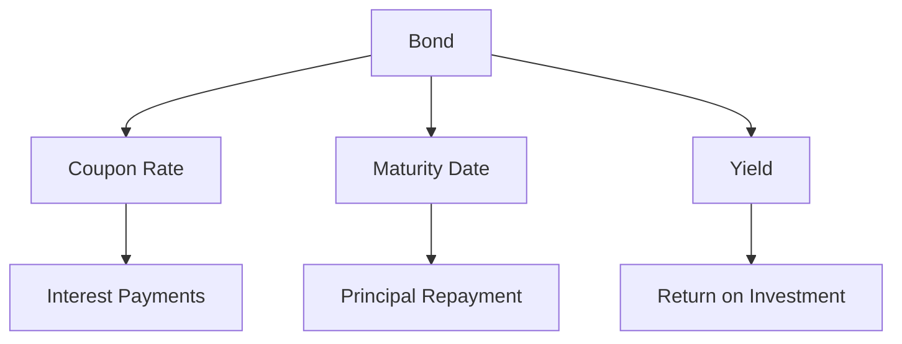

## Overview of Chapter 6

### Introduction to Fixed-Income Securities

Fixed-income securities are a cornerstone of many investment portfolios, offering a reliable source of income and a means of preserving capital. These debt instruments, which include bonds and debentures, provide investors with regular interest payments and the return of principal at maturity. In this chapter, we will delve into the features and types of fixed-income securities, their significance in investment strategies, and their role within the Canadian financial landscape.

### Understanding the Fixed-Income Marketplace in Canada

The Canadian fixed-income market is a vital component of the national economy, providing a mechanism for governments and corporations to raise capital. The market includes a diverse range of instruments, from government bonds to corporate debentures, each serving different purposes and investor needs. The Bank of Canada plays a crucial role in this market, influencing interest rates and monetary policy, which in turn affects the pricing and yield of fixed-income securities.

### The Rationale Behind Issuing Debt Securities

Governments and corporations issue debt securities for several reasons:

1. **Government Financing:** Governments issue bonds to finance public projects, manage fiscal deficits, and implement monetary policies. Canadian government bonds are considered low-risk investments due to the country's strong credit rating.

2. **Corporate Financing:** Corporations issue bonds and debentures to fund expansion, manage cash flow, and refinance existing debt. This allows companies to leverage financial resources without diluting equity ownership.

### Overview of Bond Terminology and Fundamental Features

Understanding the terminology and features of bonds is essential for any investor. Key terms include:

- **Coupon Rate:** The interest rate paid by the bond issuer to the bondholder, usually expressed as a percentage of the face value.
- **Maturity Date:** The date on which the bond's principal is repaid to the investor.
- **Yield:** The return on investment for a bond, influenced by the coupon rate, purchase price, and time to maturity.

Below is a diagram illustrating the relationship between bond features:

### Distinction Between Bonds and Debentures

While both bonds and debentures are forms of debt securities, they differ in terms of security and risk:

- **Bonds:** Typically secured by physical assets or collateral, making them less risky. For example, a bond issued by a Canadian utility company might be backed by its infrastructure.

- **Debentures:** Unsecured and backed only by the issuer's creditworthiness. They generally offer higher yields to compensate for the increased risk. A debenture from a major Canadian corporation like RBC might rely solely on the company's financial health.

### Importance of Fixed-Income Securities for Investors

Fixed-income securities are crucial for investors seeking steady income and capital preservation. They offer:

- **Predictable Income:** Regular interest payments provide a stable cash flow, ideal for retirees or conservative investors.
- **Capital Preservation:** The return of principal at maturity helps protect against market volatility.
- **Diversification:** Adding fixed-income securities to a portfolio can reduce overall risk and enhance returns.

### Practical Examples and Case Studies

Consider a Canadian pension fund that allocates a portion of its portfolio to government bonds to ensure steady income for retirees. Alternatively, a private investor might include corporate debentures from a company like TD Bank to achieve higher yields while accepting moderate risk.

### Best Practices and Common Pitfalls

**Best Practices:**

- **Diversification:** Spread investments across different issuers and maturities to mitigate risk.
- **Credit Analysis:** Evaluate the creditworthiness of issuers to avoid defaults.

**Common Pitfalls:**

- **Interest Rate Risk:** Rising interest rates can decrease bond prices, affecting portfolio value.
- **Inflation Risk:** Inflation can erode the purchasing power of fixed-income returns.

### References and Additional Resources

For further exploration of fixed-income securities, consider the following resources:

- **Government of Canada Department of Finance:** [www.fin.gc.ca](https://www.fin.gc.ca)
- **Bank of Canada:** Publications on fixed-income markets ([www.bankofcanada.ca](https://www.bankofcanada.ca))
- **Investment Industry Regulatory Organization of Canada (IIROC):** [www.iiroc.ca](https://www.iiroc.ca)
- **Additional Reading:** "Canadian Fixed-Income Securities" by Frank J. Fabozzi

### **Ready to Test Your Knowledge?**

**Practice 10 Essential CSC Exam Questions to Master Your Certification**



### What are fixed-income securities?

- [x] Debt instruments that provide regular interest payments and return of principal at maturity
- [ ] Equity instruments that offer dividends
- [ ] Derivatives used for hedging
- [ ] Commodities traded on exchanges

> **Explanation:** Fixed-income securities are debt instruments that provide investors with regular interest payments and the return of principal at maturity.

### What is the primary role of the Bank of Canada in the fixed-income market?

- [x] Influencing interest rates and monetary policy
- [ ] Issuing corporate bonds
- [ ] Regulating stock exchanges
- [ ] Providing insurance for investments

> **Explanation:** The Bank of Canada influences interest rates and monetary policy, which affects the pricing and yield of fixed-income securities.

### Why do corporations issue debentures?

- [x] To fund expansion and manage cash flow without diluting equity
- [ ] To increase stock prices
- [ ] To reduce their credit rating
- [ ] To avoid paying taxes

> **Explanation:** Corporations issue debentures to fund expansion and manage cash flow without diluting equity ownership.

### What is a key difference between bonds and debentures?

- [x] Bonds are typically secured by physical assets, while debentures are unsecured
- [ ] Bonds have no maturity date, while debentures do
- [ ] Bonds are issued by individuals, while debentures are issued by governments
- [ ] Bonds pay variable interest, while debentures pay fixed interest

> **Explanation:** Bonds are typically secured by physical assets or collateral, whereas debentures are unsecured and backed only by the issuer's creditworthiness.

### What is the coupon rate of a bond?

- [x] The interest rate paid by the bond issuer to the bondholder
- [ ] The price at which the bond is sold
- [ ] The bond's maturity date
- [ ] The bond's credit rating

> **Explanation:** The coupon rate is the interest rate paid by the bond issuer to the bondholder, usually expressed as a percentage of the face value.

### What is a common risk associated with fixed-income securities?

- [x] Interest rate risk
- [ ] Currency risk
- [ ] Liquidity risk
- [ ] Political risk

> **Explanation:** Interest rate risk is a common risk associated with fixed-income securities, as rising interest rates can decrease bond prices.

### How can investors mitigate risk in a fixed-income portfolio?

- [x] Diversification across different issuers and maturities
- [ ] Investing solely in high-yield bonds
- [ ] Avoiding government bonds
- [ ] Concentrating investments in a single sector

> **Explanation:** Diversification across different issuers and maturities can help mitigate risk in a fixed-income portfolio.

### What is the maturity date of a bond?

- [x] The date on which the bond's principal is repaid to the investor
- [ ] The date on which the bond is issued
- [ ] The date on which the bond's interest rate changes
- [ ] The date on which the bond is sold

> **Explanation:** The maturity date is the date on which the bond's principal is repaid to the investor.

### What is financial leverage?

- [x] The use of borrowed funds to increase potential return on investment
- [ ] The process of diversifying a portfolio
- [ ] The act of issuing new shares
- [ ] The strategy of buying low and selling high

> **Explanation:** Financial leverage involves using borrowed funds to increase the potential return on investment.

### True or False: Fixed-income securities are only suitable for conservative investors.

- [ ] True
- [x] False

> **Explanation:** While fixed-income securities are often favored by conservative investors for their stability, they can also be part of a diversified portfolio for investors with varying risk tolerances.


