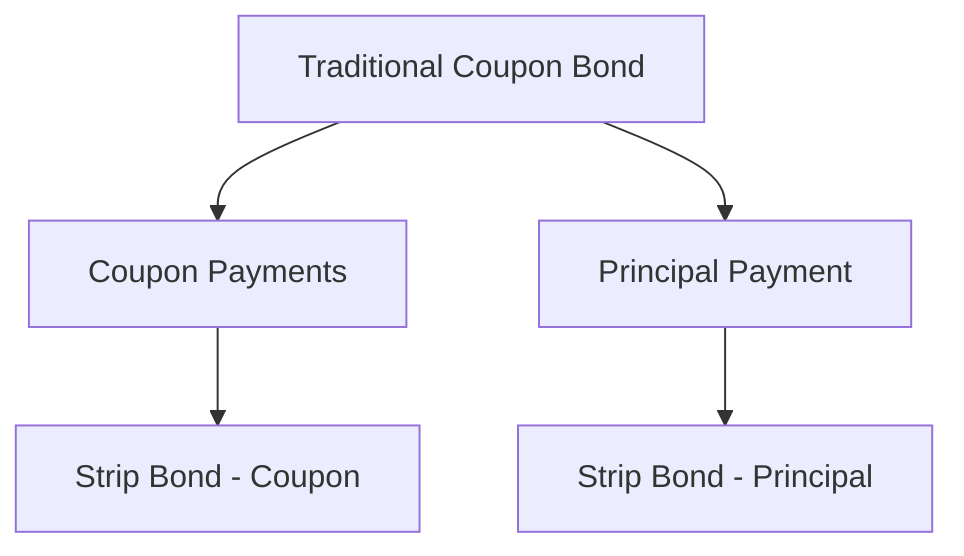

## 6.9 Strip Bonds and Zero-Coupon Bonds

In the realm of fixed-income securities, strip bonds and zero-coupon bonds stand out for their unique structure and investment characteristics. These instruments offer investors a predetermined return at maturity without the periodic interest payments typical of traditional bonds. This section delves into the creation, benefits, tax implications, and strategic uses of strip bonds, particularly within the Canadian financial landscape.

### Understanding Strip Bonds

**Strip Bonds Defined**

Strip bonds, also known as zero-coupon bonds, are a type of bond sold at a discount to their face value. Unlike conventional bonds, strip bonds do not pay periodic interest (coupons) to the holder. Instead, they offer a single payment at maturity, which includes both the principal and the accumulated interest.

**Creation Process of Strip Bonds**

Strip bonds are created by separating the interest payments (coupons) from the principal repayment of a traditional coupon bond. This process, known as "stripping," involves dividing the bond into its constituent parts: the individual coupon payments and the bond residue (the principal amount). Each component can then be sold separately as a zero-coupon bond.

For example, consider a 10-year Government of Canada bond with a face value of $1,000 and an annual coupon rate of 5%. This bond can be stripped into 10 separate coupon payments of $50 each and a single $1,000 principal payment. Each of these components can be sold individually as a strip bond.

### Investment Characteristics of Strip Bonds

**Predetermined Return at Maturity**

One of the primary attractions of strip bonds is their predictable return. Since they are sold at a discount, the difference between the purchase price and the face value represents the investor's return. This return is realized upon maturity, providing a clear and fixed yield.

**No Periodic Interest Payments**

Strip bonds do not provide periodic interest payments, which can be advantageous for investors seeking to avoid reinvestment risk. Reinvestment risk arises when an investor must reinvest coupon payments at potentially lower interest rates. With strip bonds, the investor is assured of a specific return without the need to manage interim cash flows.

### Tax Implications of Strip Bonds

**Annual Taxation on Accrued Interest**

Despite the absence of periodic interest payments, strip bondholders are subject to annual taxation on the accrued interest. This is because the Canada Revenue Agency (CRA) requires investors to report the imputed interest income each year, even though it is not received until maturity. This imputed interest is calculated based on the bond's yield to maturity and the original purchase price.

For detailed information on the taxation of strip bonds, refer to the [Canada Revenue Agency (CRA) website](https://www.canada.ca/en/revenue-agency.html).

**Suitability for Tax-Deferred Accounts**

Given the tax implications, strip bonds are particularly well-suited for tax-deferred accounts such as Registered Retirement Savings Plans (RRSPs). Within an RRSP, the annual imputed interest is not taxed until funds are withdrawn, allowing the investment to grow tax-free. This makes strip bonds an attractive option for long-term, tax-efficient growth.

### Practical Examples and Case Studies

**Example: Investing in Strip Bonds through an RRSP**

Consider an investor who purchases a strip bond with a face value of $10,000, maturing in 10 years, at a price of $6,500. The bond's yield to maturity is 4.5%. If held in a taxable account, the investor would need to report the annual accrued interest as income. However, by holding the bond within an RRSP, the investor defers taxation, maximizing the compound growth of the investment.

**Case Study: Canadian Pension Funds and Strip Bonds**

Canadian pension funds often utilize strip bonds to match long-term liabilities with predictable cash flows. For instance, a pension fund might purchase strip bonds to align with future pension payouts, ensuring that the fund's obligations are met without exposure to reinvestment risk.

### Diagrams and Visual Aids

Below is a diagram illustrating the stripping process of a traditional bond into its components:

### Best Practices and Common Pitfalls

**Best Practices**

- **Utilize Tax-Deferred Accounts:** Whenever possible, hold strip bonds within RRSPs or other tax-deferred accounts to avoid annual taxation on accrued interest.
- **Align with Financial Goals:** Use strip bonds to match future liabilities or financial goals, taking advantage of their predictable cash flows.

**Common Pitfalls**

- **Ignoring Tax Implications:** Failing to account for the annual taxation of accrued interest can lead to unexpected tax liabilities.
- **Liquidity Considerations:** Strip bonds may be less liquid than traditional bonds, so investors should be prepared to hold them to maturity.

### References and Further Reading

- **Canada Revenue Agency (CRA):** Taxation of strip bonds ([www.canada.ca/en/revenue-agency.html](https://www.canada.ca/en/revenue-agency.html))
- **Canadian Depository for Securities (CDS):** Information on strip bonds ([www.cds.ca](http://www.cds.ca))

For those interested in deepening their understanding of fixed-income securities, consider exploring additional resources such as "The Handbook of Fixed Income Securities" by Frank J. Fabozzi or online courses on fixed-income investing.

### Encouragement for Application

Understanding and effectively utilizing strip bonds can significantly enhance an investor's fixed-income strategy, particularly within the Canadian market. By applying the principles discussed in this section, investors can optimize their portfolios for tax efficiency and long-term growth.

### **Ready to Test Your Knowledge?**

**Practice 10 Essential CSC Exam Questions to Master Your Certification**



### What is a strip bond?

- [x] A bond sold at a discount that pays no interest until maturity
- [ ] A bond that pays interest monthly
- [ ] A bond that pays interest quarterly
- [ ] A bond that pays interest semi-annually

> **Explanation:** Strip bonds, also known as zero-coupon bonds, are sold at a discount and do not pay periodic interest. Instead, they provide a single payment at maturity.

### How are strip bonds created?

- [x] By separating the interest payments from the principal of a traditional bond
- [ ] By combining multiple bonds into one
- [ ] By issuing new bonds without coupons
- [ ] By converting stocks into bonds

> **Explanation:** Strip bonds are created by stripping the interest payments (coupons) from the principal repayment of a traditional bond.

### What is the tax implication of owning strip bonds in a taxable account?

- [x] Annual taxation on accrued interest
- [ ] No taxation until maturity
- [ ] Taxation only at maturity
- [ ] Taxation on the principal amount only

> **Explanation:** Investors must report the imputed interest income each year, even though it is not received until maturity.

### Why are strip bonds suitable for RRSPs?

- [x] They allow for tax-deferred growth
- [ ] They provide monthly income
- [ ] They are exempt from all taxes
- [ ] They offer higher interest rates

> **Explanation:** Holding strip bonds in an RRSP defers taxation on the accrued interest, allowing for tax-efficient growth.

### What is a bond residue?

- [x] The remaining principal amount after coupons have been stripped
- [ ] The interest payments of a bond
- [ ] The total value of a bond
- [ ] The market value of a bond

> **Explanation:** Bond residue refers to the principal amount left after the coupons have been stripped from a traditional bond.

### What is accrued interest in the context of strip bonds?

- [x] Interest that accumulates on a bond since the last interest payment
- [ ] Interest paid monthly
- [ ] Interest paid annually
- [ ] Interest paid at maturity

> **Explanation:** Accrued interest is the interest that accumulates on a bond since the last interest payment, which is relevant for tax purposes.

### What is the main advantage of strip bonds over traditional bonds?

- [x] Predictable return at maturity without reinvestment risk
- [ ] Higher interest rates
- [ ] Monthly income
- [ ] Lower risk

> **Explanation:** Strip bonds offer a predictable return at maturity without the need to manage interim cash flows, avoiding reinvestment risk.

### What is a common pitfall when investing in strip bonds?

- [x] Ignoring tax implications
- [ ] Investing in too many bonds
- [ ] Not diversifying enough
- [ ] Overestimating returns

> **Explanation:** Failing to account for the annual taxation of accrued interest can lead to unexpected tax liabilities.

### How can strip bonds be used in financial planning?

- [x] To match future liabilities with predictable cash flows
- [ ] To generate monthly income
- [ ] To increase portfolio volatility
- [ ] To speculate on interest rates

> **Explanation:** Strip bonds can be used to align with future financial goals, providing predictable cash flows.

### True or False: Strip bonds are always more liquid than traditional bonds.

- [ ] True
- [x] False

> **Explanation:** Strip bonds may be less liquid than traditional bonds, and investors should be prepared to hold them to maturity.


