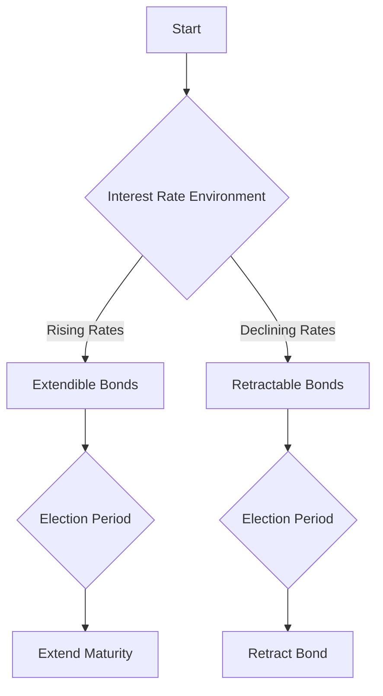

## 6.10 Callable, Extendible, and Retractable Bonds

In the realm of fixed-income securities, understanding the nuances of callable, extendible, and retractable bonds is crucial for both issuers and investors. These bonds offer unique features that can significantly impact investment strategies and portfolio management. This section delves into the characteristics of these bonds, providing insights into their mechanisms, benefits, and potential challenges.

### Callable Bonds: Features and Issuer's Rights

**Callable bonds**, also known as redeemable bonds, provide issuers with the right to redeem the bonds before their maturity date. This feature allows issuers to manage their debt more flexibly, particularly in a declining interest rate environment. By calling the bonds, issuers can refinance their debt at a lower cost, thus reducing interest expenses.

#### Key Features of Callable Bonds

1. **Issuer's Right to Redeem**: The primary feature of a callable bond is the issuer's right to redeem the bond before its maturity. This option is typically exercised when interest rates fall, allowing the issuer to reissue new bonds at a lower rate.

2. **Call Protection Period**: To protect investors, callable bonds often include a **call protection period**. During this timeframe, the bond cannot be called, providing investors with a guaranteed period of interest payments. This period is crucial for investors seeking stability in their income streams.

3. **Call Premiums**: When an issuer calls a bond, they may pay a **call premium** to compensate investors for the early redemption. This premium is usually a percentage of the bond's face value and serves as an incentive for investors to accept the call.

#### Example: Callable Bonds in Practice

Consider a Canadian corporation, such as a major bank like RBC, issuing a callable bond with a 10-year maturity and a 5-year call protection period. If interest rates drop significantly after five years, RBC might choose to call the bond, pay the call premium, and issue new bonds at a lower rate. This strategy helps the bank manage its interest expenses effectively.

### Extendible Bonds: Flexibility for Investors

**Extendible bonds** offer investors the option to extend the bond's maturity date. This feature provides flexibility, allowing investors to adapt to changing market conditions or personal financial goals.

#### Characteristics of Extendible Bonds

1. **Option to Extend Maturity**: Investors holding extendible bonds can choose to extend the bond's maturity, often at predetermined intervals. This option is beneficial in a rising interest rate environment, where extending the bond can lock in higher yields for a longer period.

2. **Election Period**: The **election period** is the timeframe during which investors must decide whether to extend the bond's maturity. This period is typically specified in the bond's prospectus and requires careful consideration of market trends and personal investment strategies.

#### Example: Extendible Bonds in Action

Imagine an investor holding an extendible bond issued by a Canadian utility company. The bond has an initial maturity of five years, with an option to extend for an additional five years. If interest rates are expected to rise, the investor might choose to extend the bond, securing the current yield for a longer duration.

### Retractable Bonds: Early Redemption Options

**Retractable bonds** provide investors with the option to redeem the bond earlier than its maturity date. This feature is particularly advantageous in a declining interest rate environment, where investors might seek to reinvest in higher-yielding opportunities.

#### Features of Retractable Bonds

1. **Option to Shorten Maturity**: Investors can choose to redeem retractable bonds before the scheduled maturity, offering flexibility to adapt to changing financial needs or market conditions.

2. **Election Period**: Similar to extendible bonds, retractable bonds have an election period during which investors must decide on early redemption. This decision requires analysis of interest rate trends and potential reinvestment opportunities.

#### Example: Retractable Bonds in Practice

Consider a Canadian pension fund holding retractable bonds issued by a telecommunications company. With interest rates declining, the fund may opt to retract the bonds and reinvest in higher-yielding securities, optimizing their portfolio returns.

### Investment Strategies and Considerations

Investing in callable, extendible, and retractable bonds requires a strategic approach, considering both market conditions and individual financial goals. Here are some strategies and considerations:

1. **Interest Rate Environment**: Assess the current and projected interest rate environment. Callable bonds are advantageous in declining rates, while extendible and retractable bonds offer flexibility in rising or volatile markets.

2. **Portfolio Diversification**: Incorporate a mix of bond types to diversify risk and enhance portfolio resilience. Each bond type offers unique benefits that can complement overall investment objectives.

3. **Investor Goals**: Align bond investments with personal financial goals, such as income stability, capital preservation, or growth. Consider the bond's features and election periods in relation to these goals.

4. **Regulatory Compliance**: Ensure compliance with Canadian financial regulations and consider tax implications, especially when dealing with retractable bonds and potential capital gains.

### Diagrams and Visual Aids

To further illustrate these concepts, consider the following diagram representing the decision-making process for extendible and retractable bonds:

### Best Practices and Common Pitfalls

- **Best Practices**: Regularly review bond portfolios to align with changing market conditions and personal financial goals. Utilize financial advisors for tailored investment strategies.
- **Common Pitfalls**: Avoid making decisions based solely on short-term market fluctuations. Consider long-term implications and potential reinvestment opportunities.

### References and Further Reading

- **Prospectuses**: Review prospectuses from Canadian issuers for detailed bond features and election periods.
- **Investment Strategies**: Consult financial advisors for strategies tailored to callable bonds and other fixed-income securities.
- **Additional Resources**: Explore books and online courses on fixed-income securities for deeper insights into bond investment strategies.

### **Ready to Test Your Knowledge?**

**Practice 10 Essential CSC Exam Questions to Master Your Certification**



### What is a callable bond?

- [x] A bond that can be redeemed by the issuer before maturity.
- [ ] A bond that allows investors to extend its maturity date.
- [ ] A bond that allows investors to redeem it earlier than the maturity date.
- [ ] A bond that cannot be redeemed before maturity.

> **Explanation:** A callable bond, also known as a redeemable bond, allows the issuer to redeem the bond before its maturity date.

### What is the purpose of a call protection period?

- [x] To provide investors with a guaranteed period of interest payments.
- [ ] To allow issuers to call the bond at any time.
- [ ] To extend the bond's maturity date.
- [ ] To allow investors to retract the bond early.

> **Explanation:** The call protection period ensures that the bond cannot be called during a specified timeframe, providing stability for investors.

### What is an extendible bond?

- [x] A bond that allows investors to extend its maturity date.
- [ ] A bond that can be redeemed by the issuer before maturity.
- [ ] A bond that allows investors to redeem it earlier than the maturity date.
- [ ] A bond with no option to change its maturity.

> **Explanation:** An extendible bond gives investors the option to extend the bond's maturity date, offering flexibility in investment strategies.

### What is the election period in the context of bonds?

- [x] The period during which investors can exercise options like extending or retracting a bond.
- [ ] The period during which issuers can call the bond.
- [ ] The period during which the bond pays interest.
- [ ] The period during which the bond cannot be traded.

> **Explanation:** The election period is when investors decide whether to exercise options such as extending or retracting a bond.

### Which bond type allows investors to redeem it earlier than the maturity date?

- [x] Retractable bond
- [ ] Callable bond
- [ ] Extendible bond
- [ ] Convertible bond

> **Explanation:** A retractable bond allows investors to redeem it before the scheduled maturity date, offering flexibility in investment decisions.

### Why might an issuer call a bond?

- [x] To refinance debt at a lower interest rate.
- [ ] To increase the bond's interest rate.
- [ ] To extend the bond's maturity date.
- [ ] To reduce the bond's face value.

> **Explanation:** Issuers call bonds to refinance their debt at lower interest rates, reducing their interest expenses.

### What is a call premium?

- [x] Compensation paid to investors when a bond is called early.
- [ ] An additional interest payment made to investors.
- [ ] A fee charged to investors for extending a bond's maturity.
- [ ] A penalty for retracting a bond early.

> **Explanation:** A call premium is paid to investors as compensation when a bond is called before its maturity.

### What should investors consider when deciding to extend a bond?

- [x] Current and projected interest rate environment.
- [ ] The bond's call protection period.
- [ ] The issuer's credit rating.
- [ ] The bond's face value.

> **Explanation:** Investors should consider the interest rate environment to determine if extending the bond aligns with their investment goals.

### What is a common pitfall when investing in callable bonds?

- [x] Making decisions based solely on short-term market fluctuations.
- [ ] Ignoring the bond's call protection period.
- [ ] Failing to consider the bond's face value.
- [ ] Overlooking the bond's interest rate.

> **Explanation:** Investors should avoid making decisions based solely on short-term market changes and consider long-term implications.

### True or False: Retractable bonds are beneficial in a declining interest rate environment.

- [x] True
- [ ] False

> **Explanation:** Retractable bonds allow investors to redeem them early and reinvest in higher-yielding opportunities, which is advantageous in a declining interest rate environment.


