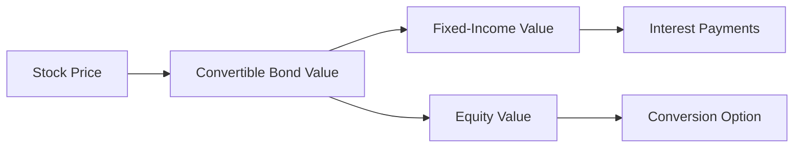

## 6.11 Convertible Bonds and Debentures

Convertible bonds and debentures are unique financial instruments that offer investors the potential for both fixed-income returns and equity participation. This section delves into the mechanics of these securities, their market behavior, and the strategic considerations for investors in the Canadian context.

### Understanding Convertible Bonds and Debentures

**Convertible Bond/Debenture:** A convertible bond or debenture is a type of fixed-income security that grants the holder the right to convert the bond into a predetermined number of common shares of the issuing company. This feature provides the bondholder with the potential to benefit from the company's equity appreciation while enjoying the security of fixed interest payments.

### Conversion Privileges and Mechanisms

The conversion privilege is a key feature of convertible bonds, allowing bondholders to convert their bonds into shares at a specified conversion price. This price is set at the issuance of the bond and determines the number of shares each bond can be converted into.

**Conversion Price:** The conversion price is the price at which the bond can be exchanged for common stock. It is calculated by dividing the bond's par value by the conversion ratio, which is the number of shares the bondholder receives upon conversion.

#### Example:

Consider a convertible bond with a par value of $1,000 and a conversion ratio of 20. The conversion price would be:

 \text{Conversion Price} = \frac{\text{Par Value}}{\text{Conversion Ratio}} = \frac{1000}{20} = \$50 

This means the bondholder can convert the bond into 20 shares at a price of $50 per share.

### Forced Conversion

Issuers may employ a strategy known as forced conversion to compel bondholders to convert their bonds into shares. This typically occurs when the underlying stock price exceeds the conversion price, making conversion attractive. Issuers can call the bonds, often at a premium, to encourage conversion and reduce debt.

**Forced Conversion:** This mechanism allows issuers to manage their capital structure by reducing debt and potentially increasing equity. However, it can lead to dilution, where existing shareholders' ownership percentage decreases due to the issuance of new shares.

### Market Behavior of Convertible Securities

The market behavior of convertible bonds is influenced by the price movements of the underlying stock. When the stock price rises above the conversion price, the bond's value tends to increase, reflecting the potential for conversion. Conversely, if the stock price falls, the bond's value may decline, although it retains a floor value based on its fixed-income characteristics.

#### Diagram: Convertible Bond Value vs. Stock Price

### Benefits and Risks of Investing in Convertible Bonds

**Benefits:**

1. **Potential for Equity Upside:** Convertible bonds offer the opportunity to participate in the equity appreciation of the issuing company.
2. **Fixed-Income Security:** Investors receive regular interest payments, providing a steady income stream.
3. **Downside Protection:** The bond's fixed-income component provides a floor value, offering some protection against stock price declines.

**Risks:**

1. **Interest Rate Risk:** Like all bonds, convertibles are subject to interest rate fluctuations, which can affect their market value.
2. **Credit Risk:** The issuer's creditworthiness impacts the bond's risk profile.
3. **Dilution Risk:** Conversion can lead to dilution, affecting existing shareholders' ownership percentages.

### Practical Examples and Case Studies

Consider a Canadian company, XYZ Corp, which issues convertible bonds to raise capital. The bonds have a conversion price of $40, and the company's stock is currently trading at $35. As the stock price approaches and exceeds the conversion price, bondholders may consider converting their bonds to capitalize on the equity upside.

In another scenario, a major Canadian bank, such as RBC, might issue convertible debentures to manage its capital structure. By setting a conversion price strategically, the bank can encourage conversion when its stock price is favorable, thus reducing debt and increasing equity.

### Best Practices and Common Pitfalls

**Best Practices:**

- **Evaluate Conversion Terms:** Investors should carefully assess the conversion price and ratio to understand the potential for equity participation.
- **Monitor Market Conditions:** Keeping an eye on the underlying stock's performance is crucial for making informed conversion decisions.
- **Diversify Investments:** Including a mix of fixed-income and equity securities can help mitigate risks.

**Common Pitfalls:**

- **Ignoring Dilution Impact:** Investors should be aware of the potential dilution effect on existing shareholders.
- **Overlooking Credit Risk:** Assessing the issuer's creditworthiness is essential to gauge the bond's risk profile.

### References and Further Reading

- **Canadian Securities Administrators (CSA):** For regulations on convertible securities, visit [www.securities-administrators.ca](https://www.securities-administrators.ca).
- **Books and Articles:** Consider exploring additional resources such as "The Handbook of Convertible Bonds" by Jan De Spiegeleer and Wim Schoutens for a deeper understanding of convertible securities.

### Conclusion

Convertible bonds and debentures offer a unique blend of fixed-income security and equity potential, making them an attractive option for investors seeking diversification and growth opportunities. By understanding the mechanics of conversion, market behavior, and associated risks, investors can make informed decisions that align with their financial goals.

### **Ready to Test Your Knowledge?**

**Practice 10 Essential CSC Exam Questions to Master Your Certification**



### What is a convertible bond?

- [x] A bond that can be converted into a specified number of common shares.
- [ ] A bond that pays variable interest rates.
- [ ] A bond that cannot be converted into equity.
- [ ] A bond that is only issued by government entities.

> **Explanation:** A convertible bond is a type of bond that can be converted into a specified number of common shares of the issuing company.

### What determines the number of shares a bondholder receives upon conversion?

- [x] Conversion ratio
- [ ] Interest rate
- [ ] Maturity date
- [ ] Dividend yield

> **Explanation:** The conversion ratio determines the number of shares a bondholder receives upon conversion.

### What is the conversion price?

- [x] The price at which a bond can be converted into common stock.
- [ ] The price at which a bond is issued.
- [ ] The price at which a bond is redeemed.
- [ ] The price at which a bond pays interest.

> **Explanation:** The conversion price is the price at which a bond can be converted into common stock.

### What is forced conversion?

- [x] When an issuer compels bondholders to convert bonds into shares.
- [ ] When bondholders voluntarily convert bonds into shares.
- [ ] When bonds are redeemed at maturity.
- [ ] When bonds are sold in the secondary market.

> **Explanation:** Forced conversion occurs when an issuer compels bondholders to convert bonds into shares, often by calling the bonds.

### What is a potential risk of convertible bonds?

- [x] Dilution
- [ ] Guaranteed returns
- [ ] No interest payments
- [ ] No credit risk

> **Explanation:** A potential risk of convertible bonds is dilution, which reduces existing shareholders' ownership percentage due to new shares being issued.

### How does the market behavior of convertible bonds relate to the underlying stock price?

- [x] Convertible bond value increases with the stock price.
- [ ] Convertible bond value decreases with the stock price.
- [ ] Convertible bond value is unaffected by the stock price.
- [ ] Convertible bond value is inversely related to the stock price.

> **Explanation:** The market behavior of convertible bonds is influenced by the underlying stock price; the bond's value tends to increase with the stock price.

### What is a benefit of investing in convertible bonds?

- [x] Potential for equity upside
- [ ] No risk of interest rate changes
- [ ] Guaranteed principal repayment
- [ ] No credit risk

> **Explanation:** A benefit of investing in convertible bonds is the potential for equity upside, allowing investors to participate in the company's growth.

### What is a common pitfall when investing in convertible bonds?

- [x] Ignoring dilution impact
- [ ] Overestimating guaranteed returns
- [ ] Focusing solely on interest payments
- [ ] Assuming no credit risk

> **Explanation:** A common pitfall is ignoring the dilution impact, which can affect existing shareholders' ownership percentages.

### What should investors monitor when holding convertible bonds?

- [x] Underlying stock's performance
- [ ] Only the bond's interest payments
- [ ] Only the bond's maturity date
- [ ] Only the bond's credit rating

> **Explanation:** Investors should monitor the underlying stock's performance to make informed conversion decisions.

### Convertible bonds offer both fixed-income security and equity potential.

- [x] True
- [ ] False

> **Explanation:** Convertible bonds offer both fixed-income security through interest payments and equity potential through conversion into shares.


