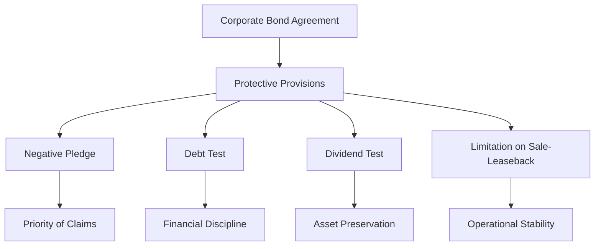

## 6.13 Protective Provisions of Corporate Bonds

Corporate bonds are a fundamental component of the fixed-income market, offering investors a relatively stable income stream. However, the risk of default is an inherent concern for bondholders. To mitigate this risk, corporate bond agreements often include protective provisions, commonly known as covenants. These covenants are legal clauses designed to safeguard the interests of bondholders by imposing certain restrictions and obligations on the issuer. This section explores the various protective provisions found in corporate bonds, their role in protecting bondholders, and their impact on the issuer's financial flexibility and creditworthiness.

### Overview of Common Protective Covenants

Protective covenants are integral to bond agreements, serving as a mechanism to ensure that issuers maintain a level of financial discipline. These covenants can be broadly categorized into affirmative covenants, which require the issuer to take specific actions, and negative covenants, which restrict certain activities. Here, we focus on the most common protective covenants:

1. **Negative Pledge**: This covenant prevents the issuer from pledging the same assets as collateral for other debts. By doing so, it ensures that bondholders have a priority claim on the issuer's assets, reducing the risk of asset dilution.

2. **Debt Test**: Also known as a limitation on additional indebtedness, this covenant restricts the issuer's ability to incur additional debt beyond a specified threshold. It helps maintain the issuer's leverage at manageable levels, thereby protecting bondholders from excessive risk.

3. **Dividend Test**: This covenant limits the issuer's ability to pay dividends to shareholders. By preserving the issuer's assets, it ensures that sufficient resources are available to meet bond obligations.

4. **Limitation on Sale-Leaseback Transactions**: This covenant restricts the issuer's ability to sell assets and lease them back, which could otherwise deplete the asset base available to bondholders.

### The Role of Covenants in Safeguarding Bondholders' Interests

Protective provisions play a crucial role in aligning the interests of bondholders and issuers. By imposing restrictions on the issuer's financial and operational activities, covenants help ensure that the issuer remains financially stable and capable of meeting its debt obligations. Here are some key ways in which covenants safeguard bondholders:

- **Priority of Claims**: Covenants like the negative pledge ensure that bondholders have a priority claim on the issuer's assets, reducing the risk of asset dilution and enhancing the security of their investment.

- **Financial Discipline**: Debt tests and dividend tests impose financial discipline on the issuer, preventing excessive leverage and ensuring that sufficient resources are retained to meet bond obligations.

- **Operational Stability**: By restricting sale-leaseback transactions and other potentially risky activities, covenants help maintain the issuer's operational stability, reducing the risk of financial distress.

### Impact of Covenants on Issuer Behavior

While protective provisions are designed to safeguard bondholders, they also have a significant impact on the issuer's behavior and financial flexibility. Here are some key considerations:

- **Financial Flexibility**: Covenants can limit the issuer's ability to raise additional capital or engage in certain business activities, potentially restricting growth opportunities. For example, a stringent debt test may prevent the issuer from taking on new projects that require additional financing.

- **Creditworthiness**: Adherence to covenants can enhance the issuer's creditworthiness by demonstrating financial discipline and stability. However, failure to comply with covenants can lead to a downgrade in credit ratings, increasing the cost of capital.

- **Negotiation and Compliance**: Issuers must carefully negotiate covenant terms to balance the interests of bondholders with their own operational needs. Compliance with covenants requires ongoing monitoring and reporting, adding to the issuer's administrative burden.

### Practical Examples and Case Studies

To illustrate the impact of protective provisions, consider the following examples:

- **Case Study: RBC's Bond Issuance**: In a recent bond issuance by the Royal Bank of Canada (RBC), the bond agreement included a negative pledge covenant, ensuring that the bank's assets were not pledged as collateral for other debts. This provision provided bondholders with added security, contributing to the bond's favorable reception in the market.

- **Example: TD Bank's Dividend Test**: Toronto-Dominion Bank (TD) included a dividend test in its bond agreement, limiting dividend payments to preserve capital for bond obligations. This covenant helped maintain TD's strong credit rating by ensuring that sufficient resources were available to meet its debt commitments.

### Diagrams and Visual Aids

To better understand the relationship between protective provisions and bondholder security, consider the following diagram illustrating the flow of protective covenants in a corporate bond agreement:

### Best Practices and Common Pitfalls

When evaluating corporate bonds, investors should consider the following best practices and potential challenges:

- **Thorough Analysis**: Carefully review bond covenants to understand their implications for both bondholders and issuers. Pay attention to the specific terms and conditions of each covenant.

- **Monitoring Compliance**: Ensure that the issuer is in compliance with all covenants. Non-compliance can lead to default, negatively impacting bondholders.

- **Balancing Interests**: Issuers should negotiate covenants that balance the need for financial flexibility with the protection of bondholders' interests.

### References and Additional Resources

For further exploration of protective provisions in corporate bonds, consider the following resources:

- **IIROC Regulations on Bond Covenants**: Visit the [IIROC website](https://www.iiroc.ca) for official regulations and guidelines on bond covenants.

- **Corporate Bond Offering Documents**: Review offering documents for examples of covenants in real-world bond agreements.

- **Books and Articles**: Explore books like "The Handbook of Fixed Income Securities" by Frank J. Fabozzi for a deeper understanding of bond covenants and their impact.

### Glossary

- **Protective Provisions (Covenants)**: Legal clauses in bond contracts designed to protect bondholders.
- **Negative Pledge**: A promise not to use the same assets as collateral for other debt.
- **Debt Test**: A covenant limiting the issuer's ability to incur additional debt.
- **Dividend Test**: Restrictions on dividend payments to preserve assets for bondholders.

### **Ready to Test Your Knowledge?**

**Practice 10 Essential CSC Exam Questions to Master Your Certification**



### What is the primary purpose of protective provisions in corporate bonds?

- [x] To safeguard bondholders' interests
- [ ] To increase the issuer's financial flexibility
- [ ] To enhance the issuer's operational efficiency
- [ ] To maximize dividend payments

> **Explanation:** Protective provisions are designed to protect bondholders by imposing restrictions on the issuer's activities.

### Which covenant prevents an issuer from pledging the same assets as collateral for other debts?

- [x] Negative pledge
- [ ] Debt test
- [ ] Dividend test
- [ ] Limitation on sale-leaseback

> **Explanation:** A negative pledge ensures that the issuer does not use the same assets as collateral for other debts, protecting bondholders' claims.

### What is the effect of a debt test on an issuer?

- [x] It limits the issuer's ability to incur additional debt
- [ ] It increases the issuer's dividend payments
- [ ] It allows unrestricted sale-leaseback transactions
- [ ] It enhances the issuer's credit rating

> **Explanation:** A debt test restricts the issuer's ability to take on additional debt, maintaining financial discipline.

### How do dividend tests protect bondholders?

- [x] By limiting dividend payments to preserve assets
- [ ] By increasing the issuer's leverage
- [ ] By allowing unrestricted asset sales
- [ ] By enhancing operational efficiency

> **Explanation:** Dividend tests restrict dividend payments, ensuring that sufficient resources are available to meet bond obligations.

### What impact do covenants have on an issuer's creditworthiness?

- [x] They can enhance creditworthiness by demonstrating financial discipline
- [ ] They decrease creditworthiness by increasing leverage
- [ ] They have no impact on credit ratings
- [ ] They automatically lead to a credit downgrade

> **Explanation:** Adherence to covenants can enhance an issuer's creditworthiness by showing financial stability and discipline.

### Which covenant restricts the issuer's ability to sell assets and lease them back?

- [x] Limitation on sale-leaseback
- [ ] Negative pledge
- [ ] Debt test
- [ ] Dividend test

> **Explanation:** The limitation on sale-leaseback covenant prevents the issuer from depleting the asset base available to bondholders.

### Why is it important for investors to monitor an issuer's compliance with covenants?

- [x] Non-compliance can lead to default
- [ ] Compliance increases dividend payments
- [ ] Compliance decreases asset preservation
- [ ] Non-compliance enhances credit ratings

> **Explanation:** Monitoring compliance is crucial because non-compliance with covenants can lead to default, negatively impacting bondholders.

### How do protective provisions affect an issuer's financial flexibility?

- [x] They can restrict financial flexibility by imposing limitations
- [ ] They enhance financial flexibility by allowing unrestricted borrowing
- [ ] They have no impact on financial flexibility
- [ ] They automatically increase operational efficiency

> **Explanation:** Protective provisions can restrict an issuer's financial flexibility by imposing limitations on borrowing and other activities.

### What is a common pitfall when evaluating corporate bonds?

- [x] Failing to thoroughly analyze bond covenants
- [ ] Overestimating the issuer's creditworthiness
- [ ] Ignoring the issuer's dividend policy
- [ ] Focusing solely on interest rates

> **Explanation:** A common pitfall is not thoroughly analyzing bond covenants, which are crucial for understanding the bond's risk profile.

### True or False: Protective provisions are only beneficial to bondholders and have no impact on issuers.

- [ ] True
- [x] False

> **Explanation:** Protective provisions impact both bondholders and issuers by safeguarding bondholders' interests while potentially restricting issuers' financial flexibility.


