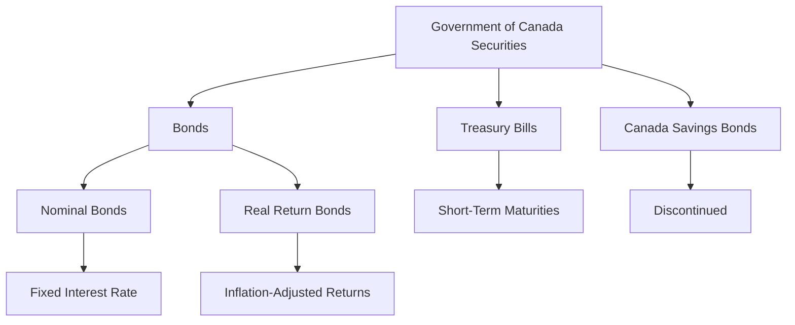

## 6.14 Government of Canada Securities

Government of Canada securities are a cornerstone of the Canadian fixed-income market, offering a range of investment options that cater to both individual and institutional investors. This section delves into the various types of federal government securities, their features, benefits, and the roles they play in diversified portfolios.

### Federal Government Securities Overview

The Canadian federal government issues several types of securities to finance its operations and manage the national debt. These include:

- **Bonds**
- **Treasury Bills (T-bills)**
- **Canada Savings Bonds (CSBs)** (discontinued)

Each of these instruments serves different purposes and appeals to different investor needs.

### Government of Canada Bonds

#### Features and Benefits

Government of Canada bonds are long-term debt securities with maturities ranging from one to thirty years. They are known for their:

- **Non-callability:** Once issued, these bonds cannot be called or redeemed by the issuer before maturity, providing investors with a predictable income stream.
- **High Credit Quality:** Backed by the full faith and credit of the Canadian government, these bonds are considered one of the safest investments, with minimal default risk.

#### Types of Government Bonds

1. **Nominal Bonds:** These bonds pay a fixed interest rate (coupon) and return the principal at maturity. They are ideal for investors seeking stable, predictable income.

2. **Real Return Bonds (RRBs):** Introduced to protect investors from inflation, RRBs adjust both the principal and interest payments based on the Consumer Price Index (CPI). This ensures that the purchasing power of the returns is maintained over time.

   - **Inflation-Adjusted Returns:** The principal value of RRBs increases with inflation, and the interest payments are calculated on this adjusted principal, providing a real rate of return.

### Treasury Bills (T-bills)

T-bills are short-term government debt instruments with maturities of less than one year, typically issued in 3-month, 6-month, and 12-month terms. They are sold at a discount and redeemed at face value, with the difference representing the investor's return.

#### Features

- **Liquidity:** T-bills are highly liquid, making them an attractive option for investors seeking short-term, low-risk investments.
- **No Interest Payments:** Instead of periodic interest payments, the return is realized through the difference between the purchase price and the face value at maturity.

### Canada Savings Bonds (CSBs)

Though discontinued in 2017, Canada Savings Bonds were once a popular savings product fully guaranteed by the federal government. They offered a modest interest rate and were redeemable at any time, providing flexibility to investors.

### Role in Portfolios

Government of Canada securities play a crucial role in both individual and institutional portfolios:

- **Diversification:** These securities provide a stable and secure component to a diversified investment portfolio, balancing riskier assets like equities.
- **Income Generation:** Bonds and T-bills offer regular income, appealing to retirees and conservative investors.
- **Inflation Protection:** Real Return Bonds offer a hedge against inflation, preserving purchasing power over time.

### Practical Examples and Case Studies

#### Example: Canadian Pension Fund Strategy

Consider a Canadian pension fund that allocates a portion of its portfolio to Government of Canada bonds to ensure stable income and preserve capital. By including Real Return Bonds, the fund also protects against inflation, aligning with its long-term liabilities.

#### Case Study: Individual Investor

An individual investor nearing retirement might allocate a significant portion of their RRSP to Government of Canada bonds and T-bills. This strategy provides a reliable income stream and reduces exposure to market volatility.

### Diagrams and Visuals

Below is a diagram illustrating the relationship between different types of Government of Canada securities and their features:

### Best Practices and Common Pitfalls

#### Best Practices

- **Diversify Across Maturities:** Spread investments across different maturities to manage interest rate risk.
- **Consider Inflation Protection:** Use Real Return Bonds to safeguard against inflation in long-term portfolios.

#### Common Pitfalls

- **Ignoring Inflation:** Failing to account for inflation can erode the real value of fixed-income investments.
- **Overconcentration:** Over-reliance on government securities can limit growth potential in a portfolio.

### References and Further Reading

- **Bank of Canada:** For more information on government securities, visit [www.bankofcanada.ca](https://www.bankofcanada.ca).
- **CRA:** For tax treatment of government bonds, visit [www.canada.ca/en/revenue-agency.html](https://www.canada.ca/en/revenue-agency.html).

### Summary

Government of Canada securities offer a range of investment options that provide safety, income, and inflation protection. By understanding their features and roles, investors can effectively incorporate these instruments into their portfolios to achieve their financial goals.

### **Ready to Test Your Knowledge?**

**Practice 10 Essential CSC Exam Questions to Master Your Certification**



### Which of the following is a feature of Government of Canada bonds?

- [x] Non-callability
- [ ] High interest rates
- [ ] Short-term maturities
- [ ] Variable interest rates

> **Explanation:** Government of Canada bonds are non-callable, meaning they cannot be redeemed by the issuer before maturity.

### What is a key benefit of Real Return Bonds?

- [x] Inflation-adjusted returns
- [ ] High liquidity
- [ ] Short-term investment
- [ ] High credit risk

> **Explanation:** Real Return Bonds provide inflation-adjusted returns, protecting the investor's purchasing power.

### How are Treasury Bills (T-bills) typically issued?

- [x] At a discount
- [ ] At a premium
- [ ] At face value
- [ ] With a fixed coupon rate

> **Explanation:** T-bills are issued at a discount and redeemed at face value, with the difference being the investor's return.

### What was a characteristic of Canada Savings Bonds?

- [x] Fully guaranteed by the federal government
- [ ] High interest rates
- [ ] Inflation-adjusted returns
- [ ] Long-term maturities

> **Explanation:** Canada Savings Bonds were fully guaranteed by the federal government, providing a safe investment option.

### Which of the following is NOT a type of Government of Canada bond?

- [ ] Nominal Bonds
- [ ] Real Return Bonds
- [x] Corporate Bonds
- [ ] Treasury Bills

> **Explanation:** Corporate Bonds are not issued by the government; they are issued by corporations.

### What is a common use of Government of Canada securities in portfolios?

- [x] Diversification
- [ ] Speculation
- [ ] High-risk investment
- [ ] Short-term trading

> **Explanation:** Government of Canada securities are commonly used for diversification and stability in portfolios.

### Which institution provides information on government securities in Canada?

- [x] Bank of Canada
- [ ] Canadian Securities Exchange
- [ ] Toronto Stock Exchange
- [ ] Canada Revenue Agency

> **Explanation:** The Bank of Canada provides information on government securities.

### What is the primary risk associated with ignoring inflation in fixed-income investments?

- [x] Erosion of real value
- [ ] Increased credit risk
- [ ] Higher interest rates
- [ ] Shorter maturities

> **Explanation:** Ignoring inflation can lead to the erosion of the real value of fixed-income investments.

### What type of bond adjusts both principal and interest payments based on the CPI?

- [x] Real Return Bonds
- [ ] Nominal Bonds
- [ ] Corporate Bonds
- [ ] Treasury Bills

> **Explanation:** Real Return Bonds adjust both principal and interest payments based on the Consumer Price Index (CPI).

### True or False: Government of Canada bonds can be called before maturity.

- [ ] True
- [x] False

> **Explanation:** Government of Canada bonds are non-callable, meaning they cannot be redeemed before maturity.


