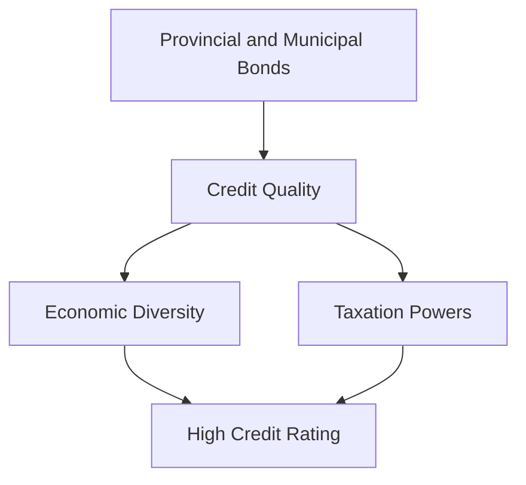

## 6.15 Provincial and Municipal Government Securities

In the realm of fixed-income securities, provincial and municipal government securities play a crucial role in the Canadian financial landscape. These securities offer investors a range of opportunities to diversify their portfolios while supporting public sector projects. This section delves into the features and types of provincial and municipal government securities, examining their credit quality, unique characteristics, and the factors influencing their valuation.

### Features of Provincial Bonds

Provincial bonds are debt securities issued by provincial governments in Canada. They are a vital component of the fixed-income market, providing provinces with the necessary funds to finance infrastructure projects, healthcare, education, and other public services. Here are some key features of provincial bonds:

#### Credit Quality Considerations

The credit quality of provincial bonds is a critical factor for investors. It reflects the province's ability to meet its debt obligations. Credit rating agencies, such as DBRS, assess the creditworthiness of provincial bonds based on several factors, including:

- **Economic Strength:** Provinces with diverse and robust economies tend to have higher credit ratings. Economic diversity reduces reliance on a single industry, mitigating risks associated with economic downturns.

- **Fiscal Management:** Effective fiscal management, including balanced budgets and prudent debt management, enhances a province's credit quality.

- **Taxation Powers:** Provinces have significant taxation powers, which provide a stable revenue stream to support debt repayment.

#### Guarantees

Some provincial bonds come with guarantees, enhancing their appeal to investors. A guaranteed bond is one where repayment is assured by another entity, such as the provincial government itself or a federal guarantee. This added security can lead to higher credit ratings and lower yields compared to non-guaranteed bonds.

### Provincial Savings Bonds

Provincial savings bonds are tailored specifically for residents of the issuing province. These bonds offer unique characteristics that make them attractive to local investors:

- **Accessibility:** Provincial savings bonds are often available in smaller denominations, making them accessible to a broader range of investors.

- **Tax Advantages:** Interest income from provincial savings bonds may be exempt from provincial taxes, providing a tax-efficient investment option for residents.

- **Direct Support:** By investing in provincial savings bonds, residents directly support their province's financial needs, contributing to local economic development.

### Municipal Securities

Municipal securities, including instalment debentures (serial bonds), are issued by municipal governments to fund local projects such as roads, schools, and public utilities. These securities have distinct features and considerations:

#### Instalment Debentures (Serial Bonds)

Instalment debentures, or serial bonds, are a type of municipal security where portions of the bond issue mature at regular intervals. This structure provides several benefits:

- **Predictable Cash Flows:** Investors receive regular principal repayments, which can be reinvested or used for other purposes.

- **Reduced Interest Rate Risk:** As portions of the bond mature over time, the impact of interest rate fluctuations is mitigated.

#### Factors Affecting Creditworthiness

The creditworthiness of municipal securities is influenced by various factors, including:

- **Economic Diversity:** Municipalities with diverse economic bases are better positioned to withstand economic shocks, enhancing their credit quality.

- **Taxation Powers:** Like provinces, municipalities have taxation powers, which provide a stable revenue source for debt repayment.

- **Debt Levels:** High levels of existing debt can negatively impact a municipality's credit rating, increasing borrowing costs.

### The Role of Taxation Powers and Economic Diversity

Taxation powers and economic diversity are pivotal in assessing the credit quality of both provincial and municipal bonds. These factors determine the issuer's ability to generate revenue and manage debt effectively. Provinces and municipalities with strong, diverse economies and robust taxation frameworks are more likely to maintain high credit ratings, offering investors greater security.

### Practical Examples and Case Studies

To illustrate these concepts, consider the following examples:

#### Example 1: Ontario Provincial Bonds

Ontario, Canada's most populous province, issues bonds to finance various public projects. The Ontario Financing Authority provides detailed information on these bonds, including their credit ratings and terms. Ontario's diverse economy, encompassing finance, manufacturing, and technology, contributes to its strong credit quality.

#### Example 2: City of Toronto Municipal Debentures

The City of Toronto issues municipal debentures to fund infrastructure projects. Toronto's economic diversity, driven by finance, real estate, and technology sectors, supports its high credit rating. The city's taxation powers further enhance its ability to meet debt obligations.

### Diagrams and Visual Aids

To better understand the relationship between economic diversity, taxation powers, and credit quality, consider the following diagram:

This diagram illustrates how economic diversity and taxation powers contribute to the credit quality of provincial and municipal bonds, ultimately influencing their credit ratings.

### Best Practices and Common Pitfalls

When investing in provincial and municipal government securities, consider the following best practices and potential challenges:

- **Diversify Investments:** Diversifying across different provinces and municipalities can mitigate risks associated with regional economic downturns.

- **Monitor Credit Ratings:** Regularly review credit ratings from agencies like DBRS to assess the ongoing creditworthiness of your investments.

- **Understand Tax Implications:** Be aware of the tax implications of interest income from these securities, particularly any provincial tax exemptions.

- **Stay Informed:** Keep abreast of economic and fiscal developments in the regions where you invest, as these can impact credit quality and bond performance.

### References and Additional Resources

For further exploration of provincial and municipal government securities, consider the following resources:

- **Provincial Finance Ministries:** For detailed information on provincial bonds, visit the [Ontario Financing Authority](https://www.ofina.on.ca).

- **Credit Rating Agencies:** Access municipal bond ratings from agencies like DBRS for insights into credit quality.

- **Books and Articles:** Explore books and articles on fixed-income securities and municipal finance for deeper insights.

### Conclusion

Provincial and municipal government securities offer investors a range of opportunities to support public sector projects while diversifying their portfolios. By understanding the features, credit quality considerations, and unique characteristics of these securities, investors can make informed decisions that align with their financial goals.

### **Ready to Test Your Knowledge?**

**Practice 10 Essential CSC Exam Questions to Master Your Certification**



### What is a provincial bond?

- [x] A debt security issued by a provincial government.
- [ ] A debt security issued by a municipal government.
- [ ] A debt security issued by a federal government.
- [ ] A debt security issued by a private corporation.

> **Explanation:** A provincial bond is a debt security issued by a provincial government to finance public projects.

### What enhances the credit quality of a provincial bond?

- [x] Economic diversity and effective fiscal management.
- [ ] High levels of existing debt.
- [ ] Lack of taxation powers.
- [ ] Economic reliance on a single industry.

> **Explanation:** Economic diversity and effective fiscal management enhance the credit quality of a provincial bond by reducing risks and ensuring stable revenue streams.

### What is a guaranteed bond?

- [x] A bond whose repayment is guaranteed by another entity.
- [ ] A bond with no repayment guarantee.
- [ ] A bond issued by a private corporation.
- [ ] A bond with variable interest rates.

> **Explanation:** A guaranteed bond is one where repayment is assured by another entity, such as a provincial government, providing added security to investors.

### What is a unique feature of provincial savings bonds?

- [x] They are tailored specifically for residents of the issuing province.
- [ ] They are available only to institutional investors.
- [ ] They offer no tax advantages.
- [ ] They are issued by municipal governments.

> **Explanation:** Provincial savings bonds are tailored for residents of the issuing province, often offering tax advantages and supporting local economic development.

### What is an instalment debenture?

- [x] A bond issue where portions mature at regular intervals.
- [ ] A bond with a single maturity date.
- [x] A type of municipal security.
- [ ] A bond with a floating interest rate.

> **Explanation:** An instalment debenture, or serial bond, is a type of municipal security where portions of the bond issue mature at regular intervals, providing predictable cash flows.

### What factors affect the creditworthiness of municipal securities?

- [x] Economic diversity and taxation powers.
- [ ] Lack of economic diversity.
- [ ] High levels of existing debt.
- [ ] Absence of taxation powers.

> **Explanation:** Economic diversity and taxation powers positively affect the creditworthiness of municipal securities by ensuring stable revenue streams and reducing risks.

### How can investors mitigate risks when investing in provincial and municipal securities?

- [x] Diversify investments across different regions.
- [ ] Invest only in a single province or municipality.
- [x] Monitor credit ratings regularly.
- [ ] Ignore economic developments in the regions.

> **Explanation:** Diversifying investments and monitoring credit ratings regularly can help investors mitigate risks associated with regional economic downturns.

### What role do taxation powers play in assessing provincial bonds?

- [x] They provide a stable revenue stream for debt repayment.
- [ ] They have no impact on credit quality.
- [ ] They increase the risk of default.
- [ ] They are irrelevant to bond investors.

> **Explanation:** Taxation powers provide a stable revenue stream for debt repayment, enhancing the credit quality of provincial bonds.

### Why is economic diversity important for provincial bonds?

- [x] It reduces reliance on a single industry, mitigating risks.
- [ ] It increases the risk of economic downturns.
- [ ] It has no impact on credit quality.
- [ ] It leads to higher borrowing costs.

> **Explanation:** Economic diversity reduces reliance on a single industry, mitigating risks associated with economic downturns and enhancing credit quality.

### True or False: Municipal securities are only issued by provincial governments.

- [ ] True
- [x] False

> **Explanation:** Municipal securities are issued by municipal governments, not provincial governments, to fund local projects.


