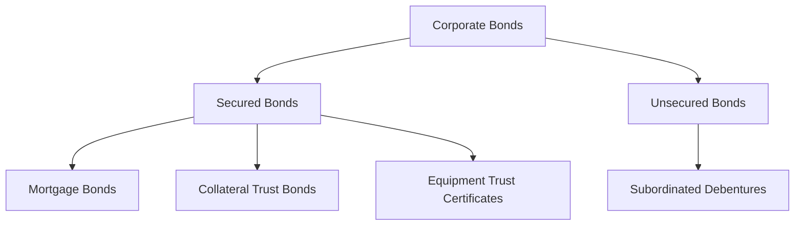

---

linkTitle: "6.16 Types of Corporate Bonds"
title: "Corporate Bonds: Types and Features in Canadian Markets"
description: "Explore the diverse types of corporate bonds, including mortgage bonds, floating-rate securities, and Eurobonds, with a focus on Canadian financial markets."
categories:
- Fixed-Income Securities
- Corporate Bonds
- Canadian Finance
tags:
- Mortgage Bonds
- Floating-Rate Securities
- Eurobonds
- Canadian Markets
- Investment Strategies
date: 2024-10-25
type: docs
nav_weight: 7700

canonical: "https://securitiesexamsmastery.ca/13/6/17"
license: "© 2023 Tokenizer Inc. CC BY-NC-SA 4.0"
---

## 6.16 Types of Corporate Bonds

Corporate bonds are a critical component of the fixed-income market, offering investors a range of options to diversify their portfolios and manage risk. In this section, we delve into various types of corporate bonds, focusing on their unique features and relevance within the Canadian financial landscape. Understanding these instruments is essential for making informed investment decisions and achieving financial goals.

### Mortgage Bonds

Mortgage bonds are secured by real assets, such as property or equipment, owned by the issuing corporation. This security provides an additional layer of protection for investors, as the assets can be liquidated to repay bondholders in the event of default. Mortgage bonds are particularly appealing to risk-averse investors seeking stable returns.

#### Example: Canadian Real Estate Investment Trusts (REITs)

In Canada, mortgage bonds are often issued by real estate investment trusts (REITs) that own and manage income-producing properties. These bonds are secured by the underlying real estate assets, providing investors with a tangible assurance of repayment. For instance, a Canadian REIT might issue mortgage bonds to finance the acquisition of a commercial property, using the property itself as collateral.

### Floating-Rate Securities

Floating-rate securities, also known as variable-rate bonds, have interest payments that adjust periodically based on a benchmark rate, such as the Canadian Overnight Repo Rate Average (CORRA) or the Bank of Canada's policy rate. This feature makes them attractive in rising interest rate environments, as they offer protection against inflation and interest rate risk.

#### Example: Floating-Rate Notes (FRNs) Issued by Canadian Banks

Major Canadian banks, such as RBC and TD, often issue floating-rate notes (FRNs) to manage their interest rate exposure. These securities provide investors with the opportunity to benefit from increasing interest rates while maintaining a relatively stable principal value. For example, an FRN issued by RBC might have its interest payments linked to the CORRA, adjusting every quarter to reflect changes in the benchmark rate.

### Domestic Bonds, Foreign Bonds, and Eurobonds

Understanding the distinctions between domestic bonds, foreign bonds, and Eurobonds is crucial for investors operating in global markets.

#### Domestic Bonds

Domestic bonds are issued by Canadian corporations in the Canadian market and denominated in Canadian dollars (CAD). These bonds are subject to Canadian regulations and are typically purchased by domestic investors seeking exposure to local companies.

#### Foreign Bonds

Foreign bonds are issued in a domestic market by a foreign borrower and denominated in the domestic currency. In Canada, these are often referred to as "Maple Bonds." They allow foreign entities to access Canadian capital while providing Canadian investors with international exposure without currency risk.

#### Eurobonds

Eurobonds are international bonds issued in a currency not native to the country where they are issued. They offer issuers flexibility in choosing the currency and market for issuance, often resulting in lower borrowing costs. For Canadian corporations, issuing Eurobonds can be a strategic way to tap into global capital markets.

#### Example: Canadian Corporations in Global Markets

A Canadian mining company might issue Eurobonds denominated in U.S. dollars to attract international investors and finance its overseas operations. This strategy allows the company to benefit from the liquidity and depth of the global bond market while diversifying its investor base.

### Other Corporate Debt Instruments

In addition to the bonds discussed above, several other corporate debt instruments play a significant role in the fixed-income market.

#### Collateral Trust Bonds

Collateral trust bonds are secured by financial assets, such as stocks or bonds, held in trust by a third party. This structure provides additional security for bondholders, as the collateral can be sold to repay the debt if necessary.

#### Equipment Trust Certificates

Equipment trust certificates are secured by specific pieces of equipment, such as aircraft or machinery. These bonds are commonly used in industries with significant capital expenditures, such as transportation and manufacturing.

#### Subordinated Debentures

Subordinated debentures are unsecured bonds that rank lower in priority compared to other debts in the event of issuer default. While they offer higher yields to compensate for the increased risk, investors should carefully assess the issuer's creditworthiness before investing.

### Practical Application and Investment Strategies

Investors can leverage the diversity of corporate bonds to construct a well-balanced portfolio that aligns with their risk tolerance and investment objectives. For instance, a conservative investor might prioritize mortgage bonds and domestic bonds for their stability, while a more aggressive investor might seek higher yields through subordinated debentures and Eurobonds.

### Diagrams and Visual Aids

To enhance understanding, consider the following diagram illustrating the hierarchy of bond security and risk:

### Best Practices and Common Pitfalls

- **Best Practices:** Diversify across different types of bonds to mitigate risk and enhance returns. Monitor interest rate trends to optimize the timing of investments in floating-rate securities.
- **Common Pitfalls:** Overlooking the credit risk associated with subordinated debentures and failing to account for currency risk in foreign and Eurobond investments.

### References and Further Reading

- **Bank of Canada:** Explore materials on foreign bonds and their impact on the Canadian economy ([www.bankofcanada.ca](https://www.bankofcanada.ca)).
- **International Capital Market Association (ICMA):** Access guidelines on international bonds and best practices for issuers ([www.icmagroup.org](https://www.icmagroup.org)).

### Glossary

- **Mortgage Bond:** A bond secured by a mortgage on real property owned by the issuer.
- **Floating-Rate Security:** A bond with variable interest rates linked to a benchmark rate.
- **Eurobond:** An international bond issued in a currency not native to the country where it's issued.
- **Foreign Bond:** A bond issued in a domestic market by a foreign borrower, denominated in the domestic currency.
- **Subordinated Debenture:** A lower-ranking bond paid after other debts in case of issuer default.

### Conclusion

Understanding the various types of corporate bonds is essential for navigating the fixed-income market and making informed investment decisions. By leveraging the unique features of each bond type, investors can tailor their portfolios to meet specific financial goals and risk preferences.

### **Ready to Test Your Knowledge?**

**Practice 10 Essential CSC Exam Questions to Master Your Certification**



### What is a mortgage bond?

- [x] A bond secured by a mortgage on real property owned by the issuer.
- [ ] A bond with variable interest rates linked to a benchmark rate.
- [ ] An international bond issued in a currency not native to the country where it's issued.
- [ ] A bond issued in a domestic market by a foreign borrower, denominated in the domestic currency.

> **Explanation:** A mortgage bond is secured by real property, providing additional security for investors.

### Which type of bond has interest payments that adjust with market rates?

- [ ] Mortgage bond
- [x] Floating-rate security
- [ ] Eurobond
- [ ] Subordinated debenture

> **Explanation:** Floating-rate securities have variable interest rates linked to a benchmark rate, adjusting with market conditions.

### What is a Eurobond?

- [ ] A bond issued in a domestic market by a foreign borrower, denominated in the domestic currency.
- [x] An international bond issued in a currency not native to the country where it's issued.
- [ ] A bond secured by financial assets held in trust.
- [ ] A lower-ranking bond paid after other debts in case of issuer default.

> **Explanation:** Eurobonds are issued internationally in a currency not native to the country of issuance.

### What is a foreign bond?

- [ ] A bond secured by a mortgage on real property owned by the issuer.
- [ ] A bond with variable interest rates linked to a benchmark rate.
- [ ] An international bond issued in a currency not native to the country where it's issued.
- [x] A bond issued in a domestic market by a foreign borrower, denominated in the domestic currency.

> **Explanation:** Foreign bonds are issued in a domestic market by foreign entities, denominated in the domestic currency.

### Which of the following is a secured bond?

- [x] Mortgage bond
- [ ] Subordinated debenture
- [ ] Eurobond
- [x] Equipment trust certificate

> **Explanation:** Mortgage bonds and equipment trust certificates are secured by real assets or equipment, providing security for investors.

### What is a subordinated debenture?

- [ ] A bond secured by a mortgage on real property owned by the issuer.
- [ ] A bond with variable interest rates linked to a benchmark rate.
- [ ] An international bond issued in a currency not native to the country where it's issued.
- [x] A lower-ranking bond paid after other debts in case of issuer default.

> **Explanation:** Subordinated debentures are unsecured and rank lower in priority compared to other debts.

### Which type of bond is commonly issued by Canadian banks to manage interest rate exposure?

- [ ] Mortgage bond
- [x] Floating-rate security
- [ ] Eurobond
- [ ] Subordinated debenture

> **Explanation:** Canadian banks often issue floating-rate securities to manage interest rate risk.

### What is the primary advantage of investing in floating-rate securities?

- [ ] They offer fixed interest payments.
- [x] They provide protection against rising interest rates.
- [ ] They are secured by real assets.
- [ ] They are issued in foreign currencies.

> **Explanation:** Floating-rate securities adjust their interest payments with market rates, offering protection against rising interest rates.

### Which bond type is secured by financial assets held in trust?

- [ ] Mortgage bond
- [ ] Floating-rate security
- [x] Collateral trust bond
- [ ] Subordinated debenture

> **Explanation:** Collateral trust bonds are secured by financial assets held in trust, providing additional security for investors.

### True or False: Eurobonds are always issued in the currency of the issuer's home country.

- [ ] True
- [x] False

> **Explanation:** Eurobonds are issued in a currency not native to the country where they are issued, providing flexibility for issuers.


