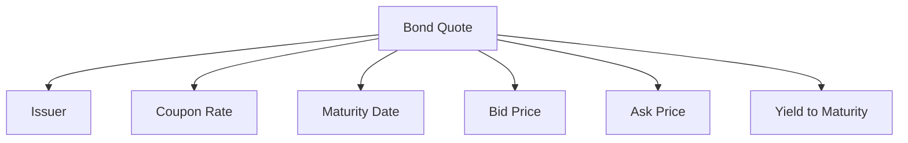

## 6.18 How to Read Bond Quotes and Ratings

Understanding bond quotes and ratings is crucial for making informed investment decisions in the fixed-income market. This section will guide you through the components of a bond quote, the role of credit rating agencies, and how these ratings influence bond pricing and investor decisions. We will also explore the importance of monitoring ratings for changes that may affect bond valuations.

### Components of a Bond Quote

A bond quote provides essential information about a bond's characteristics and market value. Here are the key components:

1. **Issuer**: The entity that issues the bond, such as a corporation, government, or municipality. The issuer's creditworthiness is a critical factor in determining the bond's risk and return.

2. **Coupon Rate**: The annual interest rate paid by the bond issuer, expressed as a percentage of the bond's face value. For example, a bond with a face value of $1,000 and a coupon rate of 5% pays $50 in interest annually.

3. **Maturity Date**: The date on which the bond's principal amount is repaid to investors. Bonds can have short, medium, or long-term maturities, affecting their interest rate risk and price volatility.

4. **Bid and Ask Prices**: 
   - **Bid Price**: The price a buyer is willing to pay for the bond.
   - **Ask Price**: The price a seller is willing to accept for the bond.
   The difference between the bid and ask prices is known as the spread, which reflects the bond's liquidity.

5. **Yield to Maturity (YTM)**: The total return anticipated on a bond if held until it matures, accounting for the bond's current market price, coupon payments, and time to maturity. YTM is a critical measure for comparing bonds with different coupon rates and maturities.

### Understanding Credit Rating Agencies

Credit rating agencies assess the creditworthiness of bond issuers and assign ratings that indicate the issuer's ability to repay debt. The major agencies include:

- **DBRS Limited**: A Canadian credit rating agency providing ratings and research on various financial instruments. [Visit DBRS](https://www.dbrsmorningstar.com)

- **Moody's Canada Inc.**: Offers credit ratings and research, helping investors assess credit risk. [Visit Moody's](https://www.moodys.com)

- **Standard & Poor's (S&P)**: Provides credit ratings and market intelligence, widely used by investors globally. [Visit S&P](https://www.spglobal.com/ratings)

### How Bond Ratings Influence Investor Decisions

Bond ratings significantly impact investor decisions and bond pricing. Here's how:

- **Investment-Grade Bonds**: Bonds rated BBB-/Baa3 or higher are considered investment-grade, indicating low credit risk. These bonds are attractive to conservative investors seeking stable returns.

- **Speculative Bonds (Junk Bonds)**: Bonds rated below investment-grade are considered speculative, with higher credit risk and potential for higher returns. These bonds appeal to risk-tolerant investors seeking higher yields.

- **Impact on Pricing**: Higher-rated bonds typically have lower yields due to their perceived safety, while lower-rated bonds offer higher yields to compensate for increased risk.

### The Importance of Monitoring Ratings

Monitoring bond ratings is crucial for investors to manage risk and optimize returns. Changes in ratings can affect bond valuations and investor sentiment. For example, a downgrade may lead to a decline in bond prices, while an upgrade can increase demand and prices.

### Practical Example: Canadian Pension Fund Strategy

Consider a Canadian pension fund managing a diversified bond portfolio. The fund may prioritize investment-grade bonds to ensure stable income and preserve capital. By closely monitoring credit ratings, the fund can adjust its holdings in response to rating changes, maintaining an optimal risk-return balance.

### Step-by-Step Guidance: Analyzing a Bond Quote

1. **Identify the Issuer**: Assess the issuer's reputation and financial health.
2. **Examine the Coupon Rate**: Compare it with current market rates to evaluate attractiveness.
3. **Check the Maturity Date**: Consider how the bond fits into your investment horizon.
4. **Review Bid and Ask Prices**: Analyze the spread to gauge liquidity.
5. **Calculate Yield to Maturity**: Use YTM to compare bonds with different features.

### Diagram: Bond Quote Components

### Best Practices and Common Pitfalls

- **Best Practices**: Diversify bond holdings across issuers, sectors, and maturities to manage risk. Regularly review credit ratings and market conditions.
- **Common Pitfalls**: Ignoring credit rating changes can lead to unexpected losses. Overconcentration in speculative bonds increases portfolio risk.

### References and Additional Resources

- **DBRS Limited**: [www.dbrs.com](https://www.dbrsmorningstar.com)
- **Moody's Canada Inc.**: [www.moodys.com](https://www.moodys.com)
- **Standard & Poor's (S&P)**: [www.spglobal.com/ratings](https://www.spglobal.com/ratings)

For further exploration, consider reading "The Bond Book" by Annette Thau or taking online courses on fixed-income securities.

### Summary

Understanding bond quotes and ratings is essential for navigating the fixed-income market. By analyzing the components of a bond quote and considering credit ratings, investors can make informed decisions that align with their risk tolerance and investment goals. Regularly monitoring ratings and market conditions will help optimize portfolio performance and manage risk effectively.

### **Ready to Test Your Knowledge?**

**Practice 10 Essential CSC Exam Questions to Master Your Certification**



### What is the coupon rate of a bond?

- [x] The annual interest rate paid by the bond issuer
- [ ] The price a buyer is willing to pay for the bond
- [ ] The total return anticipated on a bond if held until maturity
- [ ] The difference between the bid and ask prices

> **Explanation:** The coupon rate is the annual interest rate paid by the bond issuer, expressed as a percentage of the bond's face value.

### Which of the following is a Canadian credit rating agency?

- [x] DBRS Limited
- [ ] Fitch Ratings
- [ ] Morningstar
- [ ] Bloomberg

> **Explanation:** DBRS Limited is a Canadian credit rating agency providing ratings and research on various financial instruments.

### What does a bond's yield to maturity (YTM) represent?

- [x] The total return anticipated on a bond if held until it matures
- [ ] The price a seller is willing to accept for the bond
- [ ] The annual interest rate paid by the bond issuer
- [ ] The bond's maturity date

> **Explanation:** Yield to maturity (YTM) is the total return anticipated on a bond if held until it matures, accounting for the bond's current market price, coupon payments, and time to maturity.

### How do credit ratings influence bond pricing?

- [x] Higher-rated bonds typically have lower yields
- [ ] Higher-rated bonds typically have higher yields
- [ ] Ratings do not influence bond pricing
- [ ] Lower-rated bonds are always more expensive

> **Explanation:** Higher-rated bonds typically have lower yields due to their perceived safety, while lower-rated bonds offer higher yields to compensate for increased risk.

### What is an investment-grade bond?

- [x] A bond rated BBB-/Baa3 or higher
- [ ] A bond rated below BBB-/Baa3
- [ ] A bond with a high coupon rate
- [ ] A bond with a short maturity

> **Explanation:** An investment-grade bond is rated BBB-/Baa3 or higher, indicating low credit risk.

### What is the bid price of a bond?

- [x] The price a buyer is willing to pay for the bond
- [ ] The price a seller is willing to accept for the bond
- [ ] The bond's face value
- [ ] The bond's coupon rate

> **Explanation:** The bid price is the price a buyer is willing to pay for the bond.

### What is a speculative bond also known as?

- [x] Junk bond
- [ ] Investment-grade bond
- [ ] Treasury bond
- [ ] Municipal bond

> **Explanation:** A speculative bond is also known as a junk bond, indicating higher credit risk and potential for higher returns.

### Why is it important to monitor bond ratings?

- [x] Changes in ratings can affect bond valuations
- [ ] Ratings never change
- [ ] Ratings are irrelevant to bond pricing
- [ ] Monitoring ratings is only necessary for stocks

> **Explanation:** Monitoring bond ratings is important because changes can affect bond valuations and investor sentiment.

### What does the ask price of a bond represent?

- [x] The price a seller is willing to accept for the bond
- [ ] The price a buyer is willing to pay for the bond
- [ ] The bond's yield to maturity
- [ ] The bond's maturity date

> **Explanation:** The ask price is the price a seller is willing to accept for the bond.

### True or False: A bond's maturity date is the date on which the bond's principal amount is repaid to investors.

- [x] True
- [ ] False

> **Explanation:** True. The maturity date is the date on which the bond's principal amount is repaid to investors.


