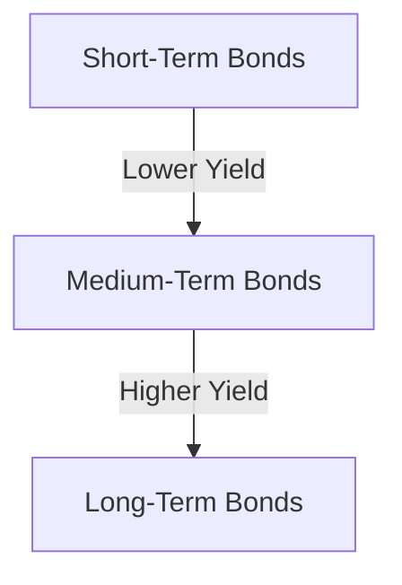

## 6.2.1 Bond Terminology and Features

Understanding the terminology and features of bonds is crucial for anyone involved in the financial markets, particularly in the context of Canadian securities. Bonds are a fundamental component of fixed-income securities, offering a predictable income stream and a relatively lower risk compared to equities. This section delves into the essential features and terminology associated with bonds, providing insights into their structure, valuation, and the factors influencing their attractiveness to investors.

### Bond Features and Their Implications

#### Structure of Interest Payments

Bonds typically provide regular interest payments to investors, known as coupon payments. These payments can be structured in various ways, with the most common being semi-annual and annual payments. In Canada, semi-annual payments are prevalent, meaning investors receive interest twice a year. This structure affects the bond's yield and the investor's cash flow, making it an important consideration when evaluating bond investments.

For example, consider a Canadian government bond with a face value of CAD 1,000 and an annual coupon rate of 4%. If the bond pays interest semi-annually, the investor would receive CAD 20 every six months. This regular income stream is a key feature that attracts investors seeking stable returns.

#### The Yield Curve and Its Significance

The yield curve is a graphical representation that plots the yields of bonds with equal credit quality but different maturities. It typically shows the relationship between interest rates and time, providing insights into future interest rate changes and economic conditions.

In Canada, the yield curve is closely monitored by investors and policymakers. A normal yield curve, which slopes upward, suggests that longer-term bonds have higher yields than short-term bonds, indicating expectations of economic growth and inflation. Conversely, an inverted yield curve, where short-term yields are higher than long-term yields, can signal an impending economic downturn.

Below is a simplified representation of a yield curve:

Understanding the yield curve helps investors make informed decisions about bond investments and assess the broader economic outlook.

#### Callable and Convertible Bonds

**Callable Bonds:**

A callable bond gives the issuer the right to redeem the bond before its maturity at a predetermined price. This feature is advantageous to issuers, especially in declining interest rate environments, as it allows them to refinance debt at lower rates. However, it introduces reinvestment risk for investors, as they may have to reinvest the principal at lower yields.

For instance, if a Canadian corporation issues a callable bond with a 5% coupon rate and interest rates fall to 3%, the company might choose to call the bond, repay the principal, and issue new bonds at the lower rate. Investors must weigh this risk when considering callable bonds.

**Convertible Bonds:**

Convertible bonds offer investors the option to convert the bond into a predetermined number of the issuing company's equity shares. This feature provides potential upside if the company's stock performs well, making convertible bonds attractive to investors seeking both income and growth.

For example, a Canadian technology firm might issue a convertible bond that allows conversion into its shares at a specific price. If the company's stock price rises significantly, investors can convert their bonds into shares, potentially realizing substantial gains.

#### Bond Ratings and Credit Risk

Bond ratings are evaluations of the creditworthiness of a bond issuer, indicating the degree of risk associated with the bond. Ratings are provided by agencies such as Moody's, Standard & Poor's, and DBRS Morningstar in Canada. They range from high-grade (low risk) to speculative (high risk), influencing the bond's yield and marketability.

A high bond rating suggests a low risk of default, making the bond more attractive to conservative investors. Conversely, lower-rated bonds, often referred to as "junk bonds," offer higher yields to compensate for the increased risk.

### Practical Examples and Case Studies

To illustrate these concepts, consider the investment strategies of Canadian pension funds. These funds often hold a diversified portfolio of bonds, balancing high-rated government bonds for stability with corporate bonds for higher yields. By analyzing the yield curve and bond ratings, fund managers can optimize their portfolios to achieve desired risk-return profiles.

Similarly, major Canadian banks like RBC and TD issue callable and convertible bonds to manage their capital structures and attract different investor segments. Understanding these features enables investors to assess the potential risks and rewards associated with these securities.

### Best Practices and Common Pitfalls

When investing in bonds, consider the following best practices:

- **Diversification:** Spread investments across different issuers, sectors, and maturities to mitigate risk.
- **Yield Curve Analysis:** Use the yield curve to gauge economic conditions and interest rate trends.
- **Credit Risk Assessment:** Evaluate bond ratings and issuer financial health to assess default risk.
- **Feature Evaluation:** Understand the implications of callable and convertible features on bond valuation.

Common pitfalls include over-reliance on bond ratings without conducting independent analysis and ignoring the impact of interest rate changes on bond prices.

### Conclusion

Bonds are a vital component of the fixed-income market, offering diverse features and investment opportunities. By understanding bond terminology and features, investors can make informed decisions, optimize their portfolios, and navigate the complexities of the Canadian financial landscape. Continuous learning and critical analysis are essential to mastering bond investments and achieving financial goals.

## Quiz Time!



### What is the primary advantage of a callable bond for the issuer?

- [x] The ability to refinance debt at lower interest rates
- [ ] The option to convert bonds into equity
- [ ] The guarantee of higher yields for investors
- [ ] The elimination of credit risk

> **Explanation:** Callable bonds allow issuers to redeem bonds before maturity, enabling them to refinance at lower rates when interest rates decline.

### How does a normal yield curve typically appear?

- [x] Upward sloping
- [ ] Downward sloping
- [ ] Flat
- [ ] Inverted

> **Explanation:** A normal yield curve slopes upward, indicating higher yields for longer-term bonds compared to short-term bonds.

### What is a convertible bond?

- [x] A bond that can be converted into a predetermined number of equity shares
- [ ] A bond that can be redeemed before maturity
- [ ] A bond with a fixed interest rate
- [ ] A bond that pays interest annually

> **Explanation:** Convertible bonds offer the option to convert the bond into equity shares, providing potential upside if the company's stock performs well.

### What does a high bond rating indicate?

- [x] Low risk of default
- [ ] High risk of default
- [ ] High yield
- [ ] Low yield

> **Explanation:** A high bond rating suggests a low risk of default, making the bond more attractive to conservative investors.

### Which of the following is a common feature of Canadian government bonds?

- [x] Semi-annual interest payments
- [ ] Convertible into equity shares
- [ ] Callable before maturity
- [ ] Rated as speculative

> **Explanation:** Canadian government bonds typically offer semi-annual interest payments, providing a regular income stream to investors.

### What does an inverted yield curve potentially signal?

- [x] An impending economic downturn
- [ ] Economic growth
- [ ] Stable interest rates
- [ ] High inflation

> **Explanation:** An inverted yield curve, where short-term yields are higher than long-term yields, can signal an impending economic downturn.

### Why might an investor choose a convertible bond?

- [x] Potential upside if the company's stock performs well
- [ ] Guaranteed higher yields
- [x] Diversification of investment
- [ ] Elimination of credit risk

> **Explanation:** Convertible bonds offer potential upside through conversion into equity shares, appealing to investors seeking both income and growth.

### What is the role of bond ratings?

- [x] Assessing credit risk and investment quality
- [ ] Determining bond maturity
- [ ] Setting interest rates
- [ ] Guaranteeing bond performance

> **Explanation:** Bond ratings evaluate the creditworthiness of a bond issuer, indicating the degree of risk associated with the bond.

### How can investors mitigate risk in a bond portfolio?

- [x] Diversification across issuers, sectors, and maturities
- [ ] Investing only in high-yield bonds
- [ ] Ignoring bond ratings
- [ ] Focusing solely on short-term bonds

> **Explanation:** Diversification helps mitigate risk by spreading investments across different issuers, sectors, and maturities.

### True or False: A callable bond can be converted into equity shares.

- [ ] True
- [x] False

> **Explanation:** A callable bond allows the issuer to redeem it before maturity, but it does not offer conversion into equity shares.


