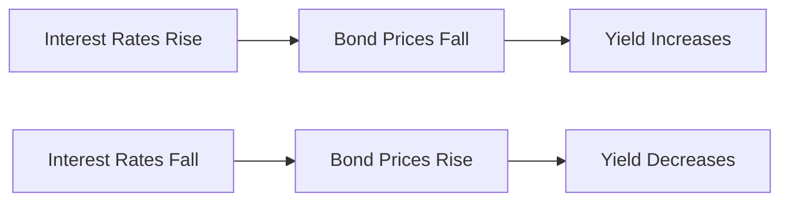

## 6.2 The Basic Features and Terminology of Fixed-Income Securities

Fixed-income securities, commonly referred to as bonds, are a cornerstone of the investment landscape, offering a predictable income stream and a return of principal at maturity. Understanding the basic features and terminology of these instruments is crucial for anyone involved in financial markets, particularly in the Canadian context. This section will delve into the essential terms and concepts that define fixed-income securities, providing a comprehensive understanding that will aid in making informed investment decisions.

### Key Terminology and Bond Features

#### Par Value (Face Value)

The **par value**, also known as the face value, is the principal amount of the bond that the issuer agrees to repay the bondholder at maturity. Typically set at $1,000 for corporate bonds, the par value serves as the baseline for calculating interest payments. For example, a bond with a par value of $1,000 and a coupon rate of 5% will pay $50 in interest annually.

#### Coupon Rate

The **coupon rate** is the fixed interest rate paid by the bond issuer on the bond’s par value. It represents the annual income an investor can expect to receive from the bond, expressed as a percentage of the par value. For instance, a bond with a 4% coupon rate and a $1,000 par value will pay $40 in interest each year. The coupon rate is determined at issuance and remains constant throughout the life of the bond.

#### Maturity Date

The **maturity date** is the date on which the bond's principal, or par value, is repaid to the bondholder. Bonds can have varying maturities, ranging from short-term (less than three years) to long-term (more than ten years). The maturity date is a critical factor in determining the bond's risk and return profile, as longer maturities typically involve greater interest rate risk.

#### Bond Price

The **bond price** is the current market price of a bond, expressed as a percentage of its par value. Bond prices fluctuate based on changes in interest rates, credit quality, and other market conditions. A bond trading at 95 is priced at 95% of its par value, or $950 for a $1,000 bond. Conversely, a bond trading at 105 is priced at 105% of its par value, or $1,050.

#### Yield to Maturity (YTM)

The **yield to maturity (YTM)** is the total return expected on a bond if held until it matures, considering both interest payments and any capital gain or loss. YTM is a comprehensive measure of a bond's return, accounting for the bond's current price, coupon payments, and time to maturity. It is expressed as an annual percentage rate. YTM is particularly important for investors as it allows for comparison between bonds with different coupon rates and maturities.

### Bond Pricing and Market Dynamics

Bond prices are quoted in the market as a percentage of their par value. When a bond trades **above par**, it is selling for more than its face value, often due to a coupon rate higher than prevailing interest rates. Conversely, a bond trading **below par** is selling for less than its face value, typically because its coupon rate is lower than current market rates.

#### Example: Trading Above and Below Par

Consider a bond with a 6% coupon rate and a par value of $1,000. If market interest rates fall to 4%, the bond's price will likely rise above par, as its coupon payments are more attractive than new issues. Conversely, if interest rates rise to 8%, the bond's price will fall below par, as investors can obtain higher yields elsewhere.

### The Impact of Interest Rates on Bond Prices and Yields

Interest rates and bond prices have an inverse relationship. When interest rates rise, bond prices fall, and vice versa. This is because the fixed coupon payments of existing bonds become more or less attractive compared to new bonds issued at current rates.

#### Example: Interest Rate Impact

Suppose you hold a bond with a 5% coupon rate and a par value of $1,000. If interest rates increase to 6%, new bonds will offer higher returns, making your bond less attractive. As a result, the price of your bond will decrease to adjust the yield to match the new market rate.

### Practical Applications and Considerations

Understanding these fundamental concepts is essential for evaluating fixed-income investments. Investors must consider how interest rate changes, credit risk, and market conditions affect bond prices and yields. Canadian investors, in particular, should be aware of how domestic economic factors, such as the Bank of Canada's monetary policy, influence interest rates and bond markets.

### Visualizing Bond Concepts

To further illustrate these concepts, consider the following diagram showing the relationship between bond prices and interest rates:

### Best Practices and Common Pitfalls

- **Best Practices:**
  - Regularly monitor interest rate trends and economic indicators.
  - Diversify bond holdings across different maturities and credit qualities.
  - Consider the tax implications of bond investments, particularly within Canadian tax-advantaged accounts like RRSPs and TFSAs.

- **Common Pitfalls:**
  - Failing to account for interest rate risk, especially in long-term bonds.
  - Overlooking the impact of inflation on real returns.
  - Ignoring credit risk and the issuer's financial health.

### Conclusion

Understanding the basic features and terminology of fixed-income securities is crucial for making informed investment decisions. By grasping concepts such as par value, coupon rate, maturity date, bond price, and yield to maturity, investors can better navigate the complexities of the bond market. This knowledge is particularly valuable in the Canadian context, where economic conditions and regulatory frameworks play a significant role in shaping investment opportunities.

## Quiz Time!



### What is the par value of a bond?

- [x] The principal amount to be repaid at maturity
- [ ] The interest payment received annually
- [ ] The current market price of the bond
- [ ] The bond's yield to maturity

> **Explanation:** The par value, or face value, is the principal amount that the bond issuer agrees to repay at maturity.

### How is the coupon rate of a bond defined?

- [x] The fixed interest rate paid on the bond’s par value
- [ ] The bond's yield to maturity
- [ ] The bond's current market price
- [ ] The total return expected on the bond

> **Explanation:** The coupon rate is the fixed interest rate paid by the bond issuer on the bond’s par value, expressed as a percentage.

### What does it mean when a bond is trading above par?

- [x] The bond's market price is higher than its par value
- [ ] The bond's market price is lower than its par value
- [ ] The bond's coupon rate is lower than market rates
- [ ] The bond's yield to maturity is negative

> **Explanation:** A bond trading above par has a market price higher than its par value, often due to a higher coupon rate compared to current market rates.

### What is yield to maturity (YTM)?

- [x] The total return expected on a bond if held until maturity
- [ ] The bond's current market price
- [ ] The fixed interest rate paid on the bond
- [ ] The bond's par value

> **Explanation:** Yield to maturity (YTM) is the total return expected on a bond if held until it matures, considering both interest payments and capital gain or loss.

### How do rising interest rates affect bond prices?

- [x] Bond prices fall
- [ ] Bond prices rise
- [ ] Bond prices remain unchanged
- [ ] Bond prices become volatile

> **Explanation:** Rising interest rates cause bond prices to fall because the fixed coupon payments of existing bonds become less attractive compared to new bonds issued at higher rates.

### What is the relationship between bond prices and yields?

- [x] Inverse relationship
- [ ] Direct relationship
- [ ] No relationship
- [ ] Random relationship

> **Explanation:** Bond prices and yields have an inverse relationship; as bond prices fall, yields increase, and vice versa.

### What is a common pitfall when investing in long-term bonds?

- [x] Failing to account for interest rate risk
- [ ] Overestimating the bond's par value
- [ ] Ignoring the bond's coupon rate
- [ ] Misunderstanding the bond's maturity date

> **Explanation:** A common pitfall when investing in long-term bonds is failing to account for interest rate risk, as longer maturities are more sensitive to interest rate changes.

### What is the significance of the maturity date of a bond?

- [x] It is the date when the bond's principal is repaid
- [ ] It is the date when the bond's coupon rate is adjusted
- [ ] It is the date when the bond's price is recalculated
- [ ] It is the date when the bond's yield to maturity is determined

> **Explanation:** The maturity date is significant because it is the date when the bond's principal, or par value, is repaid to the bondholder.

### How can Canadian investors benefit from understanding bond features?

- [x] By making informed investment decisions
- [ ] By avoiding all types of bonds
- [ ] By focusing solely on short-term bonds
- [ ] By ignoring interest rate trends

> **Explanation:** Canadian investors can benefit from understanding bond features by making informed investment decisions that consider interest rate trends, credit risk, and market conditions.

### True or False: A bond's coupon rate changes with market interest rates.

- [ ] True
- [x] False

> **Explanation:** False. A bond's coupon rate is fixed at issuance and does not change with market interest rates.


