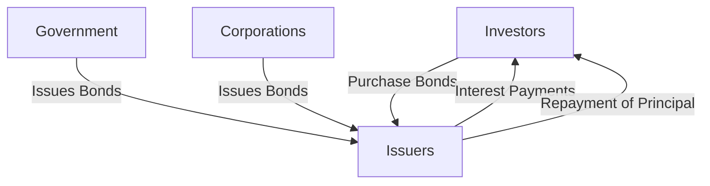

## 6.1 The Fixed-Income Marketplace

The fixed-income marketplace is a cornerstone of the Canadian financial system, providing essential funding for governments and corporations while offering investors a stable income stream. This section delves into the intricacies of the fixed-income market, highlighting its participants, comparing its size to the equity market, and discussing its critical role in financial strategies.

### Overview of Participants in the Canadian Fixed-Income Market

The Canadian fixed-income market is a vibrant ecosystem comprising various participants, each playing a pivotal role in its functioning.

#### Issuers

**Governments:** The Government of Canada is a major issuer of fixed-income securities, primarily through bonds and treasury bills. These instruments are crucial for financing public expenditures and managing national debt. Provincial and municipal governments also issue bonds to fund infrastructure projects and other public services.

**Corporations:** Canadian corporations issue bonds to raise capital for expansion, acquisitions, and other business activities. Corporate bonds often offer higher yields than government bonds, reflecting the increased risk associated with corporate creditworthiness.

#### Investors

**Institutions:** Institutional investors, such as pension funds, insurance companies, and mutual funds, are significant players in the fixed-income market. They seek stable returns and risk management through diversified bond portfolios. For instance, Canadian pension funds often allocate a substantial portion of their assets to fixed-income securities to match long-term liabilities.

**Individuals:** Retail investors participate in the fixed-income market through direct bond purchases or indirectly via bond mutual funds and exchange-traded funds (ETFs). These investments provide regular interest income and portfolio diversification.

### Comparison of the Fixed-Income Market Size to the Equity Market in Canada

The fixed-income market in Canada is substantial, often rivaling the equity market in size. While equities offer growth potential, fixed-income securities provide stability and predictable income, appealing to risk-averse investors.

In recent years, the Canadian fixed-income market has experienced significant growth, driven by increased government borrowing and corporate bond issuance. According to the Bank of Canada, the outstanding amount of Government of Canada bonds alone exceeds CAD 1 trillion, underscoring the market's scale.

### The Role of Fixed-Income Securities in Government Financing and Corporate Capital Structure

Fixed-income securities are indispensable tools for both government and corporate financing.

#### Government Financing

Governments rely on bonds to finance budget deficits and fund public projects. The issuance of government bonds is a critical component of fiscal policy, allowing governments to manage economic cycles and invest in infrastructure.

#### Corporate Capital Structure

For corporations, bonds are a vital part of the capital structure. They provide an alternative to equity financing, enabling companies to raise funds without diluting ownership. The interest payments on bonds are tax-deductible, making them an attractive financing option.

### Importance of Understanding Market Dynamics for Informed Investment Decisions

Understanding the dynamics of the fixed-income market is crucial for making informed investment decisions. Key factors include:

- **Interest Rates:** Bond prices are inversely related to interest rates. Investors must monitor central bank policies and economic indicators to anticipate rate changes.
- **Credit Risk:** Assessing the creditworthiness of issuers is essential to manage risk. Ratings from agencies like Moody's and S&P provide insights into issuer reliability.
- **Inflation:** Inflation erodes the purchasing power of fixed-income returns. Inflation-linked bonds, such as Real Return Bonds in Canada, offer protection against this risk.

### Practical Examples and Case Studies

#### Example: Canadian Pension Fund Strategy

A Canadian pension fund might allocate 40% of its portfolio to fixed-income securities to ensure stable returns and match long-term liabilities. This allocation includes a mix of government and high-grade corporate bonds, balancing risk and return.

#### Case Study: RBC's Fixed-Income Portfolio

Royal Bank of Canada (RBC) manages a diverse fixed-income portfolio, including government, corporate, and municipal bonds. By actively managing duration and credit exposure, RBC aims to optimize returns while maintaining risk within acceptable limits.

### Diagrams and Visual Aids

Below is a simplified diagram illustrating the flow of funds in the fixed-income market:

### Best Practices and Common Pitfalls

**Best Practices:**

- Diversify across issuers and maturities to manage risk.
- Regularly review credit ratings and economic indicators.
- Consider inflation-protected securities to preserve purchasing power.

**Common Pitfalls:**

- Ignoring interest rate risk can lead to significant capital losses.
- Overconcentration in a single issuer increases default risk.
- Failing to account for inflation can erode real returns.

### References and Further Reading

- **Bank of Canada:** [Information on Government of Canada bonds](https://www.bankofcanada.ca)
- **Canadian Securities Administrators (CSA):** [Resources on investing](https://www.securities-administrators.ca)

For further exploration, consider reading "The Bond Book" by Annette Thau for a comprehensive guide to bond investing.

---

### **Ready to Test Your Knowledge?**

**Practice 10 Essential CSC Exam Questions to Master Your Certification**



### Who are the primary issuers in the Canadian fixed-income market?

- [x] Governments and corporations
- [ ] Only governments
- [ ] Only corporations
- [ ] Banks and insurance companies

> **Explanation:** The primary issuers in the Canadian fixed-income market are governments (federal, provincial, and municipal) and corporations.

### What is a key reason corporations issue bonds?

- [x] To raise capital without diluting ownership
- [ ] To increase equity
- [ ] To decrease debt
- [ ] To pay dividends

> **Explanation:** Corporations issue bonds to raise capital without diluting ownership, as bonds do not involve issuing new shares.

### How do interest rates affect bond prices?

- [x] Bond prices are inversely related to interest rates
- [ ] Bond prices increase with interest rates
- [ ] Bond prices are not affected by interest rates
- [ ] Bond prices are directly related to interest rates

> **Explanation:** Bond prices are inversely related to interest rates; when rates rise, bond prices fall, and vice versa.

### What is the role of fixed-income securities in government financing?

- [x] To finance budget deficits and public projects
- [ ] To increase tax revenue
- [ ] To reduce inflation
- [ ] To pay government salaries

> **Explanation:** Fixed-income securities, like government bonds, are used to finance budget deficits and fund public projects.

### Which of the following is a common pitfall in fixed-income investing?

- [x] Ignoring interest rate risk
- [ ] Diversifying across issuers
- [ ] Monitoring credit ratings
- [ ] Considering inflation-protected securities

> **Explanation:** Ignoring interest rate risk is a common pitfall, as changes in rates can significantly impact bond prices.

### What is a benefit of investing in inflation-linked bonds?

- [x] Protection against inflation
- [ ] Higher yields than corporate bonds
- [ ] Guaranteed returns
- [ ] No credit risk

> **Explanation:** Inflation-linked bonds offer protection against inflation by adjusting interest payments based on inflation rates.

### Which institution is a significant player in the fixed-income market?

- [x] Pension funds
- [ ] Small businesses
- [ ] Startups
- [ ] Retail stores

> **Explanation:** Pension funds are significant players in the fixed-income market due to their need for stable, long-term returns.

### What is the principal in a bond?

- [x] The face value or original amount invested
- [ ] The interest payment
- [ ] The issuer's profit
- [ ] The bond's maturity date

> **Explanation:** The principal is the face value or original amount invested in a bond, repaid at maturity.

### How do credit ratings affect bond investments?

- [x] They provide insights into issuer reliability
- [ ] They determine the bond's interest rate
- [ ] They guarantee bond returns
- [ ] They are irrelevant to bond pricing

> **Explanation:** Credit ratings provide insights into issuer reliability, helping investors assess credit risk.

### True or False: The fixed-income market in Canada is smaller than the equity market.

- [ ] True
- [x] False

> **Explanation:** The fixed-income market in Canada is substantial and often rivals the equity market in size.


