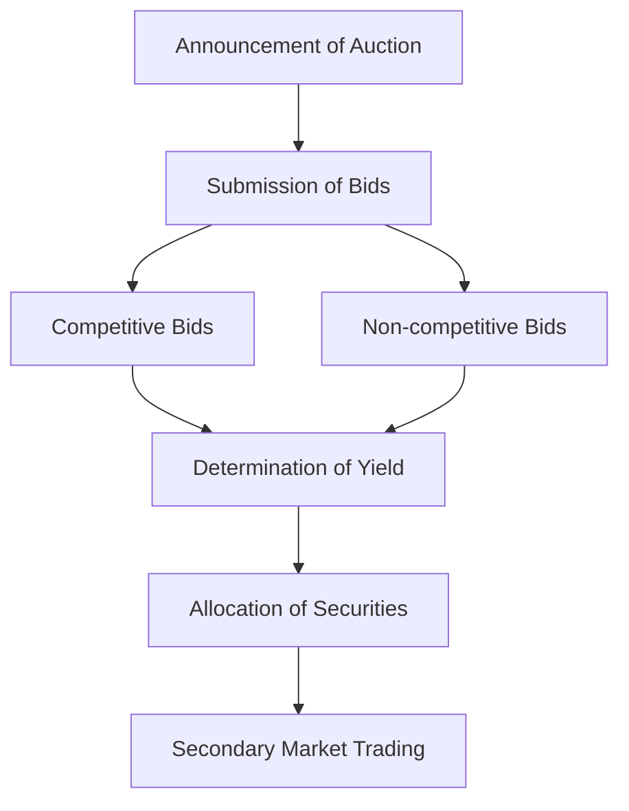

## 6.3.1 Features of Government of Canada Securities

Government of Canada securities are a cornerstone of the Canadian fixed-income market, offering investors a secure and predictable investment option. This section delves into the key characteristics of these securities, their market dynamics, and the implications for investors.

### Key Characteristics of Government of Canada Securities

#### Non-callable Nature

One of the defining features of Government of Canada securities is their non-callable nature. This means that once these bonds are issued, the government cannot redeem them before their maturity date. This characteristic provides a level of predictability and security for investors, as they can be assured of receiving interest payments until the bond matures, without the risk of early redemption. This feature is particularly attractive to risk-averse investors seeking stable income streams.

#### Auction and Secondary Market Processes

Government of Canada securities are initially sold through a well-structured auction process. The Bank of Canada conducts these auctions, where bonds are sold to the highest bidders. This process ensures transparency and fair pricing, reflecting current market conditions. There are two main types of auctions: competitive and non-competitive. In a competitive auction, bidders specify the yield they are willing to accept, while in a non-competitive auction, bidders agree to accept the yield determined by the auction.

Once issued, these securities can be traded in the secondary market, providing liquidity to investors. The secondary market allows investors to buy and sell existing securities, offering flexibility in managing their investment portfolios. The liquidity of Government of Canada securities is generally high, meaning they can be easily bought or sold without significantly affecting their price.

#### Secure Investment Option

Government of Canada securities are considered one of the safest investment options available. Backed by the full faith and credit of the Canadian government, they carry minimal default risk. This security makes them an attractive choice for conservative investors, such as pension funds and insurance companies, looking to preserve capital while earning a modest return.

### Impact of Interest Rate Changes

The prices and yields of Government of Canada securities are sensitive to changes in interest rates. When interest rates rise, the prices of existing bonds typically fall, as newer issues offer higher yields. Conversely, when interest rates decline, the prices of existing bonds tend to rise, as they offer more attractive yields compared to new issues. This inverse relationship is a fundamental concept in bond investing and is crucial for investors to understand when managing their portfolios.

#### Example: Interest Rate Impact

Consider a Government of Canada bond with a fixed coupon rate of 3%. If market interest rates rise to 4%, the bond's price will likely decrease because investors can obtain a better yield from newly issued bonds. Conversely, if market rates fall to 2%, the bond's price will increase, as its higher coupon rate becomes more attractive.

### Practical Applications and Strategies

Investors can leverage Government of Canada securities in various ways to achieve their financial goals. For instance, they can be used to:

- **Diversify Portfolios:** Including these securities in a portfolio can reduce overall risk due to their stability and low correlation with equities.
- **Hedge Against Inflation:** Inflation-linked bonds, such as Real Return Bonds, adjust their principal based on inflation rates, providing a hedge against inflationary pressures.
- **Generate Income:** The predictable interest payments from these securities can provide a steady income stream, ideal for retirees or income-focused investors.

### Diagram: Auction Process Flow

Below is a diagram illustrating the auction process for Government of Canada securities:

### Best Practices and Considerations

- **Monitor Interest Rates:** Stay informed about interest rate trends, as they significantly impact bond prices and yields.
- **Understand Market Conditions:** Be aware of economic indicators and government fiscal policies that may affect the demand for Government of Canada securities.
- **Diversify Across Maturities:** Consider holding a mix of short, medium, and long-term bonds to balance risk and return.

### Common Pitfalls

- **Ignoring Interest Rate Risk:** Failing to account for interest rate changes can lead to unexpected losses.
- **Overconcentration:** Relying too heavily on Government of Canada securities may limit growth potential, especially in a low-interest-rate environment.

### Conclusion

Government of Canada securities offer a reliable and secure investment option, characterized by their non-callable nature and robust market processes. Understanding their features and the impact of interest rate changes is crucial for making informed investment decisions. By incorporating these securities into a diversified portfolio, investors can achieve a balance of safety and income, tailored to their financial objectives.

## Quiz Time!



### What is a key feature of Government of Canada securities that provides predictability for investors?

- [x] Non-callable nature
- [ ] Callable nature
- [ ] Variable interest rates
- [ ] High default risk

> **Explanation:** The non-callable nature ensures that these securities cannot be redeemed before maturity, providing predictability for investors.

### How are Government of Canada securities initially sold?

- [x] Through an auction process
- [ ] Directly to investors
- [ ] Via stock exchanges
- [ ] Through private placements

> **Explanation:** Government of Canada securities are sold through an auction process conducted by the Bank of Canada.

### What happens to the price of a Government of Canada bond when interest rates rise?

- [x] The price decreases
- [ ] The price increases
- [ ] The price remains unchanged
- [ ] The price becomes volatile

> **Explanation:** When interest rates rise, the price of existing bonds typically decreases because new bonds offer higher yields.

### What is the role of the secondary market for Government of Canada securities?

- [x] To provide liquidity
- [ ] To issue new securities
- [ ] To determine interest rates
- [ ] To guarantee returns

> **Explanation:** The secondary market allows investors to buy and sell existing securities, providing liquidity.

### Which type of auction involves bidders specifying the yield they are willing to accept?

- [x] Competitive auction
- [ ] Non-competitive auction
- [ ] Open auction
- [ ] Sealed auction

> **Explanation:** In a competitive auction, bidders specify the yield they are willing to accept.

### Why are Government of Canada securities considered a secure investment option?

- [x] They are backed by the Canadian government
- [ ] They offer high returns
- [ ] They are traded on stock exchanges
- [ ] They have variable interest rates

> **Explanation:** These securities are backed by the full faith and credit of the Canadian government, minimizing default risk.

### What is a potential pitfall of investing heavily in Government of Canada securities?

- [x] Overconcentration
- [ ] High volatility
- [ ] Lack of liquidity
- [ ] High default risk

> **Explanation:** Overconcentration in these securities may limit growth potential, especially in a low-interest-rate environment.

### What is the impact of interest rate changes on bond yields?

- [x] Inverse relationship
- [ ] Direct relationship
- [ ] No relationship
- [ ] Variable relationship

> **Explanation:** There is an inverse relationship between interest rates and bond yields.

### What is a strategy for managing interest rate risk in a bond portfolio?

- [x] Diversify across maturities
- [ ] Invest only in long-term bonds
- [ ] Focus on high-yield bonds
- [ ] Avoid bonds altogether

> **Explanation:** Diversifying across maturities can help balance risk and return in a bond portfolio.

### True or False: Government of Canada securities can be redeemed before maturity.

- [ ] True
- [x] False

> **Explanation:** Government of Canada securities are non-callable, meaning they cannot be redeemed before maturity.


