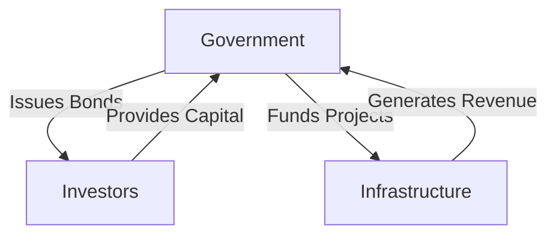

## 6.2 The Rationale for Issuing Fixed-Income Securities

Fixed-income securities, commonly known as bonds, are a cornerstone of the financial markets, providing a critical mechanism for both governments and corporations to raise capital. This section delves into the rationale behind issuing these securities, examining the motivations and benefits for both public and private entities.

### Government Issuance of Debt Securities

#### Financing Deficits

Governments often face situations where their expenditures exceed their revenues, leading to budget deficits. To bridge this gap, they issue debt securities, such as government bonds. This process, known as **deficit financing**, allows governments to maintain essential services and fund various initiatives without immediate tax increases.

For example, the Canadian government frequently issues bonds to manage its fiscal policy, ensuring that it can continue to provide healthcare, education, and infrastructure development. These bonds are attractive to investors due to their perceived safety and the backing of the government.

#### Funding Infrastructure Projects

Another significant reason for government bond issuance is to finance large-scale **infrastructure projects**. These projects, such as building highways, bridges, and public transit systems, require substantial upfront investment. By issuing bonds, governments can spread the cost over time, aligning the financial burden with the long-term benefits these projects provide.

Consider the construction of the Confederation Bridge in Canada, which was partly financed through government bonds. This approach allowed the government to undertake a massive infrastructure project without immediate budgetary constraints.

### Corporate Issuance of Bonds

#### Financing Operations and Growth

Corporations issue bonds to raise capital for various purposes, including financing day-to-day operations and funding growth initiatives. Unlike equity financing, which involves selling ownership stakes, debt financing through bonds allows companies to retain control while accessing necessary funds.

For instance, a company like Royal Bank of Canada (RBC) might issue bonds to finance the expansion of its digital banking services. This strategic move enables RBC to enhance its competitive position without diluting shareholder equity.

#### Leveraging and Financial Strategy

Debt financing offers corporations the advantage of **financial leverage**. By using borrowed funds to invest in profitable ventures, companies can amplify their returns on equity. However, this strategy also introduces additional risk, as the obligation to repay debt remains regardless of business performance.

A practical example is a manufacturing firm that issues bonds to invest in new technology, aiming to increase production efficiency. If successful, the enhanced profitability can outweigh the cost of debt, benefiting shareholders.

### Advantages of Debt Financing Over Equity Financing

#### Tax Benefits

One of the primary advantages of debt financing is the tax benefit associated with interest payments. In Canada, interest on debt is tax-deductible, reducing the overall tax burden for corporations. This makes debt an attractive option compared to equity, where dividends are paid from after-tax income.

#### Retention of Ownership Control

By opting for debt rather than equity, companies can raise capital without relinquishing ownership control. This is particularly important for businesses that wish to maintain strategic direction and decision-making authority within a concentrated group of stakeholders.

### Impact of Financial Leverage on Corporate Profitability and Risk

Financial leverage can significantly impact a company's profitability and risk profile. While leveraging can enhance returns during periods of growth, it also increases the company's exposure to financial distress in downturns. Therefore, companies must carefully balance the benefits of leverage with the associated risks.

### Practical Example: Canadian Pension Funds

Canadian pension funds, such as the Canada Pension Plan Investment Board (CPPIB), often invest in fixed-income securities to achieve stable returns. By understanding the rationale behind bond issuance, these funds can make informed decisions that align with their long-term investment strategies.

### Diagrams and Visual Aids

To further illustrate these concepts, consider the following diagram showing the flow of funds in a government bond issuance:

This diagram highlights the cyclical nature of bond issuance and its role in funding government initiatives.

### Best Practices and Common Pitfalls

- **Best Practices:** Governments and corporations should carefully assess their financing needs and market conditions before issuing bonds. Transparent communication with investors and adherence to regulatory requirements are crucial for successful bond issuance.
- **Common Pitfalls:** Over-reliance on debt can lead to financial instability. Both public and private entities must manage their debt levels prudently to avoid excessive leverage and potential default.

### References and Additional Resources

- **Canada Revenue Agency (CRA):** Guidelines on corporate financing and taxation ([www.canada.ca/en/revenue-agency.html](https://www.canada.ca/en/revenue-agency.html))
- **Canadian Bond Investors' Association:** Industry insights ([www.cbia-acob.ca](http://www.cbia-acob.ca))

For further exploration, consider reading "The Bond Book" by Annette Thau for a comprehensive understanding of bond markets and investment strategies.

### **Ready to Test Your Knowledge?**

**Practice 10 Essential CSC Exam Questions to Master Your Certification**



### Why do governments issue debt securities?

- [x] To finance budget deficits
- [ ] To increase equity
- [ ] To reduce taxes
- [ ] To decrease spending

> **Explanation:** Governments issue debt securities to finance budget deficits, allowing them to cover expenses that exceed their revenues.

### What is a primary reason corporations issue bonds?

- [x] To finance operations and growth
- [ ] To reduce debt
- [ ] To increase equity
- [ ] To lower taxes

> **Explanation:** Corporations issue bonds primarily to finance operations and growth initiatives without diluting ownership.

### What is a benefit of debt financing over equity financing?

- [x] Tax-deductible interest payments
- [ ] Increased shareholder control
- [ ] Higher dividend payouts
- [ ] Reduced financial risk

> **Explanation:** Debt financing offers the benefit of tax-deductible interest payments, reducing the overall tax burden for corporations.

### What is financial leverage?

- [x] Using borrowed funds to increase potential returns
- [ ] Selling equity to raise capital
- [ ] Reducing operational costs
- [ ] Increasing tax liabilities

> **Explanation:** Financial leverage involves using borrowed funds to invest in profitable ventures, potentially increasing returns on equity.

### What is deficit financing?

- [x] Government borrowing to cover expenses exceeding revenue
- [ ] Corporate borrowing to expand operations
- [x] Issuing equity to raise capital
- [ ] Reducing government spending

> **Explanation:** Deficit financing refers to government borrowing to cover expenses that exceed revenue, often through issuing bonds.

### What is a common pitfall of excessive leverage?

- [x] Increased financial risk
- [ ] Reduced tax benefits
- [ ] Higher equity dilution
- [ ] Lower interest rates

> **Explanation:** Excessive leverage can lead to increased financial risk, as the obligation to repay debt remains regardless of business performance.

### How can governments fund infrastructure projects?

- [x] By issuing bonds
- [ ] By increasing taxes
- [x] By reducing spending
- [ ] By selling equity

> **Explanation:** Governments often issue bonds to fund large-scale infrastructure projects, spreading the cost over time.

### What is the impact of financial leverage on risk?

- [x] It increases risk
- [ ] It decreases risk
- [ ] It has no impact on risk
- [ ] It eliminates risk

> **Explanation:** Financial leverage increases risk, as companies must repay debt regardless of their financial performance.

### What is a key advantage of retaining ownership control?

- [x] Strategic decision-making remains with original stakeholders
- [ ] Increased tax liabilities
- [ ] Higher interest payments
- [ ] Reduced operational efficiency

> **Explanation:** Retaining ownership control allows original stakeholders to maintain strategic decision-making authority.

### True or False: Interest payments on debt are tax-deductible in Canada.

- [x] True
- [ ] False

> **Explanation:** In Canada, interest payments on debt are tax-deductible, providing a financial advantage to companies using debt financing.


