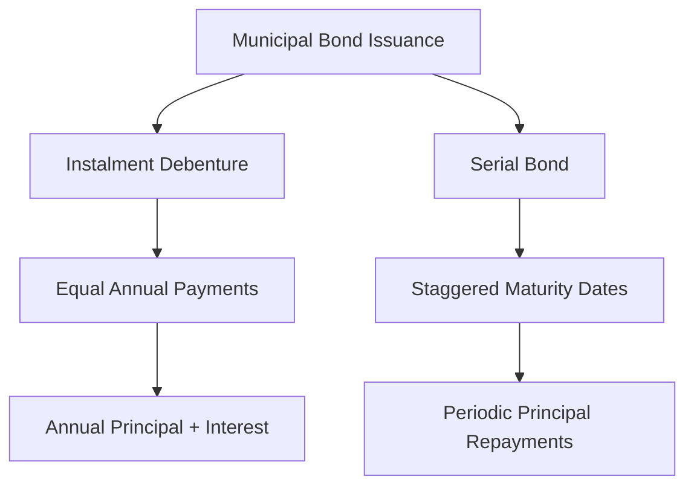

## 6.4.1 Features of Provincial and Municipal Bonds

Provincial and municipal bonds are critical components of the Canadian fixed-income market, offering investors a range of opportunities to diversify their portfolios while supporting local government projects. Understanding the features of these bonds, including their credit quality, risk, and types, is essential for making informed investment decisions. This section delves into the intricacies of provincial and municipal bonds, providing insights into their unique characteristics and their role in the broader financial landscape.

### Credit Quality and Risk

#### Factors Influencing Credit Ratings

The credit quality of provincial and municipal bonds is a key consideration for investors, as it directly impacts the perceived risk and potential return of these securities. Several factors influence the credit ratings of these bonds:

1. **Economic Diversity**: Provinces and municipalities with diverse economies tend to have higher credit ratings. Economic diversity reduces reliance on a single industry, mitigating the impact of sector-specific downturns. For example, Ontario's diverse economy, which includes finance, manufacturing, and technology, contributes to its strong credit rating.

2. **Government Stability**: Political stability and effective governance are crucial for maintaining high credit ratings. Stable governments are more likely to implement sound fiscal policies and manage debt responsibly, enhancing investor confidence.

3. **Revenue Generation**: The ability of a province or municipality to generate revenue through taxes and other means is a significant factor in credit ratings. Regions with robust revenue streams are better positioned to meet their debt obligations.

4. **Debt Levels**: The existing debt burden of a province or municipality affects its credit rating. High levels of debt relative to revenue can lead to downgrades, as they indicate potential difficulties in servicing new or existing debt.

#### Role of Provincial Guarantees

Provincial governments often provide guarantees on bonds issued by provincial authorities, enhancing their credit quality. A **Guaranteed Bond** is one where the provincial government assures the repayment of principal and interest, reducing the risk for investors. This guarantee can lead to higher credit ratings and lower borrowing costs for the issuing authority.

### Types of Municipal Bonds

Municipal bonds come in various forms, each with distinct features that cater to different investor needs and municipal financing strategies. Two common types are instalment debentures and serial bonds.

#### Instalment Debentures

Instalment debentures are a popular tool for municipalities to manage debt repayments effectively. These bonds allow municipalities to repay debt in instalments over time, rather than in a lump sum at maturity. This structured repayment schedule helps municipalities align debt service with their cash flow, reducing the financial strain of large, one-time payments.

**Example**: A Canadian city issues an instalment debenture to finance a new public transit project. The bond is structured to repay a portion of the principal annually, along with interest, over a 10-year period. This approach allows the city to manage its budget more effectively while ensuring steady progress on the project.

#### Serial Bonds

A **Serial Bond** is issued with multiple maturity dates, allowing for partial repayments over a period. This structure provides flexibility for both issuers and investors, as it enables municipalities to stagger debt repayments and investors to receive periodic principal repayments.

**Comparison with Instalment Debentures**: While both instalment debentures and serial bonds offer structured repayment schedules, they differ in execution. Instalment debentures typically involve equal annual payments, whereas serial bonds have varying principal amounts maturing at different times. This distinction allows municipalities to tailor their debt management strategies to their specific financial situations.

### Practical Financial Examples and Case Studies

To illustrate the application of these concepts, consider the following real-world scenarios:

- **Case Study: Ontario's Green Bond Program**: Ontario has successfully issued green bonds to finance environmentally friendly projects. These bonds, often backed by provincial guarantees, attract investors seeking sustainable investment opportunities while benefiting from the province's strong credit rating.

- **Example: City of Toronto's Infrastructure Bonds**: Toronto frequently issues municipal bonds to fund infrastructure projects. By utilizing instalment debentures, the city can manage its debt service efficiently, ensuring that essential projects like road improvements and public transit expansions are adequately funded.

### Diagrams and Visual Aids

To enhance understanding, consider the following diagram illustrating the repayment structure of instalment debentures and serial bonds:

### Best Practices and Common Challenges

Investors and municipalities alike should be aware of best practices and potential challenges when dealing with provincial and municipal bonds:

- **Best Practices**: Diversify bond holdings across different provinces and municipalities to mitigate risk. Consider the credit quality and economic outlook of the issuing region before investing.

- **Common Challenges**: Economic downturns or political instability can negatively impact credit ratings, affecting bond prices and yields. Investors should stay informed about regional developments and adjust their portfolios accordingly.

### Conclusion

Provincial and municipal bonds offer valuable opportunities for investors seeking stable, income-generating assets. By understanding the features of these bonds, including credit quality, risk factors, and types, investors can make informed decisions that align with their financial goals. As the Canadian financial landscape continues to evolve, staying informed about these securities will be crucial for successful investment strategies.

## Quiz Time!



### Which factor is NOT typically considered when assessing the credit quality of provincial and municipal bonds?

- [ ] Economic diversity
- [ ] Government stability
- [x] Weather patterns
- [ ] Revenue generation

> **Explanation:** Weather patterns are not typically considered when assessing the credit quality of bonds, whereas economic diversity, government stability, and revenue generation are key factors.

### What is a Guaranteed Bond?

- [x] A bond where the provincial government guarantees the repayment of principal and interest
- [ ] A bond with no guarantee of repayment
- [ ] A bond issued by a private corporation
- [ ] A bond that matures in one year

> **Explanation:** A Guaranteed Bond is one where the provincial government assures the repayment of principal and interest, reducing risk for investors.

### How do instalment debentures benefit municipalities?

- [x] By allowing debt repayments in instalments over time
- [ ] By requiring a lump sum payment at maturity
- [ ] By offering no interest payments
- [ ] By providing tax-free income

> **Explanation:** Instalment debentures allow municipalities to repay debt in instalments over time, aligning debt service with cash flow.

### What is a Serial Bond?

- [x] A bond issued with multiple maturity dates, allowing partial repayments over a period
- [ ] A bond that matures in one year
- [ ] A bond with no interest payments
- [ ] A bond guaranteed by a corporation

> **Explanation:** A Serial Bond is issued with multiple maturity dates, allowing for partial repayments over a period.

### Which of the following is a key difference between instalment debentures and serial bonds?

- [x] Instalment debentures involve equal annual payments, while serial bonds have varying principal amounts maturing at different times.
- [ ] Instalment debentures are tax-free, while serial bonds are not.
- [ ] Serial bonds are guaranteed by the federal government, while instalment debentures are not.
- [ ] Instalment debentures have no interest payments, while serial bonds do.

> **Explanation:** Instalment debentures involve equal annual payments, while serial bonds have varying principal amounts maturing at different times.

### What is a common challenge when investing in provincial and municipal bonds?

- [x] Economic downturns can negatively impact credit ratings.
- [ ] Bonds are always tax-free.
- [ ] Bonds have no maturity dates.
- [ ] Bonds are guaranteed to increase in value.

> **Explanation:** Economic downturns can negatively impact credit ratings, affecting bond prices and yields.

### How can investors mitigate risk when investing in provincial and municipal bonds?

- [x] By diversifying bond holdings across different provinces and municipalities
- [ ] By investing only in bonds from one province
- [ ] By avoiding bonds with high credit ratings
- [ ] By investing solely in corporate bonds

> **Explanation:** Diversifying bond holdings across different provinces and municipalities can help mitigate risk.

### What role do provincial guarantees play in bond issuance?

- [x] They enhance credit quality by assuring repayment of principal and interest.
- [ ] They eliminate the need for interest payments.
- [ ] They reduce the maturity period of bonds.
- [ ] They increase the tax rate on bonds.

> **Explanation:** Provincial guarantees enhance credit quality by assuring repayment of principal and interest, reducing risk for investors.

### Which of the following is an example of a real-world application of municipal bonds?

- [x] Toronto issuing bonds to fund infrastructure projects
- [ ] A private company issuing bonds for expansion
- [ ] A federal government bond issuance
- [ ] A bond issued by a foreign government

> **Explanation:** Toronto issuing bonds to fund infrastructure projects is an example of a real-world application of municipal bonds.

### True or False: Instalment debentures typically involve equal annual payments.

- [x] True
- [ ] False

> **Explanation:** Instalment debentures typically involve equal annual payments, allowing for structured debt management.


