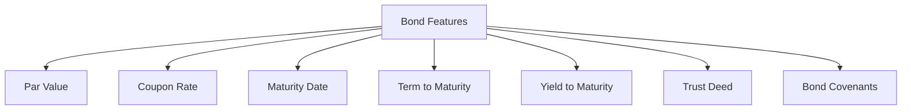

## 6.3 The Basic Features and Terminology of Fixed-Income Securities

Fixed-income securities, such as bonds and debentures, are fundamental components of the financial markets. They provide a predictable income stream and are crucial for both individual and institutional investors. This section delves into the basic features and terminology associated with these securities, offering insights into their structure, legal aspects, and practical applications within the Canadian context.

### Key Bond Terms

Understanding the basic terminology of bonds is essential for navigating the fixed-income market. Here are the key terms you need to know:

#### Par Value (Face Value)

The par value, or face value, of a bond is the amount that the issuer agrees to repay the bondholder at maturity. Typically set at $1,000 for corporate bonds, this value serves as the basis for calculating interest payments. For example, if you purchase a bond with a par value of $1,000 and a coupon rate of 5%, you will receive $50 in interest annually.

#### Coupon Rate

The coupon rate is the annual interest rate paid on a bond's par value. It determines the periodic interest payments made to bondholders. For instance, a bond with a 4% coupon rate and a $1,000 par value will pay $40 in interest each year. The coupon rate can be fixed or variable, impacting the bond's appeal in different interest rate environments.

#### Maturity Date

The maturity date is when the bond's principal is repaid to investors. Bonds can have short, medium, or long-term maturities, ranging from a few months to several decades. The maturity date is crucial for investors, as it influences the bond's interest rate risk and potential return.

#### Term to Maturity

The term to maturity refers to the remaining lifespan of a bond until it matures. It is a critical factor in assessing a bond's risk and return profile. Generally, longer-term bonds are more sensitive to interest rate changes, affecting their market value.

### How Bonds and Debentures Function as Debt Instruments

Bonds and debentures are both debt instruments, but they differ in terms of security and risk. Here's how they function:

- **Bonds** are typically secured by specific assets or collateral, providing an additional layer of security for investors. This makes them less risky compared to debentures. For example, a mortgage bond might be secured by real estate assets.

- **Debentures**, on the other hand, are unsecured and rely on the issuer's creditworthiness. They carry a higher risk, often resulting in higher interest rates to compensate investors. Canadian corporations frequently issue debentures to raise capital without pledging specific assets.

### Legal Aspects of Bond Issuance

The issuance of bonds involves several legal components, ensuring the protection of both issuers and investors. Key legal aspects include:

#### Trust Deed

A trust deed is a legal document outlining the terms and conditions of a bond issue. It specifies the rights and obligations of the issuer and bondholders, including interest payment schedules, maturity dates, and any covenants. The trust deed is crucial for maintaining transparency and accountability in bond transactions.

#### Bond Covenants

Bond covenants are clauses within the trust deed that impose certain restrictions or obligations on the issuer. They can be affirmative (requiring specific actions) or negative (restricting certain actions). For instance, a covenant might require the issuer to maintain a minimum level of working capital or restrict additional borrowing. These covenants protect bondholders by ensuring the issuer's financial stability.

### Secured Bonds vs. Unsecured Debentures

The distinction between secured bonds and unsecured debentures is vital for assessing risk and return:

- **Secured Bonds**: Backed by collateral, secured bonds offer greater protection to investors. In the event of default, bondholders have a claim on the pledged assets. This security often results in lower interest rates compared to unsecured debentures.

- **Unsecured Debentures**: Without collateral backing, debentures depend on the issuer's creditworthiness. They are riskier, leading to higher interest rates to attract investors. Debentures are common in corporate finance, where companies leverage their reputation to raise funds.

### Practical Examples and Case Studies

To illustrate these concepts, consider the following examples:

#### Example 1: Canadian Pension Fund Investment

A Canadian pension fund might invest in a mix of government and corporate bonds to achieve a stable income stream. By analyzing the par value, coupon rate, and maturity date, the fund can align its investments with its long-term liabilities, ensuring sufficient cash flow for pension payouts.

#### Example 2: Major Canadian Bank Bond Issuance

A major Canadian bank, such as RBC, may issue secured bonds to finance its operations. The trust deed will outline the terms, including bond covenants that restrict excessive risk-taking. Investors can assess the bank's credit rating and the bond's collateral to determine the investment's suitability.

### Diagrams and Visual Aids

To enhance understanding, consider the following diagram illustrating the relationship between bond features:

### Best Practices and Common Pitfalls

When investing in fixed-income securities, consider these best practices:

- **Diversification**: Spread investments across different issuers and maturities to mitigate risk.
- **Credit Analysis**: Evaluate the issuer's creditworthiness to assess default risk.
- **Interest Rate Sensitivity**: Understand how interest rate changes impact bond prices, especially for long-term bonds.

Common pitfalls include:

- **Ignoring Credit Risk**: Failing to assess the issuer's financial health can lead to unexpected losses.
- **Overconcentration**: Investing too heavily in a single issuer or sector increases risk exposure.

### References and Further Reading

For more information on Canadian fixed-income securities, consider the following resources:

- **IIROC Debt Market Regulation**: [www.iiroc.ca](https://www.iiroc.ca)
- **Bank of Canada Glossary**: [www.bankofcanada.ca/terms](https://www.bankofcanada.ca/terms)

These resources provide comprehensive insights into regulatory frameworks and financial terminology, enhancing your understanding of the Canadian fixed-income market.

### Conclusion

Understanding the basic features and terminology of fixed-income securities is crucial for making informed investment decisions. By grasping the nuances of bonds and debentures, investors can effectively navigate the Canadian financial landscape, optimizing their portfolios for stability and growth.

### **Ready to Test Your Knowledge?**

**Practice 10 Essential CSC Exam Questions to Master Your Certification**



### What is the par value of a bond?

- [x] The amount the issuer agrees to repay at maturity
- [ ] The annual interest payment
- [ ] The market price of the bond
- [ ] The bond's yield to maturity

> **Explanation:** The par value, or face value, is the amount the issuer agrees to repay at maturity.

### Which term describes the annual interest rate paid on a bond's par value?

- [x] Coupon rate
- [ ] Yield to maturity
- [ ] Par value
- [ ] Maturity date

> **Explanation:** The coupon rate is the annual interest rate paid on a bond's par value.

### What is the significance of a bond's maturity date?

- [x] It is the date on which the bond's principal is repaid to investors
- [ ] It determines the bond's coupon rate
- [ ] It indicates the bond's market value
- [ ] It affects the bond's par value

> **Explanation:** The maturity date is when the bond's principal is repaid to investors.

### How do secured bonds differ from unsecured debentures?

- [x] Secured bonds are backed by collateral, while unsecured debentures are not
- [ ] Secured bonds have higher interest rates than unsecured debentures
- [ ] Secured bonds are issued by governments, while debentures are issued by corporations
- [ ] Secured bonds are riskier than unsecured debentures

> **Explanation:** Secured bonds are backed by collateral, providing more security than unsecured debentures.

### What is a trust deed in the context of bond issuance?

- [x] A legal document outlining the terms and conditions of a bond issue
- [ ] A certificate of bond ownership
- [ ] A document specifying the bond's coupon rate
- [ ] A record of bond transactions

> **Explanation:** A trust deed is a legal document outlining the terms and conditions of a bond issue.

### Which factor influences a bond's interest rate risk?

- [x] Term to maturity
- [ ] Par value
- [ ] Coupon rate
- [ ] Trust deed

> **Explanation:** The term to maturity influences a bond's interest rate risk, with longer terms generally being more sensitive.

### What is a bond covenant?

- [x] A clause imposing restrictions or obligations on the issuer
- [ ] A document certifying bond ownership
- [ ] A type of secured bond
- [ ] A measure of a bond's yield to maturity

> **Explanation:** A bond covenant is a clause imposing restrictions or obligations on the issuer.

### Why might a Canadian pension fund invest in bonds?

- [x] To achieve a stable income stream
- [ ] To speculate on currency fluctuations
- [ ] To increase exposure to equity markets
- [ ] To hedge against inflation

> **Explanation:** A Canadian pension fund might invest in bonds to achieve a stable income stream.

### What is the primary risk associated with debentures?

- [x] Credit risk due to lack of collateral
- [ ] Inflation risk
- [ ] Currency risk
- [ ] Liquidity risk

> **Explanation:** The primary risk associated with debentures is credit risk due to lack of collateral.

### True or False: The coupon rate of a bond can be variable.

- [x] True
- [ ] False

> **Explanation:** The coupon rate of a bond can be variable, adjusting with changes in interest rates.


