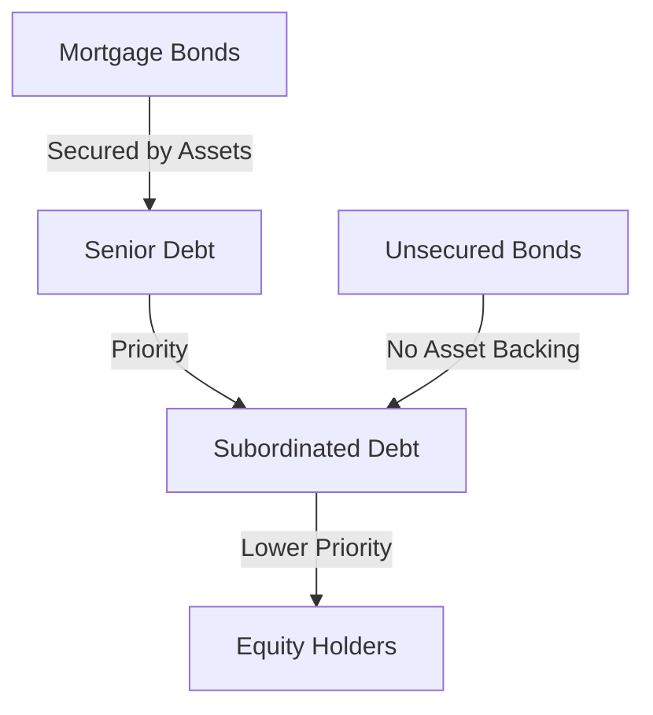

## 6.5.1 Features of Different Corporate Bonds

Corporate bonds are a critical component of the fixed-income market, offering a variety of features that cater to different investment strategies and risk appetites. In this section, we will delve into the characteristics of various types of corporate bonds, including mortgage bonds, floating-rate securities, subordinated debentures, and high-yield bonds. We will also explore protective features such as covenants, callable, and convertible options, which play a significant role in bond pricing and investment decisions.

### Types of Corporate Bonds

#### Mortgage Bonds

Mortgage bonds are secured by specific assets of the issuing corporation, providing an additional layer of security for bondholders. These bonds are backed by tangible assets such as real estate or equipment, which can be liquidated to satisfy bondholder claims in the event of default. This security typically results in lower yields compared to unsecured bonds, reflecting the reduced risk.

**Example:** Consider a Canadian real estate company issuing mortgage bonds secured by its portfolio of commercial properties. In the event of financial distress, bondholders have a claim on these properties, offering a safety net that enhances the bond's appeal to conservative investors.

#### Floating-Rate Securities

Floating-rate securities, also known as variable-rate bonds, have interest payments that adjust periodically based on a benchmark rate, such as the Canadian Overnight Repo Rate Average (CORRA). This feature protects investors from interest rate risk, as the bond's yield adjusts in response to market conditions.

**Example:** A Canadian bank might issue a floating-rate bond with interest payments tied to the CORRA. As interest rates rise, the bond's coupon payments increase, maintaining its attractiveness to investors seeking protection against inflation.

#### Subordinated Debentures

Subordinated debentures are unsecured bonds that rank below other debts in terms of claims on assets. Due to their lower priority, they offer higher yields to compensate for the increased risk. These bonds are often used by companies to raise capital without diluting equity.

**Example:** A telecommunications company in Canada might issue subordinated debentures to finance network expansion. Investors are attracted by the higher yields, but they must weigh the risk of lower recovery in case of bankruptcy.

#### High-Yield Bonds

High-yield bonds, often referred to as "junk bonds," are speculative-grade securities offering higher returns to compensate for greater credit risk. These bonds are typically issued by companies with lower credit ratings, making them suitable for investors with a higher risk tolerance.

**Example:** A Canadian startup in the technology sector might issue high-yield bonds to fund research and development. While the potential returns are attractive, investors must consider the company's financial stability and growth prospects.

### Protective Features

#### Protective Covenants

Protective covenants are clauses in the bond indenture designed to safeguard bondholder interests by restricting issuer behavior. These covenants can be affirmative, requiring the issuer to maintain certain financial ratios, or negative, prohibiting actions like taking on additional debt.

**Example:** A Canadian manufacturing firm might include covenants in its bond issuance that limit dividend payments to preserve cash flow for debt servicing. This reassures bondholders of the company's commitment to financial stability.

#### Callable and Convertible Features

**Callable Bonds:** Callable bonds give the issuer the right to redeem the bond before its maturity date at a predetermined price. This feature allows issuers to refinance debt if interest rates decline, but it introduces reinvestment risk for investors.

**Example:** A Canadian utility company might issue callable bonds to take advantage of falling interest rates. Investors benefit from higher initial yields but face the risk of early redemption.

**Convertible Bonds:** Convertible bonds offer the option to convert the bond into a predetermined number of the issuer's equity shares. This feature provides potential upside if the company's stock performs well, combining the benefits of fixed income and equity.

**Example:** A Canadian biotech firm might issue convertible bonds to attract investors interested in participating in the company's growth. The conversion feature adds value, especially if the company's stock price appreciates significantly.

### Glossary

- **Floating-Rate Security:** A bond with interest payments that vary based on a reference rate.
- **Senior Debt:** Debt that has priority over other unsecured or subordinated debt.
- **Convertible Bond:** A bond that can be converted into a predetermined number of the issuer’s equity shares.
- **Callable Bond:** A bond that can be redeemed by the issuer before its maturity date at a set price.

### Practical Application and Strategy

Investors should carefully assess the features of corporate bonds to align with their investment objectives and risk tolerance. For instance, conservative investors may prefer mortgage bonds for their security, while those seeking higher returns might explore high-yield bonds. Understanding protective covenants and callable or convertible features is crucial for managing risks and optimizing portfolio performance.

### Diagrams and Visuals

To enhance understanding, consider the following diagram illustrating the hierarchy of debt claims in the event of a company's liquidation:

### Conclusion

Corporate bonds offer a diverse range of features that cater to different investment strategies and risk profiles. By understanding the nuances of mortgage bonds, floating-rate securities, subordinated debentures, and high-yield bonds, investors can make informed decisions that align with their financial goals. Protective features such as covenants, callable, and convertible options further enhance the strategic value of corporate bonds in a well-diversified portfolio.

## Quiz Time!



### Which type of bond is secured by specific assets of the issuing corporation?

- [x] Mortgage Bonds
- [ ] Floating-Rate Securities
- [ ] Subordinated Debentures
- [ ] High-Yield Bonds

> **Explanation:** Mortgage bonds are secured by specific assets, providing additional security for bondholders.

### What feature of floating-rate securities protects investors from interest rate risk?

- [x] Variable interest rates based on a benchmark rate
- [ ] Fixed interest rates
- [ ] Asset backing
- [ ] Conversion to equity

> **Explanation:** Floating-rate securities have variable interest rates that adjust based on a benchmark rate, protecting investors from interest rate risk.

### Which type of bond offers higher yields due to its lower priority in claims?

- [ ] Mortgage Bonds
- [ ] Floating-Rate Securities
- [x] Subordinated Debentures
- [ ] High-Yield Bonds

> **Explanation:** Subordinated debentures offer higher yields because they have a lower priority in claims compared to senior debt.

### What is a key characteristic of high-yield bonds?

- [ ] Secured by assets
- [ ] Low credit risk
- [x] Speculative-grade with higher returns
- [ ] Fixed interest rates

> **Explanation:** High-yield bonds are speculative-grade securities offering higher returns to compensate for greater credit risk.

### What is the purpose of protective covenants in bond indentures?

- [x] To safeguard bondholder interests by restricting issuer behavior
- [ ] To increase bond yields
- [ ] To provide asset backing
- [ ] To allow early redemption

> **Explanation:** Protective covenants are clauses designed to safeguard bondholder interests by restricting issuer behavior.

### What risk do callable bonds introduce for investors?

- [ ] Credit risk
- [ ] Interest rate risk
- [x] Reinvestment risk
- [ ] Inflation risk

> **Explanation:** Callable bonds introduce reinvestment risk, as the issuer can redeem the bond early, forcing investors to reinvest at potentially lower rates.

### What benefit do convertible bonds offer to investors?

- [x] Potential upside from converting to equity
- [ ] Fixed interest payments
- [ ] Asset backing
- [ ] Early redemption

> **Explanation:** Convertible bonds offer the potential upside of converting to equity, allowing investors to benefit from stock price appreciation.

### In the event of a company's liquidation, which debt has the highest priority?

- [x] Senior Debt
- [ ] Subordinated Debt
- [ ] Equity Holders
- [ ] Convertible Bonds

> **Explanation:** Senior debt has the highest priority in the event of a company's liquidation.

### What is a common feature of mortgage bonds?

- [ ] Variable interest rates
- [x] Secured by specific assets
- [ ] High yields
- [ ] Conversion to equity

> **Explanation:** Mortgage bonds are secured by specific assets, providing additional security for bondholders.

### True or False: High-yield bonds are also known as "junk bonds."

- [x] True
- [ ] False

> **Explanation:** High-yield bonds are often referred to as "junk bonds" due to their speculative-grade nature and higher credit risk.


