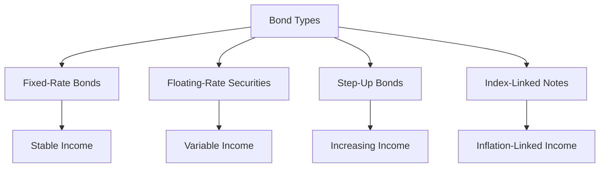

## 6.4 Interest on Bonds

Understanding how interest payments work for bonds is crucial for anyone involved in fixed-income securities. This section will delve into the mechanics of interest payments, focusing on semi-annual coupon payments, and explore variations such as fixed-rate, floating-rate, and step-up bonds. Additionally, we will introduce index-linked notes and discuss how these payment structures impact bond valuation.

### How Interest Payments Work for Fixed-Income Securities

Bonds are a type of fixed-income security that pay interest to investors, typically in the form of coupon payments. These payments are usually made semi-annually, meaning bondholders receive interest twice a year. The coupon payment is calculated based on the bond's coupon rate and its face value.

#### Semi-Annual Coupon Payments

In Canada, most bonds pay interest semi-annually. For example, if you hold a bond with a face value of $1,000 and a coupon rate of 5%, you would receive $25 every six months. This is calculated as:

 \text{Coupon Payment} = \frac{\text{Coupon Rate} \times \text{Face Value}}{2} 

This regular income stream is one of the key attractions of investing in bonds, providing predictable cash flow.

### Variations in Interest Payment Structures

Interest payment structures can vary significantly among different types of bonds. Understanding these variations is essential for making informed investment decisions.

#### Fixed-Rate Bonds

Fixed-rate bonds have a set coupon rate that remains constant throughout the bond's life. This predictability makes them attractive to investors seeking stable income. For instance, a 10-year Government of Canada bond with a 3% coupon rate will pay 3% of its face value annually, regardless of changes in market interest rates.

#### Floating-Rate Securities

Floating-rate securities, also known as variable-rate bonds, have interest payments that fluctuate with market benchmarks, such as the Canadian Dollar Offered Rate (CDOR). These bonds are appealing in rising interest rate environments, as their payments increase with the benchmark rate. For example, a floating-rate bond might pay interest at CDOR plus 1%.

#### Step-Up Bonds

Step-up bonds feature a coupon rate that increases at predetermined intervals. This structure benefits investors by providing higher income over time, often aligning with inflation or anticipated interest rate hikes. For example, a step-up bond might start with a 2% coupon rate, increasing to 3% after five years.

### Introduction to Index-Linked Notes

Index-linked notes, such as Real Return Bonds (RRBs) in Canada, offer returns tied to a specific index, often related to inflation. These bonds adjust their principal and interest payments based on changes in the Consumer Price Index (CPI), protecting investors from inflation risk. For instance, if inflation rises by 2%, both the principal and interest payments on an RRB would increase accordingly.

### Impact of Interest Payment Frequency and Structure on Bond Valuation

The frequency and structure of interest payments significantly affect a bond's valuation. Bonds with more frequent payments, like semi-annual coupons, are generally more attractive to investors, as they provide more regular income. Additionally, the structure of interest payments influences a bond's sensitivity to interest rate changes, known as duration.

#### Valuation Example

Consider two bonds with identical face values and maturities, but one is a fixed-rate bond, and the other is a floating-rate bond. In a rising interest rate environment, the floating-rate bond may be valued higher due to its increasing coupon payments, while the fixed-rate bond's value might decline as its payments become less attractive compared to new issues.

### Practical Examples and Case Studies

#### Canadian Pension Funds

Canadian pension funds often invest in a mix of fixed-rate and floating-rate bonds to balance income stability and interest rate risk. For example, a pension fund might hold a portfolio with 60% fixed-rate bonds for stable income and 40% floating-rate bonds to hedge against rising rates.

#### Major Canadian Banks

Banks like RBC and TD use step-up bonds as part of their investment strategies to align with anticipated interest rate trends. By gradually increasing coupon rates, these bonds help banks manage their interest income over time.

### Diagrams and Visual Aids

Below is a diagram illustrating the relationship between different bond types and their interest payment structures:

### Best Practices and Common Pitfalls

- **Best Practices:**
  - Diversify bond holdings across different interest payment structures to manage risk.
  - Monitor economic indicators, such as inflation and interest rates, to adjust bond portfolios accordingly.

- **Common Pitfalls:**
  - Over-reliance on fixed-rate bonds in a rising interest rate environment can lead to decreased portfolio value.
  - Ignoring inflation risk when investing in long-term fixed-income securities.

### References and Additional Resources

- **Bank of Canada:** Information on Real Return Bonds ([www.bankofcanada.ca](https://www.bankofcanada.ca))
- **Financial Consumer Agency of Canada (FCAC):** Guides on investment products ([www.canada.ca/en/financial-consumer-agency.html](https://www.canada.ca/en/financial-consumer-agency.html))

### Summary

Understanding the nuances of interest payments on bonds is essential for effective fixed-income investing. By exploring different payment structures and their impact on bond valuation, investors can make informed decisions that align with their financial goals and market conditions.

### **Ready to Test Your Knowledge?**

**Practice 10 Essential CSC Exam Questions to Master Your Certification**



### What is the typical frequency of coupon payments for most bonds in Canada?

- [x] Semi-annually
- [ ] Annually
- [ ] Quarterly
- [ ] Monthly

> **Explanation:** Most bonds in Canada pay interest semi-annually, providing investors with regular income twice a year.

### Which type of bond has a coupon rate that remains constant throughout its life?

- [x] Fixed-rate bond
- [ ] Floating-rate security
- [ ] Step-up bond
- [ ] Index-linked note

> **Explanation:** Fixed-rate bonds have a set coupon rate that does not change over the life of the bond, offering predictable income.

### What is a key feature of floating-rate securities?

- [ ] Fixed interest payments
- [x] Interest payments that fluctuate with market benchmarks
- [ ] Increasing coupon rates at predetermined intervals
- [ ] Returns tied to a specific index

> **Explanation:** Floating-rate securities have interest payments that vary based on market benchmarks, such as the CDOR.

### How do step-up bonds benefit investors?

- [ ] By providing fixed income
- [x] By offering increasing income over time
- [ ] By linking returns to inflation
- [ ] By fluctuating with market rates

> **Explanation:** Step-up bonds have coupon rates that increase at predetermined intervals, providing higher income over time.

### What is an index-linked note?

- [ ] A bond with a fixed coupon rate
- [ ] A bond with a fluctuating interest rate
- [ ] A bond with increasing coupon rates
- [x] A bond whose returns are tied to a specific index

> **Explanation:** Index-linked notes, such as Real Return Bonds, have returns tied to an index, often related to inflation.

### How does the frequency of interest payments affect bond valuation?

- [x] More frequent payments generally increase a bond's attractiveness
- [ ] Less frequent payments increase a bond's attractiveness
- [ ] Frequency has no impact on valuation
- [ ] Only annual payments affect valuation

> **Explanation:** Bonds with more frequent payments, like semi-annual coupons, are generally more attractive due to regular income.

### In a rising interest rate environment, which bond type might be valued higher?

- [ ] Fixed-rate bond
- [x] Floating-rate bond
- [ ] Step-up bond
- [ ] Index-linked note

> **Explanation:** Floating-rate bonds may be valued higher in rising interest rate environments due to increasing coupon payments.

### What is a common pitfall when investing in fixed-rate bonds?

- [ ] Over-reliance on floating-rate securities
- [x] Over-reliance in a rising interest rate environment
- [ ] Ignoring inflation risk
- [ ] Diversifying bond holdings

> **Explanation:** Over-reliance on fixed-rate bonds in a rising interest rate environment can lead to decreased portfolio value.

### Which Canadian institution provides information on Real Return Bonds?

- [x] Bank of Canada
- [ ] Financial Consumer Agency of Canada
- [ ] Canada Revenue Agency
- [ ] Investment Industry Regulatory Organization of Canada

> **Explanation:** The Bank of Canada provides information on Real Return Bonds, which are index-linked notes.

### True or False: Step-up bonds have a coupon rate that decreases over time.

- [ ] True
- [x] False

> **Explanation:** Step-up bonds have a coupon rate that increases at predetermined intervals, not decreases.


