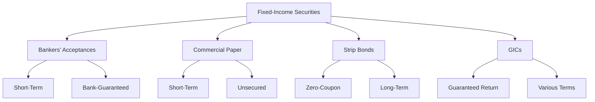

## 6.6 Other Fixed-Income Securities

In the realm of fixed-income securities, traditional bonds often take the spotlight. However, a diverse array of other fixed-income instruments plays a crucial role in financial markets, offering unique features and benefits. This section explores bankers’ acceptances, commercial paper, strip bonds, and Guaranteed Investment Certificates (GICs), providing insights into their characteristics, uses, and implications for investors.

### Bankers’ Acceptances

**Definition and Features:**

A Bankers’ Acceptance (BA) is a short-term credit investment instrument issued by a firm and guaranteed by a commercial bank. Typically used in international trade, BAs are considered low-risk investments due to the bank's guarantee. They are often used by companies to finance imports and exports, providing a reliable payment mechanism.

**Role in Financial Markets:**

BAs are traded in the money market and are popular among investors seeking short-term, low-risk investments. They offer a fixed rate of return and are usually issued at a discount to their face value, maturing at par. The liquidity and safety of BAs make them attractive to conservative investors and institutions.

### Commercial Paper

**Definition and Features:**

Commercial Paper (CP) is a short-term unsecured promissory note issued by corporations to finance short-term liabilities such as payroll, accounts payable, and inventories. CP is typically issued at a discount and matures within 270 days.

**Corporate Liquidity Management:**

Corporations use CP as a tool for liquidity management, allowing them to meet immediate financial obligations without tapping into long-term financing. The issuance of CP is often a reflection of a company's creditworthiness, as it relies on the issuer's reputation rather than collateral.

**Example:**

Consider a Canadian corporation like Bombardier, which might issue CP to manage its short-term cash flow needs. By issuing CP, Bombardier can efficiently finance its operations without incurring the costs associated with long-term debt.

### Strip Bonds

**Definition and Creation:**

Strip Bonds, also known as zero-coupon bonds, are created by separating the interest payments (coupons) from the principal of a traditional bond. Each component is sold separately, with the principal portion being the strip bond itself.

**Benefits of Zero-Coupon Bonds:**

Strip bonds are sold at a discount and redeemed at face value at maturity, offering investors a predictable return. They are particularly appealing to investors seeking long-term growth without the need for periodic interest payments. The absence of reinvestment risk is a significant advantage, as the return is locked in at purchase.

**Example:**

A Canadian investor might purchase a strip bond from a government-issued bond, benefiting from the security of a government guarantee and the simplicity of a single payout at maturity.

### Guaranteed Investment Certificates (GICs)

**Definition and Features:**

Guaranteed Investment Certificates (GICs) are Canadian investment products offering a guaranteed rate of return over a fixed term. Issued by banks and other financial institutions, GICs are considered low-risk investments.

**Duration Options and Redeemability:**

GICs come with various term lengths, ranging from a few months to several years. Some GICs are redeemable before maturity, offering flexibility, while others are non-redeemable, typically offering higher interest rates.

**Tax Implications:**

Interest earned on GICs is subject to taxation, impacting the overall return. Investors should consider holding GICs within tax-advantaged accounts like Registered Retirement Savings Plans (RRSPs) or Tax-Free Savings Accounts (TFSAs) to mitigate tax liabilities.

**Example:**

A Canadian retiree might invest in a GIC with a five-year term, benefiting from the security of a guaranteed return while aligning the investment with their retirement income strategy.

### Practical Applications and Considerations

Investors should consider the following when incorporating these fixed-income securities into their portfolios:

- **Risk Tolerance:** Assess the risk profile of each security. BAs and GICs offer lower risk, while CP and strip bonds may carry higher risk depending on the issuer.
- **Investment Horizon:** Match the term of the investment with financial goals. Short-term needs may align with BAs or CP, while long-term goals might benefit from strip bonds or GICs.
- **Tax Strategy:** Utilize tax-advantaged accounts to optimize returns, particularly for interest-bearing securities like GICs.

### Visualizing Fixed-Income Securities

Below is a diagram illustrating the relationship between different fixed-income securities and their key features:

### Conclusion

Understanding the diverse landscape of fixed-income securities beyond traditional bonds is essential for investors seeking to optimize their portfolios. Bankers’ acceptances, commercial paper, strip bonds, and GICs each offer unique features and benefits, catering to different investment strategies and risk profiles. By leveraging these instruments, investors can enhance their financial planning, align investments with goals, and navigate the complexities of the Canadian financial market.

## Quiz Time!



### What is a Bankers’ Acceptance?

- [x] A short-term credit investment instrument issued by a firm and guaranteed by a commercial bank.
- [ ] A long-term bond issued by the government.
- [ ] A type of equity security.
- [ ] A derivative contract.

> **Explanation:** A Bankers’ Acceptance is a short-term credit investment instrument issued by a firm and guaranteed by a commercial bank, commonly used in international trade.

### What is the primary use of Commercial Paper?

- [x] To finance short-term liabilities of corporations.
- [ ] To provide long-term financing for infrastructure projects.
- [ ] To hedge against currency risk.
- [ ] To invest in real estate.

> **Explanation:** Commercial Paper is used by corporations to finance short-term liabilities such as payroll and accounts payable.

### How are Strip Bonds created?

- [x] By separating the interest payments from the principal of a traditional bond.
- [ ] By combining multiple bonds into a single security.
- [ ] By issuing bonds with variable interest rates.
- [ ] By converting equity into debt.

> **Explanation:** Strip Bonds are created by separating the interest payments (coupons) from the principal of a traditional bond, resulting in a zero-coupon bond.

### What is a key benefit of Zero-Coupon Bonds?

- [x] They offer a predictable return without reinvestment risk.
- [ ] They provide regular interest payments.
- [ ] They have a floating interest rate.
- [ ] They are backed by physical assets.

> **Explanation:** Zero-Coupon Bonds offer a predictable return as they are sold at a discount and redeemed at face value at maturity, eliminating reinvestment risk.

### Which of the following is true about GICs?

- [x] They offer a guaranteed rate of return.
- [ ] They are high-risk investments.
- [x] They can have various term lengths.
- [ ] They are only available to institutional investors.

> **Explanation:** GICs offer a guaranteed rate of return and come with various term lengths, making them accessible to individual investors.

### What is the tax implication of interest earned on GICs?

- [x] It is subject to taxation.
- [ ] It is tax-free.
- [ ] It is taxed at a lower rate than dividends.
- [ ] It is only taxed upon withdrawal.

> **Explanation:** Interest earned on GICs is subject to taxation, impacting the overall return unless held in a tax-advantaged account.

### Which fixed-income security is typically used in international trade?

- [x] Bankers’ Acceptance
- [ ] Commercial Paper
- [x] Strip Bond
- [ ] GIC

> **Explanation:** Bankers’ Acceptances are commonly used in international trade due to their bank guarantee and short-term nature.

### What is a common feature of Commercial Paper?

- [x] It is unsecured.
- [ ] It pays regular interest.
- [ ] It is backed by government guarantees.
- [ ] It has a long-term maturity.

> **Explanation:** Commercial Paper is an unsecured promissory note, typically issued by corporations for short-term financing.

### What is the primary risk associated with Strip Bonds?

- [x] Interest rate risk
- [ ] Credit risk
- [ ] Liquidity risk
- [ ] Currency risk

> **Explanation:** Strip Bonds are sensitive to interest rate changes, as they do not pay periodic interest and are sold at a discount.

### True or False: GICs are considered high-risk investments.

- [ ] True
- [x] False

> **Explanation:** GICs are considered low-risk investments as they offer a guaranteed rate of return and are typically issued by banks.


