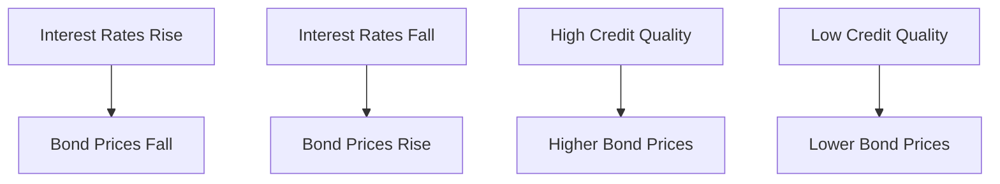

## 6.5 Denominations and Bond Pricing

In the realm of fixed-income securities, understanding the nuances of bond denominations and pricing is crucial for both individual investors and institutional players. This section delves into the standard denominations of bonds, the dynamics of bond pricing, and the factors influencing these prices. We will also explore the significance of bond price quotations in making informed trading and investment decisions.

### Standard Bond Denominations

Bonds are typically issued in standard denominations, which represent the face value or the principal amount of each bond unit. In Canada, bonds are often issued in denominations of $1,000, although larger denominations are available, particularly for institutional investors. These larger denominations, such as $10,000 or $100,000, cater to the needs of institutional investors like pension funds, insurance companies, and mutual funds, allowing them to manage large portfolios efficiently.

#### Institutional Investors and Larger Denominations

Institutional investors prefer larger denominations because they facilitate the management of substantial investment portfolios. By dealing in larger blocks, these investors can reduce transaction costs and streamline portfolio management. For example, a Canadian pension fund investing in government bonds might opt for $100,000 denominations to efficiently allocate capital across its fixed-income portfolio.

### Understanding Bond Pricing

Bond pricing is a fundamental concept in fixed-income investing, reflecting the bond's current market value relative to its par value. Bonds can be priced at par, at a discount, or at a premium:

- **At Par:** When a bond's market price equals its par value, it is said to be trading at par. For instance, a bond with a par value of $1,000 trading at $1,000 is at par.
- **At a Discount:** A bond trades at a discount when its market price is below its par value. This often occurs when the bond's coupon rate is lower than prevailing market interest rates.
- **At a Premium:** Conversely, a bond trades at a premium when its market price exceeds its par value, typically because its coupon rate is higher than current market rates.

#### Factors Affecting Bond Pricing

Several factors influence bond pricing, including:

1. **Interest Rate Movements:** Interest rates have an inverse relationship with bond prices. When interest rates rise, existing bonds with lower coupon rates become less attractive, causing their prices to fall. Conversely, when interest rates decline, existing bonds with higher coupon rates become more desirable, driving their prices up.

2. **Credit Quality:** The issuer's creditworthiness significantly impacts bond pricing. Bonds issued by entities with high credit ratings, such as the Government of Canada, are perceived as low-risk and typically trade at higher prices. In contrast, bonds from issuers with lower credit ratings may trade at discounts due to perceived higher risk.

3. **Inflation Expectations:** Inflation erodes the purchasing power of future cash flows from bonds. If investors expect higher inflation, they may demand higher yields, leading to lower bond prices.

4. **Economic Conditions:** Broader economic factors, such as GDP growth, unemployment rates, and fiscal policies, can influence bond prices by affecting interest rates and credit risk perceptions.

### The Significance of Bond Price Quotations

Bond price quotations are crucial for making informed trading and investment decisions. These quotations provide investors with real-time information on the market value of bonds, enabling them to assess the potential returns and risks associated with their investments. For example, a Canadian investor considering a corporate bond might analyze its price quotation to determine whether it offers an attractive yield relative to its risk profile.

#### Practical Example: Analyzing Bond Price Quotations

Consider a corporate bond issued by a major Canadian bank, such as RBC. Suppose the bond has a par value of $1,000, a coupon rate of 4%, and is currently quoted at $950. This indicates the bond is trading at a discount, potentially due to rising interest rates or concerns about the bank's credit quality. An investor might evaluate whether the bond's yield compensates for these risks before deciding to invest.

### Visualizing Bond Pricing Dynamics

To better understand the relationship between bond prices and interest rates, consider the following diagram:

This diagram illustrates the inverse relationship between interest rates and bond prices, as well as the impact of credit quality on bond valuation.

### Best Practices and Common Pitfalls

**Best Practices:**

- **Diversify Bond Holdings:** To mitigate risk, diversify your bond portfolio across different issuers, sectors, and maturities.
- **Monitor Economic Indicators:** Stay informed about economic trends and interest rate forecasts to anticipate potential impacts on bond prices.
- **Evaluate Credit Ratings:** Regularly review the credit ratings of bond issuers to assess credit risk and adjust your portfolio accordingly.

**Common Pitfalls:**

- **Ignoring Interest Rate Risk:** Failing to consider interest rate movements can lead to unexpected losses, especially for long-term bonds.
- **Overlooking Inflation Impact:** Neglecting inflation expectations can result in diminished real returns from fixed-income investments.

### References and Additional Resources

For further exploration of bond pricing and investment strategies, consider the following resources:

- **Canadian Securities Administrators (CSA):** Investor tools and resources ([www.securities-administrators.ca](https://www.securities-administrators.ca))
- **Bond Pricing Tools:** Available from major Canadian financial institutions such as RBC and TD Bank.

### Summary

Understanding bond denominations and pricing is essential for navigating the fixed-income market. By grasping the factors that influence bond prices and the significance of price quotations, investors can make informed decisions that align with their financial goals. As you continue to explore the world of bonds, consider how these principles apply to your investment strategy and portfolio management.

### **Ready to Test Your Knowledge?**

**Practice 10 Essential CSC Exam Questions to Master Your Certification**



### What is the standard denomination for bonds in Canada?

- [x] $1,000
- [ ] $500
- [ ] $5,000
- [ ] $10,000

> **Explanation:** Bonds in Canada are typically issued in denominations of $1,000, although larger denominations are available for institutional investors.

### When a bond is sold for less than its par value, it is said to be trading at a:

- [ ] Premium
- [x] Discount
- [ ] Par
- [ ] Yield

> **Explanation:** A bond trades at a discount when its market price is below its par value.

### What happens to bond prices when interest rates rise?

- [x] Bond prices fall
- [ ] Bond prices rise
- [ ] Bond prices remain unchanged
- [ ] Bond prices become volatile

> **Explanation:** Bond prices have an inverse relationship with interest rates; when interest rates rise, bond prices typically fall.

### Which factor does NOT directly affect bond pricing?

- [ ] Interest rate movements
- [ ] Credit quality
- [x] Stock market trends
- [ ] Inflation expectations

> **Explanation:** Stock market trends do not directly affect bond pricing, although they may influence investor sentiment.

### Bonds issued by entities with high credit ratings typically trade at:

- [x] Higher prices
- [ ] Lower prices
- [ ] Par value
- [ ] Discount

> **Explanation:** Bonds from high-credit-quality issuers are perceived as low-risk and typically trade at higher prices.

### What is the impact of inflation expectations on bond prices?

- [x] Higher inflation expectations lead to lower bond prices
- [ ] Higher inflation expectations lead to higher bond prices
- [ ] Inflation expectations have no impact on bond prices
- [ ] Inflation expectations lead to bond prices remaining stable

> **Explanation:** Higher inflation expectations can lead to lower bond prices as investors demand higher yields to compensate for reduced purchasing power.

### Which of the following is a best practice for bond investing?

- [x] Diversifying bond holdings
- [ ] Ignoring credit ratings
- [ ] Focusing only on short-term bonds
- [ ] Avoiding economic indicators

> **Explanation:** Diversifying bond holdings helps mitigate risk and is a best practice in bond investing.

### What does a bond price quotation provide?

- [x] Real-time information on the market value of bonds
- [ ] Historical performance of the bond
- [ ] Future interest rate predictions
- [ ] Stock market trends

> **Explanation:** Bond price quotations provide real-time information on the market value of bonds, aiding investment decisions.

### What is the relationship between interest rates and bond prices?

- [x] Inverse relationship
- [ ] Direct relationship
- [ ] No relationship
- [ ] Variable relationship

> **Explanation:** Bond prices have an inverse relationship with interest rates; when interest rates rise, bond prices fall, and vice versa.

### True or False: Larger bond denominations are primarily for individual investors.

- [ ] True
- [x] False

> **Explanation:** Larger bond denominations are primarily for institutional investors, allowing them to manage large portfolios efficiently.


