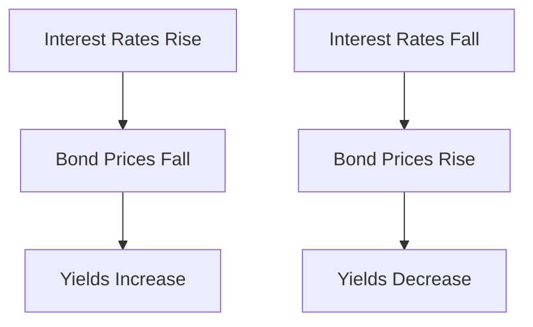

## 6.6 Bond Yields

In the realm of fixed-income securities, understanding bond yields is crucial for evaluating potential returns and making informed investment decisions. This section delves into the various measures of bond yields, their relationship with market prices and interest rates, and their significance in the Canadian financial landscape.

### Understanding Bond Yields

Bond yields are a critical metric for investors, providing insight into the potential return on a bond investment. They help investors compare different bonds and assess the attractiveness of a bond relative to other investment opportunities. The primary yield measures include nominal yield, current yield, and yield to maturity (YTM).

#### Nominal Yield

The nominal yield, also known as the coupon rate, is the annual interest rate stated on the bond when it is issued. It is expressed as a percentage of the bond's face value. For example, a bond with a face value of $1,000 and a nominal yield of 5% will pay $50 in interest annually.

While the nominal yield provides a basic understanding of the bond's interest payments, it does not account for changes in the bond's market price or the time value of money.

#### Current Yield

The current yield is a more dynamic measure, calculated by dividing the bond's annual interest payment by its current market price. This yield reflects the income an investor can expect to earn if the bond is purchased at its current price.


\text{Current Yield} = \frac{\text{Annual Interest Payment}}{\text{Current Market Price}}


For instance, if a bond with a $1,000 face value and a 5% coupon rate is currently trading at $950, the current yield would be approximately 5.26% ($50 / $950).

#### Yield to Maturity (YTM)

Yield to maturity is the most comprehensive yield measure, accounting for all future cash flows, including coupon payments and the repayment of the bond's principal at maturity. YTM is the internal rate of return (IRR) on a bond, assuming it is held until maturity and all payments are made as scheduled.

Calculating YTM involves solving for the discount rate that equates the present value of the bond's future cash flows to its current market price. This measure provides a more accurate reflection of a bond's potential return, considering both income and capital gains or losses.

### Relationship Between Bond Yields, Market Prices, and Interest Rates

Bond yields are inversely related to market prices. When interest rates rise, existing bonds with lower coupon rates become less attractive, causing their market prices to fall and yields to increase. Conversely, when interest rates decline, existing bonds with higher coupon rates become more attractive, driving up their prices and reducing yields.

This relationship is crucial for investors to understand, as it affects the valuation of bonds in their portfolios. The yield curve, a graphical representation of bond yields across different maturities, provides insight into market expectations for future interest rates and economic conditions.

### Importance of Calculating Yields

Calculating bond yields is essential for assessing the potential returns of bond investments. Yields provide a basis for comparing bonds with different maturities, coupon rates, and credit qualities. They also help investors evaluate the risk-return trade-off and make informed decisions about portfolio allocation.

For Canadian investors, understanding bond yields is particularly important given the diverse range of fixed-income securities available, including government bonds, corporate bonds, and municipal bonds. Each type of bond carries different risks and return profiles, influenced by factors such as credit risk, interest rate risk, and inflation risk.

### Practical Example: Canadian Pension Fund Strategy

Consider a Canadian pension fund seeking to balance income generation with capital preservation. The fund may invest in a mix of government and corporate bonds, using yield measures to assess the attractiveness of each bond. By analyzing the yield to maturity, the fund can determine which bonds offer the best potential returns relative to their risk profiles.

For instance, if the fund is considering a Government of Canada bond with a YTM of 2.5% and a corporate bond with a YTM of 4.5%, it must weigh the higher yield of the corporate bond against its higher credit risk. The fund may also consider the current yield to evaluate the immediate income potential of each bond.

### Best Practices and Common Pitfalls

**Best Practices:**
- Regularly monitor bond yields and market conditions to adjust investment strategies accordingly.
- Diversify bond holdings across different sectors and maturities to mitigate risk.
- Use yield to maturity as a comprehensive measure for evaluating long-term bond investments.

**Common Pitfalls:**
- Focusing solely on nominal yield without considering market price changes and interest rate movements.
- Ignoring the impact of inflation on real returns, particularly for long-term bonds.
- Overlooking credit risk when chasing higher yields in corporate bonds.

### References and Further Reading

For more information on Canadian bond yields and investment strategies, consider the following resources:
- **Bank of Canada:** Provides data on Canadian bond yields and economic indicators ([www.bankofcanada.ca](https://www.bankofcanada.ca)).
- **Investment Industry Association of Canada (IIAC):** Offers educational materials on fixed-income securities ([www.iiac.ca](https://www.iiac.ca)).

### Conclusion

Understanding bond yields is fundamental for making informed investment decisions in the fixed-income market. By exploring different yield measures and their implications, investors can better assess the potential returns and risks of bond investments. As you continue to build your knowledge, consider how these concepts apply to your own portfolio and financial goals.

### **Ready to Test Your Knowledge?**

**Practice 10 Essential CSC Exam Questions to Master Your Certification**



### What is the nominal yield of a bond?

- [x] The annual interest rate stated on the bond when it is issued.
- [ ] The bond's annual interest payment divided by its current market price.
- [ ] The internal rate of return on a bond held until maturity.
- [ ] The difference between the bond's face value and its market price.

> **Explanation:** The nominal yield, also known as the coupon rate, is the annual interest rate stated on the bond when it is issued.

### How is the current yield of a bond calculated?

- [x] By dividing the bond's annual interest payment by its current market price.
- [ ] By dividing the bond's face value by its market price.
- [ ] By calculating the internal rate of return on the bond.
- [ ] By subtracting the bond's market price from its face value.

> **Explanation:** The current yield is calculated by dividing the bond's annual interest payment by its current market price.

### What does yield to maturity (YTM) account for?

- [x] All future cash flows, including coupon payments and principal repayment.
- [ ] Only the bond's annual interest payments.
- [ ] The bond's market price fluctuations.
- [ ] The bond's credit rating.

> **Explanation:** Yield to maturity accounts for all future cash flows, including coupon payments and principal repayment, providing a comprehensive measure of a bond's potential return.

### What happens to bond prices when interest rates rise?

- [x] Bond prices fall.
- [ ] Bond prices rise.
- [ ] Bond prices remain unchanged.
- [ ] Bond prices become more volatile.

> **Explanation:** When interest rates rise, existing bonds with lower coupon rates become less attractive, causing their market prices to fall.

### Which yield measure provides the most comprehensive reflection of a bond's potential return?

- [x] Yield to maturity (YTM)
- [ ] Nominal yield
- [x] Current yield
- [ ] Yield curve

> **Explanation:** Yield to maturity provides the most comprehensive reflection of a bond's potential return, as it accounts for all future cash flows.

### What is the relationship between bond yields and market prices?

- [x] Inversely related
- [ ] Directly related
- [ ] Unrelated
- [ ] Proportional

> **Explanation:** Bond yields and market prices are inversely related; when yields rise, market prices fall, and vice versa.

### Why is it important to calculate bond yields?

- [x] To assess the potential returns of bond investments.
- [ ] To determine the bond's credit rating.
- [x] To evaluate the risk-return trade-off.
- [ ] To predict future interest rates.

> **Explanation:** Calculating bond yields is important for assessing potential returns and evaluating the risk-return trade-off of bond investments.

### What is a yield curve?

- [x] A graph showing the relationship between bond yields and maturities.
- [ ] A measure of a bond's credit risk.
- [ ] A calculation of a bond's current yield.
- [ ] A representation of a bond's market price over time.

> **Explanation:** A yield curve is a graph showing the relationship between bond yields and maturities, providing insight into market expectations for future interest rates.

### What should investors consider when comparing bonds with different yields?

- [x] Credit risk and interest rate risk.
- [ ] Only the bond's nominal yield.
- [ ] The bond's issuer and maturity date.
- [ ] The bond's historical performance.

> **Explanation:** Investors should consider credit risk and interest rate risk when comparing bonds with different yields to make informed investment decisions.

### True or False: Yield to maturity is the same as the bond's nominal yield.

- [ ] True
- [x] False

> **Explanation:** False. Yield to maturity is not the same as the bond's nominal yield; YTM accounts for all future cash flows, while nominal yield is the stated interest rate on the bond.


