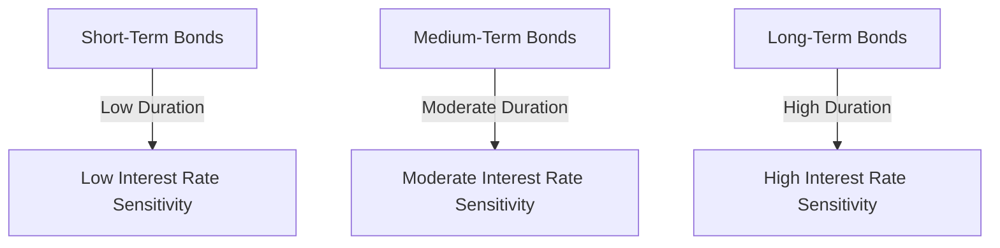

## 6.7 Term to Maturity and Bond Classifications

In the realm of fixed-income securities, understanding the term to maturity and the classification of bonds is crucial for investors aiming to optimize their portfolios. This section delves into the classification of bonds based on their maturity terms, the implications of these terms on bond price volatility and interest rate sensitivity, and the characteristics of money market securities. Additionally, we will explore considerations for investors when selecting bonds of varying maturities, with a focus on the Canadian financial landscape.

### Classification of Bonds Based on Term to Maturity

Bonds are typically classified into three categories based on their term to maturity: short-term, medium-term, and long-term. Each category has distinct characteristics and implications for investors.

#### Short-Term Bonds

**Definition:** Short-term bonds are those that mature in 1 to 5 years. These bonds are generally less sensitive to interest rate changes compared to longer-term bonds, making them a relatively stable investment option.

**Characteristics:**
- Lower interest rate risk due to shorter duration.
- Typically offer lower yields compared to medium and long-term bonds.
- Often used by investors seeking liquidity and capital preservation.

**Example:** A Canadian Treasury bill maturing in 3 years is a typical example of a short-term bond.

#### Medium-Term Bonds

**Definition:** Medium-term bonds have maturities ranging from 5 to 10 years. They strike a balance between risk and return, offering moderate yields and interest rate sensitivity.

**Characteristics:**
- Moderate interest rate risk.
- Yields are generally higher than short-term bonds but lower than long-term bonds.
- Suitable for investors looking for a balance between income and risk.

**Example:** A corporate bond issued by a major Canadian bank like RBC with a 7-year maturity.

#### Long-Term Bonds

**Definition:** Long-term bonds mature in more than 10 years. These bonds are more sensitive to interest rate changes, which can lead to higher price volatility.

**Characteristics:**
- Higher interest rate risk due to longer duration.
- Typically offer higher yields to compensate for increased risk.
- Attractive to investors seeking higher income and willing to accept greater volatility.

**Example:** A 30-year Government of Canada bond.

### Impact of Term Length on Bond Price Volatility and Sensitivity to Interest Rate Changes

The term to maturity significantly influences a bond's price volatility and sensitivity to interest rate changes. This relationship is primarily driven by the concept of duration, which measures a bond's sensitivity to interest rate fluctuations.

- **Short-term bonds** have lower duration, meaning they are less affected by interest rate changes. This makes them a safer option during periods of rising interest rates.
- **Medium-term bonds** offer a moderate level of interest rate risk, providing a balance between stability and yield.
- **Long-term bonds** have higher duration, making them more volatile and sensitive to interest rate movements. Investors in long-term bonds must be prepared for potential price fluctuations.

### Explanation of Money Market Securities and Their Characteristics

Money market securities are short-term debt instruments with high liquidity and maturities of less than one year. They are considered low-risk investments and are often used by investors seeking to preserve capital and maintain liquidity.

**Characteristics of Money Market Securities:**
- High liquidity, allowing for quick conversion to cash.
- Short maturities, typically less than one year.
- Low risk, making them suitable for conservative investors.
- Examples include Treasury bills, commercial paper, and certificates of deposit.

**Canadian Context:** The Bank of Canada provides extensive information on money markets, highlighting their role in the Canadian financial system. For more details, visit [Bank of Canada](https://www.bankofcanada.ca).

### Considerations for Investors When Selecting Bonds of Different Maturities

When selecting bonds, investors must consider several factors, including their investment goals, risk tolerance, and market conditions. Here are some key considerations:

1. **Investment Goals:** Determine whether the primary objective is income generation, capital preservation, or growth. Short-term bonds are ideal for capital preservation, while long-term bonds may offer higher income potential.

2. **Risk Tolerance:** Assess your willingness to accept price volatility. Conservative investors may prefer short-term bonds, whereas those with higher risk tolerance might opt for long-term bonds.

3. **Interest Rate Environment:** Consider the current and expected future interest rate trends. In a rising interest rate environment, short-term bonds are generally more favorable due to their lower sensitivity to rate changes.

4. **Diversification:** A well-diversified bond portfolio should include a mix of short, medium, and long-term bonds to balance risk and return.

5. **Tax Considerations:** Evaluate the tax implications of bond investments, particularly in registered accounts like RRSPs and TFSAs, which offer tax advantages.

### Practical Example: Canadian Pension Fund Strategy

Consider a Canadian pension fund managing a diversified portfolio. The fund may allocate a portion of its assets to short-term bonds for liquidity and stability, medium-term bonds for balanced growth, and long-term bonds for higher income potential. By diversifying across different maturities, the fund can effectively manage interest rate risk and achieve its investment objectives.

### Diagrams and Visual Aids

To enhance understanding, let's visualize the relationship between bond maturity, duration, and interest rate sensitivity.

This diagram illustrates how the duration of bonds affects their sensitivity to interest rate changes, with short-term bonds being the least sensitive and long-term bonds being the most sensitive.

### Best Practices and Common Pitfalls

**Best Practices:**
- Regularly review and adjust your bond portfolio to align with changing market conditions and personal financial goals.
- Diversify across different bond maturities to mitigate risk.
- Stay informed about economic indicators and interest rate forecasts.

**Common Pitfalls:**
- Over-concentration in long-term bonds during periods of rising interest rates can lead to significant losses.
- Ignoring the impact of inflation on bond returns, particularly for long-term bonds.

### References and Additional Resources

- **Bank of Canada:** For insights into money markets and interest rate trends, visit [Bank of Canada](https://www.bankofcanada.ca).
- **Financial Consumer Agency of Canada (FCAC):** Explore investment terms and financial literacy resources at [FCAC](https://www.canada.ca/en/financial-consumer-agency.html).

For further reading, consider exploring books such as "The Bond Book" by Annette Thau and online courses on fixed-income securities offered by platforms like Coursera and edX.

### Summary

Understanding the classification of bonds based on term to maturity is essential for making informed investment decisions. By considering factors such as interest rate sensitivity, investment goals, and risk tolerance, investors can effectively manage their bond portfolios and achieve their financial objectives. As you continue your journey in the world of fixed-income securities, remember to stay informed, diversify, and adapt to changing market conditions.

### **Ready to Test Your Knowledge?**

**Practice 10 Essential CSC Exam Questions to Master Your Certification**



### What is the maturity range for short-term bonds?

- [x] 1 to 5 years
- [ ] 5 to 10 years
- [ ] More than 10 years
- [ ] Less than 1 year

> **Explanation:** Short-term bonds are defined as those maturing in 1 to 5 years.

### Which type of bond is most sensitive to interest rate changes?

- [ ] Short-term bonds
- [ ] Medium-term bonds
- [x] Long-term bonds
- [ ] Money market securities

> **Explanation:** Long-term bonds have higher duration, making them more sensitive to interest rate changes.

### What is a key characteristic of money market securities?

- [x] High liquidity
- [ ] Long maturities
- [ ] High risk
- [ ] Low liquidity

> **Explanation:** Money market securities are known for their high liquidity and short maturities.

### Which bond type typically offers the highest yield?

- [ ] Short-term bonds
- [ ] Medium-term bonds
- [x] Long-term bonds
- [ ] Money market securities

> **Explanation:** Long-term bonds generally offer higher yields to compensate for increased interest rate risk.

### What is the primary goal of investing in short-term bonds?

- [x] Capital preservation
- [ ] High income
- [x] Liquidity
- [ ] Growth

> **Explanation:** Short-term bonds are often used for capital preservation and liquidity.

### What is the typical maturity range for medium-term bonds?

- [ ] 1 to 5 years
- [x] 5 to 10 years
- [ ] More than 10 years
- [ ] Less than 1 year

> **Explanation:** Medium-term bonds have maturities ranging from 5 to 10 years.

### Which factor should investors consider when selecting bonds?

- [x] Interest rate environment
- [ ] Stock market trends
- [x] Investment goals
- [ ] Real estate prices

> **Explanation:** Investors should consider the interest rate environment and their investment goals when selecting bonds.

### What is a common pitfall when investing in long-term bonds?

- [x] Over-concentration during rising interest rates
- [ ] Diversification
- [ ] Low yield
- [ ] High liquidity

> **Explanation:** Over-concentration in long-term bonds during rising interest rates can lead to significant losses.

### What does the term "duration" refer to in bond investing?

- [x] Sensitivity to interest rate changes
- [ ] Time to maturity
- [ ] Yield
- [ ] Credit risk

> **Explanation:** Duration measures a bond's sensitivity to interest rate changes.

### True or False: Money market securities are considered high-risk investments.

- [ ] True
- [x] False

> **Explanation:** Money market securities are considered low-risk investments due to their high liquidity and short maturities.


