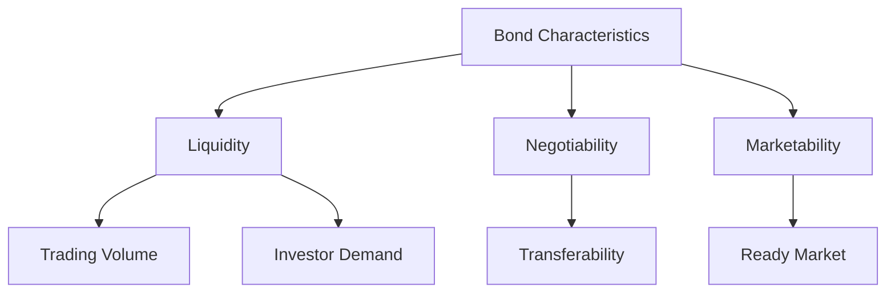

## 6.8 Liquidity, Negotiability, and Marketability

In the realm of fixed-income securities, understanding the concepts of liquidity, negotiability, and marketability is crucial for investors and financial professionals. These factors significantly influence the ease with which bonds can be bought or sold, impacting investment strategies and portfolio management. This section delves into these concepts, providing insights into their importance and application within the Canadian financial market.

### Understanding Liquidity

**Liquidity** refers to the ability to quickly buy or sell an asset without causing a significant change in its price. In the context of bonds, liquidity is a measure of how easily a bond can be converted into cash. Highly liquid bonds can be sold rapidly with minimal price impact, while illiquid bonds may require more time and potentially a price concession to find a buyer.

#### Factors Influencing Bond Liquidity

Several factors influence a bond's liquidity:

1. **Trading Volume:** Bonds that are frequently traded tend to have higher liquidity. High trading volume indicates active participation in the market, making it easier to find buyers or sellers.

2. **Investor Demand:** Bonds in high demand are generally more liquid. Demand can be driven by factors such as interest rates, economic conditions, and investor sentiment.

3. **Issuer's Creditworthiness:** Bonds issued by entities with strong credit ratings are often more liquid, as they are perceived as lower risk.

4. **Maturity and Coupon Rate:** Shorter maturity bonds and those with higher coupon rates may be more liquid due to their attractiveness to investors seeking regular income or lower interest rate risk.

5. **Market Conditions:** Overall market conditions, including economic stability and interest rate trends, can affect bond liquidity.

#### Importance of Liquidity for Investors

Liquidity is particularly important for investors who may need to sell bonds before maturity. A liquid bond market allows investors to adjust their portfolios in response to changing financial goals or market conditions without incurring significant losses. For example, during periods of rising interest rates, investors might want to sell bonds to avoid price declines. In such scenarios, liquidity becomes a critical factor in executing timely and cost-effective trades.

### Negotiability and Marketability

**Negotiability** and **marketability** are related but distinct concepts that further define a bond's ease of transfer and sale.

#### Negotiable Bonds

A **negotiable bond** is one that can be transferred or sold to another party. The negotiability of a bond is determined by its legal and contractual terms, which allow it to be freely traded in the secondary market. Most corporate and government bonds are negotiable, providing investors with the flexibility to buy and sell them as needed.

#### Marketable Bonds

A **marketable bond** is one that has a ready market, meaning there is active demand and supply for the bond. Marketable bonds are typically issued by well-known entities, such as the Canadian government or large corporations, and are listed on major exchanges. The presence of a ready market ensures that these bonds can be sold quickly and at a fair price.

### Practical Examples and Case Studies

To illustrate these concepts, consider the following examples:

#### Example 1: Canadian Government Bonds

Canadian government bonds are highly liquid and marketable due to the government's strong credit rating and the active secondary market. These bonds are frequently traded on the Canadian Securities Exchange (CSE), providing investors with ample opportunities to buy or sell them with minimal price impact.

#### Example 2: Corporate Bonds

Corporate bonds issued by major Canadian banks, such as RBC or TD, are also considered liquid and marketable. These institutions have strong credit ratings and a large investor base, ensuring active trading and demand for their bonds.

#### Case Study: Impact of Liquidity on Investment Strategy

Consider a Canadian pension fund managing a diversified bond portfolio. The fund's investment strategy emphasizes liquidity to ensure it can meet its obligations to beneficiaries. By holding a mix of government and high-grade corporate bonds, the fund maintains the flexibility to adjust its portfolio in response to interest rate changes or economic shifts.

### Diagrams and Visual Aids

To further enhance understanding, let's visualize the relationship between liquidity, negotiability, and marketability using a diagram:

This diagram illustrates how different characteristics of bonds contribute to their liquidity, negotiability, and marketability.

### Best Practices and Common Pitfalls

**Best Practices:**

- **Diversify Holdings:** To manage liquidity risk, investors should diversify their bond holdings across different issuers, maturities, and credit ratings.
- **Monitor Market Conditions:** Stay informed about economic trends and interest rate movements that may affect bond liquidity.
- **Assess Creditworthiness:** Prioritize bonds from issuers with strong credit ratings to enhance liquidity and reduce risk.

**Common Pitfalls:**

- **Overlooking Liquidity Needs:** Investors may focus solely on yield without considering the liquidity of their bond investments, leading to challenges in selling bonds when needed.
- **Ignoring Market Signals:** Failing to recognize changes in market demand or trading volume can result in suboptimal investment decisions.

### References and Additional Resources

For further exploration of these topics, consider the following resources:

- **IIROC:** Rules on debt market liquidity ([www.iiroc.ca](https://www.iiroc.ca))
- **Canadian Securities Exchange (CSE):** Market liquidity resources ([www.thecse.com](https://www.thecse.com))

### Conclusion

Understanding liquidity, negotiability, and marketability is essential for navigating the fixed-income market effectively. By considering these factors, investors can make informed decisions that align with their financial goals and risk tolerance. As you continue to explore the Canadian financial landscape, apply these principles to optimize your bond investment strategies.

### **Ready to Test Your Knowledge?**

**Practice 10 Essential CSC Exam Questions to Master Your Certification**



### What is liquidity in the context of bonds?

- [x] The ability to quickly buy or sell a bond without significantly affecting its price
- [ ] The interest rate paid by the bond
- [ ] The maturity date of the bond
- [ ] The credit rating of the bond issuer

> **Explanation:** Liquidity refers to how easily a bond can be converted into cash without affecting its price.

### Which factor does NOT influence a bond's liquidity?

- [ ] Trading volume
- [ ] Investor demand
- [x] The color of the bond certificate
- [ ] Issuer's creditworthiness

> **Explanation:** The color of the bond certificate is irrelevant to its liquidity.

### What is a negotiable bond?

- [x] A bond that can be transferred or sold to another party
- [ ] A bond that cannot be sold before maturity
- [ ] A bond with a fixed interest rate
- [ ] A bond issued by the government

> **Explanation:** A negotiable bond can be freely traded in the secondary market.

### What makes a bond marketable?

- [x] Having a ready market with active demand and supply
- [ ] Being issued by a small, unknown company
- [ ] Having a long maturity period
- [ ] Being illiquid

> **Explanation:** Marketable bonds have active demand and supply, making them easy to sell.

### Why is liquidity important for investors?

- [x] It allows investors to sell bonds quickly without significant losses
- [ ] It guarantees a fixed return on investment
- [x] It provides flexibility to adjust portfolios
- [ ] It eliminates all investment risks

> **Explanation:** Liquidity provides the ability to sell bonds quickly and adjust portfolios as needed.

### Which of the following is a best practice for managing liquidity risk?

- [x] Diversifying bond holdings
- [ ] Investing only in long-term bonds
- [ ] Ignoring market conditions
- [ ] Focusing solely on yield

> **Explanation:** Diversifying holdings helps manage liquidity risk.

### What is the role of trading volume in bond liquidity?

- [x] Higher trading volume generally indicates higher liquidity
- [ ] Trading volume has no impact on liquidity
- [x] Low trading volume can indicate illiquidity
- [ ] Trading volume affects only the bond's interest rate

> **Explanation:** Trading volume is a key indicator of liquidity.

### How does issuer's creditworthiness affect bond liquidity?

- [x] Bonds from issuers with strong credit ratings are more liquid
- [ ] Creditworthiness has no impact on liquidity
- [ ] Poor credit ratings increase liquidity
- [ ] Creditworthiness only affects bond maturity

> **Explanation:** Strong credit ratings enhance bond liquidity.

### What is the relationship between liquidity and marketability?

- [x] Marketable bonds are typically more liquid
- [ ] Liquidity and marketability are unrelated
- [ ] Marketability decreases liquidity
- [ ] Liquidity only affects negotiable bonds

> **Explanation:** Marketable bonds, with active demand, are generally more liquid.

### True or False: All bonds are equally liquid.

- [ ] True
- [x] False

> **Explanation:** Bonds vary in liquidity based on factors like trading volume and issuer creditworthiness.


