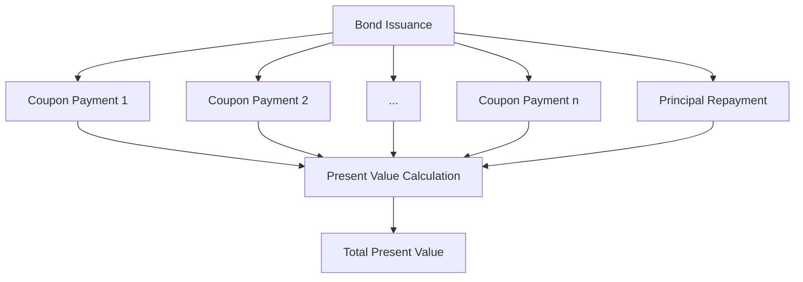

## 7.1.1 Present Value Calculations

Understanding present value calculations is crucial for anyone involved in the pricing and trading of fixed-income securities. This section will guide you through the process of calculating the present value of bond cash flows, both manually and using financial calculators. By mastering these calculations, you will gain insights into bond pricing and yield, essential for making informed investment decisions.

### Applying Present Value Formulas

The present value (PV) of a bond is the sum of the present values of its future cash flows, which include periodic coupon payments and the principal repayment at maturity. The formula for calculating the present value of a bond is:

 PV = \sum_{t=1}^{n} \frac{C}{(1 + r)^t} + \frac{F}{(1 + r)^n} 

Where:
- \\( C \\) = Coupon payment
- \\( r \\) = Discount rate per period
- \\( n \\) = Total number of periods
- \\( F \\) = Face value of the bond

#### Adjusting for Semi-Annual Bonds

For bonds with semi-annual coupon payments, the discount rate and number of periods must be adjusted accordingly. If the annual coupon rate is 6%, the semi-annual rate is 3%. Similarly, a 10-year bond will have 20 periods.

### Manual Calculation Example

Let's calculate the present value of a 10-year Canadian government bond with a face value of $1,000, an annual coupon rate of 6%, and a market interest rate of 5%.

1. **Determine the Semi-Annual Coupon Payment:**
    C = \frac{6\% \times 1,000}{2} = \$30 

2. **Calculate the Present Value of Coupon Payments:**
    PV_{\text{coupons}} = \sum_{t=1}^{20} \frac{30}{(1 + 0.025)^t} 

3. **Calculate the Present Value of the Principal:**
    PV_{\text{principal}} = \frac{1,000}{(1 + 0.025)^{20}} 

4. **Sum the Present Values:**
    PV = PV_{\text{coupons}} + PV_{\text{principal}} 

By calculating each term, you will find that the present value of the bond is approximately $1,077.22.

### Financial Calculator Usage

Using a financial calculator can streamline the process of calculating present value. Here’s how to input the data:

1. **Enter the Number of Periods (N):** 20
2. **Enter the Interest Rate per Period (I/Y):** 2.5
3. **Enter the Payment per Period (PMT):** 30
4. **Enter the Future Value (FV):** 1,000
5. **Compute the Present Value (PV):**

The calculator should confirm the manual calculation, providing a present value of approximately $1,077.22.

### Analyze Present Value Results

Interpreting the present value results is key to understanding bond pricing. If the calculated present value is higher than the bond's face value, the bond is trading at a premium. Conversely, if it is lower, the bond is trading at a discount. This affects the bond's yield:

- **Premium Bonds:** Yield is lower than the coupon rate.
- **Discount Bonds:** Yield is higher than the coupon rate.

### Glossary

- **Compounding Periods:** The frequency with which interest is calculated and added to the principal balance.
- **Annual Yield:** The total return expected on a bond over one year, incorporating both interest and price changes.
- **Accrued Interest:** The interest that has accumulated since the last coupon payment date, paid by the buyer to the seller during a bond transaction.
- **Investment Grade:** Bonds rated as having a relatively low risk of default, typically rated Baa3/BBB- or higher.

### Practical Example: Canadian Pension Fund Strategy

Consider a Canadian pension fund that invests in a portfolio of bonds to match its future liabilities. By calculating the present value of these bonds, the fund can ensure that its assets will cover its obligations. This involves regularly assessing the present value of its bond holdings in light of changing interest rates and adjusting its portfolio to maintain the desired yield.

### Diagrams and Visual Aids

Below is a diagram illustrating the cash flow of a bond and its present value calculation:

### Best Practices and Common Pitfalls

- **Best Practices:**
  - Regularly update discount rates to reflect current market conditions.
  - Use financial calculators to verify manual calculations for accuracy.

- **Common Pitfalls:**
  - Failing to adjust for semi-annual periods can lead to incorrect valuations.
  - Ignoring accrued interest when buying or selling bonds can affect transaction costs.

### Conclusion

Mastering present value calculations is essential for evaluating bond investments. By understanding how to calculate and interpret present value, you can make informed decisions about bond pricing and yield, crucial for successful investment strategies in the Canadian market.

## Quiz Time!



### What is the present value formula used for?

- [x] Discounting future cash flows to their present value
- [ ] Calculating future value of investments
- [ ] Determining the coupon rate of a bond
- [ ] Estimating the market price of a stock

> **Explanation:** The present value formula is used to discount future cash flows to their present value, which is essential for bond pricing.

### How do you adjust the discount rate for a semi-annual bond?

- [x] Divide the annual rate by 2
- [ ] Multiply the annual rate by 2
- [ ] Use the annual rate as is
- [ ] Add 2% to the annual rate

> **Explanation:** For semi-annual bonds, the annual discount rate is divided by 2 to reflect the semi-annual compounding.

### What is the present value of a bond with a face value of $1,000, a 6% annual coupon rate, and a market rate of 5%?

- [x] Approximately $1,077.22
- [ ] $1,000
- [ ] $950
- [ ] $1,050

> **Explanation:** Using the present value formula, the bond's present value is approximately $1,077.22, indicating it trades at a premium.

### What does it mean if a bond is trading at a premium?

- [x] Its present value is higher than its face value
- [ ] Its present value is lower than its face value
- [ ] Its yield is higher than the coupon rate
- [ ] It has a higher risk of default

> **Explanation:** A bond trades at a premium when its present value is higher than its face value, typically resulting in a yield lower than the coupon rate.

### What is the role of accrued interest in bond transactions?

- [x] It is paid by the buyer to the seller for interest accrued since the last coupon payment
- [ ] It is deducted from the bond's face value
- [ ] It is added to the bond's coupon payments
- [ ] It is ignored in bond transactions

> **Explanation:** Accrued interest is the interest that has accumulated since the last coupon payment, paid by the buyer to the seller during a bond transaction.

### Which of the following is considered an investment-grade bond rating?

- [x] BBB-
- [ ] CCC
- [ ] D
- [ ] BB

> **Explanation:** Bonds rated BBB- or higher are considered investment-grade, indicating a lower risk of default.

### What happens to the yield of a bond trading at a discount?

- [x] It is higher than the coupon rate
- [ ] It is lower than the coupon rate
- [ ] It equals the coupon rate
- [ ] It is unaffected by the discount

> **Explanation:** When a bond trades at a discount, its yield is higher than the coupon rate, reflecting the lower purchase price.

### How can financial calculators assist in present value calculations?

- [x] They provide precise and quick calculations
- [ ] They eliminate the need for understanding the formula
- [ ] They are only useful for stocks
- [ ] They are not applicable to bond calculations

> **Explanation:** Financial calculators offer precise and quick calculations, verifying manual computations and saving time.

### What is the significance of compounding periods in bond calculations?

- [x] They determine how often interest is calculated and added to the principal
- [ ] They are irrelevant to bond pricing
- [ ] They only apply to stocks
- [ ] They are used to calculate accrued interest

> **Explanation:** Compounding periods determine the frequency of interest calculation and addition to the principal, crucial for accurate bond pricing.

### True or False: A bond's present value is always equal to its face value.

- [ ] True
- [x] False

> **Explanation:** A bond's present value can differ from its face value, depending on market interest rates and the bond's coupon rate.


