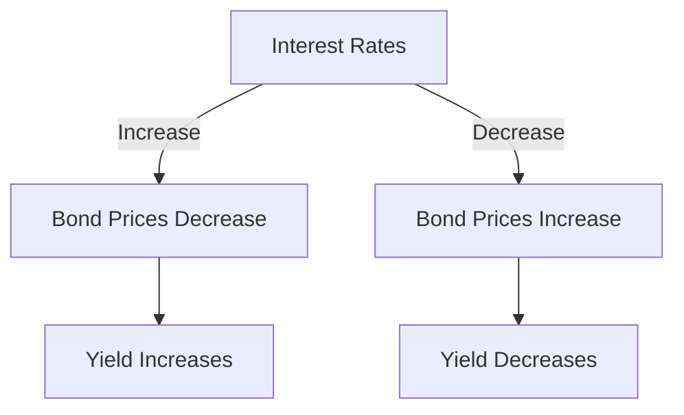

## 7.1 Introduction to Bond Pricing and Yield

Understanding bond pricing and yield is crucial for anyone involved in recommending or investing in fixed-income securities. Bonds are a cornerstone of many investment portfolios, offering a predictable income stream and potential for capital preservation. In this section, we will delve into the intricacies of bond pricing and yield, explore their relationship with interest rates, and discuss the dynamics of the secondary market.

### The Importance of Bond Pricing and Yield

Before recommending fixed-income securities, it is essential to grasp how bond pricing and yield work. These concepts are fundamental to assessing the value and potential return of a bond investment. Bond pricing and yield are interrelated, with changes in one often affecting the other. Understanding these dynamics helps investors make informed decisions, optimize their portfolios, and manage risk effectively.

### Defining Bond Yield and Its Relationship with Bond Pricing and Interest Rates

**Bond Yield** is the return an investor expects to earn from a bond. It is a critical measure of a bond's profitability and is influenced by various factors, including the bond's price, its coupon rate, and prevailing interest rates.

**Interest Rate** is the cost of borrowing money, expressed as a percentage. It plays a significant role in determining bond prices. When interest rates rise, bond prices typically fall, and vice versa. This inverse relationship is due to the fixed nature of bond coupon payments. As new bonds are issued with higher rates, existing bonds with lower rates become less attractive, leading to a decrease in their market price.

#### Example: The Inverse Relationship Between Bond Prices and Interest Rates

Consider a bond with a face value of CAD 1,000 and a coupon rate of 5%. If market interest rates rise to 6%, new bonds will offer a higher return, making the existing bond less appealing. Consequently, the price of the existing bond will decrease to align its yield with the new market rate.

### Primary Scenario: Buying Bonds and Holding to Maturity

Many investors purchase bonds with the intention of holding them until maturity. This strategy ensures that they receive the bond's face value at maturity, along with periodic coupon payments. Holding to maturity can be particularly appealing in a stable interest rate environment, as it provides a predictable income stream and minimizes exposure to market fluctuations.

#### Case Study: Canadian Pension Funds

Canadian pension funds often adopt a buy-and-hold strategy for bonds to match their long-term liabilities with predictable cash flows. By holding bonds to maturity, these funds can ensure they meet their future payout obligations to retirees.

### Secondary Markets and Alternative Bond Trading Strategies

While holding bonds to maturity is a common strategy, the **Secondary Market** offers investors the opportunity to buy and sell bonds before they mature. This market provides liquidity and flexibility, allowing investors to adjust their portfolios in response to changing market conditions or investment goals.

#### Alternative Trading Strategies

1. **Active Trading:** Some investors actively trade bonds to capitalize on price fluctuations. This strategy requires a keen understanding of market trends and interest rate movements.

2. **Laddering:** This involves purchasing bonds with varying maturities to spread risk and manage interest rate exposure. As bonds mature, the proceeds can be reinvested in new bonds, maintaining the ladder structure.

3. **Barbell Strategy:** This strategy involves investing in short-term and long-term bonds, avoiding intermediate maturities. It allows investors to benefit from the higher yields of long-term bonds while maintaining liquidity with short-term bonds.

### Visualizing Bond Pricing and Yield

To better understand the relationship between bond pricing, yield, and interest rates, consider the following diagram:

### Canadian Financial Regulations and Resources

In Canada, bond markets are regulated by institutions such as the Canadian Securities Administrators (CSA) and the Investment Industry Regulatory Organization of Canada (IIROC). These bodies ensure transparency and fairness in the bond market.

For further exploration, consider the following resources:

- *Fixed Income Securities* by Bruce Tuckman and Angel Serrat
- [Introduction to Fixed Income Securities](https://www.coursera.org/learn/fixed-income-securities) on Coursera

These resources provide deeper insights into fixed-income securities and their role in investment portfolios.

### Best Practices and Common Pitfalls

**Best Practices:**

- Stay informed about interest rate trends and economic indicators.
- Diversify bond holdings to manage risk.
- Consider the tax implications of bond investments, particularly in registered accounts like RRSPs and TFSAs.

**Common Pitfalls:**

- Ignoring interest rate risk, which can significantly impact bond prices.
- Overconcentration in a single bond or issuer, increasing default risk.
- Failing to account for inflation, which can erode the real return on bonds.

### Conclusion

Understanding bond pricing and yield is essential for making informed investment decisions in the fixed-income market. By mastering these concepts, investors can optimize their portfolios, manage risk, and achieve their financial goals. As you continue to explore the world of bonds, remember to consider the impact of interest rates, the benefits of diversification, and the opportunities presented by the secondary market.

### **Ready to Test Your Knowledge?**

**Practice 10 Essential CSC Exam Questions to Master Your Certification**



### What is bond yield?

- [x] The return an investor expects to earn from a bond.
- [ ] The interest rate set by the central bank.
- [ ] The face value of a bond.
- [ ] The price at which a bond is sold.

> **Explanation:** Bond yield is the return an investor expects to earn from a bond, reflecting its profitability.

### How do interest rates affect bond prices?

- [x] When interest rates rise, bond prices fall.
- [ ] When interest rates rise, bond prices rise.
- [ ] Interest rates have no effect on bond prices.
- [ ] Bond prices are only affected by inflation.

> **Explanation:** There is an inverse relationship between interest rates and bond prices; when rates rise, existing bond prices fall.

### What is the primary scenario for buying bonds?

- [x] Buying bonds and holding them to maturity.
- [ ] Buying bonds and selling them immediately.
- [ ] Buying bonds only during economic downturns.
- [ ] Buying bonds to avoid taxes.

> **Explanation:** Many investors buy bonds with the intention of holding them to maturity to receive predictable income.

### What is the secondary market?

- [x] A market where investors buy and sell securities they already own.
- [ ] A market for new bond issues.
- [ ] A market for government bonds only.
- [ ] A market for stocks only.

> **Explanation:** The secondary market is where investors trade existing securities, providing liquidity and flexibility.

### Which strategy involves purchasing bonds with varying maturities?

- [x] Laddering
- [ ] Barbell Strategy
- [ ] Active Trading
- [ ] Short Selling

> **Explanation:** Laddering involves buying bonds with different maturities to manage risk and interest rate exposure.

### What is the role of Canadian financial regulators in the bond market?

- [x] Ensuring transparency and fairness.
- [ ] Setting bond prices.
- [ ] Issuing government bonds.
- [ ] Determining interest rates.

> **Explanation:** Canadian financial regulators ensure transparency and fairness in the bond market.

### What is a common pitfall in bond investing?

- [x] Ignoring interest rate risk.
- [ ] Diversifying bond holdings.
- [ ] Investing in registered accounts.
- [ ] Monitoring economic indicators.

> **Explanation:** Ignoring interest rate risk can lead to significant losses in bond investments.

### What is the barbell strategy?

- [x] Investing in short-term and long-term bonds.
- [ ] Investing only in short-term bonds.
- [ ] Investing only in long-term bonds.
- [ ] Avoiding bond investments altogether.

> **Explanation:** The barbell strategy involves investing in both short-term and long-term bonds, avoiding intermediate maturities.

### Why might investors choose to hold bonds to maturity?

- [x] To receive predictable income and minimize market fluctuations.
- [ ] To speculate on bond price movements.
- [ ] To avoid paying taxes.
- [ ] To increase exposure to interest rate risk.

> **Explanation:** Holding bonds to maturity provides predictable income and reduces exposure to market fluctuations.

### True or False: Bond prices and yields move in the same direction.

- [ ] True
- [x] False

> **Explanation:** Bond prices and yields move in opposite directions; when prices rise, yields fall, and vice versa.


