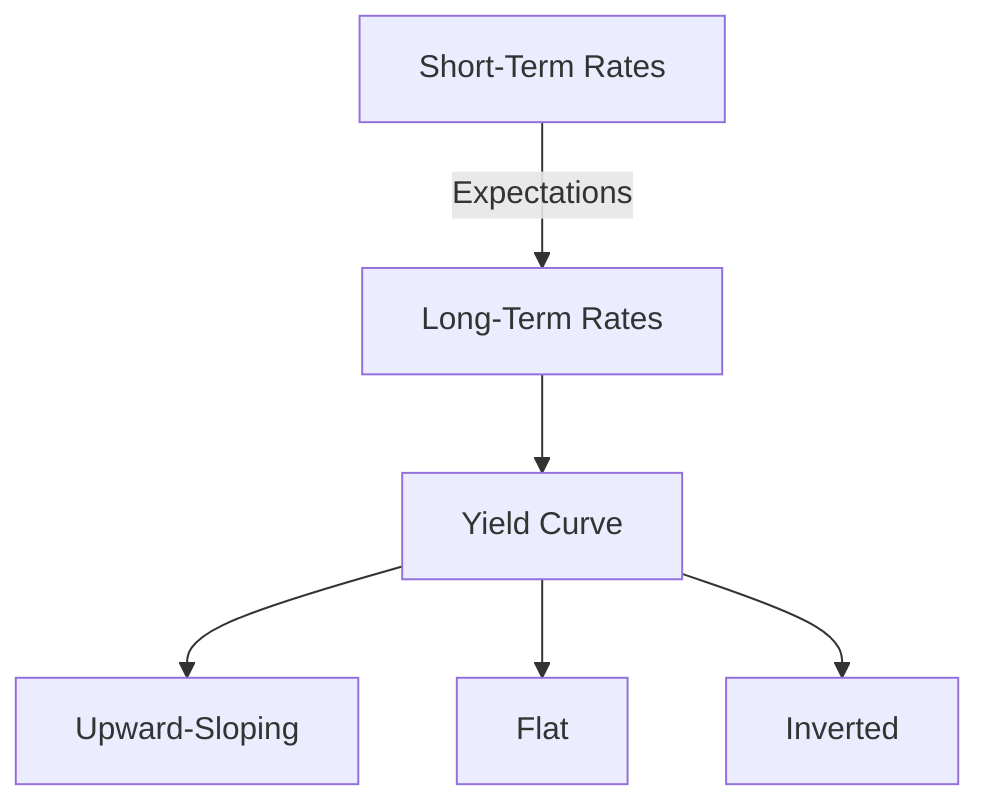

## 7.10 Expectations Theory

In the realm of fixed-income securities, understanding the dynamics of interest rates is crucial for making informed investment decisions. One of the key theories that explain the behavior of interest rates over different maturities is the Expectations Theory. This theory provides insights into the shape of the yield curve and helps investors anticipate future interest rate movements.

### Understanding Expectations Theory

**Expectations Theory** posits that the long-term interest rates are essentially an average of current and expected future short-term interest rates. This theory assumes that investors have no preference between holding a series of short-term bonds versus a single long-term bond, provided the expected returns are the same. Consequently, the yield curve, which plots interest rates of bonds with different maturities, reflects the market's expectations of future interest rates.

#### Yield Curve and Expectations Theory

The yield curve is a graphical representation of interest rates across different maturities. It can take various shapes, such as upward-sloping, flat, or inverted, each indicating different market expectations about future interest rates.

- **Upward-Sloping Yield Curve:** This is the most common shape and suggests that the market expects future short-term interest rates to rise. According to the Expectations Theory, investors anticipate higher economic growth and inflation, leading to higher interest rates.

- **Flat Yield Curve:** A flat yield curve indicates that the market expects future short-term interest rates to remain stable. This scenario suggests uncertainty or a transition period in the economy.

- **Inverted Yield Curve:** An inverted yield curve occurs when long-term interest rates are lower than short-term rates, suggesting that the market expects future short-term rates to decline. This often signals an economic slowdown or recession.

### Expectations Theory and Investment Decisions

The Expectations Theory has significant implications for investment strategies, particularly in the fixed-income market. Understanding the expected path of interest rates can help investors make better decisions regarding bond investments.

#### Example: Canadian Pension Fund Strategy

Consider a Canadian pension fund that needs to decide between investing in a series of short-term Government of Canada bonds or a long-term bond. If the yield curve is upward-sloping, the fund might anticipate higher future interest rates and opt for short-term bonds to reinvest at higher rates later. Conversely, if the yield curve is inverted, the fund might lock in current long-term rates to avoid reinvesting at potentially lower future rates.

### Practical Application and Analysis

To apply the Expectations Theory effectively, investors should analyze economic indicators, central bank policies, and market sentiment. For instance, if the Bank of Canada signals an intention to raise interest rates to curb inflation, the yield curve might steepen, reflecting higher expected future rates.

#### Case Study: Major Canadian Bank

Let's examine a scenario involving a major Canadian bank like RBC. Suppose RBC's analysts predict an economic downturn, leading to an inverted yield curve. The bank might adjust its portfolio by increasing holdings in long-term bonds to secure higher yields before rates potentially fall.

### Visualizing the Yield Curve

To better understand the Expectations Theory, let's visualize the yield curve using a diagram:

### Best Practices and Challenges

**Best Practices:**
- Continuously monitor economic indicators and central bank announcements.
- Diversify bond portfolios to manage interest rate risk effectively.
- Use financial tools and models to simulate different interest rate scenarios.

**Common Challenges:**
- Predicting future interest rates accurately is inherently difficult.
- Market sentiment and external shocks can lead to unexpected yield curve shifts.

### References and Further Reading

For those interested in delving deeper into the Expectations Theory and its applications, consider exploring the following resources:

- [Investopedia: Expectations Theory](https://www.investopedia.com/terms/e/expectationstheory.asp)
- *Fixed Income Securities* by Bruce Tuckman and Angel Serrat

These resources provide comprehensive insights into fixed-income securities and the theoretical underpinnings of interest rate movements.

### Conclusion

The Expectations Theory offers valuable insights into the behavior of interest rates and the shape of the yield curve. By understanding this theory, investors can make informed decisions about bond investments and manage interest rate risk more effectively. As the Canadian financial landscape continues to evolve, staying informed about market expectations and economic indicators will be crucial for successful investment strategies.

### **Ready to Test Your Knowledge?**

**Practice 10 Essential CSC Exam Questions to Master Your Certification**



### What does the Expectations Theory suggest about long-term interest rates?

- [x] They are an average of current and expected future short-term rates.
- [ ] They are always higher than short-term rates.
- [ ] They are determined solely by current economic conditions.
- [ ] They are unrelated to short-term rates.

> **Explanation:** Expectations Theory posits that long-term rates are an average of current and expected future short-term rates.

### What does an upward-sloping yield curve indicate according to the Expectations Theory?

- [x] Future short-term interest rates are expected to rise.
- [ ] Future short-term interest rates are expected to fall.
- [ ] Future short-term interest rates are expected to remain stable.
- [ ] The economy is in a recession.

> **Explanation:** An upward-sloping yield curve suggests that the market expects future short-term rates to rise.

### How might a Canadian pension fund react to an inverted yield curve?

- [x] Invest in long-term bonds to lock in current rates.
- [ ] Invest in short-term bonds to benefit from rising rates.
- [ ] Avoid bond investments altogether.
- [ ] Increase exposure to equities.

> **Explanation:** An inverted yield curve suggests falling future rates, prompting a preference for long-term bonds.

### What does a flat yield curve suggest about future interest rates?

- [x] They are expected to remain stable.
- [ ] They are expected to rise.
- [ ] They are expected to fall.
- [ ] The economy is in a boom.

> **Explanation:** A flat yield curve indicates that future short-term rates are expected to remain stable.

### Which of the following is a best practice when applying the Expectations Theory?

- [x] Monitor economic indicators and central bank policies.
- [ ] Only invest in short-term bonds.
- [x] Diversify bond portfolios.
- [ ] Ignore market sentiment.

> **Explanation:** Monitoring economic indicators and diversifying portfolios are best practices.

### What is a common challenge when using the Expectations Theory?

- [x] Accurately predicting future interest rates.
- [ ] Understanding current interest rates.
- [ ] Finding long-term bonds.
- [ ] Calculating bond yields.

> **Explanation:** Predicting future interest rates accurately is challenging.

### How can investors manage interest rate risk effectively?

- [x] Diversify bond portfolios.
- [ ] Only invest in long-term bonds.
- [x] Use financial tools to simulate scenarios.
- [ ] Avoid bond investments.

> **Explanation:** Diversification and scenario simulation help manage interest rate risk.

### What might cause an unexpected shift in the yield curve?

- [x] External economic shocks.
- [ ] Stable economic conditions.
- [ ] Predictable market trends.
- [ ] Consistent central bank policies.

> **Explanation:** External shocks can lead to unexpected yield curve shifts.

### What is the primary focus of the Expectations Theory?

- [x] Relating future short-term rates to current long-term rates.
- [ ] Predicting stock market trends.
- [ ] Determining bond prices.
- [ ] Analyzing corporate earnings.

> **Explanation:** The theory focuses on the relationship between future short-term and current long-term rates.

### True or False: The Expectations Theory assumes investors prefer long-term bonds over short-term bonds.

- [ ] True
- [x] False

> **Explanation:** The theory assumes investors are indifferent between holding a series of short-term bonds or a single long-term bond if expected returns are the same.


