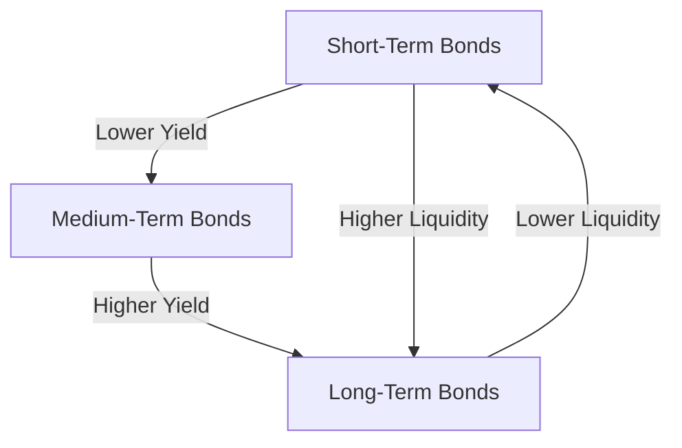

---

linkTitle: "7.11 Liquidity Preference Theory"
title: "Liquidity Preference Theory: Understanding Its Impact on Yield Curves"
description: "Explore the Liquidity Preference Theory and its influence on yield curves, investor behavior, and long-term yields in Canadian financial markets."
categories:
- Fixed-Income Securities
- Investment Strategies
- Canadian Financial Markets
tags:
- Liquidity Preference Theory
- Yield Curve
- Fixed-Income
- Canadian Securities
- Investment Analysis
date: 2024-10-25
type: docs
nav_weight: 8100

canonical: "https://securitiesexamsmastery.ca/13/7/11"
license: "© 2023 Tokenizer Inc. CC BY-NC-SA 4.0"
---

## 7.11 Liquidity Preference Theory

The Liquidity Preference Theory is a fundamental concept in finance that provides insights into the behavior of interest rates and the shape of the yield curve. This theory, introduced by John Maynard Keynes, posits that investors demand a premium for holding longer-term bonds due to the increased risks and lower liquidity associated with these investments. Understanding this theory is crucial for financial professionals, particularly in the context of Canadian financial markets, where it influences investment strategies and regulatory considerations.

### Understanding Liquidity Preference Theory

At its core, the Liquidity Preference Theory suggests that investors prefer short-term securities over long-term ones because they are more liquid and less susceptible to interest rate fluctuations. This preference for liquidity leads to a demand for higher yields on long-term securities to compensate for the additional risks and the opportunity cost of holding less liquid assets.

#### Key Concepts:

- **Liquidity Premium:** The additional yield that investors require to hold a longer-term bond instead of a series of short-term bonds. This premium compensates for the risks associated with interest rate changes and the reduced liquidity of long-term investments.

- **Yield Curve:** A graphical representation of interest rates across different maturities. The shape of the yield curve is influenced by investors' liquidity preferences, among other factors.

#### Impact on the Yield Curve

The Liquidity Preference Theory helps explain why yield curves typically slope upwards. Investors demand a liquidity premium for longer maturities, which results in higher yields for long-term bonds compared to short-term bonds. This upward slope reflects the compensation investors require for the increased risk and lower liquidity of long-term investments.

#### Practical Example: Canadian Government Bonds

Consider the yield curve for Canadian government bonds. Typically, the yields on 10-year bonds are higher than those on 2-year bonds. This difference can be attributed to the liquidity premium demanded by investors. The longer the maturity, the greater the uncertainty regarding future interest rates and economic conditions, leading to a higher required yield.

### Investor Preference for Liquidity

Investors' preference for liquidity is driven by several factors:

1. **Risk Aversion:** Investors are generally risk-averse and prefer to hold assets that can be easily converted to cash without significant loss of value.

2. **Interest Rate Risk:** Long-term bonds are more sensitive to changes in interest rates, which can lead to significant price fluctuations.

3. **Economic Uncertainty:** In times of economic uncertainty, investors may prefer the flexibility of short-term investments.

#### Influence on Long-Term Yields

The demand for liquidity premiums influences long-term yields by making them higher than they would be if investors were indifferent to liquidity. This has implications for investment strategies, as it affects the cost of borrowing and the attractiveness of long-term investments.

### Comparing Liquidity Preference Theory with Expectations Theory

While the Liquidity Preference Theory emphasizes the role of liquidity premiums, the Expectations Theory offers a different perspective. The Expectations Theory suggests that the shape of the yield curve reflects investors' expectations about future interest rates. According to this theory, if investors expect interest rates to rise, the yield curve will slope upwards, even without a liquidity premium.

#### Key Differences:

- **Liquidity Preference Theory:** Focuses on the additional yield required for holding less liquid, long-term securities.

- **Expectations Theory:** Centers on the anticipated future path of interest rates, assuming no liquidity premium.

#### Combined Insights

In practice, both theories can be used to analyze yield curves. The actual shape of the yield curve is often a combination of liquidity premiums and interest rate expectations. Understanding both theories allows investors to make more informed decisions about bond investments and interest rate risk management.

### Canadian Financial Context

In the Canadian financial market, the Liquidity Preference Theory is particularly relevant for institutions like pension funds and insurance companies, which often hold long-term bonds. These entities must balance the need for liquidity with the desire for higher yields, making the liquidity premium a critical consideration in their investment strategies.

#### Regulatory Considerations

Canadian financial regulations, such as those enforced by the Canadian Investment Regulatory Organization (CIRO), require financial institutions to manage liquidity risk effectively. Understanding the Liquidity Preference Theory helps institutions comply with these regulations by providing insights into the factors influencing bond yields and interest rate risk.

### Practical Applications and Strategies

For Canadian investors, understanding the Liquidity Preference Theory can inform several investment strategies:

1. **Bond Laddering:** By creating a bond ladder, investors can manage liquidity risk while capturing higher yields from longer-term bonds.

2. **Duration Management:** Adjusting the duration of a bond portfolio can help manage interest rate risk and optimize returns based on liquidity preferences.

3. **Yield Curve Analysis:** Analyzing the yield curve can provide insights into market expectations and liquidity premiums, aiding in investment decision-making.

### Visualizing the Yield Curve

To better understand the impact of liquidity preferences on the yield curve, consider the following diagram:

This diagram illustrates the typical upward slope of the yield curve, driven by the liquidity premium required for holding longer-term bonds.

### Further Exploration

For those interested in delving deeper into the Liquidity Preference Theory and its applications, consider the following resources:

- [Investopedia: Liquidity Preference Theory](https://www.investopedia.com/terms/l/liquidity-preference-theory.asp)
- *The Bond Book* by Annette Thau, which provides comprehensive insights into bond investing and yield curve analysis.

### Conclusion

The Liquidity Preference Theory is a vital concept for understanding the dynamics of interest rates and yield curves in the Canadian financial market. By recognizing the role of liquidity premiums, investors can make more informed decisions about bond investments and interest rate risk management. As you continue to explore fixed-income securities, consider how liquidity preferences influence your investment strategies and regulatory compliance.

### **Ready to Test Your Knowledge?**

**Practice 10 Essential CSC Exam Questions to Master Your Certification**



### What does the Liquidity Preference Theory suggest about investor behavior?

- [x] Investors demand a premium for holding longer-term bonds due to increased risk and lower liquidity.
- [ ] Investors prefer long-term bonds because they offer higher returns.
- [ ] Investors are indifferent to the maturity of bonds.
- [ ] Investors prefer short-term bonds because they are riskier.

> **Explanation:** The Liquidity Preference Theory suggests that investors require a premium for holding longer-term bonds due to the increased risks and lower liquidity associated with them.

### How does the Liquidity Preference Theory impact the yield curve?

- [x] It causes the yield curve to slope upwards.
- [ ] It causes the yield curve to slope downwards.
- [ ] It causes the yield curve to be flat.
- [ ] It has no impact on the yield curve.

> **Explanation:** The Liquidity Preference Theory explains why yield curves typically slope upwards, as investors demand a liquidity premium for longer maturities.

### What is a liquidity premium?

- [x] The additional yield required by investors to hold longer-term bonds.
- [ ] The interest rate on short-term bonds.
- [ ] The difference between the yields of two bonds with the same maturity.
- [ ] The fee charged by brokers for trading bonds.

> **Explanation:** A liquidity premium is the extra yield that investors require to compensate for the risks and lower liquidity of holding longer-term bonds.

### Which theory suggests that the yield curve reflects investors' expectations about future interest rates?

- [x] Expectations Theory
- [ ] Liquidity Preference Theory
- [ ] Market Segmentation Theory
- [ ] Capital Asset Pricing Model

> **Explanation:** The Expectations Theory posits that the yield curve reflects investors' expectations about future interest rates.

### How do liquidity preferences influence long-term yields?

- [x] They make long-term yields higher than they would be without a liquidity premium.
- [ ] They make long-term yields lower than short-term yields.
- [ ] They have no effect on long-term yields.
- [ ] They make long-term yields equal to short-term yields.

> **Explanation:** Liquidity preferences lead to higher long-term yields due to the demand for a liquidity premium.

### What is the typical shape of the yield curve according to the Liquidity Preference Theory?

- [x] Upward sloping
- [ ] Downward sloping
- [ ] Flat
- [ ] Inverted

> **Explanation:** The Liquidity Preference Theory typically results in an upward-sloping yield curve due to the liquidity premium.

### Which of the following is a strategy to manage liquidity risk in a bond portfolio?

- [x] Bond Laddering
- [ ] Short Selling
- [ ] Margin Trading
- [ ] Day Trading

> **Explanation:** Bond laddering is a strategy that helps manage liquidity risk by staggering bond maturities.

### How does the Liquidity Preference Theory relate to Canadian financial regulations?

- [x] It helps institutions manage liquidity risk and comply with regulations.
- [ ] It is irrelevant to Canadian financial regulations.
- [ ] It contradicts Canadian financial regulations.
- [ ] It only applies to equity markets.

> **Explanation:** Understanding the Liquidity Preference Theory aids institutions in managing liquidity risk, which is crucial for regulatory compliance in Canada.

### Which Canadian institutions are most likely to be influenced by the Liquidity Preference Theory?

- [x] Pension funds and insurance companies
- [ ] Retail banks
- [ ] Technology startups
- [ ] Real estate agencies

> **Explanation:** Pension funds and insurance companies often hold long-term bonds and must consider liquidity premiums in their investment strategies.

### True or False: The Liquidity Preference Theory and Expectations Theory can be used together to analyze yield curves.

- [x] True
- [ ] False

> **Explanation:** Both theories provide valuable insights into the factors influencing yield curves and can be used together for a comprehensive analysis.


