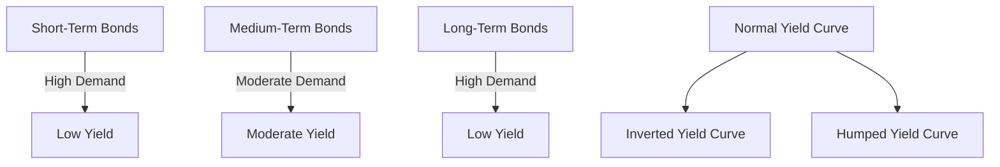

## 7.12 Market Segmentation Theory

Market Segmentation Theory is a pivotal concept in understanding the dynamics of yield curves in fixed-income markets. This theory posits that the yield curve is shaped by the supply and demand dynamics within distinct maturity segments, rather than being influenced by expectations of future interest rates or inflation alone. In this section, we will delve into the intricacies of Market Segmentation Theory, explore the preferences of institutional investors for specific bond maturities, and examine how these preferences can lead to various yield curve shapes, including inverted or humped curves.

### Understanding Market Segmentation Theory

**Market Segmentation Theory** suggests that the bond market is divided into separate segments based on maturity. Each segment operates independently, with its own supply and demand dynamics. This segmentation is primarily driven by the preferences of different types of investors who have specific maturity needs. For instance, pension funds might prefer long-term bonds to match their long-term liabilities, while banks might favor short-term bonds to manage liquidity.

The theory challenges the notion that the yield curve is solely a reflection of future interest rate expectations. Instead, it emphasizes the role of investor preferences and institutional constraints in shaping the curve. This perspective helps explain why yield curves can take on various shapes, such as normal, inverted, or humped, depending on the relative supply and demand in each segment.

### Institutional Investor Preferences

Different institutional investors have varying preferences for bond maturities based on their investment objectives and regulatory requirements. Here are some examples:

- **Pension Funds:** Typically prefer long-term bonds to align with their long-term payout obligations. This preference can increase demand for long-term securities, potentially lowering yields in that segment.

- **Insurance Companies:** Similar to pension funds, insurance companies often have long-term liabilities and thus favor long-term bonds. Their demand can further influence the shape of the yield curve.

- **Banks and Money Market Funds:** These institutions often prefer short-term bonds to maintain liquidity and manage interest rate risk. High demand for short-term securities can lead to lower yields in the short end of the curve.

- **Investment Funds:** Depending on their strategy, some investment funds might target medium-term bonds to balance risk and return, affecting yields in the intermediate segment.

### Yield Curve Shapes and Market Segmentation

The yield curve is a graphical representation of interest rates across different maturities. Market Segmentation Theory provides a framework for understanding why yield curves can take on various shapes:

- **Normal Yield Curve:** Typically upward sloping, reflecting higher yields for longer maturities. This shape can occur when there is balanced demand across all segments, with a slight preference for longer maturities due to higher risk and inflation expectations.

- **Inverted Yield Curve:** Occurs when short-term interest rates are higher than long-term rates. This can happen if there is a strong demand for long-term bonds, possibly due to economic uncertainty, causing long-term yields to drop.

- **Humped Yield Curve:** Characterized by higher yields in the medium-term segment. This shape can result from increased demand for short and long-term bonds, leaving medium-term bonds with less demand and higher yields.

### Practical Examples and Case Studies

To illustrate Market Segmentation Theory in action, consider the following Canadian financial scenarios:

#### Example 1: Canadian Pension Funds

Canadian pension funds, such as the Canada Pension Plan Investment Board (CPPIB), often invest heavily in long-term bonds to match their long-term liabilities. This preference can lead to increased demand for long-term Canadian government bonds, potentially flattening the yield curve as long-term yields decrease relative to short-term yields.

#### Example 2: Major Canadian Banks

Banks like RBC and TD Bank frequently manage liquidity by investing in short-term securities. During periods of economic uncertainty, these banks might increase their holdings of short-term government bonds, driving up demand and lowering yields in the short-term segment of the yield curve.

### Diagrams and Visual Aids

To better understand how Market Segmentation Theory affects yield curves, consider the following diagram illustrating different yield curve shapes:

### Best Practices and Challenges

**Best Practices:**

- **Diversification:** Investors should consider diversifying across different maturity segments to manage risk and optimize returns.
- **Market Analysis:** Regularly analyze market conditions and investor preferences to anticipate changes in yield curve shapes.

**Common Challenges:**

- **Interest Rate Volatility:** Sudden changes in interest rates can disrupt the balance of supply and demand across segments.
- **Regulatory Changes:** Shifts in regulations affecting institutional investors can alter demand patterns and impact yield curves.

### References and Further Reading

For those interested in exploring Market Segmentation Theory further, consider the following resources:

- [Investopedia: Market Segmentation Theory](https://www.investopedia.com/terms/m/marketsegmentationtheory.asp)
- *Fixed Income Securities* by Bruce Tuckman and Angel Serrat

These resources provide deeper insights into the theory and its applications in financial markets.

### Conclusion

Market Segmentation Theory offers a valuable lens through which to view the dynamics of yield curves. By understanding the preferences of institutional investors and the independent operation of maturity segments, investors can better anticipate changes in yield curve shapes and make informed investment decisions. As you continue to explore fixed-income securities, consider how market segmentation might influence your strategies and portfolio management.

### **Ready to Test Your Knowledge?**

**Practice 10 Essential CSC Exam Questions to Master Your Certification**



### What does Market Segmentation Theory propose about the yield curve?

- [x] It is determined by supply and demand within separate maturity segments.
- [ ] It is solely based on future interest rate expectations.
- [ ] It is influenced only by inflation expectations.
- [ ] It is random and unpredictable.

> **Explanation:** Market Segmentation Theory posits that the yield curve is shaped by supply and demand within distinct maturity segments, rather than solely by future interest rate expectations.

### Which type of investor typically prefers long-term bonds?

- [x] Pension funds
- [ ] Banks
- [ ] Money market funds
- [ ] Short-term traders

> **Explanation:** Pension funds often prefer long-term bonds to match their long-term liabilities.

### What shape does a yield curve take when short-term interest rates are higher than long-term rates?

- [x] Inverted
- [ ] Normal
- [ ] Humped
- [ ] Flat

> **Explanation:** An inverted yield curve occurs when short-term interest rates are higher than long-term rates.

### Which institution is likely to prefer short-term bonds?

- [x] Banks
- [ ] Pension funds
- [ ] Insurance companies
- [ ] Long-term investors

> **Explanation:** Banks often prefer short-term bonds to manage liquidity and interest rate risk.

### What can cause a humped yield curve?

- [x] Increased demand for short and long-term bonds
- [ ] Decreased demand for all bonds
- [x] Decreased demand for medium-term bonds
- [ ] Increased demand for medium-term bonds

> **Explanation:** A humped yield curve can result from increased demand for short and long-term bonds, leaving medium-term bonds with less demand and higher yields.

### How can investors manage risk in a segmented market?

- [x] Diversification across different maturity segments
- [ ] Investing only in long-term bonds
- [ ] Avoiding short-term bonds
- [ ] Focusing solely on medium-term bonds

> **Explanation:** Diversification across different maturity segments helps manage risk and optimize returns.

### What is a common challenge in managing a bond portfolio?

- [x] Interest rate volatility
- [ ] Consistent interest rates
- [x] Regulatory changes
- [ ] Predictable market conditions

> **Explanation:** Interest rate volatility and regulatory changes can disrupt the balance of supply and demand across segments.

### Which Canadian institution often invests in long-term bonds?

- [x] Canada Pension Plan Investment Board (CPPIB)
- [ ] RBC
- [ ] TD Bank
- [ ] Money market funds

> **Explanation:** The Canada Pension Plan Investment Board (CPPIB) often invests in long-term bonds to match its long-term liabilities.

### What is the primary driver of market segmentation in bond markets?

- [x] Investor preferences
- [ ] Government regulations
- [ ] Economic forecasts
- [ ] Random market movements

> **Explanation:** Investor preferences and institutional constraints are the primary drivers of market segmentation in bond markets.

### True or False: Market Segmentation Theory suggests that yield curves are influenced by future interest rate expectations.

- [ ] True
- [x] False

> **Explanation:** Market Segmentation Theory suggests that yield curves are determined by supply and demand within separate maturity segments, not solely by future interest rate expectations.


