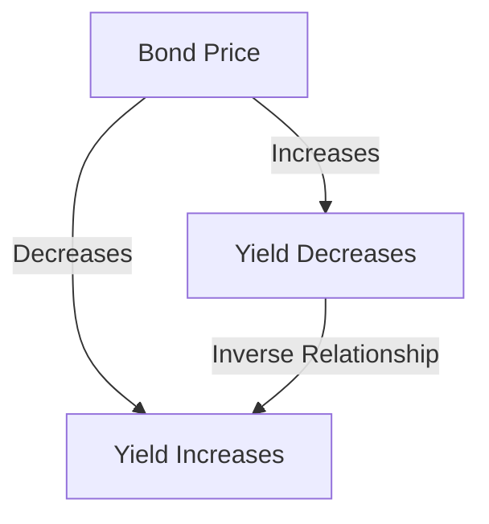

## 7.13 Fundamental Bond Pricing Properties

In the realm of fixed-income securities, understanding the fundamental properties of bond pricing is crucial for making informed investment decisions and managing bond portfolios effectively. This section delves into the key bond pricing relationships, their implications for investors, and their practical applications in real-world scenarios, particularly within the Canadian financial landscape.

### Key Bond Pricing Relationships

#### Price-Yield Relationship

One of the most fundamental concepts in bond pricing is the **Price-Yield Relationship**. This inverse relationship dictates that as bond prices increase, their yields decrease, and vice versa. This occurs because the yield of a bond is a function of its coupon payments relative to its current market price. When a bond's price rises, the fixed coupon payments represent a smaller percentage of the purchase price, resulting in a lower yield.

For example, consider a Canadian government bond with a face value of CAD 1,000 and a coupon rate of 5%. If the bond is purchased at its face value, the yield is 5%. However, if the bond's market price increases to CAD 1,100, the yield decreases because the same CAD 50 coupon payment now represents a smaller percentage of the higher purchase price.

#### Interest Rate Risk

Interest rate risk is the risk that changes in market interest rates will affect the value of a bond. When interest rates rise, the present value of a bond's future cash flows decreases, leading to a decline in its price. Conversely, when interest rates fall, bond prices tend to rise. This relationship is particularly important for long-term bonds, which are more sensitive to interest rate changes than short-term bonds.

#### Duration and Convexity

Duration measures a bond's sensitivity to interest rate changes, providing an estimate of how much a bond's price will change in response to a 1% change in interest rates. Convexity, on the other hand, accounts for the curvature in the price-yield relationship, offering a more accurate prediction of price changes for larger interest rate movements.

### Practical Applications in Investment Decisions

Understanding these bond pricing properties is essential for investors and portfolio managers. Here are some practical applications:

1. **Portfolio Diversification:** By understanding the price-yield relationship and interest rate risk, investors can diversify their portfolios to mitigate risks. For instance, including a mix of short-term and long-term bonds can help balance the portfolio's sensitivity to interest rate changes.

2. **Interest Rate Forecasting:** Investors can use duration and convexity to assess how their bond portfolios might react to anticipated changes in interest rates. This allows for strategic adjustments, such as increasing exposure to bonds with lower duration in a rising interest rate environment.

3. **Yield Curve Analysis:** The yield curve, which plots the yields of bonds with different maturities, provides insights into market expectations for future interest rates. Investors can use this information to make informed decisions about bond selection and timing.

### Real-World Scenarios

#### Case Study: Canadian Pension Funds

Canadian pension funds, such as the Canada Pension Plan Investment Board (CPPIB), often manage large fixed-income portfolios. By leveraging bond pricing properties, these funds can optimize their asset allocation to achieve long-term growth while managing risk. For example, during periods of anticipated interest rate hikes, pension funds might reduce their holdings of long-duration bonds to minimize potential losses.

#### Example: Major Canadian Banks

Major Canadian banks like RBC and TD Bank utilize bond pricing properties to manage their investment portfolios and balance sheets. By analyzing the price-yield relationship and interest rate risk, these institutions can make strategic decisions about bond issuance and investment, ensuring they maintain adequate liquidity and capital reserves.

### Visualizing Bond Pricing Properties

To enhance understanding, let's visualize the price-yield relationship using a simple diagram:

This diagram illustrates the inverse relationship between bond prices and yields, highlighting how changes in one affect the other.

### Best Practices and Common Pitfalls

- **Best Practices:** Regularly assess the duration and convexity of your bond portfolio to ensure it aligns with your investment goals and risk tolerance. Stay informed about macroeconomic trends and interest rate forecasts to make proactive adjustments.

- **Common Pitfalls:** Ignoring the impact of interest rate changes on bond prices can lead to significant losses. Avoid concentrating your portfolio in long-duration bonds during periods of rising interest rates.

### References and Additional Resources

For further exploration of bond pricing properties and their applications, consider the following resources:

- [Investopedia: Price-Yield Relationship](https://www.investopedia.com/terms/p/price-yield-relatioonship.asp)
- *The Bond Book* by Annette Thau
- Canadian Securities Administrators (CSA) for regulatory guidelines
- Open-source financial tools like QuantLib for bond pricing models

### Conclusion

Understanding the fundamental properties of bond pricing is essential for navigating the complexities of fixed-income investments. By mastering these concepts, investors can make informed decisions, optimize their portfolios, and effectively manage risk in the Canadian financial market.

### **Ready to Test Your Knowledge?**

**Practice 10 Essential CSC Exam Questions to Master Your Certification**



### What is the relationship between bond prices and yields?

- [x] Inverse relationship
- [ ] Direct relationship
- [ ] No relationship
- [ ] Exponential relationship

> **Explanation:** Bond prices and yields have an inverse relationship; as bond prices increase, yields decrease, and vice versa.

### Which of the following measures a bond's sensitivity to interest rate changes?

- [x] Duration
- [ ] Yield
- [ ] Coupon rate
- [ ] Face value

> **Explanation:** Duration measures a bond's sensitivity to interest rate changes, indicating how much a bond's price will change with a 1% change in interest rates.

### What happens to bond prices when interest rates rise?

- [x] Bond prices decrease
- [ ] Bond prices increase
- [ ] Bond prices remain unchanged
- [ ] Bond prices double

> **Explanation:** When interest rates rise, the present value of a bond's future cash flows decreases, leading to a decline in its price.

### What is convexity in bond pricing?

- [x] It accounts for the curvature in the price-yield relationship
- [ ] It measures the bond's yield
- [ ] It is the bond's coupon rate
- [ ] It is the bond's face value

> **Explanation:** Convexity accounts for the curvature in the price-yield relationship, providing a more accurate prediction of price changes for larger interest rate movements.

### Which Canadian institution is known for managing large fixed-income portfolios?

- [x] Canada Pension Plan Investment Board (CPPIB)
- [ ] Bank of Canada
- [ ] Toronto Stock Exchange
- [ ] Canadian Securities Administrators

> **Explanation:** The Canada Pension Plan Investment Board (CPPIB) manages large fixed-income portfolios as part of its investment strategy.

### What is the primary risk associated with changes in market interest rates affecting bond value?

- [x] Interest rate risk
- [ ] Credit risk
- [ ] Inflation risk
- [ ] Liquidity risk

> **Explanation:** Interest rate risk is the primary risk associated with changes in market interest rates affecting bond value.

### How can investors mitigate interest rate risk in their bond portfolios?

- [x] By diversifying with a mix of short-term and long-term bonds
- [ ] By investing only in long-term bonds
- [ ] By holding only cash
- [ ] By investing in high-yield bonds

> **Explanation:** Investors can mitigate interest rate risk by diversifying their portfolios with a mix of short-term and long-term bonds.

### What does the yield curve represent?

- [x] Yields of bonds with different maturities
- [ ] The bond's coupon rate
- [ ] The bond's face value
- [ ] The bond's credit rating

> **Explanation:** The yield curve represents the yields of bonds with different maturities, providing insights into market expectations for future interest rates.

### Which Canadian bank is known for utilizing bond pricing properties in its investment strategies?

- [x] RBC
- [ ] Bank of Canada
- [ ] Canadian Securities Administrators
- [ ] Toronto Stock Exchange

> **Explanation:** RBC, like other major Canadian banks, utilizes bond pricing properties to manage its investment portfolios and balance sheets.

### True or False: Long-term bonds are more sensitive to interest rate changes than short-term bonds.

- [x] True
- [ ] False

> **Explanation:** True. Long-term bonds are more sensitive to interest rate changes than short-term bonds due to their longer duration.


