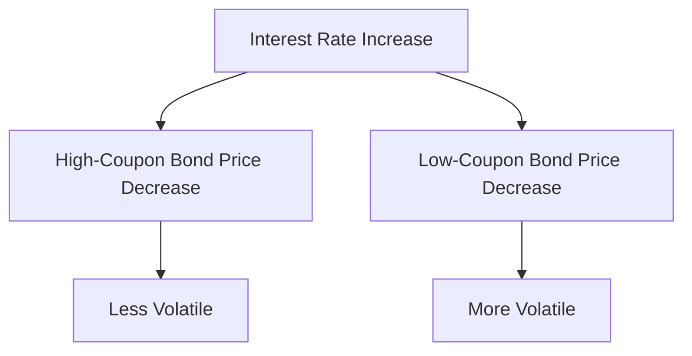

## 7.16 The Impact of Coupon Rate

In the realm of fixed-income securities, understanding the impact of the coupon rate on bond price volatility is crucial for investors, particularly within the Canadian financial landscape. The coupon rate, defined as the periodic interest payment expressed as a percentage of the bond’s face value, plays a significant role in determining how a bond's price will react to changes in market interest rates. This section delves into the nuances of how different coupon rates influence bond price volatility, compares high-coupon bonds with low-coupon bonds, and explains why lower-coupon bonds are more sensitive to yield changes.

### Understanding Coupon Rate and Bond Price Volatility

The coupon rate is a fundamental characteristic of a bond that directly affects its price volatility. When market interest rates fluctuate, the present value of a bond's future cash flows changes, leading to price adjustments. The extent of these price changes is influenced by the bond's coupon rate. 

#### High-Coupon Bonds vs. Low-Coupon Bonds

High-coupon bonds tend to be less volatile compared to low-coupon bonds when interest rates change. This is because high-coupon bonds provide larger periodic interest payments, which means a greater portion of the bond's total return is received earlier. As a result, the present value of these cash flows is less sensitive to changes in interest rates.

Conversely, low-coupon bonds have smaller periodic interest payments, making the bond's total return more reliant on the final principal repayment. This increases the bond's duration, a measure of interest rate sensitivity, and results in greater price volatility when interest rates change.

### Why Lower-Coupon Bonds Are More Sensitive to Yield Changes

The sensitivity of a bond's price to changes in interest rates is often measured by its duration. Duration is a weighted average of the time until a bond's cash flows are received and is inversely related to the coupon rate. Lower-coupon bonds have longer durations because a larger portion of their value is tied to the final principal repayment, making them more sensitive to interest rate changes.

For example, consider two bonds with the same maturity and face value: one with a 2% coupon rate and another with a 6% coupon rate. If market interest rates rise by 1%, the price of the 2% coupon bond will decrease more than the 6% coupon bond due to its longer duration and greater sensitivity to interest rate changes.

### Practical Examples

To illustrate the impact of coupon rates on bond prices, let's consider a practical example involving Canadian bonds:

**Example 1: High-Coupon Bond**

- **Bond A**: 10-year maturity, 8% coupon rate, $1,000 face value.
- **Market Interest Rate**: 5%.

The high coupon rate of Bond A means that investors receive significant interest payments throughout the bond's life. If the market interest rate increases to 6%, the bond's price will decrease, but not as drastically as a low-coupon bond, due to its shorter duration.

**Example 2: Low-Coupon Bond**

- **Bond B**: 10-year maturity, 2% coupon rate, $1,000 face value.
- **Market Interest Rate**: 5%.

Bond B, with its low coupon rate, has a longer duration. If the market interest rate rises to 6%, the price of Bond B will fall more significantly than Bond A, reflecting its higher sensitivity to interest rate changes.

### Visualizing the Impact

To better understand the relationship between coupon rates and bond price volatility, consider the following diagram illustrating the price sensitivity of high-coupon versus low-coupon bonds:

### Best Practices and Considerations

When investing in bonds, especially within the Canadian market, consider the following best practices:

- **Diversify Bond Holdings**: Include a mix of high and low-coupon bonds to balance interest rate risk and income needs.
- **Monitor Interest Rate Trends**: Stay informed about Canadian interest rate trends and economic indicators that may influence rate changes.
- **Understand Duration**: Use duration as a tool to assess a bond's sensitivity to interest rate changes and adjust your portfolio accordingly.

### References and Further Reading

For those interested in exploring this topic further, consider the following resources:

- [Investopedia: Coupon Rate](https://www.investopedia.com/terms/c/couponrate.asp)
- *Fixed Income Securities* by Bruce Tuckman and Angel Serrat

These resources provide additional insights into the mechanics of coupon rates and their impact on bond pricing.

### **Ready to Test Your Knowledge?**

**Practice 10 Essential CSC Exam Questions to Master Your Certification**



### How does a high-coupon bond typically respond to an increase in market interest rates?

- [x] It decreases in price but less than a low-coupon bond.
- [ ] It increases in price.
- [ ] It decreases in price more than a low-coupon bond.
- [ ] It remains unaffected.

> **Explanation:** High-coupon bonds are less sensitive to interest rate changes due to their shorter duration, resulting in a smaller price decrease compared to low-coupon bonds.

### What is the primary reason lower-coupon bonds are more sensitive to yield changes?

- [x] They have longer durations.
- [ ] They have shorter durations.
- [ ] They pay more frequent interest.
- [ ] They are more liquid.

> **Explanation:** Lower-coupon bonds have longer durations, meaning a larger portion of their value is tied to future cash flows, making them more sensitive to interest rate changes.

### In the context of bond investing, what does duration measure?

- [x] The sensitivity of a bond's price to interest rate changes.
- [ ] The time until a bond matures.
- [ ] The frequency of coupon payments.
- [ ] The credit risk of a bond.

> **Explanation:** Duration measures the sensitivity of a bond's price to changes in interest rates, reflecting the weighted average time until cash flows are received.

### Which bond would likely experience greater price volatility with a 1% increase in interest rates?

- [x] A bond with a 2% coupon rate.
- [ ] A bond with an 8% coupon rate.
- [ ] A bond with a 5% coupon rate.
- [ ] A bond with a 10% coupon rate.

> **Explanation:** A bond with a 2% coupon rate has a longer duration and is more sensitive to interest rate changes, leading to greater price volatility.

### What is a key advantage of high-coupon bonds in a rising interest rate environment?

- [x] They provide higher income through larger interest payments.
- [ ] They have longer durations.
- [ ] They are more sensitive to interest rate changes.
- [ ] They have lower credit risk.

> **Explanation:** High-coupon bonds provide higher income through larger interest payments, which can offset some of the negative effects of rising interest rates.

### Why might an investor choose to include low-coupon bonds in their portfolio?

- [x] To potentially benefit from greater price appreciation if interest rates fall.
- [ ] To minimize interest rate sensitivity.
- [ ] To receive higher income.
- [ ] To reduce portfolio duration.

> **Explanation:** Low-coupon bonds have longer durations and can experience greater price appreciation if interest rates fall, offering potential capital gains.

### How does the coupon rate affect a bond's duration?

- [x] Higher coupon rates generally result in shorter durations.
- [ ] Higher coupon rates generally result in longer durations.
- [ ] Coupon rates do not affect duration.
- [ ] Duration is only affected by the bond's maturity.

> **Explanation:** Higher coupon rates result in shorter durations because more of the bond's value is received earlier through interest payments.

### What is one strategy to mitigate interest rate risk in a bond portfolio?

- [x] Diversify with a mix of high and low-coupon bonds.
- [ ] Invest only in low-coupon bonds.
- [ ] Focus solely on short-term bonds.
- [ ] Avoid bonds altogether.

> **Explanation:** Diversifying with a mix of high and low-coupon bonds can help balance interest rate risk and income needs.

### Which of the following best describes a bond's coupon rate?

- [x] The periodic interest payment expressed as a percentage of the bond’s face value.
- [ ] The bond's yield to maturity.
- [ ] The bond's current market price.
- [ ] The bond's credit rating.

> **Explanation:** The coupon rate is the periodic interest payment expressed as a percentage of the bond’s face value.

### True or False: A bond with a higher coupon rate will always have a higher price than a bond with a lower coupon rate.

- [ ] True
- [x] False

> **Explanation:** A bond's price is influenced by various factors, including interest rates, credit risk, and market conditions, not just the coupon rate.



By understanding the impact of coupon rates on bond price volatility, investors can make more informed decisions in managing their fixed-income portfolios, particularly in the context of Canadian financial markets.
