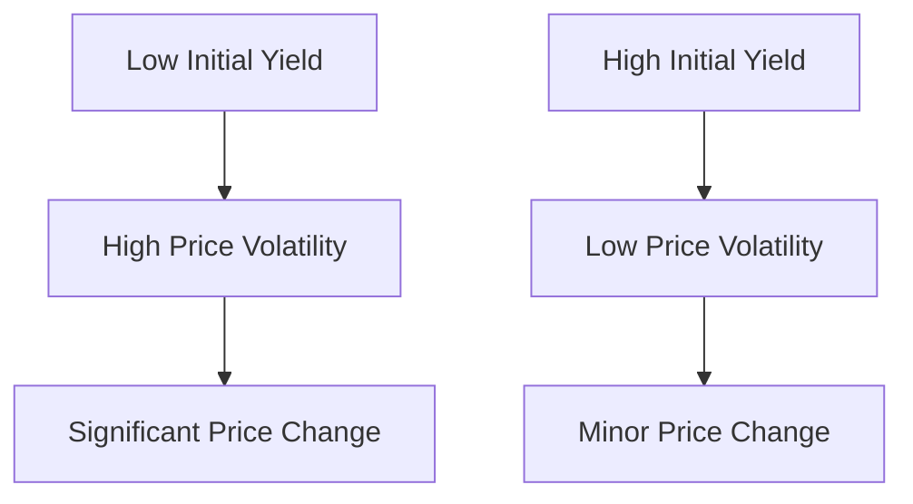

## 7.17 The Impact of Yield Changes

In the world of fixed-income securities, understanding the impact of yield changes on bond prices is crucial for investors and financial professionals. This section delves into how relative yield changes affect bond price volatility, emphasizing the greater percentage price changes when yields are low compared to when they are high. We will explore these concepts through practical examples and case studies, particularly within the Canadian financial context.

### Understanding Relative Yield Changes

**Relative Yield Change** refers to the proportional change in yield, irrespective of its initial level. This concept is fundamental in assessing how bond prices react to fluctuations in interest rates. The relationship between bond prices and yields is inversely proportional: as yields increase, bond prices decrease, and vice versa. However, the magnitude of these price changes can vary significantly depending on the initial yield level.

### Bond Price Volatility and Yield Levels

Bond price volatility is a measure of how much the price of a bond can vary over time. This volatility is influenced by changes in yields, with the degree of sensitivity often depending on the bond's duration and the initial yield level. 

#### Low Yields and High Volatility

When yields are low, bonds tend to exhibit higher price volatility. This is because a given change in yield represents a larger percentage change relative to the initial yield. For example, if a bond's yield increases from 1% to 2%, this is a 100% increase in yield, which can lead to a substantial decrease in the bond's price.

#### High Yields and Lower Volatility

Conversely, when yields are high, the same absolute change in yield results in a smaller percentage change. For instance, if a bond's yield increases from 8% to 9%, this is only a 12.5% increase, resulting in a relatively smaller impact on the bond's price.

### Practical Examples

Let's consider two bonds, both with a face value of CAD 1,000 and a duration of 5 years, but with different initial yields:

1. **Bond A**: Initial yield of 2%
2. **Bond B**: Initial yield of 8%

Suppose the yield for both bonds increases by 1 percentage point. 

- For **Bond A**, the yield change from 2% to 3% is a 50% increase, leading to a significant drop in price.
- For **Bond B**, the yield change from 8% to 9% is a 12.5% increase, resulting in a smaller price decrease.

This example illustrates how identical yield changes can have different impacts depending on the initial yield level.

### Case Study: Canadian Pension Funds

Canadian pension funds, such as the Canada Pension Plan Investment Board (CPPIB), often manage large portfolios of fixed-income securities. These funds must carefully consider yield changes when making investment decisions. For instance, during periods of low interest rates, pension funds might increase their allocation to bonds with higher initial yields to mitigate the impact of potential yield increases on their portfolios.

### Diagrams and Visual Aids

To further illustrate these concepts, consider the following diagram showing the relationship between yield changes and bond price volatility:

This diagram highlights how bonds with low initial yields experience higher price volatility compared to those with high initial yields.

### Best Practices and Common Pitfalls

**Best Practices:**
- Diversify bond portfolios to include a mix of durations and yield levels.
- Monitor interest rate trends and adjust bond allocations accordingly.
- Use financial tools and models to simulate the impact of yield changes on bond portfolios.

**Common Pitfalls:**
- Ignoring the impact of low yields on bond price volatility.
- Over-concentrating investments in bonds with similar yield levels.
- Failing to account for duration when assessing bond price sensitivity.

### Canadian Financial Regulations and Resources

Understanding the regulatory environment is essential for managing fixed-income securities in Canada. The Canadian Investment Regulatory Organization (CIRO) provides guidelines for securities transactions, including bonds. Additionally, resources such as [Investopedia's Yield Change Impact](https://www.investopedia.com/articles/investing/082614/impact-yield-interest-rates-bond-prices.asp) and *The Bond Book* by Annette Thau offer valuable insights into bond investing.

### Encouraging Continuous Learning

To deepen your understanding of yield changes and bond price volatility, consider exploring additional resources such as online courses on fixed-income securities, attending financial seminars, and engaging with investment communities.

### **Ready to Test Your Knowledge?**

**Practice 10 Essential CSC Exam Questions to Master Your Certification**



### How does a relative yield change affect bond price volatility?

- [x] It increases volatility when yields are low.
- [ ] It decreases volatility when yields are low.
- [ ] It has no effect on volatility.
- [ ] It increases volatility when yields are high.

> **Explanation:** Relative yield changes increase bond price volatility when yields are low because the percentage change in yield is larger.

### What happens to bond prices when yields increase?

- [x] Bond prices decrease.
- [ ] Bond prices increase.
- [ ] Bond prices remain the same.
- [ ] Bond prices fluctuate randomly.

> **Explanation:** Bond prices decrease when yields increase due to the inverse relationship between bond prices and yields.

### Why are percentage price changes greater when yields are low?

- [x] Because a given yield change represents a larger percentage change.
- [ ] Because bond prices are more stable at low yields.
- [ ] Because low yields indicate a strong economy.
- [ ] Because low yields reduce interest rate risk.

> **Explanation:** A given yield change represents a larger percentage change when yields are low, leading to greater price volatility.

### In the context of bond investing, what is duration?

- [x] A measure of a bond's sensitivity to interest rate changes.
- [ ] The time until a bond matures.
- [ ] The coupon payment frequency.
- [ ] The bond's credit rating.

> **Explanation:** Duration measures a bond's sensitivity to interest rate changes, indicating how much the bond's price will change with a change in yield.

### How can investors mitigate the impact of yield changes on bond portfolios?

- [x] Diversify bond portfolios.
- [x] Monitor interest rate trends.
- [ ] Concentrate investments in low-yield bonds.
- [ ] Ignore duration.

> **Explanation:** Diversifying portfolios and monitoring interest rate trends can help mitigate the impact of yield changes.

### What is the impact of a 1% yield increase on a bond with an initial yield of 2%?

- [x] Significant price decrease.
- [ ] Minor price decrease.
- [ ] No price change.
- [ ] Price increase.

> **Explanation:** A 1% yield increase from 2% to 3% represents a 50% increase, leading to a significant price decrease.

### What is the impact of a 1% yield increase on a bond with an initial yield of 8%?

- [x] Minor price decrease.
- [ ] Significant price decrease.
- [ ] No price change.
- [ ] Price increase.

> **Explanation:** A 1% yield increase from 8% to 9% represents a 12.5% increase, leading to a minor price decrease.

### Which Canadian institution provides guidelines for securities transactions?

- [x] Canadian Investment Regulatory Organization (CIRO)
- [ ] Canada Revenue Agency (CRA)
- [ ] Bank of Canada
- [ ] Toronto Stock Exchange (TSX)

> **Explanation:** The Canadian Investment Regulatory Organization (CIRO) provides guidelines for securities transactions.

### True or False: High initial yields lead to higher bond price volatility.

- [ ] True
- [x] False

> **Explanation:** High initial yields lead to lower bond price volatility because the percentage change in yield is smaller.

### True or False: Diversifying bond portfolios can help manage yield change impacts.

- [x] True
- [ ] False

> **Explanation:** Diversifying bond portfolios can help manage the impacts of yield changes by spreading risk across different yield levels and durations.


