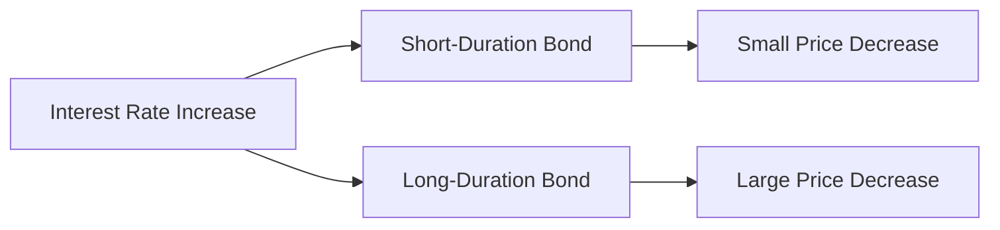

## 7.18 Duration as a Measure of Bond Price Volatility

In the world of fixed-income securities, understanding how bond prices react to changes in interest rates is crucial for investors. Duration is a key concept that helps measure this sensitivity, providing a valuable tool for managing interest rate risk. This section will delve into the intricacies of duration, its calculation, and its practical applications in portfolio management, particularly within the Canadian financial landscape.

### Understanding Duration

**Duration** is a measure of the sensitivity of a bond's price to changes in interest rates. It is expressed as a weighted average time until a bond's cash flows are received. The concept of duration helps investors understand how much a bond's price is likely to change when interest rates fluctuate. 

#### The Role of Duration

Duration serves as a critical metric for assessing the interest rate risk associated with a bond. It combines the effects of both the bond's maturity and its coupon rate, providing a comprehensive view of its price volatility. The longer the duration, the more sensitive the bond is to interest rate changes. Conversely, bonds with shorter durations are less affected by interest rate movements.

### Calculating Duration

The calculation of duration involves considering the present value of a bond's cash flows, weighted by the time until each cash flow is received. The formula for Macaulay Duration, a common measure, is as follows:

 \text{Macaulay Duration} = \frac{\sum \left( \frac{t \times C_t}{(1 + y)^t} \right)}{\sum \left( \frac{C_t}{(1 + y)^t} \right)} 

Where:
- \\( t \\) is the time period.
- \\( C_t \\) is the cash flow at time \\( t \\).
- \\( y \\) is the yield to maturity.

### Modified Duration

While Macaulay Duration provides a time-based measure, **Modified Duration** adjusts this to directly reflect price sensitivity to interest rate changes. It is calculated as:

 \text{Modified Duration} = \frac{\text{Macaulay Duration}}{1 + \frac{y}{n}} 

Where:
- \\( y \\) is the yield to maturity.
- \\( n \\) is the number of compounding periods per year.

Modified Duration offers a more practical measure for investors, indicating the percentage change in a bond's price for a 1% change in interest rates.

### Duration and Bond Price Volatility

To illustrate how duration affects bond price volatility, consider the following examples:

1. **Short-Duration Bond**: A bond with a duration of 2 years will experience a smaller price change compared to a bond with a longer duration when interest rates change. For instance, if interest rates increase by 1%, the bond's price might decrease by approximately 2%.

2. **Long-Duration Bond**: Conversely, a bond with a duration of 10 years will see a more significant price change. A 1% increase in interest rates could lead to a 10% decrease in the bond's price.

### Managing Interest Rate Risk with Duration

Investors use duration as a strategic tool to manage interest rate risk in their portfolios. By aligning the duration of their bond holdings with their investment horizon or interest rate outlook, investors can mitigate potential losses due to rate fluctuations.

#### Strategies for Managing Duration

- **Laddering**: This involves holding bonds with varying maturities, spreading interest rate risk across different durations. Canadian investors might use this strategy to balance exposure to interest rate changes while maintaining liquidity.

- **Barbell Strategy**: This approach combines short-term and long-term bonds, minimizing the impact of interest rate changes on the overall portfolio. It allows investors to benefit from higher yields on long-term bonds while maintaining flexibility with short-term holdings.

- **Bullet Strategy**: Investors focus on bonds with similar maturities, aligning the portfolio's duration with a specific investment goal or time frame.

### Practical Example: Canadian Pension Fund

Consider a Canadian pension fund managing a diversified bond portfolio. By analyzing the duration of its holdings, the fund can adjust its exposure to interest rate risk. For instance, if the fund anticipates rising interest rates, it might reduce the portfolio's average duration by shifting towards shorter-term bonds or increasing allocations to floating-rate securities.

### Visualizing Duration

Below is a diagram illustrating the relationship between bond duration and price volatility:

### Canadian Context and Resources

In Canada, understanding duration is essential for compliance with regulatory frameworks and optimizing investment strategies. Institutions like the Canadian Investment Regulatory Organization (CIRO) provide guidelines for managing interest rate risk. Additionally, resources such as [Investopedia: Duration](https://www.investopedia.com/terms/d/duration.asp) and *Fixed Income Securities* by Bruce Tuckman and Angel Serrat offer further insights into duration and its applications.

### Conclusion

Duration is a fundamental concept in bond investing, offering a measure of price sensitivity to interest rate changes. By understanding and applying duration, Canadian investors can effectively manage interest rate risk, optimize their portfolios, and achieve their financial objectives. As you explore the intricacies of fixed-income securities, consider how duration can enhance your investment strategies and align with your risk tolerance.

### **Ready to Test Your Knowledge?**

**Practice 10 Essential CSC Exam Questions to Master Your Certification**



### What is the primary role of duration in bond investing?

- [x] To measure a bond's sensitivity to interest rate changes
- [ ] To calculate the bond's yield to maturity
- [ ] To determine the bond's credit risk
- [ ] To assess the bond's liquidity

> **Explanation:** Duration is used to measure how sensitive a bond's price is to changes in interest rates.

### How does duration combine the impact of maturity and coupon rate?

- [x] By providing a weighted average time until cash flows are received
- [ ] By calculating the bond's yield
- [ ] By assessing the bond's creditworthiness
- [ ] By determining the bond's market price

> **Explanation:** Duration combines the effects of maturity and coupon rate by calculating a weighted average time until the bond's cash flows are received.

### Which type of bond is more sensitive to interest rate changes?

- [x] Long-duration bond
- [ ] Short-duration bond
- [ ] Zero-coupon bond
- [ ] Floating-rate bond

> **Explanation:** Long-duration bonds are more sensitive to interest rate changes, experiencing larger price fluctuations.

### What is the formula for Modified Duration?

- [x] \\(\text{Modified Duration} = \frac{\text{Macaulay Duration}}{1 + \frac{y}{n}}\\)
- [ ] \\(\text{Modified Duration} = \frac{\text{Yield}}{\text{Maturity}}\\)
- [ ] \\(\text{Modified Duration} = \text{Coupon Rate} \times \text{Maturity}\\)
- [ ] \\(\text{Modified Duration} = \text{Price} \times \text{Yield}\\)

> **Explanation:** Modified Duration is calculated by dividing Macaulay Duration by \\(1 + \frac{y}{n}\\), where \\(y\\) is the yield and \\(n\\) is the number of compounding periods per year.

### How can investors manage interest rate risk using duration?

- [x] By aligning the duration of their bond holdings with their investment horizon
- [ ] By only investing in short-term bonds
- [ ] By focusing solely on high-yield bonds
- [ ] By avoiding bonds altogether

> **Explanation:** Investors can manage interest rate risk by aligning the duration of their bond holdings with their investment horizon or interest rate outlook.

### What is a barbell strategy in bond investing?

- [x] Combining short-term and long-term bonds to minimize interest rate impact
- [ ] Investing only in bonds with similar maturities
- [ ] Holding bonds with varying maturities
- [ ] Focusing on zero-coupon bonds

> **Explanation:** A barbell strategy involves combining short-term and long-term bonds to minimize the impact of interest rate changes on the overall portfolio.

### Which Canadian institution provides guidelines for managing interest rate risk?

- [x] Canadian Investment Regulatory Organization (CIRO)
- [ ] Bank of Canada
- [ ] Canada Revenue Agency
- [ ] Toronto Stock Exchange

> **Explanation:** The Canadian Investment Regulatory Organization (CIRO) provides guidelines for managing interest rate risk.

### What happens to a bond's price if interest rates increase by 1% and the bond has a duration of 5 years?

- [x] The bond's price decreases by approximately 5%
- [ ] The bond's price increases by approximately 5%
- [ ] The bond's price remains unchanged
- [ ] The bond's price decreases by approximately 1%

> **Explanation:** If interest rates increase by 1%, a bond with a duration of 5 years will see its price decrease by approximately 5%.

### What is the relationship between bond duration and price volatility?

- [x] Longer duration leads to higher price volatility
- [ ] Shorter duration leads to higher price volatility
- [ ] Duration does not affect price volatility
- [ ] Duration only affects coupon payments

> **Explanation:** Longer duration leads to higher price volatility, as bonds with longer durations are more sensitive to interest rate changes.

### True or False: Duration is only relevant for zero-coupon bonds.

- [ ] True
- [x] False

> **Explanation:** Duration is relevant for all types of bonds, not just zero-coupon bonds, as it measures interest rate sensitivity.


