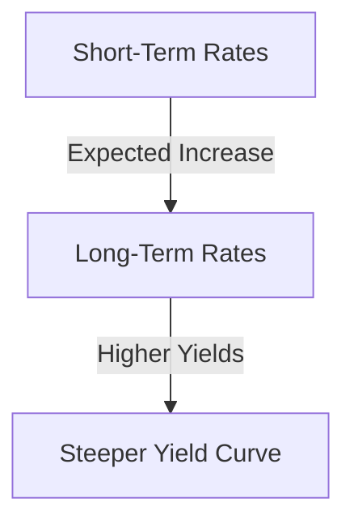
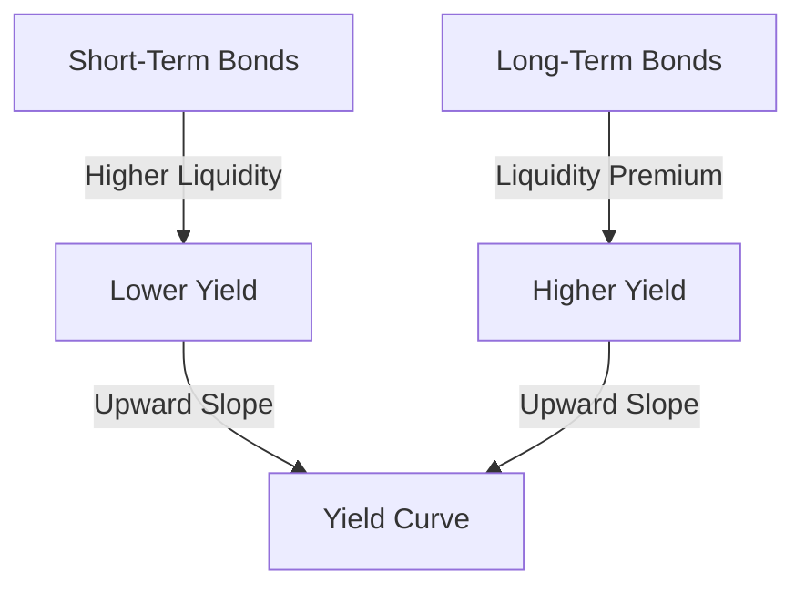
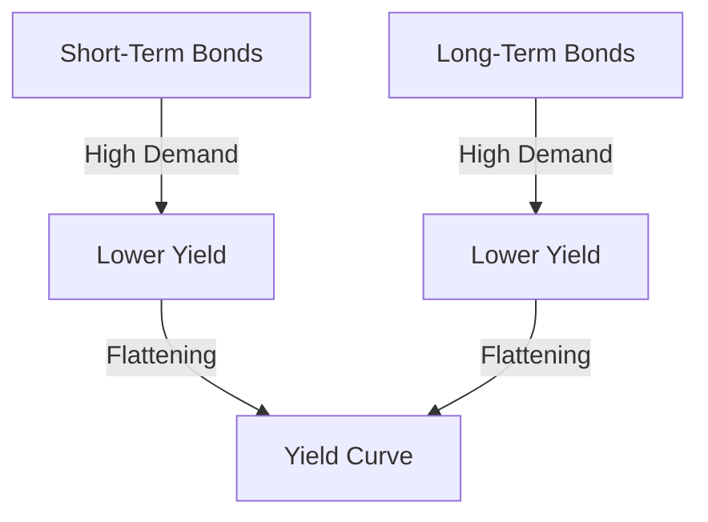

## 7.2.1 Theoretical Foundations of the Yield Curve

The yield curve is a fundamental concept in finance, representing the relationship between interest rates and the maturity of debt securities. Understanding the yield curve is crucial for financial professionals, as it influences investment decisions, economic forecasts, and monetary policy. This section explores the theoretical foundations of the yield curve, focusing on three primary theories: Expectations Theory, Liquidity Preference Theory, and Market Segmentation Theory. Each theory provides a unique perspective on how interest rates are determined and how they shape the yield curve.

### Expectations Theory

Expectations Theory posits that long-term interest rates are determined by the market's expectations of future short-term rates. According to this theory, if investors expect short-term rates to rise, long-term rates will be higher to reflect these expectations. Conversely, if short-term rates are expected to fall, long-term rates will be lower.

#### Example: Impact of Expectations on the Yield Curve

Consider a scenario where the Bank of Canada signals an upcoming increase in interest rates due to anticipated economic growth. Investors, expecting higher short-term rates in the future, will demand higher yields on long-term bonds to compensate for the expected increase. This expectation causes the yield curve to steepen, as illustrated below:

In this example, the expectation of rising short-term rates leads to a steeper yield curve, reflecting higher long-term yields.

### Liquidity Preference Theory

Liquidity Preference Theory suggests that investors prefer short-term bonds due to their lower risk and higher liquidity. As a result, investors require a liquidity premium for holding longer-term bonds, which are riskier and less liquid. This premium causes the yield curve to slope upwards.

#### Analyzing the Liquidity Premium

Investors demand a liquidity premium to compensate for the uncertainty and potential price volatility associated with long-term bonds. This premium is reflected in the upward slope of the yield curve, as shown in the following diagram:

In this model, the liquidity premium increases the yield on long-term bonds, resulting in an upward-sloping yield curve.

### Market Segmentation Theory

Market Segmentation Theory argues that the bond market is segmented based on investor preferences for different maturities. Different investors, such as pension funds, insurance companies, and individual investors, have distinct maturity preferences, leading to separate segments within the bond market.

#### Supply and Demand in Market Segmentation

The yield curve is shaped by the supply and demand dynamics within each segment. For instance, if there is high demand for short-term bonds but limited supply, short-term yields will decrease. Conversely, if there is an oversupply of long-term bonds, long-term yields will increase.

Consider a real-world scenario involving Canadian pension funds, which often prefer long-term bonds to match their long-term liabilities. If these funds increase their demand for long-term bonds, the yield on these bonds may decrease, flattening the yield curve:

In this scenario, increased demand for long-term bonds by pension funds leads to a flattening of the yield curve.

### Glossary

- **Liquidity Premium:** Additional yield that investors require for holding longer-term bonds, compensating for higher risk and lower liquidity.
- **Interest Rate Expectations:** Investor beliefs about future changes in interest rates based on economic indicators and forecasts.

### Practical Applications and Considerations

Understanding these theories provides valuable insights for financial professionals in Canada. For instance, when managing a portfolio, considering the shape of the yield curve can help in assessing interest rate risk and making informed investment decisions. Additionally, recognizing the factors that influence the yield curve can aid in predicting economic trends and adjusting strategies accordingly.

### Conclusion

The yield curve is a dynamic tool that reflects market expectations, liquidity preferences, and segmentation within the bond market. By understanding the theoretical foundations of the yield curve, financial professionals can better navigate the complexities of fixed-income securities and make informed decisions that align with their investment objectives and risk tolerance.

## Quiz Time!



### Which theory suggests that long-term interest rates are determined by expected future short-term rates?

- [x] Expectations Theory
- [ ] Liquidity Preference Theory
- [ ] Market Segmentation Theory
- [ ] None of the above

> **Explanation:** Expectations Theory posits that long-term rates reflect expected future short-term rates.

### What does Liquidity Preference Theory emphasize about short-term bonds?

- [x] They are preferred due to lower risk and higher liquidity.
- [ ] They offer higher yields than long-term bonds.
- [ ] They are less affected by interest rate changes.
- [ ] They are more volatile than long-term bonds.

> **Explanation:** Liquidity Preference Theory highlights the preference for short-term bonds due to their lower risk and higher liquidity.

### How does Market Segmentation Theory explain the shape of the yield curve?

- [x] Different investor preferences for maturities create distinct market segments.
- [ ] It is solely based on interest rate expectations.
- [ ] It depends on government bond issuance.
- [ ] It is influenced by central bank policies.

> **Explanation:** Market Segmentation Theory suggests that investor preferences for different maturities lead to distinct segments, influencing the yield curve shape.

### What is a liquidity premium?

- [x] Additional yield required for holding longer-term bonds.
- [ ] A discount on short-term bonds.
- [ ] A fee charged by brokers for trading bonds.
- [ ] A government subsidy for bondholders.

> **Explanation:** A liquidity premium is the extra yield investors require for holding longer-term bonds due to higher risk and lower liquidity.

### How can expectations of rising short-term rates affect the yield curve?

- [x] They can cause the yield curve to steepen.
- [ ] They can cause the yield curve to flatten.
- [ ] They have no impact on the yield curve.
- [ ] They cause the yield curve to invert.

> **Explanation:** Expectations of rising short-term rates can lead to a steeper yield curve as investors demand higher yields on long-term bonds.

### Which theory involves the concept of a liquidity premium?

- [ ] Expectations Theory
- [x] Liquidity Preference Theory
- [ ] Market Segmentation Theory
- [ ] None of the above

> **Explanation:** Liquidity Preference Theory involves the concept of a liquidity premium for holding longer-term bonds.

### What happens to the yield curve if there is high demand for short-term bonds?

- [x] Short-term yields decrease, potentially flattening the curve.
- [ ] Short-term yields increase, steepening the curve.
- [ ] Long-term yields decrease, steepening the curve.
- [ ] Long-term yields increase, flattening the curve.

> **Explanation:** High demand for short-term bonds can decrease short-term yields, potentially flattening the yield curve.

### How does Market Segmentation Theory view the bond market?

- [x] As divided into segments based on maturity preferences.
- [ ] As a single, unified market.
- [ ] As primarily influenced by government policy.
- [ ] As driven solely by interest rate expectations.

> **Explanation:** Market Segmentation Theory views the bond market as divided into segments based on different maturity preferences.

### What is the primary focus of Expectations Theory?

- [x] Future short-term interest rate expectations.
- [ ] Investor liquidity preferences.
- [ ] Market segmentation by maturity.
- [ ] Central bank policies.

> **Explanation:** Expectations Theory focuses on how future short-term interest rate expectations influence long-term rates.

### True or False: The yield curve can provide insights into economic trends and interest rate risk.

- [x] True
- [ ] False

> **Explanation:** The yield curve is a valuable tool for understanding economic trends and assessing interest rate risk.


