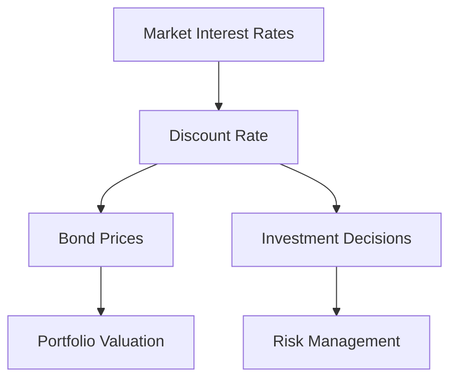

## 7.3 The Discount Rate

In the realm of fixed-income securities, the discount rate plays a pivotal role in determining the present value of future cash flows, which is essential for bond pricing. Understanding the discount rate's function and its interaction with market interest rates is crucial for making informed investment decisions, particularly in the Canadian financial market.

### Understanding the Discount Rate

The **discount rate** is the interest rate used to calculate the present value of future cash flows. It reflects the time value of money, acknowledging that a dollar today is worth more than a dollar in the future due to its potential earning capacity. In bond pricing, the discount rate is used to determine the present value of the bond's future interest payments and its principal repayment at maturity.

#### Role in Bond Pricing

When pricing a bond, the discount rate is applied to each of the bond's future cash flows to calculate their present value. The sum of these present values gives the bond's price. The formula for calculating the present value of a bond's cash flows is:

 PV = \sum \frac{C}{(1 + r)^t} + \frac{F}{(1 + r)^n} 

Where:
- \\( PV \\) = Present Value of the bond
- \\( C \\) = Cash flow (coupon payment) in each period
- \\( r \\) = Discount rate
- \\( t \\) = Time period
- \\( F \\) = Face value of the bond
- \\( n \\) = Total number of periods

### Choosing an Appropriate Discount Rate

Selecting the right discount rate is crucial as it directly affects the bond's valuation. The choice of discount rate is influenced by several factors, including the bond's risk profile, the issuer's creditworthiness, and prevailing market conditions.

#### Factors Influencing the Discount Rate

1. **Credit Risk:** Bonds with higher credit risk typically require a higher discount rate to compensate investors for the increased risk of default. Credit ratings from agencies like Moody's can provide guidance on the appropriate risk premium to add to the discount rate.

2. **Market Interest Rates:** The prevailing market interest rates serve as a baseline for the discount rate. As market rates rise, the discount rate typically increases, leading to a decrease in bond prices, and vice versa.

3. **Inflation Expectations:** Higher expected inflation may lead to higher discount rates as investors demand greater returns to offset the erosion of purchasing power.

4. **Liquidity Premium:** Less liquid bonds may require a higher discount rate to compensate for the difficulty in selling the bond quickly without a significant price concession.

### Impact of Market Interest Rates on the Discount Rate

Market interest rates are a fundamental component in determining the discount rate. Changes in these rates can significantly impact bond prices and investment strategies.

#### Relationship Between Market Interest Rates and Bond Prices

- **Inverse Relationship:** There is an inverse relationship between market interest rates and bond prices. When interest rates rise, existing bonds with lower coupon rates become less attractive, causing their prices to fall. Conversely, when interest rates decline, existing bonds with higher coupon rates become more attractive, leading to an increase in their prices.

- **Yield Curve Dynamics:** The yield curve, which plots interest rates across different maturities, provides insights into market expectations for future interest rates. A steep yield curve may indicate rising interest rates, affecting the discount rate applied to long-term bonds more than short-term ones.

### Practical Examples and Case Studies

To illustrate these concepts, consider the following examples involving Canadian financial institutions:

#### Example 1: Canadian Pension Fund

A Canadian pension fund is evaluating a 10-year government bond with a 3% coupon rate. The current market interest rate for similar bonds is 4%. The fund uses this rate as the discount rate to calculate the bond's present value. Given the higher market rate, the bond's price will be below its face value, reflecting the increased opportunity cost of holding a lower-yielding bond.

#### Example 2: Major Canadian Bank

A major Canadian bank, such as RBC, is assessing corporate bonds issued by a company with a BBB credit rating. The bank considers the prevailing market interest rate of 5% and adds a risk premium of 1% due to the company's credit rating, resulting in a discount rate of 6%. This rate is used to evaluate the bond's attractiveness compared to other investment opportunities.

### Visualizing the Discount Rate's Impact

To better understand the relationship between the discount rate, bond prices, and market interest rates, consider the following diagram:

### Best Practices and Common Pitfalls

#### Best Practices

- **Regular Monitoring:** Continuously monitor market interest rates and credit ratings to adjust discount rates accordingly.
- **Diversification:** Diversify bond portfolios to mitigate risks associated with interest rate fluctuations and credit risk.
- **Scenario Analysis:** Conduct scenario analysis to understand the impact of different interest rate environments on bond valuations.

#### Common Pitfalls

- **Ignoring Credit Risk:** Failing to account for credit risk can lead to underestimating the discount rate and overvaluing bonds.
- **Overreliance on Historical Data:** Relying solely on historical interest rates without considering current market conditions can result in inaccurate discount rate assumptions.

### References and Additional Resources

For further exploration of the discount rate and its implications in bond pricing, consider the following resources:

- [Moody’s Credit Rating Tools](https://www.moodys.com/researchtools) for assessing credit risk and determining appropriate risk premiums.
- *Fixed Income Securities* by Bruce Tuckman and Angel Serrat, a comprehensive guide to understanding fixed-income markets and instruments.

### Encouragement for Application

Understanding the discount rate and its impact on bond pricing is essential for making informed investment decisions. By applying these principles, investors can better navigate the complexities of the Canadian financial market, optimize their portfolios, and achieve their financial goals.

### **Ready to Test Your Knowledge?**

**Practice 10 Essential CSC Exam Questions to Master Your Certification**



### What is the primary role of the discount rate in bond pricing?

- [x] To calculate the present value of future cash flows
- [ ] To determine the bond's coupon rate
- [ ] To assess the bond's liquidity
- [ ] To evaluate the bond's maturity date

> **Explanation:** The discount rate is used to calculate the present value of future cash flows, which is essential for determining the bond's price.

### How does an increase in market interest rates affect bond prices?

- [x] Bond prices decrease
- [ ] Bond prices increase
- [ ] Bond prices remain unchanged
- [ ] Bond prices become more volatile

> **Explanation:** An increase in market interest rates leads to a decrease in bond prices due to the inverse relationship between interest rates and bond prices.

### Which factor is NOT typically considered when choosing a discount rate?

- [ ] Credit risk
- [ ] Market interest rates
- [ ] Inflation expectations
- [x] Bondholder's personal income

> **Explanation:** A bondholder's personal income is not a factor in determining the discount rate for bond pricing.

### What is the impact of a higher credit risk on the discount rate?

- [x] It increases the discount rate
- [ ] It decreases the discount rate
- [ ] It has no impact on the discount rate
- [ ] It stabilizes the discount rate

> **Explanation:** Higher credit risk increases the discount rate to compensate investors for the increased risk of default.

### What does a steep yield curve indicate about future interest rates?

- [x] Rising interest rates
- [ ] Falling interest rates
- [ ] Stable interest rates
- [ ] Volatile interest rates

> **Explanation:** A steep yield curve typically indicates expectations of rising future interest rates.

### Which Canadian financial institution might use a risk premium when evaluating corporate bonds?

- [x] RBC
- [ ] Bank of England
- [ ] Federal Reserve
- [ ] European Central Bank

> **Explanation:** RBC, a major Canadian bank, might use a risk premium to evaluate corporate bonds based on credit ratings.

### What is a common pitfall when determining the discount rate?

- [x] Ignoring credit risk
- [ ] Overestimating inflation
- [ ] Underestimating liquidity
- [ ] Overvaluing maturity

> **Explanation:** Ignoring credit risk can lead to underestimating the discount rate and overvaluing bonds.

### What is the relationship between the discount rate and bond prices?

- [x] Inverse relationship
- [ ] Direct relationship
- [ ] No relationship
- [ ] Random relationship

> **Explanation:** There is an inverse relationship between the discount rate and bond prices; as the discount rate increases, bond prices decrease.

### Which tool can be used to assess credit risk for determining the discount rate?

- [x] Moody’s Credit Rating Tools
- [ ] Google Finance
- [ ] Yahoo Finance
- [ ] Bloomberg Terminal

> **Explanation:** Moody’s Credit Rating Tools can be used to assess credit risk and determine appropriate risk premiums for the discount rate.

### True or False: The discount rate is only influenced by market interest rates.

- [ ] True
- [x] False

> **Explanation:** The discount rate is influenced by multiple factors, including credit risk, inflation expectations, and liquidity premiums, in addition to market interest rates.


