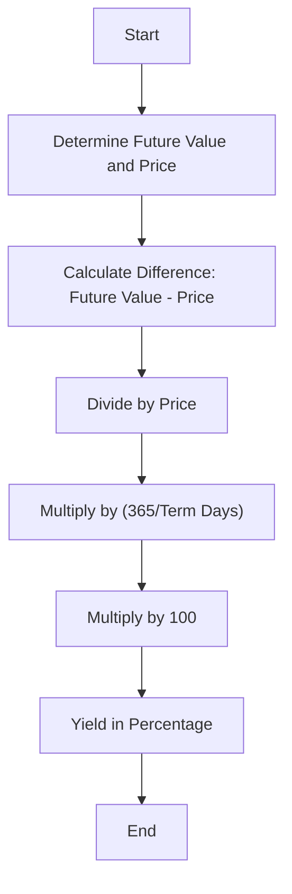

## 7.5 Calculating the Yield on a Treasury Bill

In this section, we will delve into the intricacies of calculating the yield on a Treasury Bill (T-Bill), a fundamental concept for anyone involved in fixed-income securities. Understanding T-Bills and their yield calculations is crucial for financial professionals and investors, particularly within the Canadian context.

### Understanding Treasury Bills (T-Bills)

**Treasury Bills (T-Bills)** are short-term government securities that are sold at a discount and redeemed at their face value upon maturity. They are considered one of the safest investments available, as they are backed by the full faith and credit of the issuing government. In Canada, T-Bills are issued by the Government of Canada and are a popular choice for investors seeking a secure, short-term investment vehicle.

#### Key Features of T-Bills:

- **Maturity:** T-Bills typically have maturities ranging from a few days to one year. Common maturities include 91 days, 182 days, and 364 days.
- **Discounted Price:** T-Bills are sold at a discount to their face value. The difference between the purchase price and the face value represents the investor's return.
- **Liquidity:** T-Bills are highly liquid, making them an attractive option for investors who may need quick access to their funds.
- **Risk-Free:** As government-backed securities, T-Bills are considered virtually risk-free, making them a benchmark for measuring the risk of other investments.

### Calculating the Yield on a T-Bill

The yield on a T-Bill is a measure of the return an investor earns on the investment, expressed as an annual percentage. The yield calculation takes into account the difference between the purchase price and the face value, as well as the term of the T-Bill.

#### Yield Calculation Formula:

The formula to calculate the yield on a T-Bill is as follows:

 \text{Yield} = \left(\frac{\text{Future Value} - \text{Price}}{\text{Price}}\right) \times \left(\frac{365}{\text{Term Days}}\right) \times 100 

Where:
- **Future Value** is the face value of the T-Bill at maturity.
- **Price** is the purchase price of the T-Bill.
- **Term Days** is the number of days until the T-Bill matures.

### Practical Example of Yield Calculation

Let's consider a practical example to illustrate the yield calculation for a T-Bill:

**Example:**

An investor purchases a 91-day T-Bill with a face value of CAD 100,000 at a discounted price of CAD 98,500. To calculate the yield, we will apply the formula:

1. **Determine the Future Value and Price:**
   - Future Value = CAD 100,000
   - Price = CAD 98,500

2. **Calculate the Yield:**

 \text{Yield} = \left(\frac{100,000 - 98,500}{98,500}\right) \times \left(\frac{365}{91}\right) \times 100 

 \text{Yield} = \left(\frac{1,500}{98,500}\right) \times 4.01099 \times 100 

 \text{Yield} = 0.01523 \times 4.01099 \times 100 

 \text{Yield} = 6.11\% 

Thus, the annualized yield on this 91-day T-Bill is approximately 6.11%.

### Visualizing the Yield Calculation

To further enhance understanding, let's visualize the yield calculation process using a flowchart:

### Best Practices and Considerations

When calculating the yield on a T-Bill, consider the following best practices:

- **Accurate Inputs:** Ensure that the purchase price and term days are accurately recorded to avoid errors in yield calculation.
- **Market Conditions:** Be aware of current market conditions, as interest rates and economic factors can influence T-Bill yields.
- **Comparative Analysis:** Compare T-Bill yields with other fixed-income securities to assess relative value and risk.

### Common Challenges and Solutions

- **Interest Rate Fluctuations:** T-Bill yields can be affected by changes in interest rates. Stay informed about monetary policy and economic indicators.
- **Inflation Impact:** Consider the impact of inflation on real returns, as T-Bills may offer lower yields compared to other investments during inflationary periods.

### Canadian Context and Resources

In Canada, T-Bills are a vital component of the fixed-income market. For more information on T-Bills and current rates, refer to the [Bank of Canada Treasury Bills Information](https://www.bankofcanada.ca/rates/interest-rates/t-bills/). Additionally, the book *Fixed Income Securities* by Bruce Tuckman and Angel Serrat provides a comprehensive overview of fixed-income markets and instruments.

### Encouragement for Further Exploration

Understanding T-Bill yields is a foundational skill for financial professionals and investors. By mastering this concept, you can make informed investment decisions and optimize your portfolio's performance. We encourage you to explore additional resources and practice yield calculations to deepen your understanding.

### **Ready to Test Your Knowledge?**

**Practice 10 Essential CSC Exam Questions to Master Your Certification**



### What is a Treasury Bill (T-Bill)?

- [x] A short-term government security sold at a discount and redeemed at par
- [ ] A long-term corporate bond with fixed interest payments
- [ ] A type of equity security with variable dividends
- [ ] A derivative instrument used for hedging

> **Explanation:** A Treasury Bill (T-Bill) is a short-term government security sold at a discount and redeemed at par, making it a safe investment option.

### How is the yield on a T-Bill calculated?

- [x] Yield = [(Future Value - Price) / Price] * (365 / Term Days) * 100
- [ ] Yield = [(Price - Future Value) / Future Value] * (365 / Term Days) * 100
- [ ] Yield = [(Future Value - Price) / Future Value] * (365 / Term Days) * 100
- [ ] Yield = [(Price - Future Value) / Price] * (365 / Term Days) * 100

> **Explanation:** The correct formula for calculating the yield on a T-Bill is Yield = [(Future Value - Price) / Price] * (365 / Term Days) * 100.

### What is the primary risk associated with investing in T-Bills?

- [x] Inflation risk
- [ ] Credit risk
- [ ] Liquidity risk
- [ ] Currency risk

> **Explanation:** The primary risk associated with T-Bills is inflation risk, as their returns may not keep pace with inflation.

### Which of the following is a feature of T-Bills?

- [x] They are sold at a discount to their face value.
- [ ] They pay periodic interest payments.
- [ ] They have a maturity of over one year.
- [ ] They are issued by corporations.

> **Explanation:** T-Bills are sold at a discount to their face value and do not pay periodic interest payments.

### What is the term used to describe the difference between the purchase price and the face value of a T-Bill?

- [x] Discount
- [ ] Premium
- [ ] Coupon
- [ ] Spread

> **Explanation:** The difference between the purchase price and the face value of a T-Bill is referred to as the discount.

### Why are T-Bills considered risk-free investments?

- [x] They are backed by the full faith and credit of the issuing government.
- [ ] They offer high returns compared to other securities.
- [ ] They have long maturities that reduce risk.
- [ ] They are issued by private corporations.

> **Explanation:** T-Bills are considered risk-free because they are backed by the full faith and credit of the issuing government.

### What is the typical maturity range for T-Bills?

- [x] A few days to one year
- [ ] One to five years
- [ ] Five to ten years
- [ ] Over ten years

> **Explanation:** T-Bills typically have maturities ranging from a few days to one year.

### How does the Bank of Canada influence T-Bill rates?

- [x] Through monetary policy and interest rate adjustments
- [ ] By setting fixed rates for all T-Bills
- [ ] By issuing corporate bonds
- [ ] By regulating stock market activities

> **Explanation:** The Bank of Canada influences T-Bill rates through monetary policy and interest rate adjustments.

### What is the impact of rising interest rates on T-Bill yields?

- [x] T-Bill yields generally increase
- [ ] T-Bill yields generally decrease
- [ ] T-Bill yields remain unchanged
- [ ] T-Bill yields become negative

> **Explanation:** Rising interest rates generally lead to an increase in T-Bill yields.

### True or False: T-Bills are a suitable investment for short-term liquidity needs.

- [x] True
- [ ] False

> **Explanation:** T-Bills are highly liquid and suitable for short-term liquidity needs due to their short maturities and government backing.


