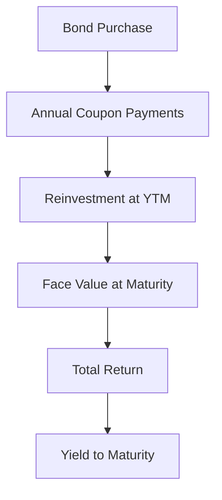

## 7.7 Calculating the Yield to Maturity on a Bond

Yield to Maturity (YTM) is a critical concept in the world of fixed-income securities, offering investors a comprehensive measure of the return they can expect if they hold a bond until it matures. Understanding YTM is essential for making informed investment decisions, particularly in the Canadian financial market where bonds play a significant role in portfolio diversification and risk management.

### Understanding Yield to Maturity (YTM)

**Yield to Maturity (YTM)** is the total return anticipated on a bond if it is held until it matures. It is expressed as an annual percentage rate and considers all coupon payments, the face value of the bond, and any capital gain or loss incurred if the bond was purchased at a price different from its face value. YTM is a comprehensive measure that assumes all coupon payments are reinvested at the same rate as the bond's current yield, which is a key assumption in its calculation.

### The Process of Calculating YTM

Calculating YTM involves solving for the interest rate that equates the present value of a bond's future cash flows to its current market price. This process can be complex, as it requires solving a nonlinear equation. The formula for YTM is:

 P = \frac{C}{(1 + YTM)^1} + \frac{C}{(1 + YTM)^2} + \cdots + \frac{C + F}{(1 + YTM)^n} 

Where:
- \\( P \\) = Current market price of the bond
- \\( C \\) = Coupon payment
- \\( F \\) = Face value of the bond
- \\( n \\) = Number of years to maturity

Given the complexity of this equation, financial calculators or spreadsheet software like Excel are often used to compute YTM.

### Assumptions in YTM Calculation

1. **Reinvestment Rate:** All coupon payments are reinvested at the same rate as the YTM.
2. **Holding Period:** The bond is held until maturity.
3. **Market Conditions:** The market conditions remain stable, and the bond issuer does not default.

### Illustrating YTM Calculation with Examples

Let's consider a practical example using a financial calculator:

**Example:**

Suppose you purchase a 10-year Canadian government bond with a face value of $1,000, an annual coupon rate of 5%, and a current market price of $950. To calculate the YTM, you would input the following into a financial calculator:

- **N (Number of periods):** 10
- **PV (Present Value):** -950 (the negative sign indicates cash outflow)
- **PMT (Payment):** 50 (5% of $1,000)
- **FV (Future Value):** 1,000

Using these inputs, the calculator will solve for the interest rate, which is the YTM. In this case, the YTM is approximately 5.57%.

### Comparing YTM with Other Yield Measures

YTM is often compared with other yield measures such as:

- **Current Yield:** This is the annual coupon payment divided by the bond's current price. It does not account for capital gains or losses.
- **Yield to Call (YTC):** Similar to YTM, but it assumes the bond will be called (redeemed by the issuer) before it matures.
- **Yield to Worst (YTW):** The lowest yield an investor can receive if the bond is called or matures early.

### Practical Applications and Considerations

Understanding YTM is crucial for evaluating the attractiveness of different bonds, particularly in the context of Canadian investment strategies. For instance, Canadian pension funds often use YTM to assess the long-term viability of fixed-income investments. Additionally, individual investors can use YTM to compare bonds with different maturities and coupon rates, helping them make more informed decisions about their RRSP or TFSA portfolios.

### Visualizing YTM Calculation

To further aid understanding, consider the following diagram illustrating the cash flows of a bond and how they relate to YTM:

### Best Practices and Common Pitfalls

- **Best Practices:**
  - Use financial calculators or software to ensure accuracy.
  - Consider the impact of taxes and fees on YTM calculations.
  - Regularly review market conditions as they can affect bond prices and YTM.

- **Common Pitfalls:**
  - Ignoring the reinvestment assumption can lead to inaccurate YTM estimates.
  - Failing to account for callable bonds, which may alter expected returns.

### References and Further Exploration

For those interested in delving deeper into YTM and related concepts, consider exploring the following resources:

- [Investopedia: Yield to Maturity](https://www.investopedia.com/terms/y/yieldtomaturity.asp)
- [Financial Calculators: Yield to Maturity Calculation](https://www.calculator.net/yield-to-maturity-calculator.html)

These resources provide additional insights and tools for calculating and understanding YTM in various contexts.

### Summary

Yield to Maturity is a vital metric for bond investors, offering a comprehensive view of potential returns. By understanding how to calculate and interpret YTM, investors can make more informed decisions, optimize their portfolios, and better navigate the Canadian financial landscape.

### **Ready to Test Your Knowledge?**

**Practice 10 Essential CSC Exam Questions to Master Your Certification**



### What does Yield to Maturity (YTM) represent?

- [x] The total return expected from a bond if held until maturity, considering both coupon payments and any capital gain or loss.
- [ ] The annual coupon payment divided by the bond's current price.
- [ ] The lowest yield an investor can receive if the bond is called or matures early.
- [ ] The yield assuming the bond will be called before it matures.

> **Explanation:** YTM represents the total return expected from a bond if held until maturity, considering both coupon payments and any capital gain or loss.

### Which of the following is an assumption made in YTM calculation?

- [x] All coupon payments are reinvested at the same rate as the YTM.
- [ ] The bond will be sold before maturity.
- [ ] The bond issuer will default.
- [ ] The bond will be called before maturity.

> **Explanation:** One key assumption in YTM calculation is that all coupon payments are reinvested at the same rate as the YTM.

### What is the formula for calculating YTM?

- [x] \\( P = \frac{C}{(1 + YTM)^1} + \frac{C}{(1 + YTM)^2} + \cdots + \frac{C + F}{(1 + YTM)^n} \\)
- [ ] \\( YTM = \frac{C}{P} \\)
- [ ] \\( YTM = \frac{C + F}{P} \\)
- [ ] \\( YTM = \frac{C}{F} \\)

> **Explanation:** The formula for calculating YTM involves equating the present value of a bond's future cash flows to its current market price.

### How does YTM differ from Current Yield?

- [x] YTM considers both coupon payments and capital gains or losses, while Current Yield only considers coupon payments.
- [ ] YTM is always higher than Current Yield.
- [ ] YTM only applies to bonds with a maturity of less than one year.
- [ ] YTM is calculated using the bond's face value, while Current Yield uses the market price.

> **Explanation:** YTM considers both coupon payments and capital gains or losses, while Current Yield only considers coupon payments.

### What tool is often used to calculate YTM due to its complexity?

- [x] Financial calculators or spreadsheet software
- [ ] Manual calculations
- [ ] Online bond trading platforms
- [ ] Stock market indices

> **Explanation:** Due to the complexity of the YTM calculation, financial calculators or spreadsheet software are often used.

### Which yield measure assumes the bond will be called before it matures?

- [x] Yield to Call (YTC)
- [ ] Yield to Maturity (YTM)
- [ ] Current Yield
- [ ] Yield to Worst (YTW)

> **Explanation:** Yield to Call (YTC) assumes the bond will be called before it matures.

### What is a common pitfall when calculating YTM?

- [x] Ignoring the reinvestment assumption
- [ ] Using the bond's face value instead of market price
- [ ] Assuming the bond will be sold before maturity
- [ ] Calculating YTM for stocks

> **Explanation:** Ignoring the reinvestment assumption can lead to inaccurate YTM estimates.

### What does the YTM calculation assume about market conditions?

- [x] Market conditions remain stable, and the bond issuer does not default.
- [ ] Market conditions will fluctuate significantly.
- [ ] The bond issuer will default.
- [ ] The bond will be sold before maturity.

> **Explanation:** YTM calculation assumes that market conditions remain stable, and the bond issuer does not default.

### Which Canadian financial tool can benefit from understanding YTM?

- [x] RRSP portfolios
- [ ] Real estate investments
- [ ] Cryptocurrency trading
- [ ] Foreign exchange trading

> **Explanation:** Understanding YTM can benefit RRSP portfolios by helping investors make informed decisions about fixed-income investments.

### True or False: YTM is the same as the bond's coupon rate.

- [ ] True
- [x] False

> **Explanation:** False. YTM is not the same as the bond's coupon rate; it considers the total return expected if the bond is held until maturity.


